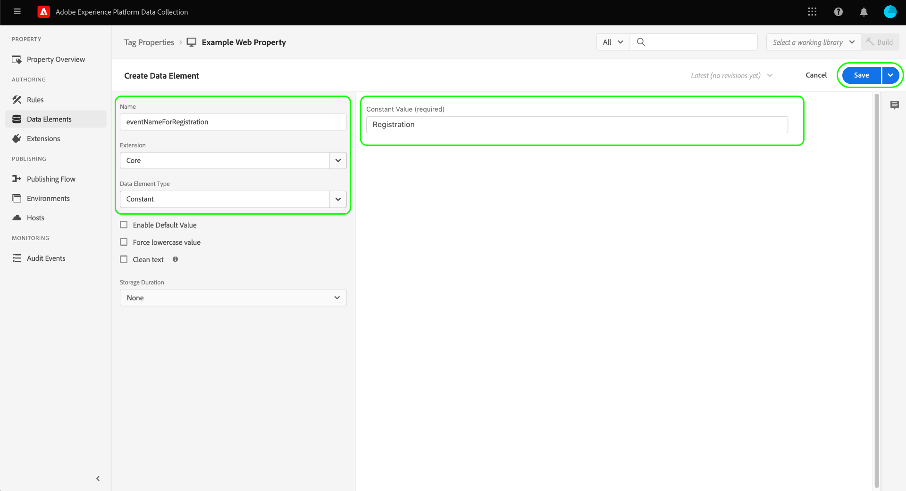

# [!DNL Braze Track Events API] Ereignisweiterleitungs-Erweiterung

[[!DNL Braze]](https://www.braze.com) ist eine Kundeninteraktionsplattform, die kundenorientierte Interaktionen zwischen Verbrauchern und Marken in Echtzeit ermöglicht. Verwenden [!DNL Braze]können Sie Folgendes tun:

* Bereitstellen von Daten (z. B. Marketing-Nachrichten) für zielgerichtete Benutzer basierend auf ihrer Sprachpräferenz, Standort-Präferenz und mehr, um Konversionsraten zu erhöhen und wichtige Geschäftsziele zu unterstützen.
* Senden Sie personalisierte Nachrichten an Kunden über verschiedene Kanäle, einschließlich E-Mail, Push-Benachrichtigungen und In-App-Nachrichten, zum richtigen Zeitpunkt und in ihrer bevorzugten Sprache.
* Richten Sie bestimmte Benutzer für Marketing- und Werbekampagnen ein, um die Anzahl der wiederkehrenden Kunden zu erhöhen.
* Untersuchen Sie das Benutzerverhalten und die Muster, um bestimmte Zielgruppen mit personalisierten Nachrichten anzusprechen, was zur Umsatzsteigerung beitragen könnte.

Die [!DNL Braze Track Events API] [Ereignisweiterleitung](../../../ui/event-forwarding/overview.md) -Erweiterung ermöglicht es Ihnen, die im Adobe Experience Platform Edge Network erfassten Daten zu nutzen und an [!DNL Braze] in Form von serverseitigen Ereignissen, bei denen die [[!DNL Braze User Identify]](https://www.braze.com/docs/api/endpoints/user_data/post_user_identify) und [[!DNL Braze User Track]](https://www.braze.com/docs/api/endpoints/user_data/post_user_track) APIs.

In diesem Dokument werden die Anwendungsfälle der Erweiterung, die Installation in Ihren Ereignisweiterleitungsbibliotheken und die Verwendung ihrer Funktionen in der Ereignisweiterleitung behandelt. [Regel](../../../ui/managing-resources/rules.md).

## Anwendungsfälle

Diese Erweiterung sollte verwendet werden, wenn Sie Daten aus dem Edge-Netzwerk in [!DNL Braze] , um die Analyse- und Targeting-Funktionen der Kunden zu nutzen.

Angenommen, ein Einzelhandelsunternehmen verfügt über eine mehrkanalige Präsenz (Website und Mobilgeräte) und erfasst Transaktions- oder Konversionsdaten als Ereignisdaten von seiner Website und mobilen Plattformen. Verwendung verschiedener [Tag](../../../home.md) Regeln, werden diese Daten in Echtzeit an das Edge-Netzwerk gesendet. Von hier aus kann die [!DNL Braze] Ereignisweiterleitungserweiterung sendet automatisch relevante Ereignisse an [!DNL Braze] vom Server aus.

Sobald die Daten gesendet wurden, können die Analyseteams des Unternehmens [!DNL Braze's] Funktionen zur Verarbeitung der Datensätze und Ableitung von Geschäftsinsights, um Diagramme, Dashboards oder andere Visualisierungen zu generieren, die geschäftliche Stakeholder informieren. Siehe Abschnitt [[!DNL Braze] Kunden](https://www.braze.com/customers) für weitere Informationen zu den verschiedenen Anwendungsfällen der Plattform.

## [!DNL Braze] Voraussetzungen und Limits {#prerequisites}

Sie müssen über eine [!DNL Braze] , um seine Technologien zu nutzen. Wenn Sie kein Konto haben, navigieren Sie zu [Erste Schritte](https://www.braze.com/get-started/) on [!DNL Braze] zur Verbindung mit [!DNL Braze Sales] und starten Sie die Kontoerstellung.

### API-Limits

Die Erweiterung verwendet zwei von [!DNL Braze]Die APIs und ihre Beschränkungen sind unten beschrieben:

| API | Ratenbeschränkungen |
| --- | --- |
| [!DNL User Track] | 50.000 Anfragen pro Minute.  Siehe Abschnitt [[!DNL User Track] API-Dokumentation](https://www.braze.com/docs/api/endpoints/user_data/post_user_track#rate-limit) für Details. |
| [!DNL User Identify] | 20.000 Anfragen pro Minute.  Siehe Abschnitt [[!DNL User Identify] API-Dokumentation](https://www.braze.com/docs/api/endpoints/user_data/post_user_identify#rate-limit) für Details. |

>[!NOTE]
>
>Weitere Informationen finden Sie im Handbuch [[!DNL Braze] API-Beschränkungen](https://www.braze.com/docs/api/api_limits/) weitere Einzelheiten zu den von ihnen auferlegten Beschränkungen.

### Lebenszyklus von Benutzerprofilen verstehen

[!DNL Braze] erstellt anonyme Benutzerprofile mithilfe der eindeutigen Kennung, `deviceId`, festgelegt durch [!DNL Braze]. Sobald ein Benutzer durch Angabe einer Benutzer-ID identifiziert wurde, wird ein identifiziertes Benutzerprofil erstellt.

Beim ersten Zuweisen eines `external_id` in ein unbekanntes Benutzerprofil migriert werden alle vorhandenen Benutzerprofildaten und alle anonymen Ereignisse in das neue Benutzerprofil. Die anonymen Benutzerprofile, die dieselbe `deviceId` werden auch dem identifizierten Benutzerprofil als Alias zugewiesen.

[!DNL Braze] führt alle Daten zusammen und behält sie bei, die mit dem reinen Alias-Profil verknüpft sind. Alle nachfolgenden anonymen Benutzerdaten werden jedoch verwaist. Siehe Abschnitt [!DNL Braze] Dokumentationsseiten auf [identifizierte Benutzerprofile](https://www.braze.com/docs/user_guide/data_and_analytics/user_data_collection/user_profile_lifecycle/#identified-user-profiles) und [Best Practices bei der Datenerfassung](https://www.braze.com/docs/user_guide/data_and_analytics/user_data_collection/best_practices/#overview) für weitere Informationen.

### Abrechenbare Datenpunkte

Senden zusätzlicher benutzerdefinierter Attribute an [!DNL Braze] kann die [!DNL Braze] Datenpunktverbrauch. Wenden Sie sich an Ihre [!DNL Braze] Kundenbetreuer vor dem Senden zusätzlicher benutzerdefinierter Attribute. Siehe Abschnitt [!DNL Braze] Dokumentation zu [Abrechnungsdatenpunkte](https://www.braze.com/docs/user_guide/onboarding_with_braze/data_points/#billable-data-points) für weitere Informationen.

### Erforderliche Konfigurationsdetails sammeln {#configuration-details}

Um das Edge-Netzwerk mit [!DNL Braze], sind folgende Eingaben erforderlich:

| Schlüsseltyp | Beschreibung | Beispiel |
| --- | --- | --- |
| [!DNL Braze] Instanz | Der REST-Endpunkt, der mit dem [!DNL Braze] -Konto. Siehe Abschnitt [!DNL Braze] Dokumentation zu [Instanzen](https://www.braze.com/docs/user_guide/administrative/access_braze/braze_instances) für Leitlinien. | `rest.iad-03.braze.com` |
| API-Schlüssel | Die [!DNL Braze] API-Schlüssel, der mit dem [!DNL Braze] -Konto.  Siehe Abschnitt [!DNL Braze] Dokumentation zu [REST-API-Schlüssel](https://www.braze.com/docs/api/basics/#rest-api-key) für Leitlinien. | `YOUR-BRAZE-REST-API-KEY` |

## Voraussetzungen für Experience Clouden

In diesem Abschnitt werden die erforderlichen Schritte in Experience Cloud für alle Implementierungen beschrieben. Je nach Ihren individuellen Implementierungsanforderungen kann es hilfreich sein, die folgenden Konstrukte vor dem Konfigurieren der Erweiterung einzurichten:

1. A [schema](../../../../xdm/schema/composition.md) um die Datenstruktur zu beschreiben, die Sie in Experience Cloud aufnehmen
1. A [datastream](https://experienceleague.adobe.com/docs/platform-learn/data-collection/event-forwarding/set-up-a-datastream.html) Weiterleiten eingehender Daten an geeignete Adobe Experience Cloud-Anwendungen
1. A [Datensatz](https://experienceleague.adobe.com/docs/platform-learn/tutorials/data-ingestion/create-datasets-and-ingest-data.html?lang=de) zum Speichern der erfassten Daten

Für alle Implementierungen ist Folgendes auf der Experience Cloud-Seite erforderlich:

1. [Erstellen geheimer Daten](#create-a-secret)
1. [Einrichten von Tag-Eigenschaften](#set-up-tag-properties)
1. [Hinzufügen von Datenelementen in Tag-Eigenschaften](#add-data-elements-within-tag-properties)
1. [Hinzufügen von Regeln in Tag-Eigenschaften](#add-rules-within-tag-properties)

### Erstellen geheimer Daten

Erstellen Sie eine neue [Ereignisweiterleitungsgeheimnis](../../../ui/event-forwarding/secrets.md) und legen Sie den Wert auf Ihre [[!DNL Braze] API-Schlüssel](#configuration-details). Dies wird verwendet, um die Verbindung zu Ihrem Konto zu authentifizieren, während der Wert sicher bleibt.

### Einrichten von Tag-Eigenschaften

[Tag-Eigenschaft erstellen](https://experienceleague.adobe.com/docs/platform-learn/implement-in-websites/configure-tags/create-a-property.html?lang=en) oder wählen Sie eine vorhandene Eigenschaft aus, die Sie stattdessen bearbeiten möchten. Diese Eigenschaft wird so konfiguriert, dass die erforderlichen Datenstrukturen für [!DNL Braze] , da sie in das Edge-Netzwerk übertragen werden, bevor sie mit der Ereignisweiterleitung gesendet werden.

### Hinzufügen von Datenelementen in Tag-Eigenschaften

Wenn Ihre Website [!DNL Braze] SDK: Sie müssen [Datenelement erstellen](../../../ui/managing-resources/data-elements.md) , die **[!UICONTROL Cookie]** Typ (bereitgestellt von [[!UICONTROL Core] Tag-Erweiterung](../../client/core/overview.md)) so die [!DNL Braze] `deviceId` kann aus dem Cookie gelesen werden.

Die **[!UICONTROL Cookie-Name]** -Wert muss mit dem Wert [!DNL Braze] Cookie-Name für die Website. Der Name sollte ein Format haben, das dem `ab.storage.deviceId.{BRAZE_PROJECT_TOKEN_FOR_WEBSITE}`. Wählen Sie **[!UICONTROL Speichern]**, wenn Sie fertig sind.

Setzen Sie für das zweite Datenelement den Typ auf **[!UICONTROL XDM-Objekt]** (aus dem [Adobe Experience Platform Web SDK-Erweiterung](../../client/sdk/overview.md)) und ordnen Sie sie dem zuvor erstellten Schema zu. Stellen Sie beim Zuordnen der Daten sicher, dass der Wert der Variablen `deviceId` Datenelement (enthält das [!DNL Braze] `deviceId` -Wert aus dem Cookie) als Wert in einem Ihrer Schemafelder referenziert wird.

>[!NOTE]
>
>Wenn Ihre Website nicht ausgeführt wird, wird die [!DNL Braze] SDK, eine Adobe Experience Cloud ID (ECID) wird als Fallback verwendet `deviceId` Wert, der mit dem Ereignis übergeben wird, das an [!DNL Braze].

Abhängig von Ihrem Szenario müssen Sie möglicherweise ein weiteres Datenelement erstellen, das zum Zuordnen des Ereignisnamens im Schema verwendet werden kann. Dies kann mithilfe der **[!UICONTROL Konstante]** vom [!UICONTROL Core] -Erweiterung.

### Hinzufügen von Regeln in Tag-Eigenschaften

Der letzte Schritt vor der Installation der [!DNL Braze] Erweiterung zum Erstellen eines Tags [Regel](../../../ui/managing-resources/rules.md) (oder mehrere Tag-Regeln), die für die Benutzer-Identifizierungs-Ereignisse ausgelöst werden, die verfolgt werden, z. B. Anmeldungen, Anmeldungen, Registrierungen usw.

Bei der Konfiguration der **[!UICONTROL Veranstaltungen]** Wählen Sie für die Regel die entsprechenden Ereignistypen aus, die auf die Regel Trigger werden sollen. Nachfolgend finden Sie ein Beispiel für ein Ereignis, bei dem die Anmelderegel bei einem Benutzerklick Trigger wird:

Schließlich wird bei der Auswahl der **[!UICONTROL Aktionen]** Wählen Sie für die Regel die **[!UICONTROL Ereignis senden]** Aktionstyp, der von der Web SDK-Erweiterung bereitgestellt wird. under **[!UICONTROL XDM-Daten]**, wählen Sie die [!UICONTROL XDM-Objekt] Datentyp, den Sie erstellt haben [früher](#add-data-elements-within-tag-properties).

## Installieren und konfigurieren Sie die [!DNL Braze] Erweiterung {#install}

So installieren Sie die Erweiterung: [Erstellen einer Ereignisweiterleitungs-Eigenschaft](../../../ui/event-forwarding/overview.md#properties) oder wählen Sie eine vorhandene Eigenschaft aus, die Sie stattdessen bearbeiten möchten.

Wählen Sie **[!UICONTROL Erweiterungen]** in der linken Navigation aus. Im **[!UICONTROL Katalog]** Registerkarte, wählen Sie **[!UICONTROL Installieren]** auf der Karte für die [!DNL Braze] -Erweiterung.

![[!DNL Braze]Installieren der Erweiterung.](../../../images/extensions/server/braze/install-extension.png)

Geben Sie im nächsten Bildschirm Folgendes ein: [Konfigurationswerte](#configuration-details) die Sie zuvor aus [!DNL Braze]:

* **[!UICONTROL Rest-Endpunkt-URL löschen]**: Sie können den Wert Ihrer [!DNL Braze] REST-Endpunkt-URL als Nur-Text in der bereitgestellten Eingabe.
* **[!UICONTROL API-Schlüssel]**: Wählen Sie die [Geheimdatenelement](#create-a-secret) die Sie zuvor erstellt haben und die [!DNL Braze] API-Schlüssel.

Wählen Sie **[!UICONTROL Speichern]**, wenn Sie fertig sind.

![Die [!DNL Braze] Erweiterungskonfigurationsseite.](../../../images/extensions/server/braze/configure-extension.png)

## Einrichten von Datenelementen für die Ereignisweiterleitung

Nach der Installation und Konfiguration der Erweiterung besteht der nächste Schritt darin, Datenelemente für die Ereignisweiterleitung zu erstellen, die die erforderlichen Datenkonstrukte erfassen, die an gesendet werden [!DNL Braze].

### Erstellen Sie eine `deviceId` Datenelement

Wenn Ihre Site mit der Variablen [!DNL Braze] SDK, haben Sie bereits eine [Geheimdatenelement](#add-data-elements-within-tag-properties) , der [!DNL Braze] `deviceId` in Ihrer Tag-Eigenschaft. Jetzt müssen Sie unter der Ereignisweiterleitung ein separates Datenelement einrichten, das auf diesen Wert verweist, wenn er im XDM-Format gesendet wird.

Wählen Sie beim Erstellen des Datenelements die Option **[!UICONTROL Core]** für die Erweiterung und wählen Sie dann **[!UICONTROL Pfad]** für den Datenelementtyp. Geben Sie für den Wert den Punkt-Notierungspfad zum `deviceId` -Feld, da es in Ihrem Schema vorhanden ist. Wählen Sie **[!UICONTROL Speichern]**, wenn Sie fertig sind.

### Erstellen Sie eine `EventName` Datenelement

Erstellen Sie in der Ereignisweiterleitungseigenschaft ein Datenelement, das die **[!UICONTROL Pfad]** Typ aus der **[!UICONTROL Core]** -Erweiterung. Geben Sie für den Wert den Punkt-Notierungspfad zum Ereignisnamen ein, so wie er in Ihrem Schema vorhanden ist.

### Erstellen von Datenelementen für Ereignisse und Käufe

Die [[!DNL Braze User Track] API](https://www.braze.com/docs/api/endpoints/user_data/post_user_track) unterstützt zwei verschiedene Aktionen: custom [events](https://www.braze.com/docs/api/objects_filters/event_object/#what-is-the-event-object) und [purchases](https://www.braze.com/docs/api/objects_filters/purchase_object/#what-is-a-purchase-object). Die API unterstützt auch [attributes](https://www.braze.com/docs/api/objects_filters/user_attributes_object/) die [!DNL Braze] Datenpunkte.

Die Datenelemente für `deviceId` und `EventName` sind sowohl für benutzerspezifische Ereignisse als auch für Käufe erforderlich, es gibt jedoch zusätzliche Datenelemente, die für beide Ereignistypen eingeschlossen werden können. Diese sind unten aufgeführt.

>[!NOTE]
>
>Alle unten aufgeführten Datenelemente sollten die Variable **[!UICONTROL Pfad]** Typ eingeben, damit sie bestimmten Feldern in Ihrem Schema zugeordnet werden können, wie im Abschnitt **Schemapfad** Spalte.

#### Benutzerspezifische Ereignisse

| [!DNL Braze]-Key | Schemapfad | Beschreibung | Obligatorisch |
| --- | --- | --- | --- |
| [!DNL Braze] Geräte-ID | `arc.event.xdm._extconndev.brazeDeviceId` | `deviceId` identifiziert den Benutzer, der das Ereignis ausgeführt hat. `deviceId` muss bei jedem Ereignis angegeben werden, da dies für [!DNL Braze] , um eine Analyse durchzuführen. | Ja |
| Ereignistyp | `arc.event.xdm._extconndev.event_Type` | Der Name des Ereignisses. | Ja |
| Benutzer-ID | `arc.event.xdm._extconndev.userId` | Die E-Mail- oder Anmelde-ID des Benutzers, falls verfügbar. |  |
| App-ID | `arc.event.xdm._extconndev.appId` | Eine Zeichenfolge, die angibt, wo das Ereignis ausgelöst wurde. |  |
| Ereignisfelder | `arc.event.xdm._extconndev.event_Properties` | Ein JSON-Objekt, das alle Attribute zum Ereignis darstellt. |  |

{style="table-layout:auto"}

#### Käufe

| [!DNL Braze]-Key | Schemapfad | Beschreibung | Obligatorisch |
| --- | --- | --- | --- |
| [!DNL Braze] Geräte-ID | `arc.event.xdm._extconndev.brazeDeviceId` | `deviceId` identifiziert den Benutzer, der das Ereignis ausgeführt hat. `deviceId` muss bei jedem Ereignis angegeben werden, da dies für [!DNL Braze] , um eine Analyse durchzuführen. | Ja |
| Ereignistyp | `arc.event.xdm._extconndev.event_Type` | Der Name des Ereignisses. | Ja |
| Benutzer-ID | `arc.event.xdm._extconndev.userId` | Die E-Mail- oder Anmelde-ID des Benutzers, falls verfügbar. |  |
| App-ID | `arc.event.xdm._extconndev.appId` | Eine Zeichenfolge, die angibt, wo das Ereignis ausgelöst wurde. |  |
| Produkt-ID | `arc.event.xdm._extconndev.product_Id` | Eine Kennung für den Kauf, z. B. UPC, ISBN, Produktkategorie oder Produktname. | Ja |
| Währung | `arc.event.xdm._extconndev.currency` | Die für den Kauf verwendete Währung in [Codeformat nach ISO 4217](https://www.iso.org/iso-4217-currency-codes.html). | Ja |
| Preis | `arc.event.xdm._extconndev.price` | Der Wert des Kaufs in Zahlen. | Ja |
| Menge | `arc.event.xdm._extconndev.quantity` | Die Menge des gekauften Produkts. | Ja |
| Zusätzliche Felder | `arc.event.xdm._extconndev.event_Properties` | Ein JSON-Objekt, das zusätzliche Attribute zum Ereignis darstellt. Siehe Abschnitt [[!DNL Braze] Dokumentation](https://www.braze.com/docs/user_guide/onboarding_with_braze/data_points/#billable-data-points) für Details darüber, welche Datenpunkte abgerechnet werden. |  |

{style="table-layout:auto"}

## Einrichten von Ereignisweiterleitungsregeln

Sobald alle Ihre Datenelemente eingerichtet sind, können Sie mit der Erstellung von Ereignisweiterleitungsregeln beginnen, die bestimmen, wann und wie Ihre benutzerspezifischen Ereignisse und Käufe an gesendet werden [!DNL Braze].

Seit [!DNL Braze User Track] Die API unterstützt benutzerdefinierte Ereignisse und Käufe als zwei separate Aktionen. Erstellen Sie mindestens zwei Regeln, damit [!DNL Braze's] -Analysen für jede Komponente können entsprechend genutzt werden.

Daher wird die [!DNL Braze] -Erweiterung ermöglicht es Ihnen, die folgenden Aktionstypen zu Ihren Regeln hinzuzufügen:

* **[!UICONTROL Bremsereignis]**
* **[!UICONTROL Kaufereignis &quot;löschen&quot;]**

>[!IMPORTANT]
>
>Sie müssen mindestens eine Regel mit einem Aktionstyp von **[!UICONTROL Bremsereignis]**. Ohne diese Regel sendet das Edge-Netzwerk keine Ereignisse an [!DNL Braze].

### Erstellen Sie eine [!DNL Track Event] Regel {#tracking-rule}

Beginnen Sie mit der Erstellung einer neuen Regel in Ihrer Ereignisweiterleitungseigenschaft. under **[!UICONTROL Bedingungen]**, fügen Sie eine **[!UICONTROL Wertvergleich]** Bedingungstyp (bereitgestellt von [!UICONTROL Core] Erweiterung), um zu überprüfen, ob `EventName` ist nicht `Purchase`. Dadurch wird sichergestellt, dass die Ereignisse mit der richtigen Objekt-Payload an die [!DNL Braze] API.

under **[!UICONTROL Aktionen]**, fügen Sie eine neue Aktion hinzu und legen Sie die Erweiterung auf **[!UICONTROL Brase]**. Legen Sie als Nächstes den Aktionstyp auf **[!UICONTROL Bremsereignis]** Senden von Adobe Experience Edge Network-Ereignissen an [!DNL Braze].

Von hier aus müssen Sie die **[!UICONTROL Ereignisname]** -Feld zur Eigenschaft des eingehenden Ereignisnamens sowie der **[!UICONTROL Ereigniszeit]**. Andere optionale Felder umfassen [!UICONTROL Externe Benutzer-ID], [!UICONTROL Benutzer-ID speichern], [!UICONTROL Alias-Bezeichnung], [!UICONTROL Alias-Name]und [!UICONTROL App-Kennung].

>[!NOTE]
>
>Die **[!UICONTROL Bremsereignis]** -Aktion erfordert nur **[!UICONTROL Ereignisname]** und **[!UICONTROL Ereigniszeit]** angegeben werden. Sie sollten jedoch so viele Informationen wie möglich in die übrigen Felder aufnehmen. Weitere Informationen finden Sie unter [!DNL Braze] event -Objekt, siehe [amtliche Dokumentation](https://www.braze.com/docs/api/objects_filters/event_object/).

Einmal [!UICONTROL Bremsereignis] -Aktion zur Regel hinzugefügt wird, können Sie auch eine **[!UICONTROL Braze Purchase]** Aktion, wenn es sich bei dem zu verfolgenden Ereignis um ein Kaufereignis handelt. Nachfolgend finden Sie eine Beispielkonfiguration für die Kaufaktion:

>[!NOTE]
>
>Weitere Informationen finden Sie unter [!DNL Braze] Kaufobjekt, siehe [amtliche Dokumentation](https://www.braze.com/docs/api/objects_filters/purchase_object/).

Die [!DNL Track Event] -Regel ist abgeschlossen und sollte ähnlich wie das folgende Bild aussehen. Auswählen **[!UICONTROL Speichern]** , um die Regel zur Bibliothek hinzuzufügen.

>[!IMPORTANT]
>
>Wenn Ihre Website die [!DNL Braze] SDK: Sie können mit dem nächsten Schritt von [Validieren Ihrer Daten in [!DNL Braze]](#validate). Wenn Sie die [!DNL Braze] SDK: Sie müssen [eine separate Identitäts-Tracking-Regel erstellen](#create-an-identity-tracking-rule) sicherstellen, dass geeignete Ereignisse und `deviceId` Werte werden an [!DNL Braze] wenn ein Ereignis zur Identifizierung eines Benutzers eintritt.

### Erstellen einer Identitäts-Tracking-Regel

Wenn Sie die [!DNL Braze SDK]besteht der nächste Schritt darin, eine weitere Regel zu erstellen, die beide **[!UICONTROL Bremsereignis]** und **[!UICONTROL Braze Alias]** Aktionstypen. Diese Regel stellt sicher, dass bei jedem Auftreten eines Benutzeridentifizierungsereignisses auf der Website (z. B. Anmeldung, Anmeldung, Registrierung usw.) die entsprechenden Ereignisse und `deviceId` Werte werden an [!DNL Braze].

Beginnen Sie mit der Definition einer neuen Regel zur Verfolgung von Identitätsereignissen. In diesem Beispiel wird eine Regel speziell für ein Registrierungsereignis definiert.

Ähnlich wie bei [!DNL Track Event] Regel, unter **[!UICONTROL Bedingungen]**, fügen Sie eine **[!UICONTROL Wertvergleich]** Bedingungstyp, der prüft, ob `EventName` gleich `Registration`. Dadurch wird sichergestellt, dass dieses Ereignis nur für Registrierungs-Ereignisse ausgelöst wird.

![Aktionskonfiguration für [!DNL Braze] Aktionstypen Alias und Identifizieren.](../../../images/extensions/server/braze/ef-registration-condition.png)

Um sicherzustellen, dass [!DNL Braze] die Benutzeridentitäten automatisch zusammenführen können, müssen Sie die folgenden Aktionstypen zur Regel hinzufügen, die beide von der [!DNL Braze] Erweiterung:

* **[!UICONTROL Bremsereignis]**
* **[!UICONTROL Alias-Ereignis löschen]**

Konfigurieren Sie die **[!UICONTROL Bremsereignis]** genauso wie die [Ereignisverfolgungsregel](#tracking-rule), einschließlich möglichst vieler Informationen in den bereitgestellten Feldern.

![Konfiguration der [!DNL Braze] Ereignisaktion](../../../images/extensions/server/braze/registration-braze-event.png)

Die  **[!UICONTROL Alias-Ereignis löschen]** -Aktion erfordert [Benutzerkennung](https://www.braze.com/docs/api/objects_filters/aliases_to_identify)und Sie können optional eine [Anwendungs-ID](https://www.braze.com/docs/api/identifier_types/) gegebenenfalls.

![Konfiguration der [!DNL Braze] Alias-Aktion](../../../images/extensions/server/braze/registration-braze-alias.png)

Nachdem beide Aktionen zur Regel hinzugefügt wurden, wählen Sie **[!UICONTROL Speichern]** , um die Regel Ihrer Arbeitsbibliothek hinzuzufügen. Von hier aus können Sie die Bibliothek in einer Ihrer Umgebungen erstellen, um zu überprüfen, ob sie erwartungsgemäß funktioniert.

![Beide [!DNL Braze] Aktionen werden der Regel hinzugefügt](../../../images/extensions/server/braze/registration-rule-complete.png)

## Validieren von Daten in [!DNL Braze] {#validate}

Wenn die Ereigniskollektion und [!DNL Adobe Experience Platform] -Integration erfolgreich war, werden Ereignisse im [!DNL Braze] console when [Anzeigen von Benutzerprofilen](https://www.braze.com/docs/user_guide/engagement_tools/segments/user_profiles/). Insbesondere die neuen Ereignisdaten, die an [!DNL Braze] wird im [!DNL Purchases] -Abschnitt eines bestimmten Benutzers [Übersichtsregisterkarte](https://www.braze.com/docs/user_guide/engagement_tools/segments/user_profiles/#overview-tab).

## Nächste Schritte

In diesem Handbuch wurde beschrieben, wie Konversionsereignisse an gesendet werden [!DNL Braze] über die Ereignisweiterleitung. Weitere Informationen zu nachgelagerten Anwendungen für Ereignisdaten, die an gesendet werden [!DNL Braze], siehe [amtliche Dokumentation](https://www.braze.com/docs).

Weiterführende Informationen zu Ereignisweiterleitungsfunktionen in Experience Platform finden Sie im Abschnitt [Übersicht über die Ereignisweiterleitung](../../../ui/event-forwarding/overview.md).