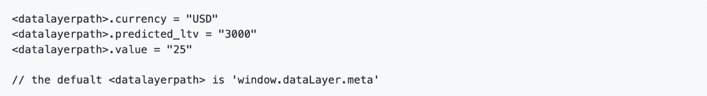

# [!DNL Meta Conversions API] Erweiterungsübersicht

Die [[!DNL Meta Conversions API]](https://developers.facebook.com/docs/marketing-api/conversions-api/) ermöglicht es Ihnen, Ihre Server-seitigen Marketing-Daten mit [!DNL Meta] Technologien zur Optimierung Ihres Anzeigen-Targeting, Senkung der Kosten pro Aktion und Messung der Ergebnisse. Ereignisse sind mit einer [[!DNL Meta Pixel]](https://developers.facebook.com/docs/meta-pixel/) ID und werden ähnlich wie clientseitige Ereignisse verarbeitet.

Verwenden der [!DNL Meta Conversions API] -Erweiterung verwenden, können Sie die API-Funktionen in Ihrer [Ereignisweiterleitung](../../../ui/event-forwarding/overview.md) Regeln zum Senden von Daten an [!DNL Meta] vom Adobe Experience Platform Edge Network aus. In diesem Dokument wird beschrieben, wie Sie die Erweiterung installieren und ihre Funktionen in der Ereignisweiterleitung verwenden. [Regel](../../../ui/managing-resources/rules.md).

## Demo

Das folgende Video soll Ihr Verständnis der [!DNL Meta Conversions API].

>[!VIDEO](https://unlockmarketingdata.com/video-meta-conversions-api)

## Voraussetzungen

Es wird dringend empfohlen [!DNL Meta Pixel] und [!DNL Conversions API] , um dieselben Ereignisse vom Client- bzw. vom Server-seitigen freizugeben und zu senden, da dies dazu beitragen kann, Ereignisse wiederherzustellen, die nicht von abgerufen wurden. [!DNL Meta Pixel]. Vor der Installation [!DNL Conversions API] -Erweiterung, siehe Handbuch im [[!DNL Meta Pixel] Erweiterung](../../client/meta/overview.md) für Schritte zur Integration in Ihre clientseitigen Tag-Implementierungen.

>[!NOTE]
>
>Der Abschnitt zu [Ereignisdeduplizierung](#deduplication) weiter unten in diesem Dokument die Schritte beschrieben, um sicherzustellen, dass dasselbe Ereignis nicht zweimal verwendet wird, da es sowohl vom Browser als auch vom Server empfangen werden kann.

Um die [!DNL Conversions API] -Erweiterung, müssen Sie Zugriff auf die Ereignisweiterleitung haben und über eine gültige [!DNL Meta] Konto mit Zugriff auf [!DNL Ad Manager] und [!DNL Event Manager]. Insbesondere müssen Sie die Kennung eines vorhandenen [[!DNL Meta Pixel]](https://www.facebook.com/business/help/952192354843755?id=1205376682832142) (oder [Erstellen Sie eine neue [!DNL Pixel]](https://www.facebook.com/business/help/952192354843755) ), damit die Erweiterung für Ihr Konto konfiguriert werden kann.

>[!INFO]
>
>Wenn Sie diese Erweiterung mit App-Daten verwenden möchten oder wenn Sie auch mit Offline-Ereignisdaten in Ihrer [!DNL Meta] Kampagnen erstellen, müssen Sie Ihren Datensatz über eine vorhandene App erstellen und **Aus einer Pixel-ID erstellen** angezeigt. Siehe Artikel [Entscheiden Sie, welche Datensatzerstellungsoption für Ihr Unternehmen geeignet ist.](https://www.facebook.com/business/help/5270377362999582?id=490360542427371) für Details. Siehe Abschnitt [Konversions-API für App-Ereignisse](https://developers.facebook.com/docs/marketing-api/conversions-api/app-events) für alle erforderlichen und optionalen App-Tracking-Parameter.

## Installieren der Erweiterung

So installieren Sie die [!DNL Meta Conversions API] Erweiterung, navigieren Sie zur Datenerfassungs-Benutzeroberfläche oder Experience Platform-Benutzeroberfläche und wählen Sie **[!UICONTROL Ereignisweiterleitung]** über die linke Navigation. Wählen Sie hier eine Eigenschaft aus, der die Erweiterung hinzugefügt werden soll, oder erstellen Sie stattdessen eine neue Eigenschaft.

Nachdem Sie die gewünschte Eigenschaft ausgewählt oder erstellt haben, wählen Sie **[!UICONTROL Erweiterungen]** im linken Navigationsbereich und wählen Sie dann die **[!UICONTROL Katalog]** Registerkarte. Suchen Sie nach [!UICONTROL Meta Conversions-API] Karte, und wählen Sie **[!UICONTROL Installieren]**.

![Die [!UICONTROL Installieren] Option, die für die [!UICONTROL Meta Conversions-API] -Erweiterung in der Datenerfassungs-Benutzeroberfläche.](../../../images/extensions/server/meta/install.png)

In der angezeigten Konfigurationsansicht müssen Sie die Variable [!DNL Pixel] ID, die Sie zuvor kopiert haben, um die Erweiterung mit Ihrem Konto zu verknüpfen. Sie können die ID direkt in die Eingabe einfügen oder stattdessen ein Datenelement verwenden.

Sie müssen außerdem ein Zugriffstoken bereitstellen, um die [!DNL Conversions API] speziell. Siehe Abschnitt [!DNL Conversions API] Dokumentation zu [Zugriffstoken generieren](https://developers.facebook.com/docs/marketing-api/conversions-api/get-started#access-token) für Schritte zum Abrufen dieses Werts.

Wählen Sie zum Abschluss **[!UICONTROL Speichern]**

![Die [!DNL Pixel] ID, die in der Erweiterungskonfigurationsansicht als Datenelement bereitgestellt wird.](../../../images/extensions/server/meta/configure.png)

Die -Erweiterung ist installiert und Sie können jetzt ihre Funktionen in Ihren Ereignisweiterleitungsregeln verwenden.

## Integration mit der Meta Business Extension (MBE) {#mbe}

Dank der Integration mit Meta Business Extensions (MBE) können Sie sich schnell bei Ihrem Meta Business Account authentifizieren. Dadurch wird Ihre [!UICONTROL Pixel-ID] und die Meta Conversions-API [!UICONTROL Zugriffstoken], wodurch die Installation und Konfiguration der Meta Conversions-API vereinfacht werden.

Bei der Installation der [!UICONTROL Meta Conversions-API] -Erweiterung.

![Die [!UICONTROL API-Erweiterung für Meta Conversions] Hervorhebung der Installationsseite [!UICONTROL Mit Meta verbinden].](../../../images/extensions/server/meta/mbe-extension-install.png)

Eine Dialogaufforderung zur Authentifizierung in MBE wird auch in der Schnellstart-Workflow-Benutzeroberfläche bei der Ereignisweiterleitung angezeigt.

![Die Schnellstart-Workflow-Benutzeroberfläche - Hervorhebung [!UICONTROL Mit Meta verbinden].](../../../images/extensions/server/meta/mbe-extension-quick-start.png)

## Integration mit der Ereignisqualitätsübereinstimmung (EMQ) {#emq}

Durch die Integration mit der Ereignisqualitäts-Match-Bewertung (EMQ) können Sie die Effektivität Ihrer Implementierung einfach anzeigen, indem Sie EMQ-Bewertungen anzeigen. Diese Integration minimiert das Wechseln des Kontexts und hilft Ihnen, den Erfolg Ihrer Meta Conversions API-Implementierungen zu verbessern. Diese Ereignisbewertungen werden im [!UICONTROL Meta Conversions API-Erweiterung] Konfigurationsbildschirm.

![Die [!UICONTROL API-Erweiterung für Meta Conversions] Hervorhebung der Konfigurationsseite [!UICONTROL EMQ-Bewertung anzeigen].](../../../images/extensions/server/meta/emq-score.png)

## Integration mit LiveRamp (Alpha) {#alpha}

[!DNL LiveRamp] Kunden, die [!DNL LiveRamp]Die auf ihren Sites bereitgestellte authentifizierte Traffic-Lösung (ATS) kann sich dafür entscheiden, RampIDs als Parameter für Kundeninformationen freizugeben. Arbeiten Sie bitte mit Ihrem [!DNL Meta] Account-Team , um dem Alpha-Programm für diese Funktion beizutreten.

![Die Meta-Ereignisweiterleitung [!UICONTROL Regel] Hervorhebung der Konfigurationsseite [!UICONTROL Partnername (Alpha)] und [!UICONTROL Partner-ID (Alpha)].](../../../images/extensions/server/meta/live-ramp.png)

## Konfigurieren einer Ereignisweiterleitungsregel {#rule}

In diesem Abschnitt wird die Verwendung der [!DNL Conversions API] -Erweiterung in einer generischen Ereignisweiterleitungsregel. In der Praxis sollten Sie mehrere Regeln konfigurieren, um alle akzeptierten zu senden [Standardereignisse](https://developers.facebook.com/docs/meta-pixel/reference) via [!DNL Meta Pixel] und [!DNL Conversions API]. Informationen zu Mobile-App-Daten finden Sie in den erforderlichen Feldern, Feldern für App-Daten, Parametern für Kundeninformationen und benutzerdefinierten Datendetails. [here](https://developers.facebook.com/docs/marketing-api/conversions-api/app-events).

>[!NOTE]
>
>Ereignisse sollten [in Echtzeit gesendet](https://www.facebook.com/business/help/379226453470947?id=818859032317965) oder so nah wie möglich in Echtzeit, um eine bessere Anzeigenkampagnenoptimierung zu erzielen.

Beginnen Sie mit der Erstellung einer neuen Ereignisweiterleitungsregel und konfigurieren Sie deren Bedingungen nach Bedarf. Wenn Sie die Aktionen für die Regel auswählen, wählen Sie **[!UICONTROL API-Erweiterung für Meta Conversions]** für die Erweiterung und wählen Sie dann **[!UICONTROL Ereignis der Konversions-API senden]** für den Aktionstyp.

![Die [!UICONTROL Seitenansicht senden] Aktionstyp, der für eine Regel in der Datenerfassungs-Benutzeroberfläche ausgewählt wird.](../../../images/extensions/server/meta/select-action.png)

Es werden Steuerelemente angezeigt, mit denen Sie die Ereignisdaten konfigurieren können, die an [!DNL Meta] über die [!DNL Conversions API]. Diese Optionen können direkt in die bereitgestellten Eingaben eingegeben werden oder Sie können vorhandene Datenelemente auswählen, um die Werte stattdessen darzustellen. Die Konfigurationsoptionen sind wie unten beschrieben in vier Hauptabschnitte unterteilt.

| Konfigurationsabschnitt | Beschreibung |
| --- | --- |
| [!UICONTROL Server-Ereignisparameter] | Allgemeine Informationen zum Ereignis, einschließlich der Zeit, zu der es aufgetreten ist, und der Quellaktion, die es ausgelöst hat. Siehe Abschnitt [!DNL Meta] Entwicklerdokumentation für weitere Informationen zu [Standard-Ereignisparameter](https://developers.facebook.com/docs/marketing-api/conversions-api/parameters/server-event) von [!DNL Conversions API].  Wenn Sie beide [!DNL Meta Pixel] und [!DNL Conversions API] Um Ereignisse zu senden, stellen Sie sicher, dass Sie sowohl eine als auch eine **[!UICONTROL Ereignisname]** (`event_name`) und **[!UICONTROL Ereignis-ID]** (`event_id`) bei jedem Ereignis verwenden, da diese Werte für [Ereignisdeduplizierung](#deduplication).  Sie können auch **[!UICONTROL Eingeschränkte Datenverwendung aktivieren]** um die Einhaltung von Kunden-Opt-outs zu unterstützen. Siehe [!DNL Conversions API] Dokumentation zu [Datenverarbeitungsoptionen](https://developers.facebook.com/docs/marketing-apis/data-processing-options/) für Details zu dieser Funktion. |
| [!UICONTROL Parameter für Kundeninformationen] | Benutzeridentitätsdaten, mit denen das Ereignis einem Kunden zugeordnet wird. Einige dieser Werte müssen gehasht werden, bevor sie an die API gesendet werden können.  Um eine gute gemeinsame API-Verbindung und eine hohe Ereignisübereinstimmungsqualität (EMQ) sicherzustellen, wird empfohlen, alle [akzeptierte Kundeninformationsparameter](https://developers.facebook.com/docs/marketing-api/conversions-api/parameters/customer-information-parameters) neben Serverereignissen. Diese Parameter sollten ebenfalls [priorisiert anhand ihrer Bedeutung und Auswirkung auf EMQ](https://www.facebook.com/business/help/765081237991954?id=818859032317965). |
| [!UICONTROL Benutzerdefinierte Daten] | Zusätzliche Daten, die zur Optimierung der Anzeigenbereitstellung verwendet werden und in Form eines JSON-Objekts bereitgestellt werden. Siehe Abschnitt [[!DNL Conversions API] Dokumentation](https://developers.facebook.com/docs/marketing-api/conversions-api/parameters/custom-data) für weitere Informationen zu den zulässigen Eigenschaften für dieses Objekt.  Wenn Sie ein Kaufereignis senden, müssen Sie in diesem Abschnitt die erforderlichen Attribute angeben `currency` und `value`. |
| [!UICONTROL Testereignis] | Diese Option wird verwendet, um zu überprüfen, ob Ihre Konfiguration dazu führt, dass Serverereignisse von empfangen werden [!DNL Meta] wie erwartet. Um diese Funktion zu verwenden, wählen Sie die **[!UICONTROL Als Testereignis senden]** und geben Sie dann in der unten stehenden Eingabe einen Test-Ereigniscode Ihrer Wahl ein. Nachdem die Ereignisweiterleitungsregel bereitgestellt wurde, sollten bei der korrekten Konfiguration der Erweiterung und Aktion Aktivitäten angezeigt werden, die im **[!DNL Test Events]** Ansicht in [!DNL Meta Events Manager]. |

{style="table-layout:auto"}

Wählen Sie zum Abschluss **[!UICONTROL Änderungen beibehalten]** , um die Aktion zur Regelkonfiguration hinzuzufügen.

![[!UICONTROL Änderungen beibehalten] für die Aktionskonfiguration ausgewählt werden.](../../../images/extensions/server/meta/keep-changes.png)

Wenn Sie mit der Regel zufrieden sind, wählen Sie **[!UICONTROL In Bibliothek speichern]**. Veröffentlichen Sie schließlich eine neue Ereignisweiterleitung [build](../../../ui/publishing/builds.md) um die Änderungen zu aktivieren, die an der Bibliothek vorgenommen wurden.

## Ereignis-Deduplizierung {#deduplication}

Wie in [Abschnitt mit Voraussetzungen](#prerequisites), wird empfohlen, beide [!DNL Meta Pixel] Tag-Erweiterung und [!DNL Conversions API] Ereignisweiterleitungs-Erweiterung, um dieselben Ereignisse vom Client und Server in einer redundanten Einrichtung zu senden. Dies kann dazu beitragen, Ereignisse wiederherzustellen, die nicht von der einen oder anderen Erweiterung erfasst wurden.

Wenn Sie verschiedene Ereignistypen vom Client und Server senden, ohne dass sich die beiden überschneiden, ist keine Deduplizierung erforderlich. Wenn jedoch ein einzelnes Ereignis von beiden gemeinsam genutzt wird [!DNL Meta Pixel] und [!DNL Conversions API]müssen Sie sicherstellen, dass diese redundanten Ereignisse dedupliziert werden, damit Ihre Berichterstellung nicht beeinträchtigt wird.

Stellen Sie beim Senden von freigegebenen Ereignissen sicher, dass Sie eine Ereignis-ID und einen Namen mit jedem Ereignis einbeziehen, das Sie vom Client und vom Server senden. Wenn mehrere Ereignisse mit derselben ID und demselben Namen empfangen werden, [!DNL Meta] verwendet automatisch mehrere Strategien, um sie zu deduplizieren und die relevantesten Daten beizubehalten. Siehe [!DNL Meta] Dokumentation zu [Deduplizierung für [!DNL Meta Pixel] und [!DNL Conversions API] events](https://www.facebook.com/business/help/823677331451951?id=1205376682832142) für Details zu diesem Prozess.

## Schnellstart-Workflow: Metadaten-Konversions-API-Erweiterung (Beta) {#quick-start}

>[!IMPORTANT]
>
>* Die Schnellstartfunktion steht Kunden zur Verfügung, die das Real-Time CDP Prime- und Ultimate-Package erworben haben. Bitte wenden Sie sich an den Adobe-Support-Mitarbeiter, um weitere Informationen zu erhalten.
>* Diese Funktion ist für neue Netto-Implementierungen vorgesehen und unterstützt derzeit nicht die automatische Installation von Erweiterungen und Konfigurationen für vorhandene Tags und Ereignisweiterleitungseigenschaften.

>[!NOTE]
>
>Jeder vorhandene Client kann die Schnellstart-Workflows verwenden, um eine Referenzimplementierung zu erstellen, die für Folgendes verwendet werden kann:
>* Verwenden Sie ihn als Beginn einer brandneuen Implementierung.
>* Nutzen Sie ihn als Referenzimplementierung, die Sie untersuchen können, um zu sehen, wie er konfiguriert wurde, und dann in Ihren aktuellen Produktionsimplementierungen replizieren können.

Mit der Schnellstartfunktion können Sie mit der Meta-Konversions-API und den Meta-Pixel-Erweiterungen einfach und effizient einrichten. Dieses Tool automatisiert mehrere Schritte, die in Adobe-Tags und Ereignisweiterleitung ausgeführt werden, wodurch die Einrichtungszeit erheblich verkürzt wird.

Diese Funktion installiert und konfiguriert automatisch sowohl die Meta Conversions-API als auch die Meta-Pixel-Erweiterungen für neu automatisch generierte Tags und die Ereignisweiterleitungs-Eigenschaft mit den erforderlichen Regeln und Datenelementen. Außerdem werden das Experience Platform Web SDK und Datastream automatisch installiert und konfiguriert. Schließlich veröffentlicht die Schnellstartfunktion die Bibliothek automatisch in der angegebenen URL in einer Entwicklungsumgebung, was die clientseitige Datenerfassung und die serverseitige Ereignisweiterleitung über die Ereignisweiterleitung und das Experience Platform Edge Network in Echtzeit ermöglicht.

Das folgende Video bietet eine Einführung in die Schnellstarterfunktion.

>[!VIDEO](https://video.tv.adobe.com/v/3416939?quality=12&learn=on)

### Schnellstartfunktion installieren

>[!NOTE]
>
>Diese Funktion soll Ihnen bei den ersten Schritten mit der Implementierung der Ereignisweiterleitung helfen. Es wird keine End-to-End-Implementierung liefern, die voll funktionsfähig ist und allen Anwendungsfällen gerecht wird.

Bei diesem Setup werden sowohl die Meta Conversions-API als auch die Meta Pixel-Erweiterungen automatisch installiert. Diese Hybridimplementierung wird von Meta empfohlen, um serverseitige Ereigniskonversionen zu erfassen und weiterzuleiten.
Die schnelle Setup-Funktion soll Kunden bei den ersten Schritten mit der Implementierung der Ereignisweiterleitung unterstützen und soll keine vollständige Implementierung liefern, die alle Anwendungsfälle berücksichtigt.

Um die Funktion zu installieren, wählen Sie **[!UICONTROL Erste Schritte]** für **[!DNL Send Conversions Data to Meta]** zur Datenerfassung in Adobe Experience Platform **[!UICONTROL Startseite]** Seite.

Geben Sie Ihre **[!UICONTROL Domäne]**, wählen Sie **[!UICONTROL Nächste]**. Diese Domäne wird als Namenskonvention für automatisch generierte Tags und Ereignisweiterleitungseigenschaften, Regeln, Datenelemente, Datenspeicher usw. verwendet.

Im **[!UICONTROL Ersteinrichtung]** Dialogfeld eingeben **[!UICONTROL Meta-Pixel-ID]**, **[!UICONTROL Zugriffstoken für Metadaten-Konversions-API]**, und **[!UICONTROL Datenschichtpfad]**, wählen Sie **[!UICONTROL Nächste]**.

Warten Sie einige Minuten, bis der erste Einrichtungsprozess abgeschlossen ist, und wählen Sie dann **[!UICONTROL Nächste]**.

Aus dem **[!UICONTROL Code zu Ihrer Site hinzufügen]** Kopieren Sie den Code, der mit der Kopie bereitgestellt wird.  -Funktion und fügen Sie sie in die `<head>` Ihrer Quell-Website. Wählen Sie nach der Implementierung **[!UICONTROL Validierung starten]**

Die [!UICONTROL Überprüfungsergebnisse] zeigt die Implementierungsergebnisse der Meta-Erweiterung an. Auswählen **[!UICONTROL Nächste]**. Sie können auch zusätzliche Überprüfungsergebnisse anzeigen, indem Sie die **[!UICONTROL Assurance]** -Link.

Die **[!UICONTROL Nächste Schritte]** Bildschirmanzeige bestätigt den Abschluss der Einrichtung. Von hier aus haben Sie die Möglichkeit, Ihre Implementierung zu optimieren, indem Sie neue Ereignisse hinzufügen, die im nächsten Abschnitt angezeigt werden.

Wenn Sie keine zusätzlichen Ereignisse hinzufügen möchten, wählen Sie **[!UICONTROL Schließen]**.

#### Hinzufügen zusätzlicher Ereignisse

Um neue Ereignisse hinzuzufügen, wählen Sie **[!UICONTROL Bearbeiten Ihrer Tags-Webeigenschaft]**.

Wählen Sie die Regel aus, die dem Meta-Ereignis entspricht, das Sie bearbeiten möchten. Beispiel: **MetaConversion_AddToCart**.

>[!NOTE]
>
>Wenn kein Ereignis vorhanden ist, wird diese Regel nicht ausgeführt. Dies gilt für alle Regeln, mit dem **MetaConversion_PageView** -Regel ist die Ausnahme.

Um ein Ereignis hinzuzufügen, wählen Sie **[!UICONTROL Hinzufügen]** unter [!UICONTROL Veranstaltungen] -Überschrift.

Wählen Sie die [!UICONTROL Ereignistyp]. In diesem Beispiel haben wir die Variable [!UICONTROL Klicks] -Ereignis und konfigurieren Sie es für den Trigger, wenn die **.add-to-cart-button** ausgewählt ist. Wählen Sie **[!UICONTROL Änderungen beibehalten]** aus.

Das neue Ereignis wurde gespeichert. Auswählen **[!UICONTROL Arbeitsbibliothek auswählen]** und wählen Sie die Bibliothek aus, die Sie erstellen möchten.

Wählen Sie als Nächstes das Dropdown-Menü neben **[!UICONTROL In Bibliothek speichern]** und wählen **[!UICONTROL In Bibliothek speichern und erstellen]**. Dadurch wird die Änderung in der Bibliothek veröffentlicht.

Wiederholen Sie diese Schritte für jedes andere Meta-Konversionsereignis, das Sie konfigurieren möchten.

#### Datenschichtkonfiguration {#configuration}

>[!IMPORTANT]
>
>Die Art und Weise, wie Sie diese globale Datenschicht aktualisieren, hängt von Ihrer Website-Architektur ab. Eine einseitige Anwendung unterscheidet sich von einer serverseitigen Rendering-App. Es besteht auch die Möglichkeit, dass Sie vollständig dafür verantwortlich sind, diese Daten innerhalb des Tags-Produkts zu erstellen und zu aktualisieren. In allen Fällen muss die Datenschicht zwischen der Ausführung der einzelnen `MetaConversion_* rules`. Wenn Sie die Daten zwischen Regeln nicht aktualisieren, können Sie auch auf einen Fall stoßen, in dem Sie veraltete Daten aus der letzten `MetaConversion_* rule` im aktuellen `MetaConversion_* rule`.

Während der Konfiguration wurden Sie gefragt, wo sich Ihre Datenschicht befindet. Standardmäßig wäre dies `window.dataLayer.meta`und innerhalb der `meta` -Objekt, werden Ihre Daten wie unten dargestellt erwartet.

Dies ist wichtig, da jede `MetaConversion_*` verwendet diese Datenstruktur, um die relevanten Datenteile an die [!DNL Meta Pixel] und [!DNL Meta Conversions API]. Weitere Informationen finden Sie in der Dokumentation unter [Standardereignisse](https://developers.facebook.com/docs/meta-pixel/reference#standard-events) Weitere Informationen dazu, welche Daten für verschiedene Meta-Ereignisse erforderlich sind.

Wenn Sie beispielsweise die `MetaConversion_Subscribe` -Regel verwenden, müssen Sie `window.dataLayer.meta.currency`, `window.dataLayer.meta.predicted_ltv`, und `window.dataLayer.meta.value` entsprechend den Objekteigenschaften, die in der Dokumentation unter [Standardereignisse](https://developers.facebook.com/docs/meta-pixel/reference#standard-events).

Im Folgenden finden Sie ein Beispiel dafür, was auf einer Website ausgeführt werden muss, um die Datenschicht zu aktualisieren, bevor die Regel ausgeführt wird.

Standardmäßig wird die Variable `<datalayerpath>.conversionData.eventId` wird zufällig von der Aktion &quot;Neue Ereignis-ID generieren&quot;für eine der `MetaConversion_* rules`.

Um eine lokale Referenz dazu zu erhalten, wie die Datenschicht aussehen soll, können Sie den Editor für benutzerdefinierten Code im `MetaConversion_DataLayer` -Datenelement in Ihrer Eigenschaft.

## Nächste Schritte

In diesem Handbuch wurde beschrieben, wie Sie serverseitige Ereignisdaten an senden [!DNL Meta] mithilfe der [!DNL Meta Conversions API] -Erweiterung. Von hier aus wird empfohlen, Ihre Integration durch eine stärkere Verbindung zu erweitern [!DNL Pixels] und teilen Sie ggf. weitere Ereignisse. Eine der folgenden Maßnahmen kann dazu beitragen, Ihre Anzeigenleistung weiter zu verbessern:

* Andere verbinden [!DNL Pixels] , die noch nicht mit einer [!DNL Conversions API] Integration.
* Wenn Sie bestimmte Ereignisse ausschließlich über senden [!DNL Meta Pixel] Client-seitig senden Sie dieselben Ereignisse an die [!DNL Conversions API] auch vom Server aus.

Siehe [!DNL Meta] Dokumentation zu [Best Practices für [!DNL Conversions API]](https://www.facebook.com/business/help/308855623839366?id=818859032317965) für weitere Anleitungen zur effektiven Implementierung Ihrer Integration. Allgemeine Informationen zu Tags und zur Ereignisweiterleitung in Adobe Experience Cloud finden Sie im Abschnitt [Tag-Übersicht](../../../home.md).
