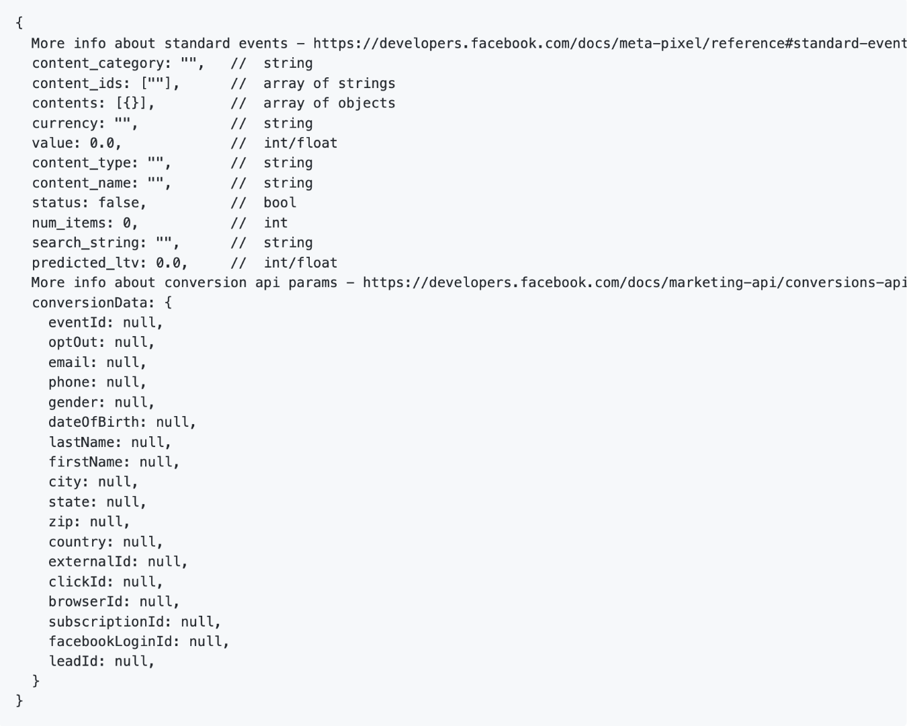

# [!DNL Meta Conversions API] - Übersicht

Mit dem [[!DNL Meta Conversions API]](https://developers.facebook.com/docs/marketing-api/conversions-api/) können Sie Ihre Server-seitigen Marketing-Daten mit [!DNL Meta] Technologien verbinden, um Ihr Anzeigen-Targeting zu optimieren, Kosten pro Aktion zu senken und Ergebnisse zu messen. Ereignisse sind mit einer [[!DNL Meta Pixel]](https://developers.facebook.com/docs/meta-pixel/)-ID verknüpft und werden auf ähnliche Weise wie Client-seitige Ereignisse verarbeitet.

Mit der [!DNL Meta Conversions API]-Erweiterung können Sie die Funktionen der API in Ihren Regeln [Ereignisweiterleitung](../../../ui/event-forwarding/overview.md) nutzen, um Daten aus Adobe Experience Platform Edge Network an [!DNL Meta] zu senden. In diesem Dokument wird beschrieben, wie Sie die Erweiterung installieren und ihre Funktionen in einer Ereignisweiterleitungsregel ([) &#x200B;](../../../ui/managing-resources/rules.md).

## Demo

Im folgenden Video werden die [!DNL Meta Conversions API] erklärt.

>[!VIDEO](https://unlockmarketingdata.com/video-meta-conversions-api)

## Voraussetzungen

Es wird dringend empfohlen, [!DNL Meta Pixel] und den [!DNL Conversions API] zu verwenden, um dieselben Ereignisse von der Client- bzw. Serverseite freizugeben und zu senden, da dies dazu beitragen kann, Ereignisse wiederherzustellen, die von [!DNL Meta Pixel] nicht erfasst wurden. Bevor Sie die [!DNL Conversions API]-Erweiterung installieren, lesen Sie das Handbuch unter [[!DNL Meta Pixel] Erweiterung](../../client/meta/overview.md) , um Anweisungen zur Integration in Ihre Client-seitigen Tag-Implementierungen zu erhalten.

>[!NOTE]
>
>Der Abschnitt [Ereignis-Deduplizierung](#deduplication) weiter unten in diesem Dokument beschreibt die Schritte, um sicherzustellen, dass dasselbe Ereignis nicht zweimal verwendet wird, da es sowohl vom Browser als auch vom Server empfangen werden kann.

Um die [!DNL Conversions API]-Erweiterung verwenden zu können, müssen Sie Zugriff auf die Ereignisweiterleitung haben und über ein gültiges [!DNL Meta] mit Zugriff auf [!DNL Ad Manager] und [!DNL Event Manager] verfügen. Insbesondere müssen Sie die ID einer vorhandenen [[!DNL Meta Pixel]](https://www.facebook.com/business/help/952192354843755?id=1205376682832142) kopieren (oder stattdessen [eine neue erstellen [!DNL Pixel]](https://www.facebook.com/business/help/952192354843755), damit die Erweiterung für Ihr Konto konfiguriert werden kann.

>[!INFO]
>
>Wenn Sie diese Erweiterung mit Mobile-App-Daten verwenden möchten oder in Ihren [!DNL Meta]-Kampagnen auch mit Offline-Ereignisdaten arbeiten, müssen Sie Ihren Datensatz über eine vorhandene App erstellen und **Erstellen aus einer Pixel-ID** auswählen, wenn Sie dazu aufgefordert werden. Weitere Informationen finden Sie [&#x200B; Artikel „Festlegen, welche Option zur Erstellung von Datensätzen für Ihr &#x200B;](https://www.facebook.com/business/help/5270377362999582?id=490360542427371) geeignet ist“. Im Dokument [Konversions-API für App-Ereignisse](https://developers.facebook.com/docs/marketing-api/conversions-api/app-events) finden Sie alle erforderlichen und optionalen App-Tracking-Parameter.

## Installieren der Erweiterung

Um die [!DNL Meta Conversions API] zu installieren, navigieren Sie zur Datenerfassungs-Benutzeroberfläche oder zur Experience Platform-Benutzeroberfläche und wählen Sie **[!UICONTROL Event Forwarding]** in der linken Navigationsleiste aus. Wählen Sie hier eine Eigenschaft aus, der die Erweiterung hinzugefügt werden soll, oder erstellen Sie stattdessen eine neue Eigenschaft.

Nachdem Sie die gewünschte Eigenschaft ausgewählt oder erstellt haben, klicken Sie im linken Navigationsbereich auf **[!UICONTROL Extensions]** und wählen Sie dann die Registerkarte **[!UICONTROL Catalog]** aus. Suchen Sie nach der Karte [!UICONTROL Meta Conversions API] und klicken Sie dann auf **[!UICONTROL Install]**.

![Die [!UICONTROL Install] Option, die für die [!UICONTROL Meta Conversions API] in der Datenerfassungs-Benutzeroberfläche ausgewählt wird.](../../../images/extensions/server/meta/install.png)

In der angezeigten Konfigurationsansicht müssen Sie die zuvor kopierte [!DNL Pixel]-ID angeben, um die Erweiterung mit Ihrem Konto zu verknüpfen. Sie können die ID direkt in die Eingabe einfügen oder stattdessen ein Datenelement verwenden.

Sie müssen auch ein Zugriffstoken angeben, um die [!DNL Conversions API] spezifisch zu verwenden. Anweisungen zum Abrufen dieses Werts finden Sie in der [!DNL Conversions API]-[&#x200B; unter &#x200B;](https://developers.facebook.com/docs/marketing-api/conversions-api/get-started#access-token) eines Zugriffstokens .

Wenn Sie fertig sind, wählen Sie **[!UICONTROL Save]** aus

![Die [!DNL Pixel]-ID, die als Datenelement in der Erweiterungskonfigurationsansicht bereitgestellt wird.](../../../images/extensions/server/meta/configure.png)

Die Erweiterung ist installiert und Sie können jetzt ihre Funktionen in Ihren Ereignisweiterleitungsregeln verwenden.

## Integration mit der Facebook- und Instagram-Erweiterung {#facebook}

Durch die Integration mit der Facebook- und Instagram-Erweiterung können Sie sich schnell bei Ihrem Meta Business-Konto authentifizieren. Dadurch werden Ihre [!UICONTROL Pixel ID] und die Meta Conversions-API-[!UICONTROL Access Token] automatisch ausgefüllt, was die Installation und Konfiguration der Meta Conversions-API vereinfacht.

Bei der Installation der [!UICONTROL Meta Conversions API]-Erweiterung wird eine Dialogaufforderung zur Authentifizierung in Facebook und Instagram angezeigt.

![Die [!UICONTROL Meta Conversions API Extension] Installationsseite mit hervorgehobener [!UICONTROL Connect to Meta].](../../../images/extensions/server/meta/mbe-extension-install.png)

Eine Dialogaufforderung zur Authentifizierung in Facebook und Instagram wird auch in der Benutzeroberfläche des Schnellstart-Workflows bei der Ereignisweiterleitung angezeigt.

![Die Schnellstart-Workflow-Benutzeroberfläche mit hervorgehobenen [!UICONTROL Connect to Meta].](../../../images/extensions/server/meta/mbe-extension-quick-start.png)

## Integration mit dem Event Quality Match Score (EMQ) {#emq}

Die Integration mit dem Event Quality Match Score (EMQ) ermöglicht es Ihnen, die Effektivität Ihrer Implementierung einfach durch die Anzeige von EMQ-Bewertungen zu überprüfen. Diese Integration minimiert den Kontextwechsel und hilft Ihnen, den Erfolg Ihrer Meta Conversions-API-Implementierungen zu verbessern. Diese Ereignisbewertungen werden im Bildschirm [!UICONTROL Meta Conversions API extension] angezeigt.

![Die [!UICONTROL Meta Conversions API Extension] Konfigurationsseite mit hervorgehobener [!UICONTROL View EMQ Score].](../../../images/extensions/server/meta/emq-score.png)

## Integration mit LiveRamp (Alpha) {#alpha}

[!DNL LiveRamp] Kunden, die die Authentication Traffic Solution (ATS) von [!DNL LiveRamp] auf ihren Sites bereitgestellt haben, können sich dafür entscheiden, RampIDs als Kundeninformationsparameter freizugeben. Bitte wenden Sie sich an Ihr [!DNL Meta]-Account-Team, um am Alpha-Programm für diese Funktion teilzunehmen.

![Die Konfigurationsseite der Meta-Ereignisweiterleitung [!UICONTROL Rule] Hervorhebung von [!UICONTROL Partner Name (alpha)] und [!UICONTROL Partner ID (alpha)].](../../../images/extensions/server/meta/live-ramp.png)

## Konfigurieren einer Ereignisweiterleitungsregel {#rule}

In diesem Abschnitt wird beschrieben, wie Sie die [!DNL Conversions API]-Erweiterung in einer generischen Ereignisweiterleitungsregel verwenden. In der Praxis sollten Sie mehrere Regeln konfigurieren, um alle akzeptierten [Standardereignisse](https://developers.facebook.com/docs/meta-pixel/reference) über [!DNL Meta Pixel] und [!DNL Conversions API] zu senden. Informationen zu Mobile-App-Daten finden Sie in den Pflichtfeldern, App-Datenfeldern, Kundeninformationsparametern und Details zu benutzerdefinierten Daten [hier](https://developers.facebook.com/docs/marketing-api/conversions-api/app-events).

>[!NOTE]
>
>Ereignisse sollten [in Echtzeit gesendet werden](https://www.facebook.com/business/help/379226453470947?id=818859032317965) oder so nah wie möglich an der Echtzeit, um die Anzeigenkampagnenoptimierung zu verbessern.

Beginnen Sie mit der Erstellung einer neuen Ereignisweiterleitungsregel und konfigurieren Sie deren Bedingungen nach Bedarf. Wählen Sie bei der Auswahl der Aktionen für die Regel **[!UICONTROL Meta Conversions API Extension]** für die Erweiterung und wählen Sie dann **[!UICONTROL Send Conversions API Event]** für den Aktionstyp aus.

![Der [!UICONTROL Send Page View] Aktionstyp, der für eine Regel in der Datenerfassungs-Benutzeroberfläche ausgewählt wird.](../../../images/extensions/server/meta/select-action.png)

Es werden Steuerelemente angezeigt, mit denen Sie die Ereignisdaten konfigurieren können, die über die [!DNL Meta] an [!DNL Conversions API] gesendet werden. Diese Optionen können direkt in die bereitgestellten Eingaben eingegeben werden oder Sie können stattdessen vorhandene Datenelemente zur Darstellung der Werte auswählen. Die Konfigurationsoptionen sind wie unten beschrieben in vier Hauptabschnitte unterteilt.

| Konfigurationsabschnitt | Beschreibung |
| --- | --- |
| [!UICONTROL Server Event Parameters] | Allgemeine Informationen zum Ereignis, einschließlich des Zeitpunkts seines Eintretens und der Quellaktion, die es ausgelöst hat. Weitere Informationen zu den [!DNL Meta]Standardereignisparametern“, die vom [&#x200B; akzeptiert &#x200B;](https://developers.facebook.com/docs/marketing-api/conversions-api/parameters/server-event), finden Sie in der [!DNL Conversions API]-Entwicklerdokumentation .  Wenn Sie sowohl [!DNL Meta Pixel] als auch die [!DNL Conversions API] zum Senden von Ereignissen verwenden, stellen Sie sicher, dass Sie bei jedem Ereignis sowohl eine **[!UICONTROL Event Name]** (`event_name`) als auch eine **[!UICONTROL Event ID]** (`event_id`) einbeziehen, da diese Werte für die [Ereignis-Deduplizierung](#deduplication).  Sie haben auch die Möglichkeit, bei der Einhaltung von Kunden-Opt-outs zu **[!UICONTROL Enable Limited Data Use]**. Einzelheiten zu dieser Funktion finden Sie in der [!DNL Conversions API] [Datenverarbeitungsoptionen](https://developers.facebook.com/docs/marketing-apis/data-processing-options/). |
| [!UICONTROL Customer Information Parameters] | Benutzeridentitätsdaten, mit denen das Ereignis einem Kunden zugeordnet wird. Einige dieser Werte müssen gehasht werden, bevor sie an die API gesendet werden können.  Um eine gute gemeinsame API-Verbindung und eine hohe Ereignisabgleichqualität (Event Match Quality, EMQ) sicherzustellen, wird empfohlen, dass Sie alle [akzeptierten Kundeninformationsparameter](https://developers.facebook.com/docs/marketing-api/conversions-api/parameters/customer-information-parameters) zusammen mit Serverereignissen senden. Diese Parameter sollten ebenfalls priorisiert werden [basierend auf ihrer Bedeutung und ihren Auswirkungen auf den EMQ](https://www.facebook.com/business/help/765081237991954?id=818859032317965). |
| [!UICONTROL Custom Data] | Zusätzliche Daten zur Optimierung des Anzeigenversands, bereitgestellt in Form eines JSON-Objekts. Weitere Informationen zu den [[!DNL Conversions API]  Eigenschaften für &#x200B;](https://developers.facebook.com/docs/marketing-api/conversions-api/parameters/custom-data) Objekt finden Sie in der Dokumentation .  Wenn Sie ein Kaufereignis senden, müssen Sie diesen Abschnitt verwenden, um die erforderlichen Attribute `currency` und `value` anzugeben. |
| [!UICONTROL Test Event] | Diese Option wird verwendet, um zu überprüfen, ob Ihre Konfiguration dazu führt, dass Server-Ereignisse erwartungsgemäß von [!DNL Meta] empfangen werden. Um diese Funktion zu verwenden, aktivieren Sie das Kontrollkästchen **[!UICONTROL Send as Test Event]** und geben Sie dann in der unten stehenden Eingabe einen Testereignis-Code Ihrer Wahl an. Nachdem die Ereignisweiterleitungsregel bereitgestellt wurde, sollten Aktivitäten in der **[!DNL Test Events]** in [!DNL Meta Events Manager] angezeigt werden, wenn Sie die Erweiterung und Aktion richtig konfiguriert haben. |

{style="table-layout:auto"}

Wenn Sie fertig sind, wählen Sie **[!UICONTROL Keep Changes]** aus, um die Aktion zur Regelkonfiguration hinzuzufügen.

![[!UICONTROL Keep Changes], der für die Aktionskonfiguration ausgewählt wird.](../../../images/extensions/server/meta/keep-changes.png)

Wenn Sie mit der Regel zufrieden sind, wählen Sie **[!UICONTROL Save to Library]** aus. Veröffentlichen Sie abschließend eine neue Ereignisweiterleitung [build](../../../ui/publishing/builds.md), um die an der Bibliothek vorgenommenen Änderungen zu aktivieren.

## Ereignis-Deduplizierung {#deduplication}

Wie im Abschnitt [Voraussetzungen](#prerequisites) erwähnt, wird empfohlen, sowohl die [!DNL Meta Pixel] Tag-Erweiterung als auch die [!DNL Conversions API] Ereignisweiterleitungserweiterung zu verwenden, um dieselben Ereignisse vom Client und Server in einer redundanten Einrichtung zu senden. Dies kann beim Wiederherstellen von Ereignissen helfen, die von der einen oder anderen Erweiterung nicht aufgenommen wurden.

Wenn Sie verschiedene Ereignistypen vom Client und Server senden, ohne dass sich diese überschneiden, ist keine Deduplizierung erforderlich. Wenn jedoch ein einzelnes Ereignis sowohl von [!DNL Meta Pixel] als auch von der [!DNL Conversions API] gemeinsam verwendet wird, müssen Sie sicherstellen, dass diese redundanten Ereignisse dedupliziert werden, damit Ihr Reporting nicht beeinträchtigt wird.

Stellen Sie beim Senden von freigegebenen Ereignissen sicher, dass Sie zu jedem Ereignis, das Sie sowohl vom Client als auch vom Server senden, eine Ereignis-ID und einen Namen hinzufügen. Wenn mehrere Ereignisse mit derselben ID und demselben Namen empfangen werden, wendet [!DNL Meta] automatisch mehrere Strategien an, um sie zu deduplizieren und die relevantesten Daten zu speichern. Weitere Informationen zu diesem Prozess finden Sie in der [!DNL Meta] [Deduplizierung für [!DNL Meta Pixel] und [!DNL Conversions API] Ereignisse](https://www.facebook.com/business/help/823677331451951?id=1205376682832142).

## Schnellstart-Workflow: Meta Conversions-API-Erweiterung (Beta) {#quick-start}

>[!IMPORTANT]
>
>* Die Schnellstartfunktion steht Kunden zur Verfügung, die das Real-Time CDP Prime- und Ultimate-Paket erworben haben. Bitte wenden Sie sich an den Adobe-Support-Mitarbeiter, um weitere Informationen zu erhalten.
>* Diese Funktion ist für neue Implementierungen vorgesehen und unterstützt derzeit nicht die automatische Installation von Erweiterungen und Konfigurationen für vorhandene Tags und Ereignisweiterleitungseigenschaften.

>[!NOTE]
>
>Jeder vorhandene Client kann die Schnellstart-Workflows verwenden, um eine Referenzimplementierung zu erstellen, die für Folgendes verwendet werden kann:
>
>* Verwenden Sie sie als Beginn einer völlig neuen Implementierung.
>* Nutzen Sie diese als Referenzimplementierung, um zu sehen, wie sie konfiguriert wurde, und replizieren Sie sie dann in Ihren aktuellen Produktionsimplementierungen.

Die Schnellstartfunktion erleichtert und vereinfacht die Einrichtung mit der Meta Conversions-API und den Meta Pixel Extensions. Dieses Tool automatisiert mehrere Schritte, die in Adobe-Tags und in der Ereignisweiterleitung ausgeführt werden, wodurch die Einrichtungszeit erheblich verkürzt wird.

Diese Funktion installiert und konfiguriert automatisch sowohl die Meta Conversions-API als auch die Meta-Pixelerweiterungen für eine neu automatisch generierte Tag- und Ereignisweiterleitungseigenschaft mit den erforderlichen Regeln und Datenelementen. Darüber hinaus werden Experience Platform Web SDK und Datenstrom automatisch installiert und konfiguriert. Schließlich veröffentlicht die Schnellstart-Funktion die Bibliothek automatisch in der angegebenen URL in einer Entwicklungsumgebung, was die Client-seitige Datenerfassung und Server-seitige Ereignisweiterleitung in Echtzeit über die Ereignisweiterleitung und Experience Platform Edge Network ermöglicht.

Das folgende Video bietet eine Einführung in die Schnellstart-Funktion.

>[!VIDEO](https://video.tv.adobe.com/v/3416939?quality=12&learn=on)

### Schnellstartfunktion installieren

>[!NOTE]
>
>Diese Funktion soll Ihnen bei den ersten Schritten mit einer Implementierung der Ereignisweiterleitung helfen. Es wird keine durchgängige, voll funktionsfähige Implementierung bereitstellen, die alle Anwendungsfälle berücksichtigt.

Mit diesem Setup werden automatisch sowohl die Meta Conversions-API als auch die Meta Pixel Extensions installiert. Diese Hybridimplementierung wird von Meta zur Server-seitigen Erfassung und Weiterleitung von Ereigniskonversionen empfohlen.
Die Funktion für die Schnelleinrichtung soll Kundinnen und Kunden bei den ersten Schritten mit einer Implementierung der Ereignisweiterleitung unterstützen und soll keine durchgängige, voll funktionsfähige Implementierung bereitstellen, die alle Anwendungsfälle berücksichtigt.

Um die Funktion zu installieren, wählen Sie **[!UICONTROL Get Started]** zur **[!DNL Send Conversions Data to Meta]** auf der Seite Datenerfassungs-**[!UICONTROL Home]** von Adobe Experience Platform aus.

Geben Sie Ihre **[!UICONTROL Domain]** ein und wählen Sie dann **[!UICONTROL Next]** aus. Diese Domain wird als Namenskonvention für Ihre automatisch generierten Tags und Eigenschaften der Ereignisweiterleitung, Regeln, Datenelemente, Datenströme usw. verwendet.

Geben Sie im Dialogfeld **[!UICONTROL Initial Setup]** Ihre **[!UICONTROL Meta Pixel ID]**, **[!UICONTROL Meta Conversion API Access Token]** und **[!UICONTROL Data Layer Path]** ein und wählen Sie dann **[!UICONTROL Next]** aus.

Warten Sie einige Minuten, bis der anfängliche Einrichtungsprozess abgeschlossen ist, und wählen Sie dann **[!UICONTROL Next]** aus.

Kopieren Sie im Dialogfeld **[!UICONTROL Add Code on Your Site]** den mit der Funktion  bereitgestellten Code und fügen Sie ihn in den `<head>` Ihrer Quell-Website ein. Wählen Sie nach der Implementierung **[!UICONTROL Start Validation]** aus

Im Dialogfeld [!UICONTROL Validation Results] werden die Ergebnisse der Implementierung der Meta-Erweiterung angezeigt. Wählen Sie **[!UICONTROL Next]** aus. Sie können auch zusätzliche Validierungsergebnisse anzeigen, indem Sie auf den Link **[!UICONTROL Assurance]** klicken.

Die **[!UICONTROL Next Steps]** bestätigt den Abschluss des Setups. Von hier aus haben Sie die Möglichkeit, Ihre Implementierung zu optimieren, indem Sie neue Ereignisse hinzufügen, die im nächsten Abschnitt angezeigt werden.

Wenn Sie keine zusätzlichen Ereignisse hinzufügen möchten, wählen Sie **[!UICONTROL Close]** aus.

#### Hinzufügen zusätzlicher Ereignisse

Um neue Ereignisse hinzuzufügen, wählen Sie **[!UICONTROL Edit Your Tags Web Property]** aus.

Wählen Sie die Regel aus, die dem Metaereignis entspricht, das Sie bearbeiten möchten. Beispiel: **MetaConversion_AddToCart**.

>[!NOTE]
>
>Wenn kein Ereignis vorhanden ist, wird diese Regel nicht ausgeführt. Dies gilt für alle Regeln, wobei die Regel **MetaConversion_PageView** die Ausnahme ist.

Um ein Ereignis hinzuzufügen, wählen Sie **[!UICONTROL Add]** unter der Überschrift [!UICONTROL Events] aus.

Wählen Sie die [!UICONTROL Event Type] aus. In diesem Beispiel haben wir das [!UICONTROL Click]-Ereignis ausgewählt und es so konfiguriert, dass es zu Trigger wird, wenn die Schaltfläche **.Zum Warenkorb hinzufügen** ausgewählt wird. Wählen Sie **[!UICONTROL Keep Changes]** aus.

Das neue Ereignis wurde gespeichert. Wählen Sie **[!UICONTROL Select a working library]** und dann die Bibliothek aus, die Sie erstellen möchten.

Wählen Sie als Nächstes das Dropdown-Menü neben **[!UICONTROL Save to Library]** aus und klicken Sie auf **[!UICONTROL Save to Library and Build]**. Dadurch wird die Änderung in der Bibliothek veröffentlicht.

Wiederholen Sie diese Schritte für jedes andere Meta-Konversionsereignis, das Sie konfigurieren möchten.

#### Konfiguration der Datenschicht {#configuration}

>[!IMPORTANT]
>
>Die Art und Weise, wie Sie diese globale Datenschicht aktualisieren, hängt von Ihrer Website-Architektur ab. Eine Single Page Application unterscheidet sich von einer Server-seitigen Rendering-App. Es besteht auch die Möglichkeit, dass Sie allein für die Erstellung und Aktualisierung dieser Daten innerhalb des Tags-Produkts verantwortlich sind. In allen Fällen muss die Datenschicht zwischen der Ausführung der einzelnen `MetaConversion_* rules` aktualisiert werden. Wenn Sie die Daten zwischen den Regeln nicht aktualisieren, können Sie auch auf einen Fall stoßen, in dem Sie veraltete Daten aus dem letzten `MetaConversion_* rule` im aktuellen `MetaConversion_* rule` senden.

Während der Konfiguration wurden Sie gefragt, wo Ihre Datenschicht lebt. Standardmäßig ist dies `window.dataLayer.meta` und innerhalb des `meta` werden Ihre Daten erwartet, wie unten dargestellt.

Dies ist wichtig, da jede `MetaConversion_*` diese Datenstruktur verwendet, um die relevanten Datenelemente an die [!DNL Meta Pixel] und an die [!DNL Meta Conversions API] zu übergeben. Weitere Informationen dazu, welche Daten für verschiedene [-Ereignisse erforderlich sind, finden &#x200B;](https://developers.facebook.com/docs/meta-pixel/reference#standard-events) in der Dokumentation unter „Standardereignisse“.

Wenn Sie beispielsweise die `MetaConversion_Subscribe` verwenden möchten, müssen Sie `window.dataLayer.meta.currency`, `window.dataLayer.meta.predicted_ltv` und `window.dataLayer.meta.value` gemäß den Objekteigenschaften aktualisieren, die in der Dokumentation unter &quot;[&quot; beschrieben &#x200B;](https://developers.facebook.com/docs/meta-pixel/reference#standard-events).

Nachfolgend finden Sie ein Beispiel dafür, was auf einer Website ausgeführt werden muss, um die Datenschicht zu aktualisieren, bevor die Regel ausgeführt wird.

Standardmäßig wird die `<datalayerpath>.conversionData.eventId` zufällig durch die Aktion „Neue Ereignis-ID generieren“ auf einem der `MetaConversion_* rules` generiert.

Als lokale Referenz dazu, wie die Datenschicht aussehen sollte, können Sie den Editor für benutzerdefinierten Code im `MetaConversion_DataLayer` Datenelement in Ihrer Eigenschaft öffnen.

## Nächste Schritte

In diesem Handbuch wurde beschrieben, wie Sie Server-seitige Ereignisdaten mithilfe der [!DNL Meta]-Erweiterung an [!DNL Meta Conversions API] senden. Von hier aus wird empfohlen, Ihre Integration zu erweitern, indem Sie weitere [!DNL Pixels] verbinden und ggf. weitere Ereignisse freigeben. Die Durchführung der folgenden Schritte kann dazu beitragen, die Leistung Ihrer Anzeige weiter zu verbessern:

* Verbinden Sie alle anderen [!DNL Pixels], die noch nicht mit einer [!DNL Conversions API]-Integration verbunden sind.
* Wenn Sie bestimmte Ereignisse ausschließlich über [!DNL Meta Pixel] auf der Client-Seite senden, senden Sie dieselben Ereignisse auch von der Server-Seite an die [!DNL Conversions API].

Weitere Anleitungen zur effektiven Implementierung [!DNL Meta] Integration finden Sie in der [&#x200B; Dokumentation  [!DNL Conversions API]](https://www.facebook.com/business/help/308855623839366?id=818859032317965)Best Practices für die ). Weitere allgemeine Informationen zu Tags und zur Ereignisweiterleitung in Adobe Experience Cloud finden Sie unter [Tags - Übersicht](../../../home.md).
