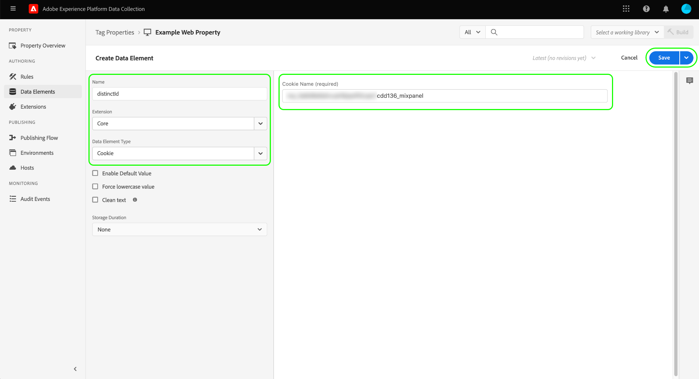

# [!DNL Mixpanel Track Events] API-Ereignisweiterleitungs-Erweiterung

[[!DNL Mixpanel]](https://www.mixpanel.com) ist ein Produktanalysetool, mit dem Sie Daten darüber erfassen können, wie Benutzer mit einem digitalen Produkt interagieren. Sie können Produktdaten mit einfachen, interaktiven Berichten analysieren, mit denen Sie die Daten mit wenigen Klicks abfragen und visualisieren können. [!DNL Mixpanel] wurde entwickelt, um Teams effizienter zu machen, indem es allen ermöglicht, Benutzerdaten in Echtzeit zu analysieren, um Trends zu identifizieren, das Benutzerverhalten zu verstehen und Entscheidungen über Ihr Produkt zu treffen.

[!DNL Mixpanel] verwendet ein ereignisbasiertes, benutzerzentriertes Modell, das jede Interaktion mit einem einzelnen Benutzer verbindet. Die [!DNL Mixpanel] Das Datenmodell basiert auf den Konzepten von Benutzern, Ereignissen und Eigenschaften.

>[!NOTE]
>
>Siehe Abschnitt [!DNL Mixpanel] Dokumentation zu [Identitäts-Management](https://help.mixpanel.com/hc/en-us/articles/360041039771-Getting-Started-with-Identity-Management) um zu verstehen, wie [!DNL Mixpanel] führt Ereignisse zusammen, um Identitäts-Cluster zu erstellen. Es wird außerdem empfohlen, das Dokument zu [eindeutige IDs](https://help.mixpanel.com/hc/en-us/articles/115004509426-Distinct-ID-Creation-JavaScript-iOS-Android-) um zu verstehen, wie sie zur Identifizierung von Benutzern in Ereignisdaten verwendet werden.

Die [!DNL Mixpanel Track Events] Mit der API-Erweiterung können Sie beide [Ereignisweiterleitung](../../../ui/event-forwarding/overview.md) und [tags](../../../home.md) , um Ereignisinformationen im Adobe Experience Platform Edge Network zu erfassen und an zu senden. [!DNL Mixpanel] mithilfe der [[!DNL Track Events] API](https://developer.mixpanel.com/reference/track-event). In diesem Dokument werden die Anwendungsfälle der Erweiterung, ihre Installation und die Integration ihrer Funktionen in die Ereignisweiterleitung behandelt. [Regeln](../../../ui/managing-resources/rules.md).

## Anwendungsfälle

Diese Erweiterung sollte verwendet werden, wenn Sie Daten aus dem Edge-Netzwerk in [!DNL Mixpanel] , um die Produktanalysefunktionen zu nutzen.

Angenommen, ein Einzelhandelsunternehmen verfügt über eine mehrkanalige Präsenz (Website und Mobilgeräte). Die Organisation erfasst Transaktions- oder Konversationseingaben als Ereignisdaten von ihren Plattformen und lädt sie in [!DNL Mixpanel] die Ereignisweiterleitungs-Erweiterung verwenden.

Die Analyseteams können dann [!DNL Mixpanel's] Funktionen zur Verarbeitung der Datensätze und Ableitung von Geschäftseinblicken, die zum Generieren von Diagrammen, Dashboards oder anderen Visualisierungen verwendet werden können, um geschäftliche Stakeholder zu informieren.

Weitere Informationen zu spezifischen Anwendungsfällen für [!DNL Mixpanel], siehe folgende Dokumentation:

* [Neu in [!DNL Mixpanel]](https://help.mixpanel.com/hc/en-us/sections/360008533532-New-to-Mixpanel)
* [Was ist [!DNL Mixpanel]?](https://developer.mixpanel.com/docs)
* [12 &quot;must-try&quot; [!DNL Mixpanel] Funktionen](https://mixpanel.com/blog/12-things-you-probably-didnt-know-you-could-do-with-mixpanel/)

## Voraussetzungen für [!DNL Mixpanel] {#prerequisites-mixpanel}

Sie müssen über gültige [!DNL Mixpanel] , um diese Erweiterung zu verwenden. Navigieren Sie zu [[!DNL Mixpanel] Registrierungsseite](https://mixpanel.com/register/) , um sich zu registrieren und ein Konto zu erstellen, falls Sie noch kein Konto haben.

Stellen Sie sicher, dass [[!DNL Identity Merge]](https://help.mixpanel.com/hc/en-us/articles/9648680824852-ID-Merge-Implementation-Best-Practices) -Einstellung für Ihr Projekt aktiviert ist. Navigieren Sie zu **[!DNL Settings]** > **[!DNL Project Setting]** > **[!DNL Identity Merge]** und aktivieren Sie die Einstellung.

<!-- (If these don't apply, do we need to include here at all?)
### API guardrails {#guardrails}

Refer to the [[!DNL Mixpanel] documentation](https://developer.mixpanel.com/reference/import-events#rate-limits) for limits and response codes. As [!DNL Mixpanel] only sends live events these limits should not apply.
-->

### Erforderliche Konfigurationsdetails sammeln {#configuration-details}

So verbinden Sie Experience Platform mit [!DNL Mixpanel] Sie müssen über die folgenden Eingaben verfügen:

| Schlüsseltyp | Beschreibung | Beispiel |
| --- | --- | --- |
| Projekt-Token | Das Projekt-Token, das mit Ihrer [!DNL Mixpanel] -Konto. Siehe Abschnitt [!DNL Mixpanel] Dokumentation zu [Suchen des Projekt-Tokens](https://help.mixpanel.com/hc/en-us/articles/115004502806-Find-Project-Token-) für Leitlinien. | `25470xxxxxxxxxxxxxxxxxxx1289` |

## Voraussetzungen für Experience Clouden

In diesem Abschnitt werden die erforderlichen Schritte in Experience Cloud für alle Implementierungen beschrieben. Je nach Ihren individuellen Implementierungsanforderungen kann es hilfreich sein, die folgenden Konstrukte vor dem Konfigurieren der Erweiterung einzurichten:

1. A [schema](../../../../xdm/schema/composition.md) um die Datenstruktur zu beschreiben, die Sie in Experience Cloud aufnehmen
1. A [datastream](https://experienceleague.adobe.com/docs/platform-learn/data-collection/event-forwarding/set-up-a-datastream.html) Weiterleiten eingehender Daten an geeignete Adobe Experience Cloud-Anwendungen
1. A [Datensatz](https://experienceleague.adobe.com/docs/platform-learn/tutorials/data-ingestion/create-datasets-and-ingest-data.html?lang=de) zum Speichern der erfassten Daten

Für alle Implementierungen ist Folgendes auf der Experience Cloud-Seite erforderlich:

1. [Erstellen geheimer Daten](#create-a-secret)
1. [Einrichten von Tag-Eigenschaften](#set-up-tag-properties)
1. [Hinzufügen von Datenelementen in Tag-Eigenschaften](#add-data-elements-within-tag-properties)
1. [Hinzufügen von Regeln in Tag-Eigenschaften](#add-rules-within-tag-properties)

### Erstellen geheimer Daten

Erstellen Sie eine neue [Ereignisweiterleitungsgeheimnis](../../../ui/event-forwarding/secrets.md) und legen Sie den Wert auf Ihre [[!DNL Mixpanel] Projekt-Token](#configuration-details). Dies wird verwendet, um die Verbindung zu Ihrem Konto zu authentifizieren, während der Wert sicher bleibt.

### Einrichten von Tag-Eigenschaften

[Tag-Eigenschaft erstellen](https://experienceleague.adobe.com/docs/platform-learn/implement-in-websites/configure-tags/create-a-property.html?lang=en) oder wählen Sie eine vorhandene Eigenschaft aus, die Sie stattdessen bearbeiten möchten. Diese Eigenschaft wird so konfiguriert, dass die erforderlichen Datenstrukturen für [!DNL Mixpanel] , da sie in das Edge-Netzwerk übertragen werden, bevor sie mit der Ereignisweiterleitung gesendet werden.

### Hinzufügen von Datenelementen in Tag-Eigenschaften

Wenn Ihre Website [[!DNL Mixpanel] SDK](https://developer.mixpanel.com/docs/nodejs), müssen Sie [Datenelement erstellen](../../../ui/managing-resources/data-elements.md) , die **[!UICONTROL Cookie]** Typ (bereitgestellt von [[!UICONTROL Core] Tag-Erweiterung](../../client/core/overview.md)) so die [!DNL Mixpanel] `distinct_id` kann aus dem Cookie gelesen werden.

Die **[!UICONTROL Cookie-Name]** -Wert muss mit dem Wert [!DNL Mixpanel] Cookie-Name für die Website. Der Name sollte ein Format haben, das dem `mp_{MIXPANEL_PROJECT_TOKEN_FOR_WEBSITE}_mixpanel`. Wählen Sie **[!UICONTROL Speichern]**, wenn Sie fertig sind.

>[!IMPORTANT]
>
>Der Name des oben genannten Datenelements (`distinctId` in diesem Beispiel) sollte mit dem Namen übereinstimmen, der für dasselbe Feld in Ihrem Schema verwendet wird. Dies gilt auch für das Datenelement der Ereignisweiterleitung, das Sie später erstellen.

Setzen Sie für das zweite Datenelement den Typ auf **[!UICONTROL XDM-Objekt]** (aus dem [Adobe Experience Platform Web SDK-Erweiterung](../../client/sdk/overview.md)) und ordnen Sie sie dem zuvor erstellten Schema zu. Stellen Sie beim Zuordnen der Daten sicher, dass der Wert der Variablen `distinct_id` Datenelement (enthält das [!DNL Mixpanel] `distinct_id` -Wert aus dem Cookie) als Wert in einem Ihrer Schemafelder referenziert wird.

>[!NOTE]
>
>Wenn Ihre Website nicht ausgeführt wird, wird die [!DNL Mixpanel] SDK, eine Adobe Experience Cloud ID (ECID) wird als Fallback verwendet `distinct_id` Wert, der mit dem Ereignis übergeben wird, das an [!DNL Mixpanel].

Abhängig von Ihrem Szenario müssen Sie möglicherweise ein weiteres Datenelement erstellen, das zum Zuordnen des Ereignisnamens im Schema verwendet werden kann. Dies kann mithilfe der **[!UICONTROL DOM-Attribut]** vom [!UICONTROL Core] -Erweiterung.

### Hinzufügen von Regeln in Tag-Eigenschaften

Sobald Ihre Datenelemente eingerichtet sind, können Sie Regeln erstellen, die bestimmen, welche Ereignisse dazu führen, dass Daten an gesendet werden [!DNL Mixpanel].

Erstellen Sie zunächst eine Regel, die für das Benutzeridentifizierungsereignis ausgelöst wird. Dies kann Anmeldungen, Anmeldungen, Registrierungen oder andere Ereignisse sein, die Sie zur Benutzeridentifizierung verwenden möchten.

under **[!UICONTROL Veranstaltungen]** Fügen Sie eine (für Ihre Website spezifische) Bedingung hinzu, die auf das Identifikationsereignis Trigger. Nachfolgend finden Sie ein Beispiel für das Auslösen der Anmelderegel bei einem Benutzerklick:

Wählen Sie **[!UICONTROL Änderungen beibehalten]** aus, um das Ereignis zur Regel hinzuzufügen.

Weiter, unter **[!UICONTROL Aktionen]**, fügen Sie die resultierenden Aktionen hinzu, die die Regel beim Auslösen durchführen soll. Zu diesen Maßnahmen gehören: **[!UICONTROL Ereignis senden]** bereitgestellt von der Platform Web SDK-Erweiterung, die das Ereignis an das Edge-Netzwerk sendet, wo es von Ereignisweiterleitungs-Erweiterungen wie [!DNL Mixpanel].

Beim Konfigurieren der Aktion finden Sie unter **[!UICONTROL XDM-Daten]** wählen Sie die [Datenelement, das Sie zuvor erstellt haben](#add-data-elements-within-tag-properties) , der `distinct_id` -Wert.

Auswählen **[!UICONTROL Änderungen beibehalten]** , um das Ereignis zur Regel hinzuzufügen, wählen Sie **[!UICONTROL Speichern]** , um die Regel zur Tag-Bibliothek hinzuzufügen. Von hier aus können Sie [Erstellen Sie einen neuen Build und stellen Sie ihn auf Ihrer Website bereit.](../../../ui/publishing/overview.md).

## Installieren und konfigurieren Sie die [!DNL Mixpanel] Erweiterung {#install}

So installieren Sie die Erweiterung: [Erstellen einer Ereignisweiterleitungs-Eigenschaft](../../../ui/event-forwarding/overview.md#properties) oder wählen Sie eine vorhandene Eigenschaft aus, die Sie stattdessen bearbeiten möchten.

Wählen Sie **[!UICONTROL Erweiterungen]** in der linken Navigation aus. Im **[!UICONTROL Katalog]** Registerkarte, wählen Sie **[!UICONTROL Installieren]** auf der Karte für die [!DNL Mixpanel] -Erweiterung.

![Installieren der [!DNL Mixpanel] -Erweiterung.](../../../images/extensions/server/mixpanel/install-extension.png)

## Einrichten von Datenelementen für die Ereignisweiterleitung

Nach der Installation der Erweiterung besteht der nächste Schritt darin, Datenelemente für die Ereignisweiterleitung zu erstellen, die die erforderlichen Datenkonstrukte erfassen, die an gesendet werden [!DNL Mixpanel].

### Erstellen Sie eine `distinctId` Datenelement

Fügen Sie Datenelemente unter &quot;Ereignisweiterleitung&quot;hinzu. Wenn die Site mit dem [[!DNL Mixpanel] SDK](https://developer.mixpanel.com/docs/nodejs) die [Datenelement der Tag-Eigenschaft](#setup-tag-properties-data-element) festgelegt worden sein. Für das Datenelement &quot;Ereignisweiterleitung&quot;stellen Sie jetzt eine **[!UICONTROL Pfad]** anstatt.

### Erstellen Sie eine `event_type` Datenelement

Nachfolgend finden Sie ein Beispiel für ein Datenelement, das für einen Ereignistyp definiert wurde:

### Erstellen zusätzlicher Datenelementzuordnungen

Die `distinctId` und `event_type` Datenelemente, die beide zum Senden von Daten an erforderlich sind [!DNL Mixpanel], es wird jedoch auch empfohlen, eine bekannte Benutzer-ID und ein benutzerdefiniertes Datenobjekt in jedes Ereignis einzuschließen, sofern verfügbar. Siehe Handbuch im [[!DNL Mixpanel Track Events] REST-API](https://developer.mixpanel.com/reference/track-event) für zusätzliche Leitlinien.

Die empfohlenen Datenelementzuordnungen sind unten beschrieben.

>[!IMPORTANT]
>
>Alle unten aufgeführten Datenelemente sollten die Variable **[!UICONTROL Pfad]** Typ eingeben, damit sie bestimmten Feldern in Ihrem Schema zugeordnet werden können, wie im Abschnitt **Schemapfad** Spalte.
>
>Für die Schemapfade müssen Sie die `{TENANT_ID}` Platzhalter mit Ihrer eindeutigen [Mandanten-ID](../../../../xdm/api/getting-started.md#know-your-tenant_id), der als Namespace für benutzerdefinierte Felder fungiert, die von Ihrer Organisation definiert werden.

| [!DNL Mixpanel]-Key | Schemapfad | Beschreibung | Obligatorisch |
| --- | --- | --- | --- |
| [!DNL Mixpanel Distinct ID] | `arc.event.xdm._{TENANT_ID}.distinct_id` | `distinct_id` identifiziert den Benutzer, der das Ereignis ausgeführt hat. `distinct_id` muss bei jedem Ereignis angegeben werden, da dies für [!DNL Mixpanel] , um die Verhaltensanalyse ordnungsgemäß und effizient durchzuführen, einschließlich Unique Users, Trichter, Bindung, Kohorten und mehr. | Ja |
| [!DNL Event Type] | `arc.event.xdm._{TENANT_ID}.event_type` | Dies ist der Name des Ereignisses. [!DNL Mixpanel] empfiehlt, die Anzahl der eindeutigen Ereignisnamen relativ gering zu halten und Eigenschaften für jeden mit dem Ereignis verknüpften Variablenkontext zu verwenden.  Anstatt beispielsweise Ereignisse mit Namen wie &quot;Paid Signup&quot;und &quot;Free Signup&quot;zu verfolgen, wird empfohlen, ein Ereignis mit dem Namen &quot;Signup&quot;zu verfolgen und eine Eigenschaft mit dem Namen &quot;Account Type&quot;mit den potenziellen Werten &quot;paid&quot;und &quot;free&quot;zu haben. | Ja |
| [!DNL Known User ID] | `arc.event.xdm._{TENANT_ID}.LoginID` | Die E-Mail- oder Login-ID des Benutzers, falls verfügbar. | Nein |
| [!DNL Data] | `arc.event.xdm._{TENANT_ID}.properties` | Ein JSON-Objekt, das alle Eigenschaften des Ereignisses darstellt. Die Daten werden auf 255 Zeichen gekürzt. | Nein |

{style="table-layout:auto"}

## Einrichten von Ereignisweiterleitungsregeln

Sobald alle Ihre Datenelemente eingerichtet sind, können Sie mit der Erstellung von Ereignisweiterleitungsregeln beginnen, die bestimmen, wann und wie Ihre Ereignisse an gesendet werden [!DNL Mixpanel]. Bevor Sie Ihre Regeln konfigurieren, müssen Sie jedoch wissen, wie Identitäts-Cluster in [!DNL Mixpanel] damit die von Ihnen gesendeten Ereignisse den einzelnen Benutzern korrekt zugeordnet werden.

### Identitäts-Cluster verstehen in [!DNL Mixpanel]

In [!DNL Mixpanel], enthält ein Identitäts-Cluster eine Sammlung von `distinct_id` Werte, die eine Verbindung zu einem einzelnen Benutzer herstellen. [!DNL Mixpanel] behandelt das Clustering von Identitäten für jeden Benutzer und löst eine einzelne kanonische `distinct_id` aus jedem Cluster, der für die Berichterstellung verwendet werden soll. Sie können auch Ihre eigene Kennung einfügen (eine lokale `distinct_id`) für anonyme Ereignisse, die vor einem Benutzeridentifikationsereignis auftreten.

[!DNL Mixpanel] löst Identitäts-Cluster mit zwei Methoden auf:

* **Identifizieren** : [!DNL Mixpanel] verbindet Ihre ausgewählte Kennung mit einem anonymen `distinct_id`. Wenn die Variable [!DNL Mixpanel] Das SDK wird auf Ihrer Website konfiguriert. Platform verwendet das `distinct_id` dem derzeit angemeldeten Benutzer zugewiesen.
* **Alias**: [!DNL Mixpanel] führt zwei nicht anonyme `distinct_id`ist zusammen, wenn andere Zusammenführungskriterien übergeben werden.

>[!NOTE]
>
>Siehe Abschnitt [!DNL Mixpanel] Dokument auf [Identitäts-Management](https://help.mixpanel.com/hc/en-us/articles/360041039771-Getting-Started-with-Identity-Management#user-identification) für weitere Informationen zu diesen Methoden.
>
>Vergewissern Sie sich, dass Sie die [[!DNL Mixpanel] Identitätszusammenführungsfunktion](#prerequisites-mixpanel) , um sicherzustellen, dass Identitäts-Cluster angemessen aufgelöst werden.

Daher [!DNL Mixpanel] Die Ereignisweiterleitungs-Erweiterung unterstützt die **[!UICONTROL Ereignis verfolgen]** Aktionstyp für Ihre Regelkonfiguration.

>[!IMPORTANT]
>
>Für jede Regel muss unabhängig von der verwendeten Methode zur Auflösung des Identitäts-Clusters eine der Aktionen die **[!UICONTROL Ereignis verfolgen]** Typ. Ohne diesen Aktionstyp sendet die Regel keine Adobe Experience Edge Network-Ereignisse an [!DNL Mixpanel].

### Ereignis-Tracking-Regel erstellen

Beginnen Sie mit der Erstellung einer neuen Regel in Ihrer Ereignisweiterleitungseigenschaft. under **[!UICONTROL Aktionen]**, fügen Sie eine neue Aktion hinzu und legen Sie die Erweiterung auf **[!UICONTROL Mixpanel]**. Legen Sie als Nächstes den Aktionstyp auf **[!UICONTROL Ereignis verfolgen]** Senden von Adobe Experience Edge Network-Ereignissen an [!DNL Mixpanel].

| Eingabe | Beschreibung |
| --- | --- |
| [!UICONTROL Projekt-Token] | Dieses Feld sollte dem Projekt-Token zugeordnet sein, das mit Ihrem [!DNL Mixpanel] -Konto. |
| [!UICONTROL Ereignistyp] | Der Ereignisname. |
| [!UICONTROL Ereigniszeit] | Die Ereigniszeit. |
| [!UICONTROL Mixpanel-Unique ID] | Dieses Feld sollte der `distinctId` -Datenelement, das Sie zuvor erstellt haben. |
| [!UICONTROL ID einfügen] | Dieses Feld sollte der `insertId` Datenelement. |
| [!UICONTROL Ereigniseigenschaften] | Wählen Sie aus der Bereitstellung von rohen JSON-Dateien oder der Verwendung eines vereinfachten Satzes von Schlüsselwerteingaben. |

>[!NOTE]
>
>Weitere Informationen zu Standardfeldern für eine [!DNL Mixpanel] -Ereignis, siehe [amtliche Dokumentation](https://developer.mixpanel.com/reference/import-events#event).

Einmal [!UICONTROL Ereignis verfolgen] -Aktion zur Regel hinzugefügt wurde, können Sie die Bedingungen der Regel so konfigurieren, dass sie nur für bestimmte Ereignisse ausgelöst wird. Alternativ können Sie den Abschnitt &quot;Bedingungen&quot;leer lassen, damit die Regel für alle Ereignisse ausgelöst wird.

>[!IMPORTANT]
>
>Wenn Ihre Website die [!DNL Mixpanel] SDK: Sie können mit dem nächsten Schritt von [Validieren Ihrer Daten in [!DNL Mixpanel]](#validate). Wenn Sie die [!DNL Mixpanel] SDK: Sie müssen [eine separate Identitäts-Tracking-Regel erstellen](#create-an-identity-tracking-rule) sicherstellen, dass geeignete Ereignisse und `distinct_id` Werte werden an [!DNL Mixpanel] wenn ein Ereignis zur Identifizierung eines Benutzers eintritt.

### Erstellen einer Identitäts-Tracking-Regel

Wenn Sie die [!DNL Mixpanel SDK], besteht der nächste Schritt darin, eine weitere Regel zu erstellen. Diese Regel stellt sicher, dass bei jedem Auftreten eines Benutzeridentifizierungsereignisses auf der Website (z. B. Anmeldung, Anmeldung, Registrierung usw.) die entsprechenden Ereignisse und `distinct_id` Werte werden an [!DNL Mixpanel].

Starten Sie den Prozess der Erstellung einer neuen Regel. Für [!UICONTROL Bedingungen] hinzufügen, fügen Sie eine Bedingung hinzu, die prüft, ob es sich bei dem Ereignis um ein Benutzeridentifikationsereignis handelt. Im folgenden Beispiel verwendet die Bedingung eine [!UICONTROL Wertvergleich] (aus dem [!UICONTROL Core] Erweiterung), um zu überprüfen, ob das eingehende Ereignis den Ereignisnamen gleich `signin`, das ein Anmeldungsereignis angibt.

![Anzeigen der Aktionskonfiguration für [!DNL Mixpanel] Aktionstypen Alias und Identifizieren.](../../../images/extensions/server/mixpanel/ef-rule-condition.png)

Nachdem Sie die entsprechenden Bedingungen zur Regel hinzugefügt haben, müssen Sie eine [!UICONTROL Ereignis senden] Senden von Adobe Experience Edge Network-Ereignissen an [!DNL Mixpanel].

>[!NOTE]
>
>Weitere Informationen zu Identitäten finden Sie unter [!DNL Mixpanel], siehe [amtliche Dokumentation](https://developer.mixpanel.com/reference/create-identity).

Nachdem die Aktion zur Regel hinzugefügt wurde, wählen Sie **[!UICONTROL Speichern]** , um die Regel Ihrer Ereignisweiterleitungsbibliothek hinzuzufügen. Von hier aus können Sie [Erstellen eines neuen Builds und Aktivieren Ihrer Änderungen](../../../ui/publishing/overview.md).

![Hinzufügen einer Ereignisweiterleitungsregel für [!DNL Mixpanel] Aktionstypen Alias und Identifizieren.](../../../images/extensions/server/mixpanel/ef-rule-complete.png)

## Validieren von Daten in [!DNL Mixpanel] {#validate}

Wenn Ihre Implementierung erfolgreich ist und Ereignisse erfasst werden, werden Ereignisse im [[!DNL Mixpanel] console](https://help.mixpanel.com/hc/en-us/articles/4402837164948).

Überprüfen Sie, ob [!DNL Mixpanel] hat die post-Anmeldungsereignisse mit E-Mail-Werten und den Ereignissen zusammengeführt, die bei Verwendung von **[!UICONTROL Ereignis senden]**. Bei korrekter Implementierung [!DNL Mixpanel] verknüpft sie mit einer [Benutzerprofil](https://help.mixpanel.com/hc/en-us/articles/115004501966).

## Nächste Schritte

In diesem Handbuch wurde beschrieben, wie Konversionsereignisse an gesendet werden [!DNL Mixpanel] über die Ereignisweiterleitung. Diese Ereignisweiterleitungs-Erweiterung nutzt die [!DNL Mixpanel] SDK und JavaScript-API. Weitere Informationen zu diesen Technologien finden Sie in der offiziellen Dokumentation:

* [[!DNL Mixpanel] SDK](https://developer.mixpanel.com/docs/nodejs)
* [[!DNL Mixpanel] JavaScript-API](https://developer.mixpanel.com/docs/javascript-full-api-reference#mixpanelidentify)

Weiterführende Informationen zu Ereignisweiterleitungsfunktionen in Experience Platform finden Sie im Abschnitt [Übersicht über die Ereignisweiterleitung](../../../ui/event-forwarding/overview.md).
