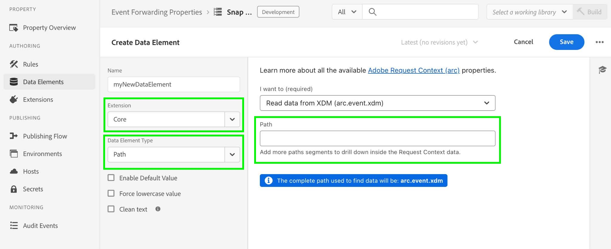

# [!DNL Snapchat] Conversions-API-Erweiterung - Übersicht

Die [!DNL Snap] Conversion API-Erweiterung ist eine sichere [Edge Network-API](https://developer.adobe.com/data-collection-apis/docs/)-Schnittstelle, über die Sie Informationen direkt über Benutzeraktionen auf Ihren Websites mit [!DNL Snapchat] teilen können. Sie können die Regeln für die Ereignisweiterleitung nutzen, um Daten vom **[!DNL Adobe Experience Platform Edge Network]** an **[!DNL Snapchat]** zu senden, indem Sie die API-Erweiterung für die **[!DNL Snap]** verwenden.

## Voraussetzungen für [!DNL Snapchat] {#prerequisites}

So verwenden Sie die [!DNL Snapchat] Conversions-API:

* Adobe Experience Platform Sie müssen eine [Ereignisweiterleitungseigenschaft“ in &#x200B;](/help/tags/ui/event-forwarding/getting-started.md) eingerichtet haben.
* Sie müssen auch über die [erforderlichen Berechtigungen](/help/collection/permissions.md) verfügen, um die Eigenschaft zu bearbeiten.

Erstellen Sie [Datenstrom](/help/tags/ui/event-forwarding/getting-started.md) und fügen Sie ihm [Ereignisweiterleitungs-Service](/help/tags/ui/event-forwarding/getting-started.md#enable-event-forwarding) hinzu.

Für die Verwendung **[!DNL Snapchat]** Konversions-API ist ein [&#x200B; &#x200B;](https://business.snapchat.com/)Business Manager“-Konto erforderlich. Business Manager hilft Werbetreibenden, die Marketing-Maßnahmen von **[!DNL Snapchat]** in ihr Unternehmen und mit externen Partnern zu integrieren. Lesen Sie den **[!DNL Snapchat]** [Hilfezentrum-Artikel](https://businesshelp.snapchat.com/s/article/get-started?language=en_US) über das Erstellen eines Business Manager-Kontos, wenn Sie noch keines haben.

Im Snapchat Ads Manager muss ein [[!DNL [Snap Pixel]]](https://businesshelp.snapchat.com/s/article/pixel-website-install?language=en_US) eingerichtet sein und Sie müssen Zugriff haben, um die `Pixel ID` anzuzeigen. Die `Pixel ID` finden Sie im Abschnitt [[!UICONTROL [Events Manager]]](https://businesshelp.snapchat.com/s/article/events-manager?language=en_US) .

Sie benötigen ein statisches, langlebiges API-Token. Informationen zum Abrufen [[!DNL Snapchat]  Tokens finden Sie &#x200B;](https://developers.snap.com/api/marketing-api/Conversions-API/GetStarted#access-token) der Dokumentation zur Konversions-API .

## Installieren und Konfigurieren der [!DNL Snapchat] Web Events API-Erweiterung {#install}

Um die Erweiterung zu installieren, navigieren Sie zu **[!UICONTROL Data Collection]** > **[!UICONTROL Event Forwarding]**. Wählen Sie die Eigenschaft aus, in der Sie die Erweiterung installieren möchten.

Nachdem Sie die gewünschte Eigenschaft ausgewählt haben, führen Sie die folgenden Schritte aus:

1. Wählen Sie im linken Navigationsbereich **[!UICONTROL Extensions]** aus.
2. Suchen Sie nach dem **[!UICONTROL Snap Conversion API Extension]** und wählen Sie **[!UICONTROL Install]** aus.

   

3. Geben Sie im Konfigurationsbildschirm die folgenden Werte ein:

* **[!UICONTROL Pixel Id]**
* **[!UICONTROL API Token]**

Wenn Sie fertig sind, wählen Sie **[!UICONTROL Save]** aus.


<!-- 
![[!DNL Snap] configuration screen for the [!DNL Snap] conversion API extension.](../../../images/extensions/server/snap/configure.png) -->

## Datenelemente erstellen {#create-data-elements}

Um Daten an die [!DNL Snapchat] Conversions-API-Erweiterung zu senden, erstellen Sie [Datenelemente](https://experienceleague.adobe.com/en/docs/platform-learn/implement-web-sdk/event-forwarding/setup-event-forwarding#create-an-event-forwarding-data-element) für jeden Datenparameter. Führen Sie folgende Schritte aus:

1. Navigieren Sie im **[!UICONTROL Authoring]** Ihrer Eigenschaft zu **[!UICONTROL Data Elements]**>**[!UICONTROL Property Info]** und wählen Sie dann **[!UICONTROL Add Data Element]** aus.

   

2. Geben Sie einen Namen für das Datenelement ein.

3. Wählen Sie **[!UICONTROL Core]** als Erweiterung und **[!UICONTROL Path]** als Datenelementtyp aus.

4. Wählen Sie aus dem Dropdown-Menü das entsprechende Element aus und füllen Sie das Feld [!UICONTROL Path] im rechten Bedienfeld aus, um auf die gewünschten Daten in Ihrem Schema zu verweisen.

   

Wenn Sie beispielsweise ein Datenelement erstellen, das auf `snapClickId` im unten gezeigten Schema verweist:


Sie müssen das Datenelement konfigurieren, da `snapClickId` sich unter `_snap.inc.exchange` im XDM-Schema befindet.


Weitere [&#x200B; zum Erstellen von Datenelementen finden Sie &#x200B;](/help/tags/ui/event-forwarding/overview.md#data-elements) Dokumentation zu Ereignisweiterleitungs-Eigenschaften .

## Erstellen von Regeln zum Senden von Konversionsereignissen an Snap {#create-snap-rules}

[Regeln](https://experienceleague.adobe.com/en/docs/platform-learn/implement-web-sdk/event-forwarding/setup-event-forwarding#create-an-event-forwarding-rule) werden zum Erstellen von Triggern für Erweiterungen in Experience Platform verwendet. In diesem Abschnitt wird beschrieben, wie Sie in Ihrer Ereignisweiterleitungs-Eigenschaft Regeln erstellen, um Konversionsereignisse mithilfe der Conversions-API-Erweiterung an Snap zu senden.

### Neue Regel erstellen

1. Navigieren Sie zu Ihrer Ereignisweiterleitungs-Eigenschaft und wählen Sie **[!UICONTROL Rules]** aus dem Menü Authoring . Klicken Sie dann auf **[!UICONTROL Create New Rule]**.

   

2. Benennen Sie die Regel und konfigurieren Sie eine Bedingung für das Auslösen des Snap-Ereignisses. Um beispielsweise ein `PURCHASE`-Ereignis zu senden, wenn ein Ereignis eine Bestellnummer enthält, legen Sie eine Bedingung fest, um zu überprüfen, ob die Benutzerinteraktion eine gültige Bestellnummer enthält.

   

3. Fügen Sie nach dem Speichern der Bedingung eine Aktion hinzu, um die Snap Conversion API mit einem Trigger zu versehen. Im linken Bedienfeld:

   * Stellen Sie das Dropdown-Menü [!UICONTROL Extension] auf [!UICONTROL Snap Conversions API Extension] ein.

   * Stellen Sie das Dropdown-Menü [!UICONTROL Action Type] auf [!UICONTROL Report Web Conversions] ein.

   * Benennen Sie die Regel entsprechend.

   

4. Konfigurieren Sie [CAPI-Parameterwerte](https://developers.snap.com/api/marketing-api/Conversions-API/Parameters) die Sie für das Ereignis im Abschnitt **[!UICONTROL Data Bindings]** im rechten Bedienfeld senden möchten. Die Felder in der Erweiterung werden wie unten dargestellt CAPI-Parametern zugeordnet. Weitere Informationen zu den einzelnen Parametern finden [&#x200B; in der &#x200B;](https://developers.snap.com/api/marketing-api/Conversions-API/Parameters) zur Snapchat Conversions-API .

| Datenbindungsfeld | Snap-API-Parameter |
| --- | --- |
| Ereignistyp (erforderlich) | `event_name` |
| E-Mail | `em` |
| Telefonnummer | `ph` |
| Benutzeragent | `client_user_agent` |
| IP-Adresse | `client_ip_address` |
| Klick-ID | `sc_click_id` |
| cookie1 | `so_cookie1` |
| Vorname | `fn` |
| Nachname | `ln` |
| Geschlecht | `ge` |
| Stadt | `ph` |
| Land | `st` |
| PLZ | `zp` |
| Land | `country` |
| Externe ID | `external_id` |
| Partner-ID | `partner_id` |
| Abonnement-ID | `subscription_id` |
| Lead-ID | `lead_id` |
| Artikel oder Kategorie | `content_category` |
| Inhaltsname | `content_ids` |
| Content-Typ | `content_name` |
| Inhalt | `contents` |
| Beschreibung | `description` |
| Ereignis-Tag | `event_tag` |
| Anzahl der Elemente | `num_items` |
| Price | `value` |
| Währung | `currency` |
| Transaction ID | `order_id` (auch zur `event_id` anstelle von `client dedup idD`) |
| Prognostizierter LTV | `predicted_ltv` |
| Suchzeichenfolge | `search_string` |
| Anmeldemethode | `sign_up_method` |
| Client-Deduplizierungs-ID | `event_id` |
| Eingeschränkte Datennutzung | `data_processing_options` |
| Seiten-URL | `event_source_url` |

{style="table-layout:auto"}

### Erforderliche und optionale Felder

Für jedes Ereignis ist eine `event_source` erforderlich, die immer auf `WEB.` festgelegt ist. Zum Abgleichen ist außerdem mindestens eines der folgenden Felder oder Kombinationen erforderlich:

* E-Mail
* Telefonnummer
* IP-Adresse und Benutzeragent

**Zusätzliche Hinweise:**

* Für `Purchase` Ereignisse sind die Felder `Currency` und `Price` erforderlich.

* Durch Aktivieren des Kontrollkästchens **[!UICONTROL Test Mode]** werden Ereignisse als Testereignisse gesendet, die im Testereignis-Tool anstelle der standardmäßigen Berichterstellung angezeigt werden. Weitere Informationen finden Sie [&#x200B; diesem Artikel &#x200B;](https://businesshelp.snapchat.com/s/article/capi-event-testing?language=en_US#:~:text=Snap's%20Conversions%20API%20(CAPI)%20Test,being%20processed%20as%20production%20results.) Business Help Center .

* Der `contents`-Parameter sollte eine JSON-Zeichenfolge sein, die mindestens eines der folgenden Felder enthält:

   * `id`
   * `item_category`
   * `brand`
   * `delivery_category`
   * `item_price`
   * `quantity`

Beispiel:

```json
{
  "id": "id1",
  "brand": "brand1",
  "delivery_category": "c1",
  "item_price": 2.00,
  "quantity": 2
}
```

Um [benutzerdefinierte Konversionswerte und ROAS-Berichte“ &#x200B;](https://businesshelp.snapchat.com/s/article/custom-conversions-value-roas?language=en_US) verwenden, schließen Sie relevante Parameter in das Feld `contents` ein. Eine Beispielkonfiguration für ein Kaufereignis könnte wie folgt aussehen: `brand`, `item_price`, `id`.

Beispielkonfiguration für ein `Purchase`:


Die optionalen Felder können wie folgt festgelegt werden:


Nachdem Sie den Namen, die Bedingung und die Aktion der Regel wie oben beschrieben festgelegt haben, speichern Sie die Regel und stellen Sie sicher, dass sie aktiviert ist.


Sie können diese Änderungen jetzt in Ihrer Eigenschaft veröffentlichen. Weitere Informationen finden Sie in [&#x200B; Dokumentation &#x200B;](/help/tags/ui/publishing/overview.md) Veröffentlichungsablauf .

## Fehler beheben {#troubleshoot}

Lesen Sie zur Fehlerbehebung und Optimierung Ihres Setups die [Empfehlungen für die Ereignisqualitätsbewertung](https://businesshelp.snapchat.com/s/article/event-quality-score), um sicherzustellen, dass Ihre Ereignisse die höchstmöglichen Übereinstimmungsraten und Leistungsergebnisse erzielen.

Wenn Sie Probleme mit Ihrem **Event Quality Score** haben, erfahren Sie mehr über unsere Empfehlungen zur Verbesserung [hier](https://businesshelp.snapchat.com/s/article/esq-issues-recommendations?language=en_US).

## Nächste Schritte {#next-steps}

In diesem Handbuch wurde beschrieben, wie Sie Server-seitige Ereignisdaten mithilfe der **[!DNL Snap]**-Erweiterung an **[!DNL Snap Conversions API]** senden. Weitere Informationen zu den Ereignisweiterleitungsfunktionen in Experience Platform finden Sie unter [Übersicht über die Ereignisweiterleitung](../../../ui/event-forwarding/overview.md).
