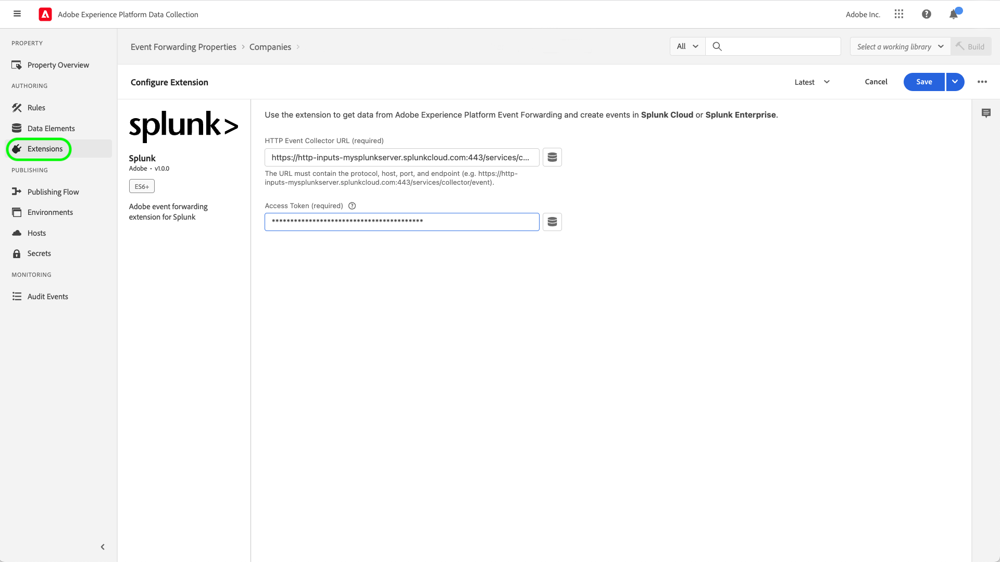

# Übersicht über die Splunk-Erweiterung

[Splunk](https://www.splunk.com/de_de) ist eine Beobachtbarkeitsplattform, die Suche, Analyse und Visualisierung für umsetzbare Einblicke in Ihre Daten bietet. Die Splunk-Erweiterung [Ereignisweiterleitung](../../../ui/event-forwarding/overview.md) nutzt die [Splunk HTTP Event Collector REST-API](https://docs.splunk.com/Documentation/Splunk/8.2.5/Data/HECRESTendpoints), um Ereignisse vom Adobe Experience Platform Edge Network an den [Splunk HTTP Event Collector](https://docs.splunk.com/Documentation/Splunk/8.2.5/Data/UsetheHTTPEventCollector) zu senden.

Splunk verwendet Träger-Token als Authentifizierungsmechanismus für die Kommunikation mit der Splunk Event Collector API.

## Anwendungsbeispiele {#use-cases}

Marketing-Teams können die Erweiterung für die folgenden Anwendungsfälle verwenden:

| Anwendungsfall | Beschreibung |
| --- | --- |
| Analyse des Kundenverhaltens | Unternehmen können Kundeninteraktions-Ereignisdaten von ihrer Website erfassen und relevante Ereignisse an Splunk weiterleiten. Marketing- und Analyse-Teams können dann nachfolgende Analysen innerhalb der Splunk-Plattform durchführen, um wichtige Benutzerinteraktionen und -verhaltensweisen zu verstehen. Die Splunk-Plattform kann verwendet werden, um Diagramme, Dashboards oder andere Visualisierungen zu generieren, um geschäftliche Stakeholder zu informieren. |
| Skalierbare Suche bei großen Datensätzen | Unternehmen können Transaktions- oder Konversationseingaben als Ereignisdaten von der Website erfassen und Ereignisse an Splunk weiterleiten. Analyse-Teams können dann die skalierbaren Indexierungsfunktionen von Splunk nutzen, um große Datensätze zu filtern und zu verarbeiten, damit geschäftliche Einblicke gewonnen und fundierte Entscheidungen getroffen werden können. |

{style="table-layout:auto"}

## Voraussetzungen {#prerequisites}

Sie müssen über ein Splunk-Konto verfügen, um diese Erweiterung verwenden zu können. Sie können sich auf der [Splunk-Homepage](https://www.splunk.com/de_de/page/sign_up) für ein Splunk-Konto registrieren.

>[!NOTE]
>
> Die Splunk-Erweiterung unterstützt sowohl Spunk Cloud- als auch Splunk Enterprise-Instanzen. Dieses Handbuch dokumentiert eine Implementierung mithilfe von [Splunk Cloud](https://www.splunk.com/de_de/products/splunk-cloud-platform.html) als Referenz. Der Konfigurationsprozess für [Splunk Enterprise](https://www.splunk.com/de_de/products/splunk-enterprise.html) ist ähnlich, erfordert jedoch spezifische Anweisungen von Ihrem Splunk Enterprise-Administrator.

Sie müssen außerdem über die folgenden technischen Werte verfügen, um die Erweiterung zu konfigurieren:

* Ein [Event Collector-Token](https://docs.splunk.com/Documentation/Splunk/8.2.5/Data/UsetheHTTPEventCollector#Create_an_Event_Collector_token_on_Splunk_Cloud_Platform). Token haben in der Regel das UUIDv4-Format wie folgt: `12345678-1234-1234-1234-1234567890AB`.
* Die Adresse und der Port der Splunk-Plattforminstanz für Ihr Unternehmen. Die Adresse und der Port einer Plattforminstanz haben in der Regel das folgende Format: `mysplunkserver.example.com:443`.
   >[!IMPORTANT]
   >
   > Splunk-Endpunkte, auf die in der Ereignisweiterleitung verwiesen wird, sollten nur Port `443` verwenden. Nicht standardmäßige Ports werden derzeit in Implementierungen der Ereignisweiterleitung nicht unterstützt.

## Installieren der Splunk-Erweiterung {#install}

Um die Splunk-Erweiterung „Event Collector“ in der Benutzeroberfläche zu installieren, navigieren Sie zu **Ereignisweiterleitung** und wählen Sie eine Eigenschaft aus, der die Erweiterung hinzugefügt werden soll, oder erstellen Sie stattdessen eine neue Eigenschaft.

Nachdem Sie die gewünschte Eigenschaft ausgewählt oder erstellt haben, navigieren Sie zu **Erweiterungen** > **Katalog**. Suchen Sie nach „[!DNL Splunk]“ und wählen Sie dann **[!DNL Install]** in der Splunk-Erweiterung aus.

## Konfigurieren der Splunk-Erweiterung {#configure_extension}

>[!IMPORTANT]
>
>Je nach Ihren Implementierungsanforderungen müssen Sie möglicherweise ein Schema, Datenelemente und einen Datensatz erstellen, bevor Sie die Erweiterung konfigurieren. Bitte überprüfen Sie alle Konfigurationsschritte, bevor Sie beginnen, um festzustellen, welche Entitäten Sie für Ihren Anwendungsfall einrichten müssen.

Wählen Sie **Erweiterungen** in der linken Navigation aus. Wählen Sie unter **Installiert** die Option **Konfigurieren** in der Splunk-Erweiterung aus.

Geben Sie für **[!UICONTROL HTTP Event Collector URL]** die Adresse und den Port Ihrer Splunk-Plattforminstanz ein. Geben Sie unter **[!UICONTROL Zugriffs-Token]** Ihren [!DNL Event Collector Token]-Wert ein. Klicken Sie abschließend auf **[!UICONTROL Speichern]**.

## Konfigurieren einer Ereignisweiterleitungsregel {#config_rule}

Beginnen Sie mit der Erstellung einer neuen [Regel](../../../ui/managing-resources/rules.md) für die Ereignisweiterleitung und konfigurieren Sie die Bedingungen nach Bedarf. Wählen Sie bei der Auswahl der Aktionen für die Regel die [!UICONTROL Splunk]-Erweiterung und wählen Sie dann den Aktionstyp [!UICONTROL Ereignis erstellen] aus. Es erscheinen zusätzliche Steuerelemente, um das Splunk-Ereignis weiter zu konfigurieren.

Der nächste Schritt besteht darin, die Eigenschaften des Splunk-Ereignisses Datenelementen zuzuordnen, die Sie zuvor erstellt haben. Die unterstützten optionalen Zuordnungen, die auf den konfigurierbaren Eingabeereignisdaten basieren, sind unten aufgeführt. Siehe die [Splunk-Dokumentation](https://docs.splunk.com/Documentation/Splunk/8.2.5/Data/FormateventsforHTTPEventCollector#Event_metadata), um weitere Informationen zu erhalten.

| Feldname | Beschreibung |
| --- | --- |
| [!UICONTROL Ereignis ]  **(ERFORDERLICH)** | Geben Sie an, wie Sie die Ereignisdaten bereitstellen möchten. Ereignisdaten können dem `event`-Schlüssel im JSON-Objekt in der HTTP-Anfrage zugewiesen sein oder es kann sich um rohen Text handeln. Der `event`-Schlüssel befindet sich im JSON-Ereignis-Paket auf derselben Ebene wie die Metadatenschlüssel. Innerhalb der geschweiften Klammern des `event`-Schlüsselwerts können die Daten in jeder gewünschten Form vorliegen (z. B. Zeichenfolge, Zahl, ein anderes JSON-Objekt usw.). |
| [!UICONTROL Host] | Der Host-Name des Clients, von dem Sie Daten senden. |
| [!UICONTROL Quellentyp] | Der Quelltyp, der den Ereignisdaten zugewiesen werden soll. |
| [!UICONTROL Quelle] | Der Quellwert, der den Ereignisdaten zugewiesen werden soll. Wenn Sie beispielsweise Daten von einer App senden, die Sie entwickeln, legen Sie diesen Schlüssel auf den Namen der App fest. |
| [!UICONTROL Index] | Der Name des Index der Ereignisdaten. Der hier angegebene Index muss sich in der Liste der zulässigen Indizes befinden, wenn der Indexparameter des Tokens festgelegt ist. |
| [!UICONTROL Zeit] | Die Ereigniszeit. Das Standardzeitformat ist UNIX-Zeit (im Format `<sec>.<ms>`) und hängt von Ihrer lokalen Zeitzone ab. Beispiel: `1433188255.500` gibt 1433188255 Sekunden und 500 Millisekunden nach Epoche oder Montag, den 1. Juni 2015, um 19:50:55 Uhr GMT an. |
| [!UICONTROL Felder] | Geben Sie ein unformatiertes JSON-Objekt oder einen Satz von Schlüssel-Wert-Paaren an, die explizite benutzerdefinierte Felder enthalten, die zur Indexzeit definiert werden sollen.  Die `fields`-Schlüssel gilt nicht für Rohdaten.  Abfragen, die die Eigenschaft `fields` enthalten, müssen an den `/collector/event`-Endpunkt gesendet werden, da sie sonst nicht indiziert werden. Weitere Informationen finden Sie in der Splunk-Dokumentation zu [indizierten Feldextraktionen](https://docs.splunk.com/Documentation/Splunk/8.2.5/Data/IFXandHEC). |

### Validieren von Daten in Splunk {#validate}

Überprüfen Sie nach dem Erstellen und Ausführen der Ereignisweiterleitungsregel, ob das an die Splunk-API gesendete Ereignis wie erwartet in der Splunk-Benutzeroberfläche angezeigt wird. Wenn die Ereignissammlung und Experience Platform-Integration erfolgreich waren, werden die Ereignisse in der Splunk-Konsole wie folgt angezeigt:

## Nächste Schritte

In diesem Dokument wurde beschrieben, wie die Splunk-Ereignisweiterleitungs-Erweiterung in der Benutzeroberfläche installiert und konfiguriert wird. Weitere Informationen zur Erfassung von Ereignisdaten in Splunk finden Sie in der offiziellen Dokumentation:

* [Einrichten und Verwenden von HTTP Event Collector in Splunk Web ](https://docs.splunk.com/Documentation/Splunk/8.2.5/Data/UsetheHTTPEventCollector)
* [Einrichten der Authentifizierung mit Token](https://docs.splunk.com/Documentation/Splunk/8.2.5/Security/Setupauthenticationwithtokens#Prerequisites_for_activating_tokens)
* [Fehlerbehebung im HTTP Event Collector](https://docs.splunk.com/Documentation/Splunk/8.2.5/Data/TroubleshootHTTPEventCollector) (listet auch ein Kompendium von [möglichen Fehler-Codes](https://docs.splunk.com/Documentation/Splunk/8.2.5/Data/TroubleshootHTTPEventCollector#Possible_error_codes) auf)
