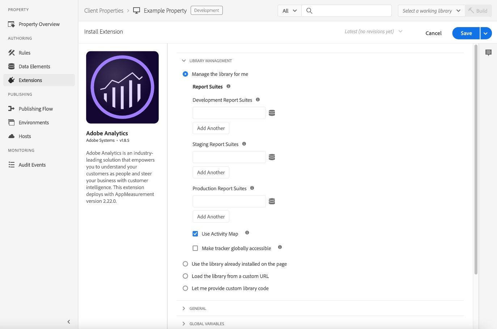

# Adobe Analytics-Erweiterung – Übersicht

>[!NOTE]
>
>Adobe Experience Platform Launch wurde als eine Suite von Datenerfassungstechnologien in Adobe Experience Platform umbenannt. Infolgedessen wurden in der gesamten Produktdokumentation mehrere terminologische Änderungen eingeführt. Eine konsolidierte Übersicht der terminologischen Änderungen finden Sie im folgenden [Dokument](../../../term-updates.md).

Verwenden Sie diese Referenz, um Informationen zum Konfigurieren der Adobe Analytics-Erweiterung und den verfügbaren Optionen beim Erstellen einer Regel mithilfe dieser Erweiterung zu erhalten.

## Konfigurieren der Adobe Analytics-Erweiterung

Dieser Abschnitt enthält eine Referenz zu den verfügbaren Optionen beim Konfigurieren der Adobe Analytics-Erweiterung.

Wenn die Adobe Target-Erweiterung noch nicht installiert ist, öffnen Sie die Eigenschaft, wählen Sie dann **[!UICONTROL Erweiterungen > Katalog]**, bewegen Sie den Mauszeiger über die Adobe Analytics-Erweiterung und wählen Sie **[!UICONTROL Installieren]** aus.

Öffnen Sie zum Konfigurieren der Erweiterung die Registerkarte „Erweiterungen“, bewegen Sie den Mauszeiger über die Erweiterung und wählen Sie dann **[!UICONTROL Konfigurieren]** aus.



## Bibliotheksverwaltung

Wählen Sie im Bereich „Bibliotheksverwaltung“ der Konfigurationsseite eine Option aus. Die folgenden Konfigurationsoptionen sind verfügbar:

### Bibliothek für mich verwalten

#### Report Suites

Geben Sie für alle folgenden Umgebungen eine oder mehrere Report Suites an:

* Entwicklung
* Staging
* Produktion

### Bereits auf der Seite installierte Bibliothek verwenden

#### Folgende Report Suites für Tracker festlegen

Wenn Sie diese Option auswählen, geben Sie für alle folgenden Umgebungen eine oder mehrere Report Suites an:

* Entwicklung
* Staging
* Produktion

#### Verwenden des Activity Map-Moduls

Die Activity Map wird als separates Modul geladen (wie das AAM-Modul). Standardmäßig ist die Activity Map aktiviert, aber wenn Sie sie lieber deaktivieren möchten, können Sie dies tun, indem Sie das Kontrollkästchen in der Konfiguration deaktivieren.

#### Tracker ist zugänglich über die globale benannte Variable

Wenn Sie dieses Kontrollkästchen aktivieren, kann das Tracker-Objekt global verwendet werden. Sie können beispielsweise die Variable `window.s.pageName` an einer beliebigen Stelle auf Ihrer Site definieren.

### Bibliothek aus einer benutzerdefinierten URL laden

#### HTTP-URL

Geben Sie die URL an, unter der sich die Bibliothek befindet.

#### HTTPS-URL

Geben Sie die URL an, unter der sich die Bibliothek befindet.

#### Folgende Report Suites für Tracker festlegen

Wenn Sie diese Option auswählen, geben Sie für alle folgenden Umgebungen eine oder mehrere Report Suites an:

* Entwicklung
* Staging
* Produktion

#### Tracker ist zugänglich über die globale benannte Variable

Geben Sie das global zu verwendende Tracker-Objekt an.

### Bereitstellung eines benutzerdefinierten Bibliothekscodes zulassen

#### Editor öffnen

Ermöglicht das Einfügen des Kern-Codes [AppMeasurement.js](https://experienceleague.adobe.com/docs/analytics/implementation/js/overview.html?lang=de). Dieser Code wird bei Verwendung der automatischen Konfigurationsmethode automatisch ausgefüllt.

>[!NOTE]
>
>Der im Tag-Editor von Launch verwendete Validator dient der Identifizierung von Problemen mit Code, der von Entwicklern geschrieben wurde. Code, der einen Minimierungsprozess durchlaufen hat, z. B. der vom Code-Manager heruntergeladene AppMeasurement.js-Code, wird unter Umständen fälschlicherweise vom Tag-Validator als fehlerbehaftet markiert. Im Normalfall können Sie dies ignorieren.

#### Folgende Report Suites für Tracker festlegen

Wenn Sie diese Option auswählen, geben Sie für alle folgenden Umgebungen eine oder mehrere Report Suites an:

* Entwicklung
* Staging
* Produktion

#### Tracker ist zugänglich über die globale benannte Variable

Geben Sie das global zu verwendende Tracker-Objekt an.

## Allgemein

Wählen Sie im Bereich „Allgemein“ der Konfigurationsseite eine Option aus. Die folgenden Konfigurationsoptionen sind verfügbar:

### EU-Konformität für Adobe Analytics aktivieren

Dadurch wird das Tracking auf der Grundlage des Cookies zum Datenschutz in der EU aktiviert oder deaktiviert.

Wenn Sie das Kontrollkästchen „EU-Konformität“ aktivieren, wird das Feld [!UICONTROL Tracking Cookie Name] angezeigt. Das Tracking-Cookie überschreibt den standardmäßigen Tracking-Cookie-Namen. Sie können den von Tags verwendeten Namen zur Verfolgung Ihres Opt-out-Status für den Erhalt anderer Cookies anpassen.

Wenn eine Seite geladen wird, überprüft das System, ob ein Cookie mit dem Namen „sat\_track“ festgelegt ist (oder das benutzerdefinierte Cookie mit dem Namen, der auf der Seite „Eigenschaft bearbeiten“ angegeben wurde). Die folgenden Informationen sind zu berücksichtigen:

* Wenn das Cookie nicht vorhanden ist oder wenn das Cookie vorhanden und auf einen anderen Wert als  „true“ festgelegt ist, wird das Laden des Tools übersprungen, wenn diese Einstellung aktiviert ist. Das bedeutet, dass der Teil der Regel, der sich auf das Tool stützt, keine Anwendung findet. Wenn eine Regel Analysen mit EU-Konformität für Drittanbietercode umfasst und das Cookie auf „false“ festgelegt wird, wird der Drittanbietercode dennoch ausgeführt. Die Analysevariablen werden jedoch nicht festgelegt.
* Wenn das Cookie vorhanden ist, jedoch auf  „true“ festgelegt ist, wird das Tool normal geladen.

Sie sind dafür verantwortlich, das Cookie „sat\_track“ (oder das Cookie mit benutzerdefiniertem Namen) auf „false“ festzulegen, wenn ein Besucher eine Abwahl trifft. Dazu können Sie den folgenden benutzerdefinierten Code verwenden:

```javascript
_satellite.cookie.set("sat_track", "false");
```

Sie müssen außerdem über einen Mechanismus verfügen, mit dem dieses Cookie auf  „true“ festgelegt wird, wenn ein Benutzer es später aktivieren können soll:

```javascript
_satellite.cookie.set("sat_track", "true");
```

### Zeichensatz

Bestimmt, wie die Bildanforderung codiert wird. Wenn für Ihre Implementierung oder Site Nicht-ASCII-Zeichen verwendet werden, ist es wichtig, an dieser Stelle einen Zeichensatz zu definieren. Sie können einen vorab festgelegten Zeichensatz auswählen oder einen benutzerdefinierten Zeichensatz angeben. Adobe empfiehlt, dieselbe Zeichencodierung wie für Ihre Site zu verwenden. Normalerweise lautet dieser Wert UTF-8.

Zeichensatz kann in benutzerdefiniertem Analytics-Code mithilfe der Variable `s.charSet` festgelegt werden. Weitere Informationen zu Zeichensätzen finden Sie in der [Dokumentation zu charSet](https://experienceleague.adobe.com/docs/analytics/implementation/vars/config-vars/charset.html?lang=de).

### Währungscode

Bestimmt die für Umsatz- und Währungsereignisse zu verwendende Konversionsrate. Wenn Besucher auf Ihrer Site in mehreren Währungen einkaufen dürfen, wird durch die Festlegung des Währungscodes sichergestellt, dass der monetäre Betrag korrekt konvertiert und gespeichert wird.

Weitere Informationen zu den unterstützten Währungs-Codes finden Sie unter [currencyCode](https://experienceleague.adobe.com/docs/analytics/implementation/vars/config-vars/currencycode.html?lang=de).

### Tracking Server

Wird für Erstanbieter-Cookie-Implementierungen verwendet, um zu bestimmen, wo das Erstanbieter-Cookie gespeichert wird. Wenn Sie den Experience Cloud ID-Dienst verwenden, rät Adobe, dieses Feld nicht auszufüllen.

Der Tracking-Server kann in benutzerdefiniertem Analytics-Code mithilfe der Variable `s.trackingServer` festgelegt werden.

Siehe [trackingServer](https://experienceleague.adobe.com/docs/analytics/implementation/vars/config-vars/trackingserver.html?lang=de) im Implementierungshandbuch zu Adobe Analytics.

### SSL-Tracking-Server

Wird für SSL-Erstanbieter-Cookie-Implementierungen verwendet, um zu bestimmen, wo das Erstanbieter-Cookie gespeichert wird. Wenn Sie den Experience Cloud ID-Dienst verwenden, rät Adobe, dieses Feld nicht auszufüllen. Falls nicht definiert, verwenden SSL-Daten den Tracking-Server.

Der SSL-Tracking-Server kann in benutzerdefiniertem Analytics-Code mithilfe der Variable `s.trackingServerSecure` festgelegt werden.

Siehe [trackingServerSecure](https://experienceleague.adobe.com/docs/analytics/implementation/vars/config-vars/trackingserversecure.html?lang=de).

## Globale Variablen

In diesem Abschnitt können Sie [eVars und Props](https://experienceleague.adobe.com/docs/analytics/implementation/vars/page-vars/evar.html?lang=de) einrichten und Hierarchien erstellen.

Globale Variablen sind Variablen, die auf das Analytics-Tracking-Objekt festgelegt werden, wenn dieses Objekt auf der Seite initialisiert wird. Die hier von Ihnen festgelegten Variablen werden festgelegt, wenn das Tracking-Objekt auf den einzelnen Seiten erstellt wird. Nach dem Festlegen dieser Variablen sind sie genau so wie beliebige andere Variablen, die auf andere Art und Weise festgelegt wurden. Dies bedeutet insbesondere, dass diese Variablen durch eine Regel modifiziert, geändert oder gelöscht werden können.

Wenn Ihre Web-Anwendung normalerweise ein Signal pro Seite sendet, können Sie Ihre Variablen in diesem Bereich ganz einfach zentral festlegen. Wenn Ihre Anwendung mehr als ein Signal pro Seite sendet (wie in einer einseitigen Anwendung) und Sie Ihre Variablen löschen und mithilfe desselben Tracking-Objekts zurücksetzen müssen, ist es einfacher, sich beim Festlegen und Löschen der Variablen auf Regeln zu verlassen.

## Linktracking

Wählen Sie im Bereich „Linktracking“ der Konfigurationsseite eine Option aus. Die folgenden Konfigurationsoptionen sind verfügbar:

### ClickMap aktivieren

[ClickMap](https://experienceleague.adobe.com/docs/analytics/analyze/activity-map/activity-map.html?lang=de) ist ein Plug-in für Internet Explorer und Firefox und ein Modul von Reports &amp; Analytics.

### Downloadlinks verfolgen

Verfolgt Links zu Dateien Ihrer Site, die heruntergeladen werden können.

Siehe [s.trackDownLoadLinks](https://experienceleague.adobe.com/docs/analytics/implementation/vars/config-vars/trackdownloadlinks.html?lang=de).

### Download-Erweiterungen

Wenn die Option „Downloadlinks verfolgen“ aktiviert ist, können Sie die Erweiterungen der Dateilinks auswählen, die im Downloadbericht enthalten sind. Wenn Ihre Site Links zu Dateien mit einer der aufgelisteten Erweiterungen enthält, werden die URLs dieser Links in den Berichten aufgeführt.

Siehe [s.linkDownloadFileTypes](https://experienceleague.adobe.com/docs/analytics/implementation/vars/config-vars/linkdownloadfiletypes.html?lang=de).

### Ausgehende Links verfolgen

Bestimmt, ob ein angeklickter Link ein Exitlink ist.

Siehe [s.trackExternalLinks](https://experienceleague.adobe.com/docs/analytics/implementation/vars/config-vars/trackexternallinks.html?lang=de).

**Hinweise zu einseitigen Apps:** Aufgrund der Art und Weise, auf die einige SPA-Websites codiert sind, kann ein interner Link zu einer Seite der SPA wie ein ausgehender Link aussehen.

Sie können eine der folgenden Methoden zur Verfolgung ausgehender Links über SPA-Sites verwenden:

* Sollten Sie über Ihre SPA keinesfalls ausgehende Links verfolgen wollen, machen Sie unter „Niemals verfolgen“ einen entsprechenden Eintrag. Beispiel: `http://testsite.com/spa/\#` Alle \#-Links zu diesem Host werden ignoriert. Alle ausgehenden Links zu anderen Hosts wie [https://www.google.com](https://www.google.com) werden verfolgt.
* Gibt es einige Links, die Sie in Ihrer SPA immer verfolgen möchten, verwenden Sie den Abschnitt „Immer verfolgen“.

Wenn Sie beispielsweise über die Seite spa/\#/about verfügen, könnten Sie unter „Immer verfolgen“ den Abschnitt „about“ eintragen.

Die Seite „about“ ist der einzige ausgehende Link, der verfolgt wird. Alle anderen Links auf der Seite (beispielsweise [https://www.google.com](https://www.google.com)) werden nicht verfolgt.

>[!NOTE]
>
>Diese beiden Optionen schließen sich gegenseitig aus.

### URL-Parameter beibehalten

Behält die Abfragezeichenfolge bei.

Siehe [s.linkLeaveQueryString](https://experienceleague.adobe.com/docs/analytics/implementation/vars/config-vars/linkleavequerystring.html?lang=de).

## Cookies

Konfigurieren Sie Feldbeschreibungen für die globalen Cookie-Einstellungen, die für die Bereitstellung der Adobe Analytics-Erweiterung verwendet werden. Die folgenden Konfigurationsoptionen sind verfügbar:

### Visitor ID

Eindeutiger Wert, der einen Kunden in Online- und Offline-Systemen kennzeichnet.

Siehe [visitorID](https://experienceleague.adobe.com/docs/analytics/import/data-sources/data-types-and-categories/datasrc-visitorid.html?lang=de).

### Besucher-Namespace

Variable zur Angabe der Domain, bei der Cookies gesetzt werden.

Siehe [visitorNamespace](https://experienceleague.adobe.com/docs/analytics/implementation/vars/config-vars/visitornamespace.html?lang=de).

### Domain Periods

Die Domain, in der die Analytics-Cookies `s_cc` und `s_sq` abgelegt sind. Es wird bestimmt, wie viele Punkte sich in der Domain der Seiten-URL befinden. Diese Variable wird auch von Plug-ins zur Bestimmung der richtigen Domain für Cookies der Plug-ins verwendet.

Siehe [s.cookieDomainPeriods](https://experienceleague.adobe.com/docs/analytics/implementation/vars/config-vars/cookiedomainperiods.html?lang=de).

### Zeiträume für Erstanbieter-Domain

Die `fpCookieDomainPeriods`-Variable ist für Cookies bestimmt, die von JavaScript festgelegt werden (`s_sq`, `s_cc`, Plug-ins) und von Erstanbietern stammen, selbst wenn Ihre Implementierung die Domains „2o7.net“ oder „omtrdc.net“ von Drittanbietern verwendet.

Siehe [s.fpCookieDomainPeriods](https://experienceleague.adobe.com/docs/analytics/implementation/vars/config-vars/fpcookiedomainperiods.html?lang=de).

### Cookie-Lebensdauer

Bestimmt die Lebensdauer eines Cookies.

Siehe [s.cookieLifetime](https://experienceleague.adobe.com/docs/analytics/implementation/vars/config-vars/cookielifetime.html?lang=de).

### Sichere Cookies

Mit dieser Variablen kann AppMeasurement sichere Cookies schreiben.

Siehe [writeSecureCookies](https://experienceleague.adobe.com/docs/analytics/implementation/vars/config-vars/writesecurecookies.html?lang=de)


## Seiten-Code anpassen

Passen Sie mithilfe des Editors Ihren Seiten-Code an.

## Adobe Audience Manager

Verwenden Sie diesen Abschnitt der Erweiterungskonfiguration, um festzulegen, wie Audience Manager mit Analytics funktioniert.

Aktivieren Sie **Automatically share Analytics data with Audience Manager**.

Die folgenden Optionen werden angezeigt:


Die Audience Manager-Subdomain wird von Adobe Audience Manager zugewiesen. Dies wird mitunter als „Partnername“ oder „Partner-Subdomain“ bezeichnet. Wenden Sie sich an Ihren Adobe-Berater oder an die Kundenunterstützung, wenn Sie Ihren Partnernamen nicht kennen.

Sie können erweiterte Einstellungen konfigurieren, indem Sie **Erweiterte Einstellungen anzeigen** auswählen und Ihre Präferenzen eingeben.


Über das der jeweiligen Einstellung zugehörige Infosymbol können Sie Details zu dieser anzeigen. Weitere Informationen zu diesen Einstellungen finden Sie außerdem in der [Dokumentation zu Adobe Audience Manager](https://experienceleague.adobe.com/docs/audience-manager/user-guide/aam-home.html?lang=de).

## Aktionstypen für die Analytics-Erweiterung

In diesem Abschnitt werden die in der Analytics-Erweiterung verfügbaren Aktionstypen beschrieben.

Die Analytics-Erweiterung umfasst folgende Aktionen:

* [Variablen festlegen](#set-variables)
* [Signal senden](#send-beacon)
* [Variablen löschen](#clear-variables)

### Variablen festlegen {#set-variables}

Wichtig: Die Verwendung einer „Variablen festlegen“-Aktion sendet das Signal nicht. Sie müssen die Aktion „Signal senden“ verwenden.

#### eVars

Legen Sie eine oder mehrere [eVars](https://experienceleague.adobe.com/docs/analytics/implementation/vars/page-vars/evar.html) fest.

1. Wählen Sie im Dropdown-Menü eine eVar aus.
1. Geben Sie an, ob Sie die eVar als Wert festlegen (Festlegen als) oder eine andere eVar kopieren (Formular duplizieren) möchten.
1. Stellen Sie einen Wert für „Festlegen als“ bereit oder wählen Sie die zu duplizierende eVar aus.
1. (Optional) Klicken Sie auf „Add eVar“ (eVar hinzufügen) aus, um weitere eVars festzulegen.
1. Wählen Sie **[!UICONTROL Änderungen beibehalten]** aus.

#### Props

Legen Sie eine oder mehrere [Eigenschaften](https://experienceleague.adobe.com/docs/analytics/implementation/vars/page-vars/prop.html?lang=de) fest.

1. Wählen Sie im Dropdown-Menü eine Eigenschaft aus.
1. Geben Sie an, ob Sie die Eigenschaft als Wert festlegen (Festlegen als) oder eine andere eVar kopieren (Formular duplizieren) möchten.
1. Stellen Sie einen Wert für „Festlegen als“ bereit oder wählen Sie die eVar aus, aus der Sie die Eigenschaft duplizieren möchten.
1. (Optional) Klicken Sie auf **[!UICONTROL Eigenschaft hinzufügen]**, um weitere Eigenschaften festzulegen.
1. Wählen Sie **[!UICONTROL Änderungen beibehalten]** aus.

#### Ereignisse

Legen Sie ein oder mehrere [Ereignisse](https://experienceleague.adobe.com/docs/analytics/implementation/vars/page-vars/events/events-overview.html?lang=de) fest.

1. Wählen Sie im Dropdown-Menü ein Ereignis aus.
1. (Optional) Wählen Sie ein Datenelement für die [Ereignis-Serialisierung](https://experienceleague.adobe.com/docs/analytics/implementation/vars/page-vars/events/event-serialization.html?lang=de) aus oder geben Sie ein Datenelement an.
1. (Optional) Klicken Sie auf **[!UICONTROL Ereignis hinzufügen]**, um weitere Ereignisse festzulegen.
1. Wählen Sie **[!UICONTROL Änderungen beibehalten]** aus.

#### Hierarchie

Legen Sie die Analytics-Variable [Hierarchy](https://experienceleague.adobe.com/docs/analytics/implementation/vars/page-vars/hier.html?lang=de) fest.

Geben Sie die einzelnen Stufen in der Hierarchie an.

Konfigurieren Sie bei Bedarf weitere Hierarchien.

#### Seitenname

Dieser Wert bezieht sich auf den Namen einer bestimmten Seite und entspricht dem [`pageName` Variable](https://experienceleague.adobe.com/docs/analytics/implementation/vars/page-vars/pagename.html) in Analytics.

>[!IMPORTANT]
>
>In Adobe Experience Manager-Implementierungen teilt diese Variable AEM mit, wo der abgerufene Analytics-Bericht gespeichert werden soll. Um sicherzustellen, dass Berichte ordnungsgemäß persistiert werden, muss die Seitenname-Zeichenfolge als durch Doppelpunkte getrennte Pfad zur Site formatiert werden.
>
>Beispielsweise eine Webseite unter `content/we-retail/language-masters/en/men.html` sollte den Wert des Seitennamen haben von `content:we-retail:language-masters:en:men`.

#### Weitere Informationen

Geben Sie weitere Informationen an, die von Ihren Seiten verwendet werden.

Zu diesen Einstellungen gehören folgende:

* „Seiten-URL“
* Server
* Kanal
* Referrer
* Kampagne
* Kauf-ID

   Geben Sie entweder einen Wert oder einen Abfrageparameter an

* Land
* PLZ
* Transaktions-ID

Diese Einstellungen stehen im Menü „Globale Variablen“ zur Verfügung, wenn Sie das Kontrollkästchen „Zusätzliche Einstellungen“ aktivieren.

#### Benutzerdefinierter Seiten-Code

**Beschreibung**

Passen Sie mithilfe des Editors den benutzerdefinierten Seiten-Code an.

**Einstellungen**

1. Wählen Sie **[!UICONTROL Editor öffnen]**.
1. Geben Sie den benutzerspezifischen Code ein.
1. Wählen Sie **[!UICONTROL Speichern]** aus.

### Signal senden {#send-beacon}

#### Seitenansicht inkrementieren – s.t()

Wählen Sie aus, ob Sie eine Seitenansicht inkrementieren möchten.

#### Seitenansicht nicht inkrementieren – s.tl()

Wählen Sie aus, ob Sie keine Seitenansicht inkrementieren möchten.

**Einstellungen**

1. Wählen Sie einen Linktyp aus.

   Sie können eine der folgenden Optionen auswählen:

   * Benutzerspezifischer Link.
   * Downloadlink.
   * Exitlink.

1. Legen Sie den Parameter für den ausgewählten Link fest.
   * Benutzerspezifischer Link: Geben Sie den Linknamen an.
   * Download-Link: Geben Sie einen Dateinamen an.
   * Exitlink: Geben Sie die Ziel-URL an.
1. Wählen Sie **[!UICONTROL Änderungen beibehalten]** aus.

### Variablen löschen {#clear-variables}

Wenn Sie den Aktionstyp „Variablen löschen“ auswählen, sind keine Konfigurationsoptionen vorhanden.
