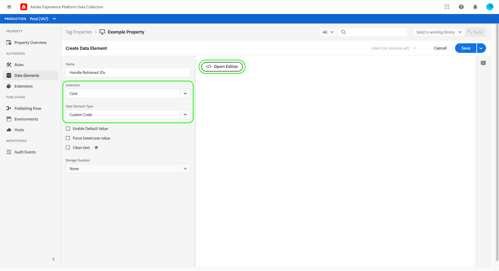

# Adobe-Datenschutzerweiterung – Übersicht

>[!NOTE]
>
>Adobe Experience Platform Launch wurde als eine Suite von Datenerfassungstechnologien in Adobe Experience Platform umbenannt. Infolgedessen wurden in der gesamten Produktdokumentation mehrere terminologische Änderungen eingeführt. Eine konsolidierte Übersicht der terminologischen Änderungen finden Sie im folgenden [Dokument](../../../term-updates.md).

Mit der Adobe Privacy-Tag-Erweiterung können Sie Benutzer-IDs erfassen und entfernen, die Endbenutzern durch Adobe-Lösungen auf Client-seitigen Geräten zugewiesen wurden. Die erfassten IDs können dann an [Adobe Experience Platform Privacy Service](../../../../privacy-service/home.md) gesendet werden, um in unterstützten Adobe Experience Cloud-Anwendungen auf die personenbezogenen Daten der betreffenden Person zuzugreifen oder sie zu löschen.

In diesem Handbuch wird beschrieben, wie Sie die Adobe Privacy-Erweiterung in der Experience Platform-Benutzeroberfläche oder der Datenerfassungs-Benutzeroberfläche installieren und konfigurieren.

>[!NOTE]
>
>Wenn Sie diese Funktionen lieber ohne Tags installieren möchten, finden Sie im Abschnitt [Übersicht über die Privacy-JavaScript-Bibliothek](../../../../privacy-service/js-library.md) Schritte zur Implementierung mit Rohcode.

## Installieren und Konfigurieren der Erweiterung

Auswählen **[!UICONTROL Erweiterungen]** im linken Navigationsbereich, gefolgt von der **[!UICONTROL Katalog]** Registerkarte. Verwenden Sie die Suchleiste, um die Liste der verfügbaren Erweiterungen einzuschränken, bis Sie „Adobe Privacy“ finden. Wählen Sie **[!UICONTROL Installieren]** aus, um fortzufahren.

Im nächsten Bildschirm können Sie konfigurieren, aus welchen Quellen und Lösungen die Erweiterung IDs erfassen soll. Die Erweiterung unterstützt die folgenden Lösungen:

* Adobe Analytics (AA)
* Adobe Audience Manager (AAM)
* Adobe Target
* Adobe Experience Cloud Identity Service (Besucher oder ECID)
* Adobe Advertising Cloud (AdCloud)

Wählen Sie mindestens eine Lösung und anschließend **[!UICONTROL Aktualisieren]** aus.

Der Bildschirm wird aktualisiert und zeigt die Eingaben für die erforderlichen Konfigurationsparameter basierend auf den von Ihnen ausgewählten Lösungen an.

Über das Dropdown-Menü unten können Sie der Konfiguration auch zusätzliche lösungsspezifische Parameter hinzufügen.

>[!NOTE]
>
>Im Abschnitt zu [Konfigurationsparameter](../../../../privacy-service/js-library.md#config-params) in der Übersicht zur Privacy-JavaScript-Bibliothek finden Sie Details zu den akzeptierten Konfigurationswerten für die einzelnen unterstützten Lösungen.

Nachdem Sie die Parameter für Ihre ausgewählten Lösungen hinzugefügt haben, wählen Sie **[!UICONTROL Speichern]** aus, um die Konfiguration zu speichern.

## Verwenden der Erweiterung {#using}

Die Adobe Privacy-Erweiterung bietet drei Aktionstypen, die in einer [Regel](../../../ui/managing-resources/rules.md) verwendet werden können, wenn ein bestimmtes Ereignis eintritt und Bedingungen erfüllt sind:

* **[!UICONTROL Abrufen von Identitäten]**: Die gespeicherten Identitätsdaten des Benutzers werden abgerufen.
* **[!UICONTROL Entfernen von Identitäten]**: Die gespeicherten Identitätsdaten des Benutzers werden entfernt.
* **[!UICONTROL Abrufen und anschließendes Entfernen von Identitäten]**: Die gespeicherten Identitätsdaten des Benutzers werden abgerufen und dann entfernt.

Für jede der oben genannten Aktionen müssen Sie eine Callback-JavaScript-Funktion bereitstellen, die die abgerufenen Identitätsdaten als Objektparameter akzeptiert und verarbeitet. Ausgehend von diesem Punkt können Sie diese Identitäten je nach Bedarf speichern, anzeigen oder an die [Privacy Service-API](../../../../privacy-service/api/overview.md) senden.

Bei Verwendung der Adobe Privacy-Tag-Erweiterung müssen Sie die erforderliche Callback-Funktion in Form eines Datenelements bereitstellen. Anweisungen zum Konfigurieren dieses Datenelements finden Sie im nächsten Abschnitt.

### Definieren eines Datenelements zur Verarbeitung von Identitäten

Erstellen Sie ein neues Datenelement, indem Sie **[!UICONTROL Datenelemente]** im linken Navigationsbereich, gefolgt von **[!UICONTROL Datenelement hinzufügen]**. Wählen Sie im Konfigurationsbildschirm die Option **[!UICONTROL Core]** für die Erweiterung und **[!UICONTROL Benutzerspezifischer Code]** für den Datenelementtyp. Wählen Sie danach im rechten Panel **[!UICONTROL Editor öffnen]**.

Definieren Sie im angezeigten Dialogfeld eine JavaScript-Funktion, die die abgerufenen Identitäten verarbeitet. Der Rückruf muss ein Argument mit einem einzigen Objekttyp akzeptieren (`ids` im Beispiel unten). Die Funktion kann dann die IDs beliebig verarbeiten und auch alle Variablen und Funktionen aufrufen, die auf Ihrer Site global für die weitere Verarbeitung verfügbar sind.

>[!NOTE]
>
>Weitere Informationen zur Struktur des `ids`-Objekts, das die Callback-Funktion verarbeiten soll, finden Sie in den [Code-Beispielen](../../../../privacy-service/js-library.md#samples) in der Übersicht zur Privacy-JavaScript-Bibliothek.

Klicken Sie abschließend auf **[!UICONTROL Speichern]**.

Sie können mit der Erstellung anderer Datenelemente mit benutzerdefiniertem Code fortfahren, wenn Sie für verschiedene Ereignisse unterschiedliche Callbacks benötigen.

### Erstellen einer Regel mit einer Datenschutzaktion

Nachdem Sie ein Callback-Datenelement zur Verarbeitung der abgerufenen IDs konfiguriert haben, können Sie eine Regel erstellen, die die Adobe Privacy-Erweiterung aufruft, sobald auf Ihrer Site ein bestimmtes Ereignis eintritt und alle anderen von Ihnen geforderten Bedingungen erfüllt sind.

Wählen Sie beim Konfigurieren der Aktion für die Regel **[!UICONTROL Adobe Privacy]** für die Erweiterung. Wählen Sie für den Aktionstyp eine der [drei Funktionen](#using) aus, die von der Erweiterung bereitgestellt werden.

Im rechten Panel werden Sie aufgefordert, ein Datenelement auszuwählen, das als Callback der Aktion dient. Wählen Sie das Datenbanksymbol () und danach das Datenelement aus der Liste aus, das Sie zuvor erstellt haben. Wählen Sie **[!UICONTROL Änderungen beibehalten]** aus, um fortzufahren.

Danach können Sie mit der Regelkonfiguration fortfahren, sodass die Adobe Privacy-Aktion bei den von Ihnen angegebenen Ereignissen und Bedingungen ausgelöst wird. Wenn Sie fertig sind, wählen Sie **[!UICONTROL Speichern]** aus.

Sie können die Regel jetzt einer Bibliothek hinzufügen, um sie zum Testen als Build auf Ihrer Website bereitzustellen. Weitere Informationen finden Sie im Überblick zum [Vorgang zur Veröffentlichung von Tags](../../../ui/publishing/overview.md).

## Deaktivieren oder Deinstallieren der Erweiterung

Nach dem Installieren der Erweiterung können Sie sie deaktivieren oder löschen. Klicken Sie in der Adobe-Datenschutzkarte in Ihren installierten Erweiterungen auf **[!UICONTROL Konfigurieren]** und wählen Sie **[!UICONTROL Deaktivieren]** oder **[!UICONTROL Deinstallieren]** aus.

## Nächste Schritte

In diesem Handbuch wurde die Verwendung der Datenschutz-Tag-Erweiterung der Adobe in der Benutzeroberfläche behandelt. Weitere Informationen zu den von der Erweiterung bereitgestellten Funktionen, einschließlich Beispielen für die Verwendung mit Rohcode, finden Sie in der [Übersicht über die Privacy-JavaScript-Bibliothek](../../../../privacy-service/js-library.md) in der Privacy Service-Dokumentation.
