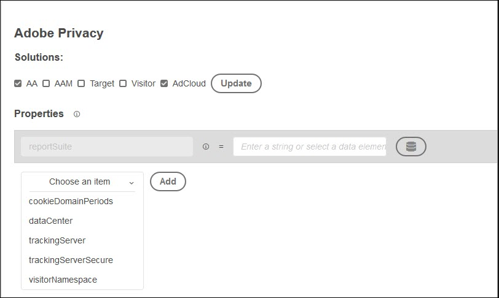

# Adobe-Datenschutzerweiterung – Übersicht

>[!NOTE]
>
>Adobe Experience Platform Launch wurde als eine Suite von Datenerfassungstechnologien in Adobe Experience Platform umbenannt. Infolgedessen wurden in der gesamten Produktdokumentation mehrere terminologische Änderungen eingeführt. Eine konsolidierte Übersicht der terminologischen Änderungen finden Sie im folgenden [Dokument](../../../term-updates.md).

Die Adobe-Datenschutzerweiterung bietet Funktionen zum Erfassen und Entfernen von Benutzer-IDs, die Endbenutzern von Adobe-Lösungen zugewiesen wurden.

## Konfigurieren von Lösungen während der Installation

Wenn Sie die Adobe-Datenschutzerweiterung aus dem Erweiterungskatalog installieren, werden Sie dazu aufgefordert, die Lösungen auszuwählen, die Sie aktualisieren möchten. Derzeit können Sie die folgenden Lösungen aktualisieren:

* Analytics (AA)
* Audience Manager (AAM)
* Target
* Besucherdienst
* AdCloud
* Wählen Sie mindestens eine Lösung und anschließend „Aktualisieren“ aus.
* Wenn Sie Ihre Lösung(en) ausgewählt und konfiguriert haben, klicken Sie auf „Speichern“. Die Adobe-Datenschutzerweiterung wird der Liste Ihrer installierten Erweiterungen hinzugefügt.

   Die Optionen für die einzelnen Lösungen werden im Folgenden beschrieben.

### Analytics



Standardmäßig müssen Sie Ihre Report Suite angeben, indem Sie eine Zeichenfolge eingeben oder ein Datenelement auswählen.

Klicken Sie zum Konfigurieren weiterer Elemente auf **[!UICONTROL Element wählen]**, wählen Sie das zu konfigurierende Element aus, klicken Sie dann auf **[!UICONTROL Hinzufügen]** und geben Sie den erforderlichen Parameter oder ein Datenelement ein.

### Audience Manager


Klicken Sie auf **[!UICONTROL Element wählen]**, wählen Sie das zu konfigurierende Element aus, klicken Sie dann auf **[!UICONTROL Hinzufügen]** und geben Sie den erforderlichen Parameter oder ein Datenelement ein. Derzeit können Sie nur `aamUUIDCookieName` konfigurieren.

### Target


Geben Sie den Target-Clientcode ein.

### Besucherdienst


Geben Sie Ihre IMS-Organisations-ID ein.

### AdCloud


Es gibt keine spezifischen Parameter für die AdCloud-Konfiguration.

## Konfigurieren der Adobe-Datenschutzerweiterung

Nach dem Installieren der Erweiterung können Sie sie deaktivieren oder löschen. Klicken Sie in der Adobe-Datenschutzkarte in Ihren installierten Erweiterungen auf **[!UICONTROL Konfigurieren]** und wählen Sie **[!UICONTROL Deaktivieren]** oder **[!UICONTROL Deinstallieren]** aus.

## Aktionen

Die folgenden Aktionen sind verfügbar, wenn Sie eine Regel mit der Adobe-Datenschutzerweiterung konfigurieren.

### Identitäten abrufen

Wenn das Ereignis und die Bedingungen erfüllt sind, rufen Sie zu dem Besucher gespeicherte Identitätsinformationen ab.

Geben Sie den Namen der JavaScript-Funktion ein, an die Sie die Daten übergeben möchten. Diese Funktion oder Methode verarbeitet die abgerufenen Identitäten. Sie haben die Wahl, ob Sie sie speichern, anzeigen oder an die Adobe DSGVO-API senden möchten.

### Identitäten entfernen

Wenn das Ereignis und die Bedingungen erfüllt sind, entfernen Sie zu dem Besucher gespeicherte Identitätsinformationen.

Geben Sie den Namen der JavaScript-Funktion ein, an die Sie die Daten übergeben möchten. Diese Funktion oder Methode verarbeitet die abgerufenen Identitäten. Sie haben die Wahl, ob Sie sie speichern, anzeigen oder an die Adobe DSGVO-API senden möchten.

### Identitäten abrufen, dann entfernen

Wenn das Ereignis und die Bedingungen erfüllt sind, rufen Sie zu dem Besucher gespeicherte Identitätsinformationen ab und entfernen Sie sie dann.

## Tutorial: Konfigurieren der Datenschutzerweiterung

Das folgende Beispiel zeigt, wie ein Datenelement eingerichtet und mit der Datenschutzerweiterung verwendet wird.

1. Erstellen Sie ein Datenelement namens `privacyFunc`.

   ```JavaScript
   window.privacyFunc = function(a,b){
       console.log(a,b);
   }
   return window.privacyFunc
   ```

1. Erstellen Sie eine Regel, die beim Laden der Bibliothek (Seitenanfang) mit einer Aktion aus der Adobe-Datenschutzerweiterung ausgeführt werden soll. Wählen Sie `privacyFunc` als Datenelement aus.

   * **Erweiterung:** Adobe-Datenschutz
   * **Aktionstyp:** Identitäten abrufen
Dieser Aktionstyp zeigt Identitäten an, die erstellt, entfernt oder nicht entfernt wurden.
   * **Name:** Abrufen von Identitäten

1. Aktualisieren Sie Ihre Entwicklungsbibliothek und veröffentlichen und testen Sie sie.
