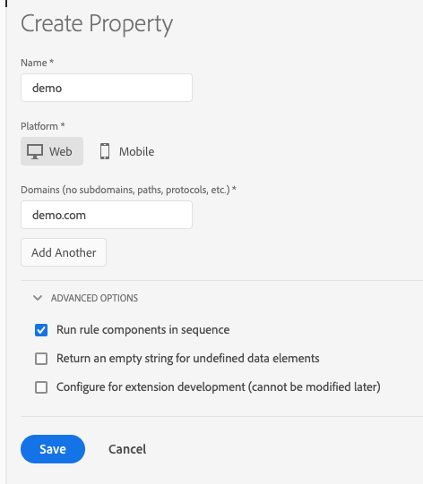

# Eigenschaften

>[!NOTE]
>
>Adobe Experience Platform Launch wurde als eine Suite von Datenerfassungstechnologien in Adobe Experience Platform umbenannt. Infolgedessen wurden in der gesamten Produktdokumentation mehrere terminologische Änderungen eingeführt. Eine konsolidierte Übersicht der terminologischen Änderungen finden Sie im folgenden [Dokument](../../term-updates.md).

## Web-Eigenschaften

Eine Web-Eigenschaft ist eine Sammlung von Regeln, Datenelementen, konfigurierten Erweiterungen, Umgebungen und Bibliotheken. Jede Webeigenschaft verfügt über einen eigenen Satz von Einbettungscodes und kann auf einer beliebigen Anzahl von verschiedenen Websites (verschiedenen Domänen) bereitgestellt werden.

## Mobile Properties

Mobile Properties können mehrere Anwendungen enthalten. In einer mobilen Property können Sie beispielsweise dieselben Regeln und Erweiterungen für mehrere iOS- und Android-Anwendungen verwalten.

## Best Practices für die Planung von Eigenschaften {#best-practices-for-planning-properties}

Jede Tag-Implementierung in Adobe Experience Platform kann sehr unterschiedlich sein. Sie bieten eine Vielzahl von Anforderungen an die Datenerfassung, Variablennutzung, Erweiterungen, Drittanbieter-Tags, andere Systeme und Technologien, Personen, Teams, geografische Regionen usw. Sie sollten Ihre Eigenschaften so strukturieren, dass sie dem Workflow und den Prozessen Ihrer IMS-Organisation entsprechen.

Beachten Sie bei der Planung von Eigenschaften Folgendes:

* Code-Struktur
* Daten
* Variablen
* Erweiterungen, Tags und Systeme
* „Personen“

### Code-Struktur

Sites basieren auf HTML, Apps auf Code. Wenn die zugrunde liegenden HTML-Vorlagen oder Code-Basen für mehrere Sites und Anwendungen gleich sind, sollten Sie in Erwägung ziehen, mehrere Sites oder Apps mit einer einzelnen Tag-Eigenschaft zu verwalten.

### Daten

Sind die Daten, die Sie für alle Ihre Websites oder Anwendungen erfassen möchten, sehr ähnlich, in gewissem Maße ähnlich oder komplett verschieden?

Wenn die Daten, die Sie erfassen müssen, ähnlich sind, kann es sinnvoll sein, diese Websites oder Anwendungen in einer Property zu gruppieren, um die Duplizierung von Regeln und das Kopieren von Regeln von einer Property zur nächsten zu vermeiden.

Wenn Ihre Datenerfassungsanforderungen für jede Site oder Anwendung eindeutig sind, kann es sinnvoll sein, sie in eigene Eigenschaften zu unterteilen. Mit dieser Methode können Sie die Datenerfassung präziser steuern, ohne Unmengen von Bedingungslogik in benutzerdefinierten Skripten zu verwenden.

### Variablen

Sind die Variablen, die Sie in Ihrer [!DNL Analytics]- und anderen Erweiterungen einrichten werden, sehr ähnlich, in gewissem Maße ähnlich oder komplett verschieden?

Wenn beispielsweise über all Ihre Websites und Anwendungen hinweg eVar27 für denselben Quellenwert verwendet wird, kann es sinnvoll sein, diese Sites oder Anwendungen zu gruppieren, sodass Sie diese gemeinsamen Variablen in nur einer Property festlegen können.

### Erweiterungen, Tags und Systeme

Sind die Erweiterungen, Tags und Systeme, die Sie bereitstellen werden, sehr ähnlich, in gewissem Maße ähnlich oder komplett verschieden?

Wenn die Erweiterungen, Tags und Systeme, die Sie bereitstellen werden, auf Ihren Sites oder Anwendungen sehr ähnlich sind, sollten Sie sie möglicherweise in dieselbe Eigenschaft aufnehmen.

Wenn Sie [!DNL Adobe Analytics] nur auf einer Website oder in einer Anwendung bereitstellen und Ihre anderen Erweiterungen und Tags ebenfalls eindeutig sind, empfiehlt es sich möglicherweise, separate Properties zu erstellen, um mehr Kontrolle zu erhalten.

Wenn Sie z. B. [!DNL Adobe Analytics], [!DNL Target] sowie dieselben Drittanbietererweiterungen für alle Ihre Sites oder Anwendungen bereitstellen, ist das ein guter Grund für eine Gruppierung.

### „Personen“

Benötigen die Personen, Teams und Organisationen, die in Adobe Experience Platform arbeiten, Zugriff auf all Ihre Websites und Anwendungen, auf einige oder nur auf eine?

Mit der User-Management-Funktion können Sie verschiedenen Personen unterschiedliche Rollen zuweisen – entweder für alle oder für einzelne Properties. Wenn jemand über ausreichende Rechte verfügt, kann diese Person administrative Aktionen für alle Eigenschaften in dieser Platform IMS-Organisation durchführen. Alle anderen Rollen können pro Eigenschaft zugewiesen werden. Sie können eine Property sogar für bestimmte Benutzer (nicht Administratoren) ausblenden, indem Sie ihnen in der betreffenden Property keine Rolle zuweisen.

## Property-Seite

Eine Property ist eine Sammlung von Regeln, Datenelementen, konfigurierten Erweiterungen, Umgebungen und Bibliotheken. Für Web gibt es nur einen Einbettungscode für die Veröffentlichung pro Eigenschaft. Für Mobilgeräte gibt es pro Eigenschaft eine Konfigurations-App-ID.

Es kann sich bei einer Eigenschaft um eine beliebige Gruppierung einer oder mehrerer Domänen bzw. Subdomänen handeln. Sie können diese Assets auf ähnliche Weise verwalten und verfolgen. Angenommen, Sie haben mehrere Websites, die auf einer Vorlage basieren, und Sie möchten auf all diesen Websites dieselben Assets verfolgen. Sie können eine Eigenschaft auf mehrere Domänen anwenden.

Auf der linken Seite des Bildschirms werden die Unternehmen Ihrer Organisation angezeigt. Dies ist besonders hilfreich, wenn Sie mehrere Konten verwalten. Wählen Sie ein Unternehmen aus, um die Properties und Auditprotokolle für dieses Unternehmen anzuzeigen.

Jede Property wird in der Liste „Properties“ angezeigt.

Diese Liste enthält folgende Informationen:

* Eigenschaftsname
* Plattform
* Status

Klicken Sie auf eine Eigenschaft, um eine Übersicht über diese zu erhalten. Die Übersicht zeigt alle Aktivitäten an, die für die Property durchgeführt wurden. Außerdem werden die Metriken und Erweiterungen für die Property aufgeführt.

## Erstellen und Konfigurieren von Properties

Dieser Abschnitt enthält Anleitungen zum Erstellen oder Konfigurieren einer Tag-Eigenschaft in Adobe Experience Platform.

>[!NOTE]
>
>Nur Benutzer mit ausreichenden Rechten können eine Eigenschaft erstellen. Siehe [User Management](user-permissions.md).

Bevor Sie beginnen, lesen Sie zunächst den Abschnitt [Best Practices für die Planung von Properties](companies-and-properties.md#best-practices-for-planning-properties).

Navigieren Sie zu Ihrer Firmenseite und klicken Sie auf **[!UICONTROL Eigenschaft hinzufügen]**, oder wählen Sie eine vorhandene Eigenschaft aus der Liste aus und klicken Sie auf **[!UICONTROL Konfigurieren]**.

### Bei Web-Properties

Befolgen Sie die Anweisungen zum Erstellen einer Webeigenschaft.

1. Füllen Sie die Felder aus:

   **Name:** Der Name Ihrer Eigenschaft.

   **Domänen:** Die Basis-URL aller Sites, für die Sie diese Eigenschaft bereitstellen möchten.

1. (Erweitert) **[!UICONTROL Regelkomponenten nacheinander ausführen]**: Aktivieren Sie dieses Kontrollkästchen, damit Bedingungen und Aktionen vor der Ausführung auf den Abschluss der vorherigen Aktion warten.
1. (Erweitert) **[!UICONTROL Geben Sie eine leere Zeichenfolge für fehlende Datenelemente zurück:]** Wenn Sie auf ein Datenelement verweisen, das nicht in einer Bibliothek vorhanden ist, wird normalerweise `undefined` zurückgegeben. Aktivieren Sie dieses Kontrollkästchen, wenn bei diesem Szenario stattdessen eine leere Zeichenfolge zurückgegeben werden soll.
1. (Erweitert) **[!UICONTROL Für die Entwicklung von Erweiterungen konfigurieren:]** Aktivieren Sie dieses Kontrollkästchen, wenn Sie Entwicklungserweiterungen installieren möchten, die aktiv von Ihrem Unternehmen entwickelt werden.
1. Wählen Sie **[!UICONTROL Speichern]** aus.

### Bei mobilen Properties

Befolgen Sie die Anweisungen zum Erstellen einer mobilen Eigenschaft.

1. Füllen Sie die Felder aus:

   * **Name:** Der Name Ihrer Eigenschaft.
   * **Datenschutz:** Standardmäßig ist die Datenschutzeinstellung aktiviert, d. h., das SDK soll Daten erfassen und an Lösungen senden. Wenn Sie sie deaktivieren, sendet das SDK standardmäßig KEINE Daten an Lösungen. Wenn Sie als Einstellung &quot;Unbekannt&quot;auswählen, muss das SDK festlegen, dass die Anwendung den Benutzer zuerst auffordert, die Datenerfassung und -freigabe zuzulassen.

      >[!NOTE]
      >
      >In der Mobile App können Sie mittels API zusätzliche Steuerungen für diese Einstellungen einrichten.

   * **HTTPS verwenden:** Wählen Sie aus, ob die gesamte Datenkommunikation über HTTP oder HTTPS gesendet werden soll.

1. Wählen Sie **[!UICONTROL Speichern]** aus.

Nachdem Sie Ihre Eigenschaft erstellt haben, fügt Platform automatisch einen Standardhost, einen Satz von Umgebungen (Entwicklung, Staging und Produktion) und die Standarderweiterungen hinzu.

## Löschen von Properties

Gehen Sie wie folgt vor, um eine Tag-Eigenschaft zu löschen.

>[!NOTE]
>
>Das Löschen von Eigenschaften kann nicht rückgängig gemacht werden. Der Anfragende muss ein Benutzer auf Administratorebene sein. Diese Anfrage kann nicht rückgängig gemacht werden.

1. Wählen Sie in der Liste „Properties“ die zu löschende Property aus.

   Sie können mehrere Properties zum Löschen auswählen.

1. Klicken Sie auf **[!UICONTROL Löschen]** und bestätigen Sie, dass Sie die Eigenschaft löschen möchten.
