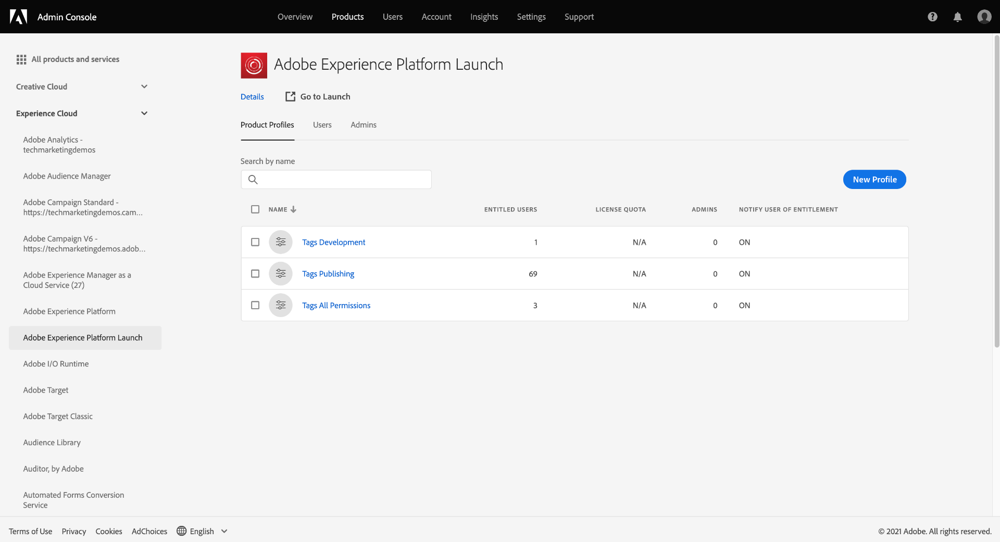

# Berechtigungen für Tags verwalten

>[!NOTE]
>
>Adobe Experience Platform Launch wurde als eine Suite von Datenerfassungstechnologien in Adobe Experience Platform umbenannt. Infolgedessen wurden in der gesamten Produktdokumentation mehrere terminologische Änderungen eingeführt. Eine konsolidierte Übersicht der terminologischen Änderungen finden Sie im folgenden [Dokument](../../term-updates.md).

Um Tags in Adobe Experience Platform verwenden zu können, müssen Sie über Adobe Admin Console Zugriff auf mindestens ein Adobe Experience Cloud-Produkt erhalten. Darüber hinaus müssen Sie auch Berechtigungen für Tags auf der Ebene des Produktprofils erhalten, damit bestimmte Aktionen ausgeführt werden können, wenn Sie über die Benutzeroberfläche für die Datenerfassung angemeldet sind.

In diesem Handbuch wird beschrieben, wie Sie diese Berechtigungen Benutzern gewähren, die die Admin Console verwenden.

>[!NOTE]
>
>Ausführliche Informationen zu den verschiedenen in diesem Handbuch erwähnten Arten von verfügbaren Tag-Berechtigungen finden Sie in der [Übersicht über Benutzerberechtigungen](./user-permissions.md).

## Administratorrechte für ein Tag-Produktprofil abrufen

Um Benutzerberechtigungen für Tags zu verwalten, müssen Sie mindestens ein Produktprofiladministrator für Tags in Adobe Admin Console sein. Systemadministratoren und Produktadministratoren können auch Berechtigungen für ein Tag-Produktprofil verwalten.

Weitere Informationen zu den verschiedenen Administrationsebenen und zur Verwaltung dieser Admin Consolen innerhalb Ihres Unternehmens finden Sie im Dokument zur Verwaltung von [Administratorrollen](https://helpx.adobe.com/de/enterprise/admin-guide.html/enterprise/using/admin-roles.ug.html) .

## Wählen Sie ein Produktprofil aus, für das Berechtigungen verwaltet werden sollen

Sobald Sie über Administratorrechte verfügen, melden Sie sich bei Admin Console an und wählen Sie **[!UICONTROL Products]** aus der oberen Navigationsleiste aus. Wählen Sie aus der Liste der angezeigten Produkte **[!UICONTROL Adobe Experience Platform Launch]** aus.

Eine Liste mit Produktprofilen wird angezeigt. Ein Produktprofil ist ein Konstrukt, das eine Gruppe von Berechtigungen mit einer Benutzergruppe verknüpft. Von hier aus können Sie ein neues Profil erstellen, das konfiguriert werden soll, oder Sie können ein vorhandenes Produktprofil aus der Liste zur Bearbeitung auswählen (vorausgesetzt, Sie verfügen über Administratorrechte für dieses Profil).

### Produktprofil erstellen

>[!NOTE]
>
>Wenn Sie ein vorhandenes Profil zur Bearbeitung ausgewählt haben, fahren Sie mit dem [nächsten Abschnitt](#permissions) fort.

Wählen Sie **[!UICONTROL Neues Profil]** aus, um ein neues Produktprofil zu erstellen.

Es wird ein Dialogfeld angezeigt, in dem Sie einen Namen und eine optionale Beschreibung für das Profil angeben können. Sie können auch umschalten, ob Benutzer E-Mails erhalten sollen, wenn sie diesem Profil hinzugefügt oder daraus entfernt werden. Klicken Sie abschließend auf **[!UICONTROL Speichern]**.

## Berechtigungen für das Produktprofil konfigurieren {#permissions}

Die Detailseite für das Produktprofil wird angezeigt. Mithilfe der verfügbaren Registerkarten können Sie die dem Profil zugewiesenen Benutzer verwalten und die spezifischen Eigenschaften und Rechte konfigurieren, die das Profil diesen Benutzern gewährt.

Schritte zum Hinzufügen von Benutzern finden Sie [weiter unten in diesem Handbuch](#users). Wählen Sie zunächst **[!UICONTROL Berechtigungen]** aus.

Der nächste Bildschirm zeigt einen Überblick über die Anzahl der Plattformen, Eigenschaften und Rechte, die dem Profil derzeit zugewiesen sind. Wählen Sie **[!UICONTROL Bearbeiten]** neben einer der Zeilen, um mit der Konfiguration der Profilberechtigungen zu beginnen.

Der Bildschirm [!UICONTROL Berechtigungen bearbeiten] wird angezeigt, über den Sie Berechtigungen zum Produktprofil hinzufügen und daraus entfernen können. Im Abschnitt **[!UICONTROL Plattformen]** können Sie sehen, dass alle Plattformen dem Profil standardmäßig hinzugefügt wurden.

### Zuweisen von Eigenschaften

Um diesem Profil Eigenschaften zuzuweisen, wählen Sie im linken Navigationsbereich **[!UICONTROL Eigenschaften]** aus.

Standardmäßig erhält ein neues Produktprofil automatisch Zugriff auf alle Eigenschaften, die für Ihr Unternehmen verfügbar sind. Dazu gehören Eigenschaften, die aktuell verfügbar sind, sowie alle zukünftigen Properties.

Wenn Sie die verfügbaren Eigenschaften einschränken möchten, wählen Sie den Umschalter **[!UICONTROL Automatisch einschließen]** aus. Auf diese Weise können Sie Eigenschaften für die Eigenschaft manuell hinzufügen und entfernen, je nach Bedarf.

Wenn die automatische Einbindung deaktiviert ist, werden alle derzeit verfügbaren Eigenschaften auf der linken Seite aufgelistet. Sie können Eigenschaften zum Profil hinzufügen, indem Sie in der linken Spalte das Pluszeichen (**+**) neben der betreffenden Eigenschaft auswählen. Um eine Eigenschaft zu entfernen, wählen Sie in der rechten Spalte das Symbol **X** neben der betreffenden Eigenschaft aus.

>[!IMPORTANT]
>
>Wenn Sie die Funktion zum automatischen Einschließen deaktivieren, müssen alle in der Zukunft erstellten Eigenschaften manuell zum Produktprofil hinzugefügt werden, damit es Zugriff darauf erhält.

### Berechtigungen zuweisen

Standardmäßig sind alle Rechte für ein Produktprofil deaktiviert und müssen manuell hinzugefügt werden, damit sie aktiviert werden können. Wenn Sie zu einem Produktprofil gehören, das automatisch Eigenschaften enthält, aber keine Rechte hat, haben Sie schreibgeschützten Zugriff auf alle Eigenschaften.

>[!NOTE]
>
>Ein Benutzer kann mehreren Produktprofilen in Admin Console angehören, die Rechte dieser Profile werden jedoch nicht zu einem Übergeordneten Berechtigungssatz kombiniert. Der Benutzer verfügt weiterhin nur über die explizit in den einzelnen Gruppen gewährten Rechte.
>
>Wenn beispielsweise Gruppe 1 Zugriff auf Property A mit der Berechtigung &quot;Entwickeln&quot;gewährt und Gruppe 2 Zugriff auf Property B mit der Berechtigung &quot;Veröffentlichen&quot;gewährt, werden die Rechte &quot;Entwickeln&quot;und &quot;Veröffentlichen&quot;nicht für Property A und Property B kombiniert. Sie können nur für Property A entwickeln und für Property B veröffentlichen.

Wählen Sie im linken Navigationsbereich **[!UICONTROL Eigenschaftsrechte]** aus. Wie bei Eigenschaften können Sie das Pluszeichen (**+**) neben einer Eigenschaftsberechtigung auswählen, um es zum Profil hinzuzufügen. Wenn Sie dem Profil alle Eigenschaftsrechte hinzufügen möchten, können Sie auch **[!UICONTROL Alle hinzufügen]** auswählen.

Wählen Sie anschließend **[!UICONTROL Unternehmensrechte]** im linken Navigationsbereich aus. Fügen Sie die erforderlichen Berechtigungen hinzu oder entfernen Sie sie. Wählen Sie nach Abschluss **[!UICONTROL Speichern]** aus.

## Benutzer dem Profil zuweisen {#users}

Um dem Produktprofil Benutzer zuzuweisen, wählen Sie die Registerkarte [!UICONTROL Benutzer] und dann [!UICONTROL Benutzer hinzufügen] aus.

Geben Sie im angezeigten Dialogfeld den Namen, die Benutzergruppe oder die E-Mail-Adresse der Benutzer ein, die Sie zum Profil hinzufügen möchten. Wenn ein Benutzer Teil Ihres Unternehmens ist, werden seine Informationen in einem Dropdown-Menü für die automatische Vervollständigung angezeigt, in dem Sie auswählen können, ob die Details ausgefüllt werden sollen. Wenn sie nicht Teil Ihrer Organisation sind, können Sie stattdessen ihre Informationen manuell eingeben.

Wenn Sie fertig sind, wählen Sie **[!UICONTROL Speichern]** aus, um die angegebenen Benutzer zum Produktprofil hinzuzufügen.

Nachdem Benutzer zum Profil hinzugefügt wurden, erhalten sie eine E-Mail, in der sie darüber informiert werden, dass sie jetzt über Berechtigungen für die Datenerfassungs-Benutzeroberfläche verfügen.

## Nächste Schritte

In diesem Dokument wurde beschrieben, wie Sie Eigenschaften und Berechtigungen für die Datenerfassungs-Benutzeroberfläche mit Adobe Admin Console verwalten. Weitere Informationen zu den verfügbaren Berechtigungen und den Funktionen, auf die sie Zugriff gewähren, finden Sie in der Übersicht zu [Benutzerberechtigungen](./user-permissions.md).
