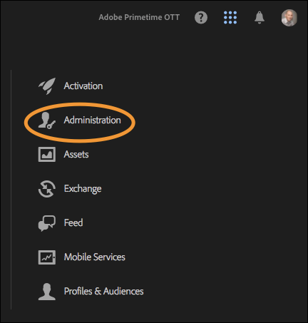
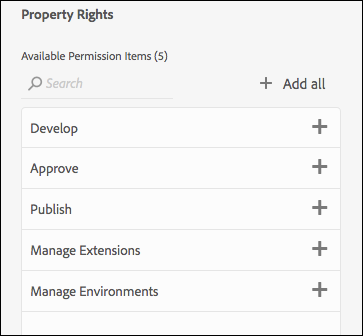

# Benutzerberechtigungen

>[!NOTE]
>
>Adobe Experience Platform Launch wird als eine Suite von Datenerfassungstechnologien in Experience Platform umbenannt. Infolgedessen wurden in der gesamten Produktdokumentation mehrere terminologische Änderungen eingeführt. Eine konsolidierte Übersicht der terminologischen Änderungen finden Sie im folgenden [Dokument](../../term-updates.md).

## Berechtigungstypen

Es gibt zwei Benutzerberechtigungen, um die Verwendung mit Tags in Adobe Experience Platform zu verstehen:

* **Experience Cloud-Berechtigungen:** Berechtigungen finden Sie in der Admin Console auf Unternehmensebene. [!DNL Experience Cloud]-Berechtigungen definieren, wer Gruppenberechtigungen und -mitgliedschaften für alle [!DNL Experience Cloud]-Produkte steuern kann.
* **Berechtigungen für Tags:** Die Berechtigungen für Tags befinden sich in der Admin Console auf Produktprofilebene. Diese Berechtigungen bestimmen, welche Benutzer bestimmte Aktionen ausführen können, wenn sie bei der Datenerfassungs-Benutzeroberfläche angemeldet sind.

Dieser Artikel beschreibt die verschiedenen Berechtigungstypen im Detail.

### Experience Cloud-Berechtigungen

In diesem Abschnitt werden die Faktoren erläutert, die bei der Verwendung von Platform wichtig sind. Eine umfassende Übersicht über die [!DNL Experience Cloud]-Berechtigungen finden Sie unter [„Verwaltungsrollen“ im Enterprise-Benutzerhandbuch](https://helpx.adobe.com/de/enterprise/using/admin-roles.html).

#### Organisationsadministrator

Organisationsadministratoren werden häufig als „Org-Admins“ bezeichnet. Die Hauptfunktion von Org-Admins besteht darin, anderen Benutzern Berechtigungen zuzuweisen. Dazu erstellen sie Produktprofile (oder Gruppen), die bestimmte Rechte für ein bestimmtes Produkt enthalten, und weisen dann bestehende oder neue Benutzer diesem Produktprofil zu.

Organisationsadministratoren in Unternehmen erben keine Rechte für Tags in Platform. Sie müssen sich selbst zu einem Produktprofil mit den entsprechenden Berechtigungen hinzufügen, wenn sie etwas in der Datenerfassungs-Benutzeroberfläche tun möchten.

#### Produktadministrator

Produktadministratoren (oder Produkt-Admins) ähneln Org-Admins, jedoch mit geringerem Umfang. Ein Produktadministrator hat nur die Berechtigung, Produktprofile für ein bestimmtes [!DNL Adobe]-Produkt zu ändern – nicht für alle [!DNL Adobe]-Produkte, auf die das Unternehmen Zugriff hat.

### Berechtigungen für Tags

Innerhalb der [!DNL Experience Cloud] werden einzelnen Benutzern keine Rechte zugewiesen. Sie werden einem Produktprofil zugewiesen (siehe „Experience Cloud-Berechtigungen“ weiter oben). Anschließend werden einzelne Benutzer einem oder mehreren Produktprofilen zugewiesen.

In einem Produktprofil sind die Berechtigungen für Tags in vier Dimensionen unterteilt.

1. Plattformen
1. Eigenschaften
1. Eigenschaftsrechte
1. Unternehmensrechte

#### Plattformen

Jede Eigenschaft verfügt über eine Plattform. Es gibt derzeit zwei Plattformen, die Sie für Tags verwenden können: *Web* und *Mobile*. Mit diesem Berechtigungstyp können Sie den Zugriff auf einen bestimmten Eigenschaftstyp einschränken oder gewähren. Dies kann nützlich sein, wenn sich das Team, das Ihre Apps verwaltet, von dem für die Verwaltung Ihrer Websites unterscheidet.

#### Eigenschaften

Dies ist eine Liste aller Eigenschaften, die in Ihrer Firma vorhanden sind. Mit diesem Berechtigungstyp können Sie den Zugriff auf bestimmte vorhandene Eigenschaften (nach Namen) einschränken oder gewähren.

#### Eigenschaftsrechte

Alle Eigenschaften, die Sie in der Datenerfassungs-Benutzeroberfläche erstellen, stehen in der Admin Console zur Verfügung, damit Sie Berechtigungen zuweisen können. Wenn ein Produktprofil nicht auf Property A1 zugreifen kann, können Benutzer, die zu diesem Profil gehören, keine Einstellungen innerhalb dieser Property anzeigen oder ändern.

Wenn ein Benutzer zu einem Profil gehört, das Zugriff auf Eigenschaft A1 hat, wird der Zugriff auf diese Eigenschaft durch die Rechte bestimmt, die ihm von dieser Berechtigungsgruppe gewährt wurden. Benutzer mit Berechtigungen für Eigenschaft A1, aber ohne zugewiesene Rechte, erhalten schreibgeschützten Zugriff.

Die in dieser Gruppe verfügbaren Berechtigungen sind:

* **Entwickeln:** Damit können Sie Regeln und Datenelemente erstellen. Sie können auch Bibliotheken in vorhandenen Entwicklungsumgebungen erstellen. Sie können eine Bibliothek zur Genehmigung senden, wenn sie bereit ist. Die meisten täglichen Aufgaben in der Datenerfassungs-Benutzeroberfläche erfordern dieses Recht.
* **Genehmigen:** Dadurch können Sie eine gesendete Bibliothek in die Staging-Umgebung erstellen. Sie können eine Bibliothek auch für die Veröffentlichung genehmigen, nachdem die nötigen Tests abgeschlossen wurden.
* **Veröffentlichen:** Damit können Sie genehmigte Bibliotheken in der Produktionsumgebung veröffentlichen.
* **Erweiterungen verwalten:** Dadurch erhalten Sie die Möglichkeit, neue Erweiterungen für eine Eigenschaft zu installieren, die Erweiterungskonfiguration für eine bereits installierte Erweiterung zu ändern und eine Erweiterung zu löschen. Weitere Informationen zu Erweiterungen](../managing-resources/extensions/overview.md) finden Sie in der Dokumentation zur Übersicht über Erweiterungen für [. Diese Rolle gehört normalerweise zu IT oder Marketing, je nach Aufbau Ihrer Organisation.
* **Umgebungen verwalten:** Ermöglicht das Erstellen und Ändern von Umgebungen. Weitere Informationen finden Sie in der [Dokumentation zu Umgebungen](../publishing/environments.md) . Diese Rolle gehört normalerweise zur IT-Gruppe.

#### Unternehmensrechte

Unternehmensrechte gelten für Berechtigungen, die mehrere Properties umfassen. Zur Zeit gibt es drei:

* **Eigenschaften verwalten:** Ermöglicht Ihnen das Erstellen neuer Eigenschaften in der Datenerfassungs-Benutzeroberfläche und das Ändern der Metadaten und Einstellungen auf Eigenschaftsebene. Sie können auch Properties löschen. Weitere Informationen finden Sie in der [Eigenschaftendokumentation](companies-and-properties.md) . In der Regel führen Administratoren diese Rolle aus.
* 
* Ermöglicht die Erstellung neuer Eigenschaften in [!DNL Platform Launch] und die Änderung der Metadaten und Einstellungen auf Eigenschaftsebene. Sie können auch Properties löschen. Weitere Informationen zu Properties finden Sie [hier](companies-and-properties.md). In der Regel führen Administratoren diese Rolle aus.
* **Erweiterungen entwickeln:** Ermöglicht die Erstellung und Änderung von Erweiterungspaketen, die dem Unternehmen gehören, einschließlich privater Versionen und Anfragen zur Veröffentlichung.
* **Mobile-App-Konfigurationen verwalten:** Dies ist nur für Kunden verfügbar, die Adobe Journey Optimizer lizenziert haben, oder für andere Lösungen, mit denen sie Zugriff auf In-App- und Push-Messaging für Mobile Apps erhalten.  Auf diese Weise können Sie Apps verwalten, von denen Experience Cloud Kenntnis hat, sowie die erforderlichen Push-Anmeldeinformationen, die für die Kommunikation mit dem Firebase Cloud Messaging-Dienst und dem Apple Push Notification Service erforderlich sind.

### Gesamt-Benutzerberechtigungen

Die Gesamtberechtigungen eines einzelnen Benutzers werden durch die Mitgliedschaft in den verschiedenen Produktprofilen bestimmt. Wenn ein Benutzer mehreren Produktprofilen angehört, werden die Berechtigungen der einzelnen Profile zusammengerechnet und nicht multipliziert.

Beispiel: Produktprofil A gewährt Henry das Entwicklungsrecht für Property 1. Profil B gewährt Henry das Veröffentlichungsrecht für Property 2. Henry kann in Property 1 entwickeln und in Property 2 veröffentlichen, er kann jedoch nicht in Property 1 veröffentlichen oder in Property 2 entwickeln, da ihm hierzu keine expliziten Rechte erteilt wurden.

## Rechteszenarien

Unternehmen haben beim Erstellen neuer Produktprofile unterschiedliche Anforderungen. Diese Anforderungen variieren je nach Unternehmensgröße, Organisationsstruktur, Anzahl der Sites, Anzahl der Personen, die an der Verwaltung von Tags beteiligt sind, usw.

Im Folgenden finden Sie einige gängige Szenarien sowie den jeweiligen empfohlenen Ausgangspunkt zum Erstellen von Produktprofilen und Hinzufügen von Benutzern.

### One-Man-Show

Wenn Sie ein kleines Unternehmen leiten, in dem eine Person für alles verantwortlich ist, gewähren Sie diese Berechtigung für alle Properties und weisen Sie der Person alle oben aufgeführten Rechte zu.

### Aufgabentrennung

Es sind viele Personen am Tagging beteiligt. Bei Ihnen erstellen mehrere Personen (vielleicht externe Berater) Regeln und Datenelemente. Sie wollen jedoch nicht, dass sie alle Zugriff auf die Produktionsumgebung erhalten. Sie möchten sicherstellen, dass nur das IT-Team auf die Produktionsumgebung zugreifen kann.

1. Erstellen Sie ein Konto für Ihre Berater und weisen Sie ihnen nur das Entwicklungsrecht zu.
1. So erstellen und testen Berater innerhalb der von Ihnen festgelegten Grenzen.
1. Wenn der Berater eine neue Erweiterung braucht oder für die Veröffentlichung bereit ist, führt ein Vertreter Ihrer Organisation (mit den entsprechenden Rechten) diese Aktionen durch.

### Großunternehmen

Großunternehmen betreiben häufig mehrere Sites geografisch verteilt, wobei verschiedene Teams für die jeweilige Region verantwortlich sind. Innerhalb dieser Teams entwickeln und veröffentlichen verschiedene Personen.

Dies ähnelt „Aufgabentrennung“, ist jedoch nach geografischen Bereichen organisiert.

* Nordamerika
   * Gruppe entwickeln
   * Gruppe veröffentlichen
* Europa
   * Gruppe entwickeln
   * Gruppe veröffentlichen
* ...
   * Gruppe entwickeln
   * Gruppe veröffentlichen

## Beispiele

Mit Beispielen der Rollen, die Sie in Ihrem Unternehmen nutzen, und den Berechtigungen, die Sie ihnen zuweisen sollten, lässt sich dieses Konzept verdeutlichen.

Im Folgenden finden Sie Beschreibungen verschiedener Rollen, die Sie möglicherweise in Ihrer Organisation nutzen, sowie eine Tabelle mit den Berechtigungen, die sie für ihre Arbeit benötigen.

* Manager: Muss wissen, was passiert, sollte aber keine Änderungen vornehmen können.
* Marketingexperte: Kann Erweiterungen installieren und neue Tags für vorhandene Properties einrichten, aber nicht in Staging- oder Produktionsumgebungen veröffentlichen.
* App-Entwickler: Ist für die Implementierung von Adobe- und Drittanbieterlösungen in nativen Apps verantwortlich.
* IT-Team: Ändert keine Tags, hat jedoch volle Kontrolle über die Staging- und die Produktionsumgebung und deren Inhalt.
* Alleskönner: Übernimmt alle Aufgaben.

| Rolle | Eigenschaften | Unternehmensrechte | Eigenschaftsrechte |
|--- |--- |--- |--- |
| Manager | Automatisch einfügen |  |  |
| Vermarkter | Automatisch einfügen | Eigenschaften verwalten | Entwickeln Eigenschaften verwalten |
| App-Entwickler | Automatisch einfügen | Eigenschaften verwalten Mobile-App-Konfigurationen verwalten | Entwickeln Eigenschaften verwalten |
| IT-Team | Automatisch einfügen | Genehmigen Veröffentlichen Umgebungen verwalten |
| Alleskönner | Automatisch einfügen | Eigenschaften verwalten | Entwickeln Genehmigen Veröffentlichen Erweiterungen verwalten Umgebungen verwalten |
| Erweiterungsentwickler | Automatisch einfügen | Properties verwalten Erweiterungen entwickeln | Entwickeln |

## Zuweisen von Benutzerberechtigungen

Die unten stehenden Schritte führen Sie durch die Zuweisung von Berechtigungen. Sie finden diesen Prozess auch als [Video](https://www.youtube.com/watch?v=ba28BHX8cwU).

Schritt 1 bis 3 können übersprungen werden, indem Sie direkt zur [Adobe Admin Console](https://adminconsole.adobe.com/enterprise/products) navigieren. Wenn Sie mehreren Organisationen angehören, wählen Sie auf der rechten Seite die richtige aus.

### 1. Melden Sie sich bei Experience Cloud an.

Melden Sie sich mit Ihrer Adobe ID bei [https://experiencecloud.adobe.com/](https://experiencecloud.adobe.com/) an und wählen Sie dann im Menü [!UICONTROL Navigation] die Organisation aus, die in der Datenerfassungs-Benutzeroberfläche verwendet werden soll.

Öffnen Sie die Lösungsauswahl, indem Sie im Menü [!UICONTROL Navigation] das Neun-Punkte-Symbol und anschließend **[!UICONTROL Administration]** auswählen.

Wenn dieser Link nicht angezeigt wird, sind beide folgenden Bedingungen wahr:

* Sie sind kein Org-Admin.
* Sie sind kein Produkt-Admin für [!DNL Experience Cloud]-Produkte.

Bitten Sie in beiden Fällen einen Organisationsadministrator, diese Schritte für Sie durchzuführen oder Sie zu einem Produktadministrator für Tags zu machen, damit Sie dies selbst tun können.

>[!NOTE]
>
>Wenn Sie nicht wissen, wer Ihr Org-Admin ist, wenden Sie sich an den Kundendienst.

### 2. Öffnen Sie die Admin Console.

Wählen Sie **Admin Console** aus.

Wählen Sie die Karte **[!DNL Experience Platform Launch] –`Company Name`** aus.

<!-- Scott, update above image. Rebranding. -->

Sie können auch in der oberen Navigationsleiste **[!UICONTROL Produkte]** und anschließend im linken Navigationsmenü **[!DNL Experience Platform Launch]-`Company Name`** auswählen.

Wenn keine [!DNL Experience Platform Launch]-Karte angezeigt wird oder [!DNL Experience Platform Launch] nicht in der Liste enthalten ist, sind Sie kein Org-Admin, sondern ein Produkt-Admin für andere Experience Cloud-Produkte. Da Sie kein Administrator für Experience Platform Launch sind, müssen Sie einen Org-Admin finden, der diese Schritte für Sie durchführen kann oder Sie als Produktadministrator für [!DNL Platform Launch] festlegt.

Nachdem Sie Platform Launch ausgewählt haben, wird eine Liste mit Produktprofilen angezeigt. Stellen Sie sich diese Profile wie Berechtigungsgruppen vor. Es wird ein Profil für Sie erstellt und wie folgt benannt: [!DNL Platform Launch] – `Company Name`.

### 3. Erstellen Sie Ihr Produktprofil.

Wenn Sie ein vorhandenes Produktprofil bearbeiten, überspringen Sie diesen Schritt.

Sie können dieses Produktprofil bearbeiten oder ein neues erstellen.

Wählen Sie **[!UICONTROL Neues Profil]** aus, um ein neues Produktprofil zu erstellen.

Fügen Sie Ihrem neuen Profil einen Namen und eine Beschreibung hinzu, konfigurieren Sie, ob Benutzer E-Mails erhalten sollen, wenn sie diesem Profil hinzugefügt oder daraus entfernt werden, und wählen Sie **[!UICONTROL Fertig]** aus.

### 4. Bearbeiten Sie Ihr Produktprofil.

Wählen Sie das Produktprofil aus der Liste aus und öffnen Sie dann die Registerkarte **[!UICONTROL Berechtigungen]**. Sie können Berechtigungen auf zwei Ebenen zuweisen: Properties und Rechte.

Um dieser Gruppendefinition Eigenschaften zuzuweisen, öffnen Sie den Bereich **[!UICONTROL Eigenschaften]**.

Eine Liste zeigt Ihre Tag-Eigenschaften an.

Standardmäßig enthalten neue Produktkonfigurationen automatisch Properties. Dies bedeutet, dass alle Properties (aktuelle und künftige) in der Gruppendefinition enthalten sind.

Wenn „Automatisch einfügen“ deaktiviert ist, werden alle zur Zeit verfügbaren Properties auf der linken Seite aufgeführt. Sie können Eigenschaften mithilfe von **[!UICONTROL Hinzufügen]** in diese Gruppendefinition verschieben.

Wählen Sie **[!UICONTROL Speichern]**, wenn Sie fertig sind.

### 5. Weisen Sie Rechte zu.

Weisen Sie die Rechte zu, die Teil Ihrer Gruppendefinition sein sollen. Öffnen Sie den Bereich **[!UICONTROL Rechte]**.

Rechte werden nicht automatisch eingefügt. Sie müssen die jeweiligen Rechte manuell Ihrem Profil zuweisen. Sie können diesem Profil schnell alle Berechtigungen hinzufügen, indem Sie die Schaltfläche [!UICONTROL + Alle hinzufügen] verwenden oder Sie können mithilfe der einzelnen Schaltflächen + (Hinzufügen) einzelne Rechte zuweisen. Weitere Informationen dazu, welche Berechtigungen den verschiedenen Rechten zugeordnet sind, finden Sie unter [Rechteszenarien](#rights-scenarios). Wählen Sie **[!UICONTROL Speichern]**, wenn Sie fertig sind. Wenn [!UICONTROL Save] nicht verfügbar ist, wurden keine Änderungen vorgenommen und Ihnen werden keine neuen Berechtigungen zugewiesen.

Weisen Sie zunächst Property-Rechte zu:

Weisen Sie dann Unternehmensrechte zu:

Wichtige Hinweise zur Zuweisung von Rechten:

* Fehlende Rechte bedeuten schreibgeschützten Zugriff. Wenn Sie einer Produktkonfiguration mit automatisch eingefügten Eigenschaften und ohne Berechtigungen angehören, haben Sie schreibgeschützten Zugriff auf alle Tag-Eigenschaften.
* Wenn Sie die Eigenschaften verwalten nicht richtig zuweisen, können Sie nach der Anmeldung keine Eigenschaften hinzufügen.
* Ein Benutzer kann mehreren Gruppen angehören. Die Rechte dieser Gruppen werden jedoch nicht zu einem Master-Berechtigungssatz zusammengefasst. Der Benutzer verfügt weiterhin nur über die explizit in den einzelnen Gruppen gewährten Rechte.

   Wenn beispielsweise Gruppe 1 den Zugriff auf Property A mit dem Recht „Entwickeln“ gewährt und Gruppe 2 Zugriff auf Property B mit dem Recht „Veröffentlichen“, dann werden die Rechte „Entwickeln“ und „Veröffentlichen“ nicht für Property A und B kombiniert. Sie können nur für Property A entwickeln und für Property B veröffentlichen.

### 6. Weisen Sie Gruppen Benutzer zu.

Um Ihrer Gruppe Benutzer zuzuweisen, öffnen Sie die Registerkarte [!UICONTROL Benutzer] und klicken Sie auf [!UICONTROL Benutzer hinzufügen].

Wählen Sie die Auslassungspunkte (...) für zusätzliche Optionen aus, z. B. für Massenbenutzervorgänge.

>[!NOTE]
>
>Als Org- oder Produkt-Admin erhalten Sie keine Rechte innerhalb des Tag-Produkts. Sie müssen mindestens einem Produktprofil angehören.

Suchen Sie nach dem Benutzer, den Sie der Gruppe hinzufügen möchten. Sie können per Name oder E-Mail-Adresse suchen. Hierbei werden Ihnen bestehende Benutzer in Ihrer Organisation angezeigt. Nachdem Sie den gewünschten Benutzer gefunden haben, wählen Sie seinen Namen aus.

Nachdem Sie Benutzer hinzugefügt haben, erhalten sie eine E-Mail, in der sie darüber informiert werden, dass sie jetzt über Rechte verfügen. Um sich anzumelden, folgen Sie dem Link zur [Datenerfassungs-Benutzeroberfläche](https://launch.adobe.com).

>[!NOTE]
>
>Wenn der Benutzer nicht vorhanden ist, können Sie seine gesamte E-Mail-Adresse und dann Vor- und Nachnamen eingeben. Der neue Benutzer erhält eine E-Mail. Wenn er daraufhin eine [!DNL Adobe] ID aus dieser E-Mail-Einladung erstellt, wird diese mit dem Benutzerkonto verknüpft, das Sie für ihn erstellt haben. Wenn Sie Berechtigungen selbst zuweisen, tritt dieses Problem nicht auf.

## Häufige Probleme

### Fehler beim Laden des Kontos

Wenn Sie sich bei der Data Collection-Benutzeroberfläche anmelden, erhalten Sie eine Meldung mit der Meldung &quot;Fehler beim Laden des Kontos&quot;.

Auflösung: Ihr Benutzer gehört keinem Tag-Produktprofil an. Sehen Sie sich die oben stehenden Schritte an, um ein Profil zu erstellen und ihm Rechte sowie einen Benutzer zuzuweisen.

### Ausgegraute Property-Schaltfläche

Nachdem Sie sich angemeldet haben, können Sie keine Properties hinzufügen.

Lösung: Ihr Benutzerkonto gehört keiner Produktkonfiguration an, die über das Recht „Properties verwalten“ verfügt. Gehen Sie zurück zu Schritt 5 weiter oben.
