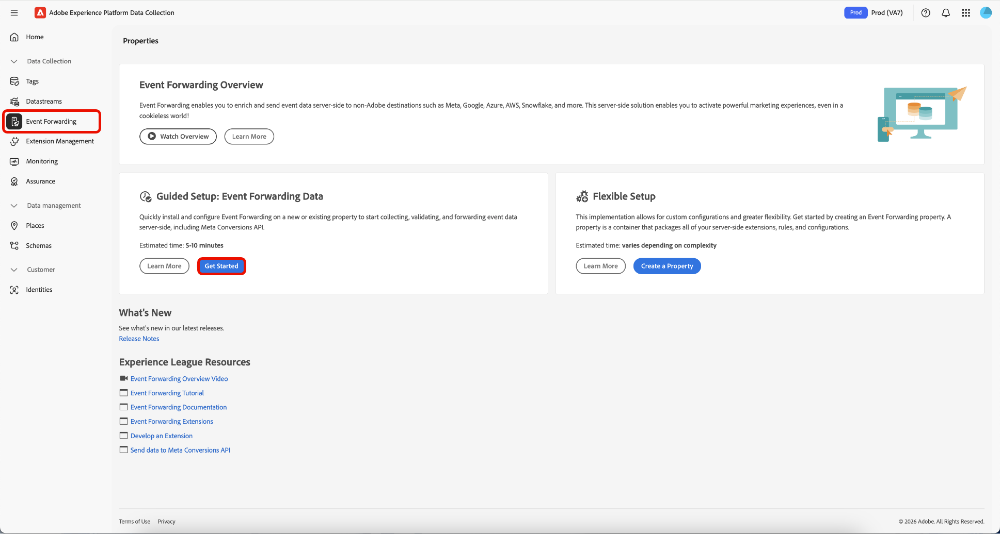
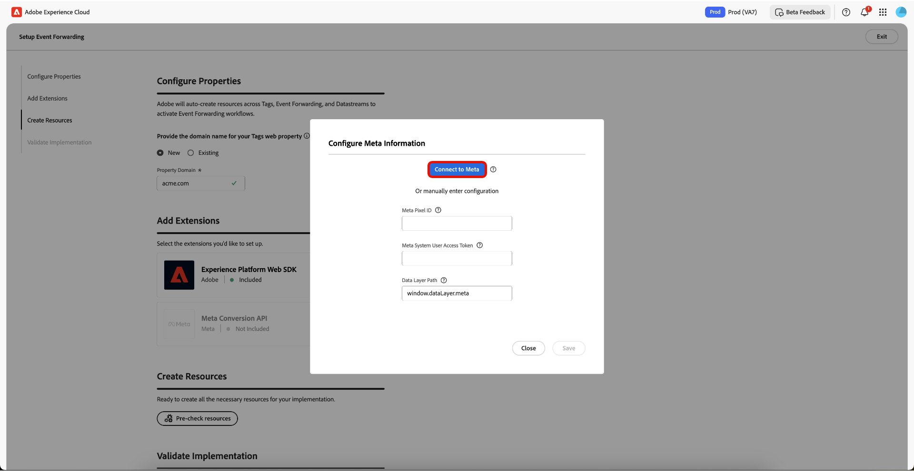
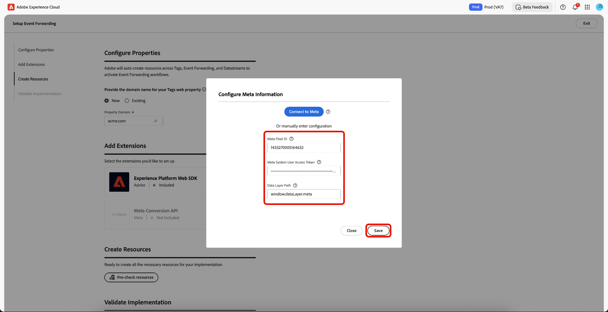
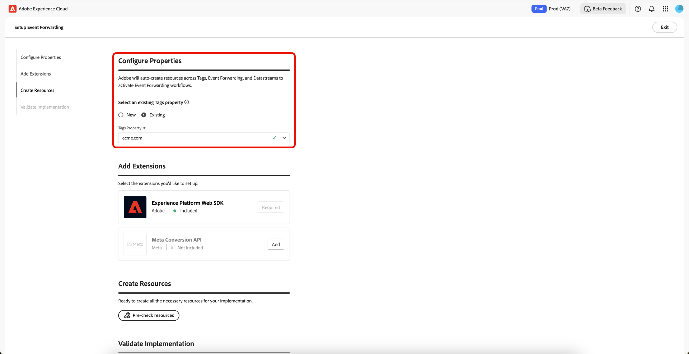

# Übersicht über das geführte Setup für die Ereignisweiterleitung

>[!IMPORTANT]
>
>Die Funktion Geführte Einrichtung steht Kunden zur Verfügung, die das Real-Time CDP Prime- und Ultimate-Paket erworben haben. Bitte wenden Sie sich an den Adobe-Support-Mitarbeiter, um weitere Informationen zu erhalten.

>[!NOTE]
>
>Jeder vorhandene Client kann die geführten Setup-Workflows verwenden, um eine Referenzimplementierung zu erstellen, die für Folgendes verwendet werden kann:
>
>* Verwenden Sie sie als Beginn einer völlig neuen Implementierung.
>* Nutzen Sie diese als Referenzimplementierung, um zu sehen, wie sie konfiguriert wurde, und replizieren Sie sie dann in Ihren aktuellen Produktionsimplementierungen.

Mit der Funktion „Geführte Einrichtung“ können Sie mühelos und effizient einrichten. Dieses Tool automatisiert mehrere Schritte, die in Adobe-Tags und in der Ereignisweiterleitung ausgeführt werden, wodurch die Einrichtungszeit erheblich verkürzt wird.

Mit diesem Setup können Erweiterungen automatisch installiert werden. Diese Hybridimplementierung wird von [!DNL Meta] zur Server-seitigen Erfassung und Weiterleitung von Ereigniskonversionen empfohlen. Die Funktion für die geführte Einrichtung soll Ihnen bei den ersten Schritten mit einer Implementierung der Ereignisweiterleitung helfen und ist nicht für eine durchgängige, voll funktionsfähige Implementierung vorgesehen, die alle Anwendungsfälle berücksichtigt.

## Erste Schritte mit der geführten Einrichtung {#guided-setup}

Um mit der Funktion zu beginnen, wählen Sie **[!UICONTROL Get Started]** in der **[!UICONTROL Event Forwarding]**-Benutzeroberfläche für Datenerfassungen aus.

>[!INFO]
>
>Sie können die geführte Einrichtung auch direkt über die Startseite der Datenerfassungen aufrufen.

### Erstellen einer neuen Tag-Eigenschaft {#new-property}

Wählen Sie im Abschnitt Eigenschaften konfigurieren die Option **[!UICONTROL New]** aus und geben Sie die neuen **[!UICONTROL Property Domain]** ein.

Wählen Sie **[!UICONTROL Add]** für die [!DNL Meta Conversion API] im Abschnitt Erweiterungen hinzufügen aus. Auf der Seite [!DNL Meta] konfigurieren haben Sie die Möglichkeit, Ihre **[!UICONTROL Meta Pixel ID]**, **[!UICONTROL Meta System User Access Token]** und **[!UICONTROL Data Layer Path]** manuell einzugeben. Sie können aber auch die **[!UICONTROL Connect to Meta]** Option verwenden.

#### Herstellen einer Verbindung mit [!DNL Meta] über Ihre Anmeldedaten {#meta-credentials}

Wählen Sie **[!UICONTROL Connect to Meta]** aus, geben Sie Ihre [!DNL Meta] ein, klicken Sie auf **[!UICONTROL Log in]** und klicken Sie dann auf **[!UICONTROL Next]**.

Sie werden jetzt aufgefordert, &quot;**-Portfolio erstellen**. Geben Sie den **[!UICONTROL Business portfolio name]** ein und wählen Sie **[!UICONTROL Next]** aus.

Wählen Sie Ihr Geschäftsportfolio aus der Liste aus und klicken Sie dann auf **[!UICONTROL Next]**. Sie können die Einstellungen für Business Portfolio, Ad Account und [!DNL Meta Pixel] sehen. Wählen Sie **[!UICONTROL Continue]** aus, um die Einstellungen zu bestätigen, und klicken Sie dann auf **[!UICONTROL Next]**.

Warten Sie einige Minuten, bis der Einrichtungsprozess abgeschlossen ist, und wählen Sie dann **[!UICONTROL Done]** aus.

Ihre **[!UICONTROL Meta Pixel ID]**, **[!UICONTROL Meta System User Access Token]** und **[!UICONTROL Data Layer Path]** werden automatisch ausgefüllt. Wählen Sie **[!UICONTROL Save]** aus.

#### Erstellen von Ressourcen für die neue Tag-Eigenschaft {#create-resources}

Wählen Sie im Abschnitt Ressourcen erstellen die Option **[!UICONTROL Pre-check resources]** aus, um Ihre Organisation und Eigenschaften auf Kollisionen oder vorhandene erforderliche Ressourcen für Ihre Implementierung zu überprüfen.

Auf der Seite „Aufgabenaktionen“ wird eine Liste von Aufgaben und Aktionen angezeigt. Wählen Sie **[!UICONTROL Create Resources]** aus, um diese Aufgaben zu erstellen.

Warten Sie einige Minuten, bis die erforderlichen Regeln, Datenelemente, Erweiterungen, Bibliotheken, SDKs usw. vollständig installiert wurden. Der Abschnitt Ressourcen erstellen enthält Links zu den erstellten Eigenschaften und Ressourcen.

#### Validieren der Implementierung {#validate-implementation}

Der Abschnitt Implementierung validieren enthält den Einbettungs-Link, den Sie auf Ihrer Website verwenden können. **[!UICONTROL Start Validation]** führt den Test in Ihrer aktuellen Browser-Sitzung auf dieser Seite für das geführte Setup aus. Wenn die Validierung hier erfolgreich ist, sollte dieselbe Implementierung funktionieren, wenn Sie den Einbettungs-Link auf Ihrer Site bereitstellen.

Wählen Sie **[!UICONTROL Send PageView Event]** aus, um ein Testereignis über die Adobe Experience Platform Edge Network zu senden. Sie wird dann Server-seitig an [!DNL Meta] weitergeleitet. Wählen Sie **[!UICONTROL Finished Validation]** aus, um die Einrichtung abzuschließen.

>[!NOTE]
>
>Wenn während des Validierungsprozesses Fehler auftreten, klicken Sie auf den Link **[!UICONTROL Assurance]** , um Ereignisse zu überprüfen, die möglicherweise fehlgeschlagen sind.

### Vorhandene Tag-Eigenschaft verwenden {#existing-property}

Wählen Sie im Abschnitt Eigenschaften konfigurieren die Option **[!UICONTROL Existing]** und wählen Sie dann aus dem Dropdown-Menü Ihre Tag-Eigenschaft aus. Das System versucht, über die Datenströme die Ereignisweiterleitungseigenschaft zu finden, die bereits mit dieser Eigenschaft verbunden ist. Sie können jetzt mit der Neukonfiguration der [!DNL Meta Conversion API] fortfahren, die Ressourcen vorab überprüfen und erstellen.

Wenn die ausgewählte Tag-Eigenschaft nicht mit einer Ereignisweiterleitungs-Eigenschaft verbunden ist oder Datenströme fehlen, werden sie automatisch erstellt.

Um Ihre [!DNL Meta Conversion API] zu konfigurieren, folgen Sie dem oben unter [Verbinden mit“  [!DNL Meta] Verwenden Ihrer Anmeldeinformationen](#meta-credentials) hervorgehobenen Prozess.

Nachdem Sie nun **[!UICONTROL Meta Pixel ID]**, **[!UICONTROL Meta System User Access Token]** und **[!UICONTROL Data Layer Path]** generiert haben, wählen Sie **[!UICONTROL Pre-Check resources]** aus, um den Workflow für die Ereignisweiterleitung zu erstellen.

Da Sie eine vorhandene Tag-Eigenschaft verwenden, unterscheidet sich der Einrichtungsprozess geringfügig vom neuen Eigenschaften-Workflow. Sie können sehen, dass das System die Erstellung der Web-Eigenschaft, des Hosts und der Umgebung überspringt, da diese bereits vorhanden sind. Wählen Sie abschließend **[!UICONTROL Create Resources]** aus, um die Aufgaben zu erstellen, die noch nicht verfügbar sind.

>[!INFO]
>
>Das geführte Setup fügt automatisch Anmerkungen zu Eigenschaften hinzu, die während des Prozesses aktualisiert werden. Sie können diese im Abschnitt Anmerkungen im rechten Bedienfeld der Tag-Eigenschaft anzeigen, wenn Sie sich im Bearbeitungsmodus befinden. Sie können sehen, wann die Eigenschaft vom geführten Setup-Tool aktualisiert oder erstellt wurde. Dieses Audit-Protokoll hilft Ihnen, Änderungen zu verfolgen, die von der geführten Einrichtungsfunktion vorgenommen wurden.

Warten Sie einige Minuten, bis die erforderlichen Regeln, Datenelemente, Erweiterungen, Bibliotheken, SDKs usw. vollständig installiert wurden. Der Abschnitt Ressourcen erstellen enthält Links zu den erstellten Eigenschaften und Ressourcen.

Der Abschnitt Implementierung validieren enthält den Einbettungs-Link, den Sie auf Ihrer Website verwenden können. **[!UICONTROL Start Validation]** führt den Test in Ihrer aktuellen Browser-Sitzung auf dieser Seite für das geführte Setup aus. Wenn die Validierung hier erfolgreich ist, sollte dieselbe Implementierung funktionieren, wenn Sie den Einbettungs-Link auf Ihrer Site bereitstellen.

Wählen Sie **[!UICONTROL Send PageView Event]** aus, um ein Testereignis über die Adobe Experience Platform Edge Network zu senden. Sie wird dann Server-seitig an [!DNL Meta] weitergeleitet. Wählen Sie **[!UICONTROL Finished Validation]** aus, um die Einrichtung abzuschließen.

>[!NOTE]
>
>Wenn während des Validierungsprozesses Fehler auftreten, klicken Sie auf den Link **[!UICONTROL Assurance]** , um Ereignisse zu überprüfen, die möglicherweise fehlgeschlagen sind.

## Nächste Schritte {#next-steps}

In diesem Handbuch wurde beschrieben, wie Sie mit dem geführten Setup-Tool Eigenschaften für die [!DNL Meta Conversions API] erstellen und konfigurieren können.

Weitere Anleitungen zur effektiven Implementierung [!DNL Meta] Integration finden Sie in der [ Dokumentation  [!DNL Conversions API]](https://www.facebook.com/business/help/308855623839366?id=818859032317965)Best Practices für die ). Weitere allgemeine Informationen zu Tags und zur Ereignisweiterleitung in Adobe Experience Cloud finden Sie unter [Tags - Übersicht](../../home.md).
