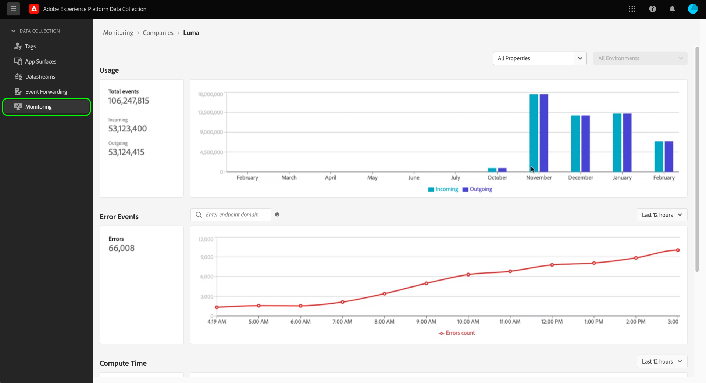

# Überwachen von Aktivitäten in der Ereignisweiterleitung (Beta)

>[!IMPORTANT]
>
>Diese Feature befindet sich derzeit in der Beta-Phase, und Ihre Organisation hat möglicherweise noch keinen Zugriff darauf. Die Funktionalität und Dokumentation können sich ändern.

Die **[!UICONTROL Überwachung]** in der Datenerfassungs-Benutzeroberfläche können Sie Nutzungsmuster, Fehler und die Berechnungszeit Ihrer Ereignisweiterleitungseigenschaften überwachen. Dieses Handbuch bietet einen allgemeinen Überblick darüber, wie Sie die auf der Registerkarte angezeigten Berichte anzeigen und verstehen.

## Voraussetzungen

In diesem Handbuch wird davon ausgegangen, dass Sie die Ereignisweiterleitung erworben haben und dass Sie über ein Verständnis der Funktionsweise der Ereignisweiterleitung verfügen. Siehe [Übersicht über die Ereignisweiterleitung](./overview.md) für weitere Informationen.

## Videoüberblick

Sehen Sie sich das folgende Video an, um einen allgemeinen Überblick über die Überwachungsfunktion zu erhalten:

>[!VIDEO](https://video.tv.adobe.com/v/343999?quality=12&learn=on)

## Auswählen von Eigenschaften und Umgebungen

Sie können Metriken in einer einzelnen Umgebung und Eigenschaft oder über alle Eigenschaften und Umgebungen Ihrer Organisation hinweg anzeigen.

Um Metriken für eine einzelne Eigenschaft anzuzeigen, wählen Sie das Eigenschaften-Dropdown-Menü aus und wählen Sie die gewünschte Eigenschaft aus der Liste aus. Nachdem Sie eine Eigenschaft ausgewählt haben, können Sie auch das Dropdown-Menü Umgebung verwenden, um eine Umgebung von Interesse auszuwählen.

## [!UICONTROL Verwendung]

>[!NOTE]
>
>Die Nutzungsdaten werden jeden Monat nach Ende des Vormonats aktualisiert.

Die **[!UICONTROL Nutzung]** zeigt eingehende und ausgehende Aufrufe für einen bestimmten Zeitraum an. Eingehende Aufrufe stellen Daten dar, die an die Ereignisweiterleitung gesendet werden. Ausgehende Aufrufe stellen Daten dar, die von der Ereignisweiterleitung gesendet werden. Die **[!UICONTROL Ereignisse insgesamt]** number im linken Bereich ist die Summe der eingehenden und ausgehenden Aufrufe für den angegebenen Zeitraum.

## [!UICONTROL Fehlerereignisse]

Die **[!UICONTROL Fehlerereignisse]** zeigt Fehler in aggregierter Form und aufgeschlüsselt nach HTTP-Antwort-Code an, wenn Sie den Cursor über das Liniendiagramm bewegen. Die angezeigten Fehler stammen aus ausgehenden Aufrufen und die Antwort-Codes stammen aus dem Endpunkt, mit dem die Ereignisweiterleitung interagiert.

Die Fehler werden für einen bestimmten Zeitraum angezeigt, der im Dropdown-Menü angepasst werden kann.

Mit dem Suchfeld für das Fehlerereignis können Sie die Ereignisweiterleitung abfragen, um Fehler für eine bestimmte Endpunktdomäne zu verstehen. Sie müssen die genaue Domain angeben, da die Suchfunktion keine Näherungen oder &quot;unscharfe&quot;Treffer akzeptiert. Sobald Sie eine exakte Domäne angegeben haben, für die ausgehende Fehlerdaten vorliegen, drücken Sie die Eingabetaste und der Bericht wird aktualisiert, um ausgehende Fehler für diese Domäne anzuzeigen. Um beispielsweise Fehler vom Facebook Conversions-API-Endpunkt zu sehen, sollte die Domäne als `https://graph.facebook.com`.

## [!UICONTROL Berechnungszeit]

Die **[!UICONTROL Berechnungszeit]** zeigt die Berechnungszeit aller Regeln auf Ereignisweiterleitungsservern an.

>[!NOTE]
>
>Die angezeigten Zeiten stellen keine End-to-End-Latenz dar. Die Ereignisweiterleitung ist auf 50 Millisekunden begrenzt. Wenn diese Grenze überschritten wird, werden die zugehörigen Daten entfernt.

Die folgenden Faktoren beeinflussen die Berechnungszeit:

1. Die Anzahl der Regeln
2. Die Komplexität der Regeln, die in der Regel durch die Menge an benutzerdefiniertem JavaScript bestimmt werden, das ausgeführt wird

Wenn beispielsweise eine Aktion in der Ereignisweiterleitung auf einen Endpunkt trifft und dieser Endpunkt zwei Sekunden dauert, um zu antworten, wird diese zweisekündige Latenz nicht mit der Berechnungszeit angerechnet, da die Ereignisweiterleitung nur wartet und nichts aktiv berechnet. Die Antwortzeit darf nicht länger als 30 Sekunden sein. Andernfalls werden die Daten verworfen.
