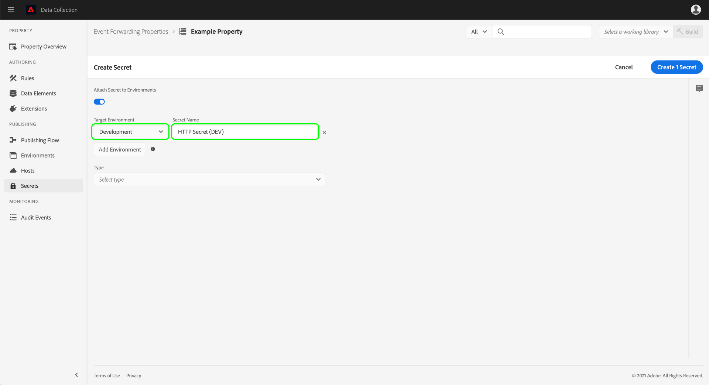

# Konfigurieren von Geheimnissen bei der Ereignisweiterleitung

Bei der Ereignisweiterleitung sind geheime Daten eine Ressource, die eine Authentifizierungsberechtigung für ein anderes System darstellt und den sicheren Datenaustausch ermöglicht. Geheime Daten können nur in den Eigenschaften der Ereignisweiterleitung erstellt werden.

Derzeit werden drei Typen von geheimen Daten unterstützt:

| Typ von geheimen Daten | Beschreibung |
| --- | --- |
| [!UICONTROL Token] | Eine einzelne Zeichenfolge, die den Wert eines Authentifizierungs-Tokens darstellt, der von beiden Systemen verstanden wird. |
| [!UICONTROL HTTP] | Enthält zwei Zeichenfolgen-Attribute für einen Benutzernamen und ein Kennwort. |
| [!UICONTROL OAuth2] | Enthält mehrere Attribute zur Unterstützung der [Art des Zuschusses für Client-Anmeldeinformationen](https://datatracker.ietf.org/doc/html/rfc6749#section-1.3.4) für [OAuth 2.0](https://datatracker.ietf.org/doc/html/rfc6749) Authentifizierungsspezifikation. Das System fordert von Ihnen die erforderlichen Informationen an. Anschließend übernimmt es die Verlängerung dieser Token für Sie in einem bestimmten Intervall. |
| [!UICONTROL Google OAuth 2] | Enthält mehrere Attribute zur Unterstützung der [OAuth 2.0](https://datatracker.ietf.org/doc/html/rfc6749) Authentifizierungsspezifikation für die Verwendung im [Google Ads API](https://developers.google.com/google-ads/api/docs/oauth/overview) und [Pub/Sub-API](https://cloud.google.com/pubsub/docs/reference/service_apis_overview). Das System fordert von Ihnen die erforderlichen Informationen an. Anschließend übernimmt es die Verlängerung dieser Token für Sie in einem bestimmten Intervall. |

{style=&quot;table-layout:auto&quot;}

Dieses Handbuch bietet einen allgemeinen Überblick darüber, wie Geheimnisse für die Ereignisweiterleitung konfiguriert werden ([!UICONTROL Edge]) in der Experience Platform-Benutzeroberfläche oder der Datenerfassungs-Benutzeroberfläche.

>[!NOTE]
>
>Ausführliche Anleitungen zum Verwalten von geheimen Daten in der Reactor-API, einschließlich einer Beispiel-JSON zur Struktur der geheimen Daten, finden Sie im [API-Handbuch für geheime Daten](../../api/guides/secrets.md).

## Voraussetzungen

In diesem Handbuch wird davon ausgegangen, dass Sie bereits mit der Verwaltung von Ressourcen für Tags und die Ereignisweiterleitung in der Benutzeroberfläche vertraut sind, einschließlich der Erstellung eines Datenelements und einer Ereignisweiterleitungsregel. Wenn Sie eine Einführung benötigen, finden Sie weitere Informationen im Handbuch unter [Verwalten von Ressourcen](../managing-resources/overview.md).

Außerdem sollten Sie über ein grundlegendes Verständnis des Veröffentlichungsflusses im Hinblick auf Tags und Ereignisweiterleitung verfügen, einschließlich der Möglichkeit, Ressourcen zu einer Bibliothek hinzuzufügen und einen Build zum Testen auf Ihrer Website zu installieren. Weitere Informationen finden Sie in der [Publishing-Übersicht](../publishing/overview.md).

## Erstellen geheimer Daten {#create}

>[!CONTEXTUALHELP]
>id="platform_eventforwarding_secrets_environments"
>title="Umgebungen für Geheimnisse"
>abstract="Damit geheime Daten durch die Ereignisweiterleitung verwendet werden können, müssen sie einer vorhandenen Umgebung zugewiesen werden. Wenn Sie keine Umgebungen für Ihre Ereignisweiterleitungs-Eigenschaft erstellt haben, müssen Sie diese konfigurieren, bevor Sie den Vorgang fortsetzen."
>additional-url="https://experienceleague.adobe.com/docs/experience-platform/tags/publish/environments/environments.html?lang=de" text="Umgebungen – Übersicht"

Um einen geheimen Schlüssel zu erstellen, wählen Sie **[!UICONTROL Ereignisweiterleitung]** Öffnen Sie in der linken Navigation die Ereignisweiterleitungs-Eigenschaft, unter der Sie das Geheimnis hinzufügen möchten. Wählen Sie anschließend im linken Navigationsbereich zunächst **[!UICONTROL Geheime Daten]** und dann **[!UICONTROL Neue geheime Daten erstellen]** aus.

Im nächsten Bildschirm können Sie die Details der geheimen Daten konfigurieren. Damit geheime Daten durch die Ereignisweiterleitung verwendet werden können, müssen sie einer vorhandenen Umgebung zugewiesen werden. Wenn Sie keine Umgebungen für Ihre Ereignisweiterleitungs-Eigenschaft erstellt haben, schauen Sie sich zunächst die Anleitung zur Konfiguration im Handbuch zu [Umgebungen](../publishing/environments.md) an, bevor Sie fortfahren.

>[!NOTE]
>
>Wenn Sie die geheimen Daten dennoch erstellen und speichern möchten, bevor Sie sie einer Umgebung hinzufügen, deaktivieren Sie die Option **[!UICONTROL Geheime Daten an Umgebungen anhängen]**, bevor Sie den Rest der Informationen ausfüllen. Beachten Sie, dass Sie sie später einer Umgebung zuweisen müssen, wenn Sie die geheimen Daten verwenden möchten.
>
>

Wählen Sie unter **[!UICONTROL Zielumgebung]** im Dropdown-Menü die Umgebung aus, der Sie die geheimen Daten zuweisen möchten. Geben Sie unter **[!UICONTROL Name der geheimen Daten]** einen Namen für die geheimen Daten im Kontext der Umgebung an. Dieser Name muss für alle geheimen Daten unter der Ereignisweiterleitungs-Eigenschaft eindeutig sein.

Geheime Daten können jeweils nur einer Umgebung zugewiesen werden. Sie können jedoch bei Bedarf die gleichen Anmeldeinformationen mehreren geheimen Daten in verschiedenen Umgebungen zuweisen. Wählen Sie **[!UICONTROL Umgebung hinzufügen]** aus, um der Liste eine weitere Zeile hinzuzufügen.

Für jede Umgebung, die Sie hinzufügen, müssen Sie einen weiteren eindeutigen Namen für die zugehörigen geheimen Daten angeben. Wenn Sie alle verfügbaren Umgebungen ausfüllen, steht die Schaltfläche **[!UICONTROL Umgebung hinzufügen]** nicht mehr zur Verfügung.

Von hier aus unterscheiden sich die Schritte zum Erstellen der geheimen Daten je nach dem Typ der jeweils erstellten geheimen Daten. Einzelheiten finden Sie in den nachfolgenden Abschnitten:

* [[!UICONTROL Token]](#token)
* [[!UICONTROL HTTP]](#http)
* [[!UICONTROL OAuth2]](#oauth2)
* [[!UICONTROL Google OAuth 2]](#google-oauth2)

### [!UICONTROL Token] {#token}

Um geheime Daten vom Typ „Token“ zu erstellen, wählen Sie in der Dropdown-Liste **[!UICONTROL Typ]** die Option **[!UICONTROL Token]** aus. Geben Sie im nun erscheinenden Feld **[!UICONTROL Token]** die Zeichenfolge zur Anmeldung an, die vom System erkannt wird, für das Sie sich authentifizieren. Wählen Sie **[!UICONTROL Geheime Daten erstellen]** aus, um die geheimen Daten zu speichern.

### [!UICONTROL HTTP] {#http}

Um geheime Daten vom Typ „HTTP“ zu erstellen, wählen Sie in der Dropdown-Liste **[!UICONTROL Typ]** die Option **[!UICONTROL Einfaches HTTP]** aus. Geben Sie in den unten angezeigten Feldern einen Benutzernamen und ein Kennwort zur Anmeldung ein, bevor Sie die Option **[!UICONTROL Geheime Daten erstellen]** auswählen, um die jeweiligen geheimen Daten zu speichern.

>[!NOTE]
>
>Nach dem Speichern werden die Anmeldedaten mit dem [Grundlegenden HTTP-Authentifizierungsschema](https://www.rfc-editor.org/rfc/rfc7617.html) verschlüsselt.

### [!UICONTROL OAuth2] {#oauth2}

Um geheime Daten vom Typ „OAuth2“ zu erstellen, wählen Sie aus der Dropdown-Liste **[!UICONTROL Typ]** die Option **[!UICONTROL OAuth2]** aus. Geben Sie in den unten angezeigten Feldern Ihre [[!UICONTROL Client-ID] und [!UICONTROL Client Secret]](https://www.oauth.com/oauth2-servers/client-registration/client-id-secret/)sowie [[!UICONTROL Token-URL]](https://www.oauth.com/oauth2-servers/access-tokens/client-credentials/) für Ihre OAuth-Integration. Die [!UICONTROL Token-URL] -Feld in der Benutzeroberfläche ist eine Verkettung zwischen dem Autorisierungsserverhost und dem Tokenpfad.

Unter **[!UICONTROL Anmeldedaten-Optionen]** können Sie weitere Optionen für die Anmeldedaten bereitstellen, z. B. `scope` und `audience` in Form von Schlüssel-Wert-Paaren. Um weitere Schlüssel-Wert-Paare hinzuzufügen, wählen Sie **[!UICONTROL Weitere hinzufügen]** aus.

Schließlich können Sie den Wert **[!UICONTROL Versatz aktualisieren]** für die jeweiligen geheimen Daten konfigurieren. Dies stellt die Anzahl der Sekunden vor Ablauf des Tokens dar, nach denen das System eine automatische Aktualisierung durchführt. Die entsprechende Uhrzeit in Stunden und Minuten wird rechts neben dem Feld angezeigt und bei der Eingabe automatisch aktualisiert.

Wenn beispielsweise der Zeitversatz zur Aktualisierung auf den Standardwert von `14400` (vier Stunden) eingestellt ist und der Wert für `expires_in` beim Zugriffs-Token `86400` (24 Stunden) ist, aktualisiert das System die geheimen Daten automatisch in 20 Stunden.

>[!IMPORTANT]
>
>Bei geheimen Daten des Typs „OAuth“ müssen zwischen Aktualisierungen mindestens vier Stunden liegen und diese Daten müssen zudem mindestens acht Stunden gültig sein. Durch diese Beschränkung haben Sie mindestens vier Stunden Zeit, um bei Problemen mit dem generierten Token einzugreifen.
>
>Wenn der Versatz beispielsweise auf `28800` (acht Stunden) eingestellt ist und der Wert `expires_in` beim Zugriffs-Token `36000` (zehn Stunden) ist, würde der Austausch scheitern, da der daraus resultierende Unterschied weniger als vier Stunden betragen würde.

Wenn Sie fertig sind, wählen Sie die Option **[!UICONTROL Geheime Daten erstellen]** aus, um die geheimen Daten zu speichern.

### [!UICONTROL Google OAuth 2] {#google-oauth2}

Um ein Google OAuth 2-Geheimnis zu erstellen, wählen Sie **[!UICONTROL Google OAuth 2]** von **[!UICONTROL Typ]** Dropdown-Liste. under **[!UICONTROL Bereiche]** Wählen Sie die Google-APIs aus, für die Sie mithilfe dieses Geheimnisses Zugriff gewähren möchten. Die folgenden Produkte werden derzeit unterstützt:

* [Google Ads API](https://developers.google.com/google-ads/api/docs/oauth/overview)
* [Pub/Sub-API](https://cloud.google.com/pubsub/docs/reference/service_apis_overview)

Wenn Sie fertig sind, wählen Sie **[!UICONTROL Geheimnis erstellen]**.

Ein Popup erscheint, das Sie darüber informiert, dass das Geheimnis manuell über Google autorisiert werden muss. Auswählen **[!UICONTROL Erstellen und Autorisieren]** , um fortzufahren.

Es wird ein Dialogfeld angezeigt, in dem Sie die Anmeldeinformationen für Ihr Google-Konto eingeben können. Befolgen Sie die Anweisungen, um der Ereignisweiterleitung unter dem ausgewählten Bereich Zugriff auf Ihre Daten zu gewähren. Sobald der Autorisierungsprozess abgeschlossen ist, wird der geheime Schlüssel erstellt.

>[!IMPORTANT]
>
>Wenn für Ihr Unternehmen eine Richtlinie zur erneuten Authentifizierung für Google Cloud-Anwendungen festgelegt ist, werden die erstellten Geheimnisse nach Ablauf der Authentifizierung nicht erfolgreich aktualisiert (zwischen 1 und 24 Stunden, je nach Richtlinienkonfiguration).
>
>Um dieses Problem zu beheben, melden Sie sich bei der Google Admin Console an und navigieren Sie zur **[!DNL App access control]** -Seite, damit Sie die Ereignisweiterleitungs-App (Adobe Real-Time CDP Event Forwarding) als [!DNL Trusted]. Weitere Informationen finden Sie in der Google-Dokumentation unter [Festlegen von Sitzungslängen für Google Cloud-Services](https://support.google.com/a/answer/9368756) für weitere Informationen.

## Geheime Daten bearbeiten

Nachdem Sie geheime Daten für eine Eigenschaft erstellt haben, finden Sie sie im Abschnitt **[!UICONTROL Geheime Daten]** im Arbeitsbereich. Um die Details von vorhandenen geheimen Daten zu bearbeiten, wählen Sie den Namen der jeweiligen geheimen Daten aus der Liste aus.

Im nächsten Bildschirm können Sie den Namen und die Anmeldeinformationen für die jeweiligen geheimen Daten ändern.

>[!NOTE]
>
>Wenn geheime Daten mit einer vorhandenen Umgebung verknüpft sind, können Sie die jeweiligen geheimen Daten nicht einer anderen Umgebung zuweisen. Wenn Sie dieselben Anmeldeinformationen in einer anderen Umgebung verwenden möchten, müssen Sie stattdessen [neue geheime Daten erstellen](#create). Die einzige Möglichkeit, die Umgebung von diesem Bildschirm aus neu zuzuweisen, besteht darin, die jeweiligen geheimen Daten nie zuvor einer Umgebung zugewiesen zu haben bzw. die Umgebung zu löschen, der die jeweiligen geheimen Daten zugewiesen waren.

### Austausch von geheimen Daten erneut versuchen

Sie können einen Austausch von geheimen Daten über den Bearbeitungsbildschirm erneut versuchen oder aktualisieren. Dieser Vorgang hängt vom Typ der zu bearbeitenden geheimen Daten ab:

| Typ von geheimen Daten | Protokoll erneut versuchen |
| --- | --- |
| [!UICONTROL Token] | Wählen Sie die Option **[!UICONTROL Geheime Daten austauschen]** aus, um den Austausch der geheimen Daten erneut zu versuchen. Dieses Steuerelement ist nur verfügbar, wenn eine Umgebung mit den jeweiligen geheimen Daten verknüpft ist. |
| [!UICONTROL HTTP] | Wenn keine Umgebung mit den jeweiligen geheimen Daten verknüpft ist, wählen Sie die Option **[!UICONTROL Geheime Daten austauschen]** aus, um die Berechtigung in base64 auszutauschen. Wenn eine Umgebung angehängt ist, wählen Sie die Option **[!UICONTROL Geheimnis austauschen und bereitstellen]** um auf base64 auszutauschen und das Geheimnis bereitzustellen. |
| [!UICONTROL OAuth2] | Wählen Sie **[!UICONTROL Token erstellen]** aus, um die Anmeldeinformationen auszutauschen und ein Zugriffs-Token vom Authentifizierungsanbieter zurückzugeben. |

## Löschen von geheimen Daten

Um vorhandene geheime Daten im Arbeitsbereich **[!UICONTROL Geheime Daten]** zu löschen, aktivieren Sie zunächst das Kontrollkästchen neben dem Namen der jeweiligen geheimen Daten und wählen Sie anschließend die Option **[!UICONTROL Löschen]** aus.

## Verwenden von geheimen Daten bei der Ereignisweiterleitung

Um bei der Ereignisweiterleitung geheime Daten zu verwenden, müssen Sie zunächst ein [Datenelement](../managing-resources/data-elements.md) erstellen, das die geheimen Daten an sich referenziert. Nach dem Speichern des Datenelements können Sie dieses in die [Regeln](../managing-resources/rules.md) zur Ereignisweiterleitung einbeziehen und diese Regeln zu einer [Bibliothek](../publishing/libraries.md) hinzufügen, die wiederum als [Build](../publishing/builds.md) für die Adobe-Server bereitgestellt werden kann.

Wählen Sie beim Erstellen des Datenelements die **[!UICONTROL Core]**-Erweiterung und anschließend für den Datenelementtyp die Option **[!UICONTROL Geheime Daten]** aus. Das rechte Bedienfeld aktualisiert sich und bietet Dropdown-Steuerelemente zum Zuweisen von bis zu drei geheimen Daten zum Datenelement, und zwar für [!UICONTROL Entwicklung], [!UICONTROL Staging] und [!UICONTROL Produktion].

>[!NOTE]
>
>In den jeweiligen Dropdown-Listen werden nur geheime Daten angezeigt, die mit der Entwicklungs-, Staging- bzw. Produktionsumgebung verknüpft sind.

Indem Sie einem einzelnen Datenelement mehrere geheime Daten zuweisen und es in eine Regel einschließen, kann sich der Wert des Datenelements ändern, je nachdem, wo sich die übergeordnete Bibliothek im [Veröffentlichungsfluss](../publishing/publishing-flow.md) befindet.

>[!NOTE]
>
>Beim Erstellen des Datenelements muss eine Entwicklungsumgebung zugewiesen werden. Geheime Daten für die Staging- und Produktionsumgebungen sind nicht erforderlich, aber Builds, die versuchen, zu diesen Umgebungen zu wechseln, funktionieren nicht, wenn für ihre Datenelemente des Typs „Geheime Daten“ keine geheimen Daten für die betreffende Umgebung ausgewählt wurden.

## Nächste Schritte

In diesem Handbuch wurde beschrieben, wie Geheimnisse in der Benutzeroberfläche verwaltet werden. Informationen zur Interaktion mit geheimen Daten mithilfe der Reactor-API finden Sie im [Endpunktleitfaden für geheime Daten](../../api/endpoints/secrets.md).
