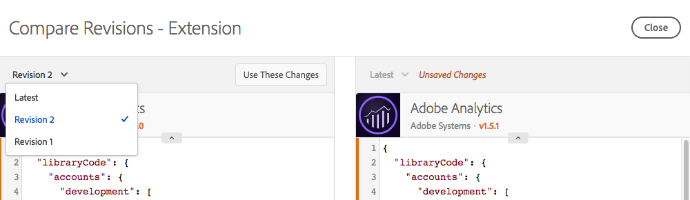

# Vergleichen von Ressourcenrevisionen

>[!NOTE]
>
>Adobe Experience Platform Launch wurde als eine Suite von Datenerfassungstechnologien in Adobe Experience Platform umbenannt. Infolgedessen wurden in der gesamten Produktdokumentation mehrere terminologische Änderungen eingeführt. Eine konsolidierte Übersicht der terminologischen Änderungen finden Sie im folgenden [Dokument](../../term-updates.md).

Vergleichen Sie Ressourcenversionen, um den Verlauf einzelner Ressource anzuzeigen. Sie können den aktuellen Status der Ressource mit älteren Versionen oder die derzeit veröffentlichte Version einer Ressource mit den neuesten gespeicherten Änderungen vergleichen.

## Starten eines Vergleichs

Das Starten eines Vergleichs ist bei allen Ressourcentypen gleich. Öffnen Sie die Bearbeitungsansicht für eine Ressource und suchen Sie dann das Drei-Punkte-Symbol neben der Schaltfläche **[!UICONTROL Speichern]**, um die verfügbaren Aktionen für diese Ressource anzuzeigen. Wählen Sie **[!UICONTROL Revisionen vergleichen]** aus der Liste aus.

Sie können bei Erweiterungen auf die Detailansicht zugreifen, indem Sie auf die Schaltfläche **[!UICONTROL Konfigurieren]** klicken, wenn die Liste der installierten Erweiterungen angezeigt wird. Wählen Sie bei Datenelementen und Regeln ein Element aus der Liste aus.

## Verwenden der Vergleichsansicht

Wenn Sie einen Vergleich starten, zeigt die Standardansicht die neueste Version auf der rechten Seite an. Diese Version enthält alle nicht gespeicherten Änderungen, die Sie in der Bearbeitungsansicht an der Ressource vorgenommen haben. (Beachten Sie den Hinweis „Nicht gespeicherte Änderungen“ rechts im unten aufgeführten Bild.)

Auf der linken Seite können Sie aus vorhandenen Versionen wählen, um diese mit der aktuellen Version zu vergleichen.

Klicken Sie auf **[!UICONTROL Diese Änderungen verwenden]**, um die Einstellungen aus der ausgewählten Version (links) in die aktuelle Version (rechts) zu kopieren. Dadurch werden die Einstellungen der alten Version in die neuesten nicht gespeicherten Änderungen kopiert. Wenn diese Änderungen beibehalten werden sollen, klicken Sie auf **[!UICONTROL Speichern]**, bevor Sie die Vergleichsansicht verlassen.

>[!TIP]
>Einzelne Ressourcen können sowohl Attribute als auch Einstellungen aufweisen. Diese Einstellungen werden als JSON-Block gespeichert. Dies ist eine strukturierte Methode zur Speicherung von Daten, die jedoch flexibel genug ist, dass Erweiterungsentwickler beliebige Elemente speichern können, damit ihre Erweiterungen die gewünschten Aktionen vornehmen können.
>In der ersten Version der Vergleichsansicht werden die Einstellungen im Rohformat als JSON angezeigt. Durch künftige Verbesserungen können Sie Versionen auf verschiedene Weise anzeigen, einschließlich detaillierter Codevergleiche und von den Erweiterungsentwicklern bereitgestellter Erweiterungsansichten.

## Vergleichen von Erweiterungen

Erweiterungen verfügen über einen einzelnen Bildschirm, um die Unterschiede zwischen den Versionen anzuzeigen.

In der Vergleichsansicht werden Unterschiede zwischen den Einstellungsversionen hervorgehoben. Hinzugefügte oder entfernte Einstellungen werden durch eine erweiterte Linie nach links oder rechts angezeigt.

Oben können Sie die folgenden Änderungen sehen:

* Die [!DNL Adobe Analytics]-Erweiterung wird auf eine neue Version aktualisiert. Dies wird durch die orangefarbenen Versionsnummern oben im Bildschirm angegeben.
* `orgID` und `currencyCode` werden in den Einstellungen geändert. Dies wird durch die Erweiterung des orangefarbenen Abschnitts in den Einstellungen angegeben.

## Vergleichen von Datenelementen

Datenelemente zeigen Unterschiede auf einem einzelnen Bildschirm an. Da Datenelemente jedoch neben den Einstellungen zusätzliche Attribute aufweisen, werden weitere Informationen angezeigt. Geänderte Attribute werden orangefarben hervorgehoben.

Oben können Sie die folgenden Änderungen sehen:

* Der Name wurde von „Page Name 2“ zu „My Special Page Name“ geändert, wie durch die orangefarbene Leiste angegeben.
* Der Typ wurde von „JavaScript-Variable“ zu „Seiteninfo“ geändert.
* Der Standardwert „b“ wurde hinzugefügt.
* „Kleinbuchstaben erzwingen“ wurde ausgewählt.
* „Bereinigter Text“ wurde ausgewählt.
* Die Einstellungen wurden geändert. (Die Einstellungen für den Typ „JavaScript-Variable“ unterscheiden sich von denen vom Typ „Seiteninfo“.)

Im Fall eines umfangreichen Einstellungsblocks können Sie den Einstellungsbereich erweitern, um ihn besser sehen zu können.

## Vergleichen von Regeln

Regeln bestehen aus vielen Regelkomponenten. Um die Änderungen an einer Regel zu verstehen, müssen Sie hinzugefügte und entfernte Komponenten sowie Änderungen an einzelnen Komponenten kennen. Wenn Sie also Versionen einer Regel vergleichen, stehen Ihnen zwei Bildschirme zur Verfügung.

Der erste Bildschirm zeigt eine allgemeine Ansicht, die Änderungen an der Anordnung der Regelkomponenten innerhalb der Regel hervorhebt. Änderungen werden hervorgehoben. Es werden verschiedene Arten von Änderungen angezeigt.

Oben können Sie die folgenden Änderungen sehen:

* Der Regelname wurde von „Analytics“ zu „Baseline Analytics“ geändert, wie durch die orangefarbene Leiste angegeben.
* Die Bedingung „Core – Domain“ wurde hinzugefügt, wie durch das orangefarbene Plussymbol und die rechts hinzugefügte Komponente angegeben.
* Die Aktion „[!DNL Adobe Analytics] – Variablen löschen“ wurde entfernt, wie durch das orangefarbene Symbol und die rechts fehlende Komponente angegeben.
* Die Aktion „[!DNL Adobe Analytics] – Variablen festlegen“ wurde geändert, wie durch die orangefarbene Linie zwischen den Komponentenversionen auf der linken und der rechten Seite angegeben. Diese Linie ist gerade, wenn die Komponentenreihenfolge nicht geändert wurde.
* Die Reihenfolge der Aktionen „[!DNL Adobe Analytics] – Variablen festlegen“ und „[!DNL Adobe Analytics] – Beacon senden“ wurde geändert. Dies wird durch die gekrümmten Linien angegeben, die die verschiedenen Komponentenversionen links und rechts miteinander verbinden.

Um die spezifischen Änderungen an einer der Regelkomponenten anzuzeigen, klicken Sie auf die jeweilige Komponente, die Sie anzeigen möchten.  Die Linie wird blau, wenn Sie mit dem Mauszeiger darüberfahren.

Der Vergleich einer einzelnen Regelkomponente verhält sich genauso wie der Vergleich eines Datenelements.

Oben können Sie die folgende Änderung sehen:

* Die Regelkomponente wurde geändert, um eVar2 mit dem Wert „1“ hinzuzufügen.

Im Fall eines umfangreichen Einstellungsblocks können Sie den Einstellungsbereich erweitern, um ihn besser sehen zu können.
