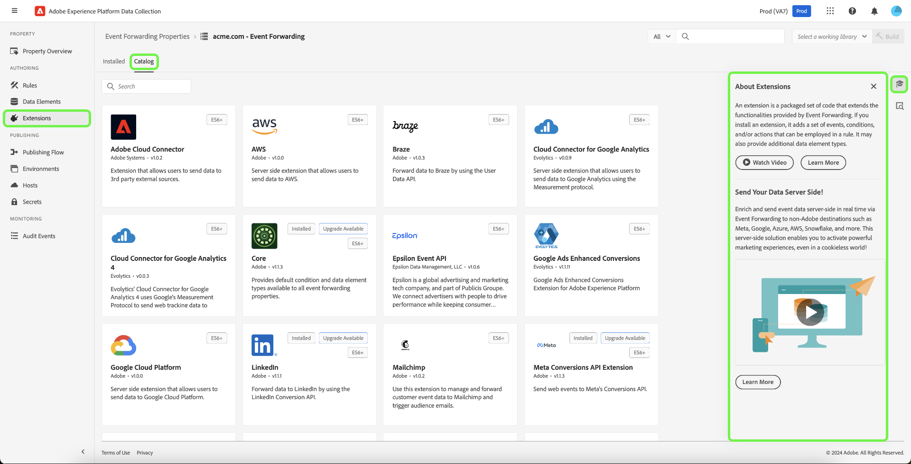

# Erweiterungen

Eine Erweiterung ist ein gepackter Code-Satz, der die von Tags oder der Ereignisweiterleitung bereitgestellten Funktionen erweitert.

Durch Hinzufügen einer Erweiterung werden neue Datenelemente und neue Optionen zum Erstellen von Regeln hinzugefügt.

Erweiterungen bestimmen die Elemente, die beim Erstellen von Eigenschaften, Regeln und Datenelementen verfügbar sind. Sie bieten Folgendes:

* Ereignisse, Bedingungen und Ausnahmen
* Datenelemente
* Client-seitiger Code

Verwenden Sie die Links oben in der Liste „Erweiterungen“, um installierte Erweiterungen, den Katalog oder Updates anzuzeigen.

Wählen Sie eine Erweiterung aus und klicken Sie auf [!UICONTROL Configure], um die Einstellungen der Erweiterung anzuzeigen und zu ändern. Weitere Informationen zu Erweiterungsoptionen finden Sie im Abschnitt [Hinzufügen einer neuen Erweiterung](#add-a-new-extension).

>[!IMPORTANT]
>
>Änderungen werden erst wirksam, nachdem sie [veröffentlicht](../../publishing/overview.md) wurden.

Standardmäßig stellt Adobe Erweiterungen bereit, die gängige Integrationen unterstützen. Erweiterungen können mit benutzerdefinierten Konfigurationen angepasst werden. Konfigurationen werden über die Erweiterungen bereitgestellt. Klicken Sie zum Erstellen einer Konfiguration auf die Erweiterungskarte und dann auf **[!UICONTROL Add New Configuration]**.

## Erweiterungskatalog

Verwenden Sie den Erweiterungskatalog, um Marketing- und Werbetechnologien, die von unabhängigen Software-Anbietern entwickelt und gepflegt werden, sowie Erweiterungen für Adobe-Lösungen zu durchsuchen, zu konfigurieren und bereitzustellen.

Die Seite „Erweiterungen“ bietet drei Ansichten:

* Installierte

  Zeigt alle installierten Erweiterungen an.

* Katalog
* Zeigt alle verfügbaren Erweiterungen an.
* Updates

  Zeigt Updates für installierte Erweiterungen an.

Klicken Sie auf **[!UICONTROL Extensions]**, um alle installierten Erweiterungen anzuzeigen. Sie können den Katalog auch verwenden, um eine Liste aller verfügbaren Erweiterungen anzuzeigen und zu ermitteln, welche Erweiterungen verfügbar sind.

Ausführliche Informationen zu Adobe-eigenen Erweiterungen finden Sie in der [Erweiterungsreferenz](../../../extensions/client/overview.md).

## Hinzufügen neuer Erweiterungen {#add-a-new-extension}

Tags sind extrem erweiterbar. Erweiterungen fügen Tags Kernfunktionen hinzu. Erweiterungen werden häufig verwendet, um Integrationen in andere Anwendungen zu schaffen.

>[!TIP]
>
>Verwenden Sie die produktinterne Hilfe im rechten Bedienfeld, um mehr über Erweiterungen zu erfahren und zusätzliche verfügbare Ressourcen anzuzeigen.

1. Öffnen Sie auf der Übersichtsseite einer Property die Registerkarte **[!UICONTROL Extensions]**.
1. Wählen Sie eine Erweiterung aus.

   

   * Wenn die Erweiterung vorhanden ist, wählen Sie sie aus dem Erweiterungskatalog aus.
   * Bewegen Sie den Mauszeiger über eine Erweiterung in Ihrer Liste, um sie zu konfigurieren oder zu deaktivieren.
   * Fügen Sie andere Erweiterungen aus dem Katalog hinzu, wenn sie derzeit nicht in der Liste aufgeführt sind.

   Die Haupterweiterung ist der Ausgangspunkt für Ihre neue Erweiterung. Die Standarderweiterung bietet Folgendes:

   * Standardereignis
   * Standardbedingungen und -ausnahmen
   * Standardmäßiger Client-seitiger Code

   Diese Standardeinstellungen sind die Grundlage für die benutzerdefinierten Regeln, die Sie für Ihre Erweiterung erstellen.

Beim Erstellen oder Bearbeiten von Elementen können Sie in Ihrer [aktiven Bibliothek](../../publishing/libraries.md#active-library) speichern und Erstellungen vornehmen. Dadurch werden Ihre Änderungen direkt in Ihrer Bibliothek gespeichert, und ein Build wird ausgeführt. Der Build-Status wird angezeigt. Sie können auch über die Dropdown-Liste „Aktive Bibliothek“ eine neue Bibliothek erstellen.

## Konfigurieren einer Erweiterung

Bewegen Sie den Mauszeiger über eine installierte Erweiterung und klicken Sie auf **[!UICONTROL Configure]**.

>[!NOTE]
>
>Einige Erweiterungen erfordern keine Konfiguration und bieten keine Konfigurationsoptionen.

Jede konfigurierbare Erweiterung verfügt über individuelle Optionen. Informationen zu den für die verschiedenen Adobe-Erweiterungen verfügbaren Optionen finden Sie in der [Erweiterungsreferenz](../../../extensions/client/overview.md).
