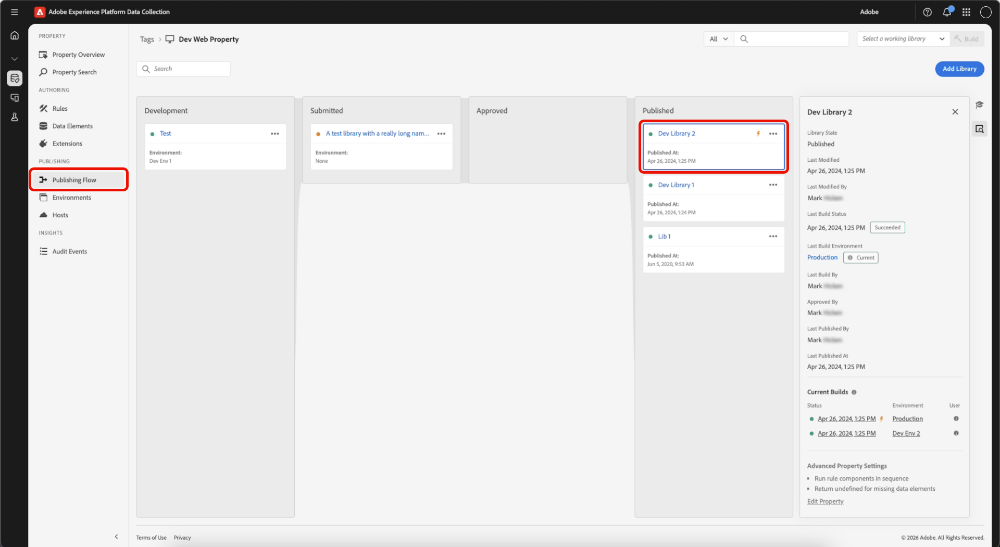
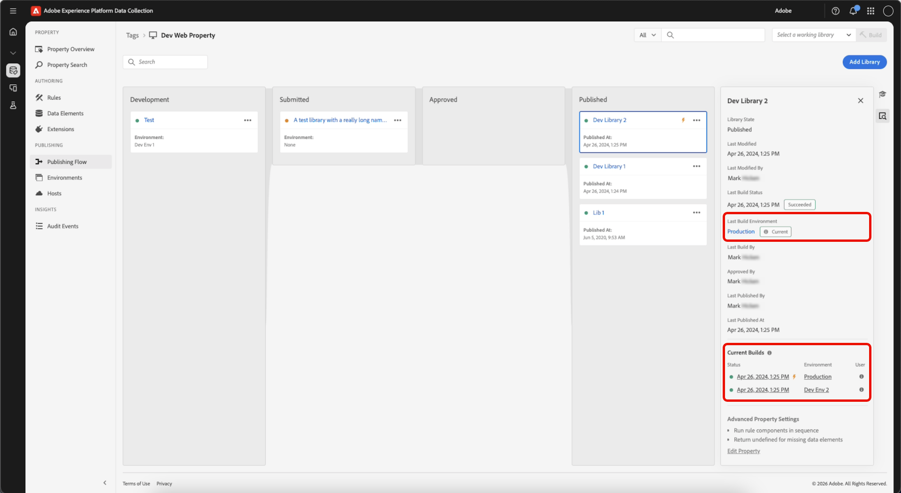

# Builds

Bei einem Build handelt es sich um eine Gruppe von Dateien, die sämtlichen Code enthalten, der auf dem Clientgerät ausgeführt wird.

Es ist eine Zusammenstellung der Änderungen, die Sie in Ihrer Bibliothek festgelegt haben, sowie aller zuvor eingereichten, genehmigten oder veröffentlichten Elemente.

Der Build besteht aus Client-seitigen Codedateien, die sich gegenseitig referenzieren. Diese Dateien werden mithilfe der Umgebung und des Hosts, den Sie für Ihre Bibliothek ausgewählt haben, an Ihren Hosting-Standort übertragen. Der Code, den Sie auf Ihrer Site bereitstellen, verweist auf denselben Speicherort, damit die Dateien geladen werden können, wenn ein Benutzer auf Ihre Site oder Anwendung zugreift.

## Dateiinhalte {#file-contents}

Eine Bibliothek definiert einen speziellen Satz von Tag-Ressourcen (Erweiterungen, Regeln und Datenelemente), die darin enthalten sein sollten.

Ein Build enthält den gesamten Modul-Code (von den Entwicklern der Erweiterung bereitgestellt) und die Konfiguration (von Ihnen eingegeben), die benötigt werden, um die in der Bibliothek enthaltenen Ressourcen zu generieren. Wenn eine Erweiterung beispielsweise Aktionen bereitstellt, die in Ihren Regeln nicht verwendet werden, ist der Code für die Durchführung dieser Aktionen nicht im Build enthalten.

Builds sind in die Hauptbibliotheksdatei und möglicherweise in viele kleinere Dateien unterteilt. Auf die Hauptbibliotheksdatei wird in Ihrem Einbettungs-Code verwiesen, und sie wird zur Laufzeit auf der Seite geladen. Sie enthält Folgendes:

* Regel-Engine
* Gesamte Erweiterungskonfiguration
* Gesamten Code und gesamte Konfiguration von Datenelementen
* Gesamten Code und gesamte Konfiguration von Regelereignissen
* Gesamten Code und gesamte Konfiguration von Bedingungen
* Ereigniscode und -konfiguration für sämtliche Regeln, die „Bibliothek geladen“ oder „Seitenende“ als Ereignis verwenden (da wir wissen, dass wir diese sofort benötigen).

Die kleineren Dateien enthalten den Code und die Konfiguration für einzelne Aktionen, die nach Bedarf auf der Seite geladen werden. Wenn eine Regel ausgelöst wird und ihre Bedingungen so ausgewertet werden, dass die Aktionen ausgeführt werden müssen, werden der erforderliche Code und die Konfiguration für die jeweilige Aktion aus einer der kleineren Dateien abgerufen. Das bedeutet, dass immer nur der Code auf der Seite geladen wird, der erforderlich ist, um die jeweiligen Aktionen durchzuführen. So wird die Hauptbibliothek möglichst klein gehalten.

## Dateiformat {#file-format}

Das Standarddateiformat für Builds ist ein Paket von Dateien, die den gesamten Code enthalten, damit Ihre Erweiterungen, Datenelemente und Regeln auf die gewünschte Weise ausgeführt werden können.

In bestimmten Fällen empfiehlt sich jedoch ein ZIP-Archiv der Dateien anstelle der ausführbaren Client-seitigen Codedatei. Beispiel: Ein Archiv ist sinnvoll, wenn Sie Ihren Build selbst hosten und den Build in einer anderen Bereitstellung verwenden möchten. Wenn Sie im Feld für den selbst gehosteten Pfad zur Bibliothek einen Wert angeben, können Sie Ihre Umgebung speichern. Neben Ihrem neuen Code wird ein Link zum archivierten Download verfügbar. Nachdem die Bibliothek erstellt wurde, haben Sie die Möglichkeit, eine ZIP-Datei auf Akamai bereitzustellen und sie von `assets.adobedtm.com/...` herunterzuladen.

>[!NOTE]
>
>An diesem Ort ist nichts vorhanden, bis Sie einen Build erstellen.

Unabhängig vom Dateiformat wird der Build immer an dem vom Host angegebenen Speicherort bereitgestellt.

Um einen Build abzuschließen, wählen Sie eine Bibliothek und die Build-Option aus, die auf dieser Ebene des Veröffentlichungsvorgangs verfügbar ist (Build für die Entwicklung, Build für das Staging...).

## Minimierung {#minification}

Durch Minimierung werden Bandbreitenkosten reduziert und die Geschwindigkeit erhöht, indem Daten, die nicht für die Ausführung erforderlich sind, aus der jeweiligen Datei entfernt werden.

Um die Leistung zu steigern, minimiert Experience Platform alles, einschließlich:

* Tag-Hauptbibliothek
* Modul-Code, der von den Entwicklern als Teil einer Erweiterung bereitgestellt wird
* Benutzerdefinierter Code, der von Experience Platform-Benutzern bereitgestellt wird

>[!NOTE]
>
>Wenn Ihr Modulcode und benutzerdefinierter Code bereits minimiert wurden, minimiert Experience Platform ihn erneut. Diese zweite Minimierung bietet keine zusätzlichen Vorteile, verursacht jedoch keinen Schaden und macht Experience Platform weniger komplex und leichter zu verwalten.

Jeder Client-seitige Code, der bereitgestellt wird, verweist auf die minimierte Version des Codes. Dies ist in den Dateinamen zu sehen, die der standardmäßigen Namenskonvention für minimierte Dateien entsprechen:

`launch-%environment_id%.min.js`

Wenn Sie den nicht minimierten Code sehen möchten, entfernen Sie „.min“ aus dem Dateinamen:

`launch-%environment_id%.js`

Wenn ein Erweiterungsentwickler minimierten Code mit seiner Erweiterung bereitstellt, stellt Experience Platform im nicht minimierten Build keinen nicht minimierten Code bereit. Wenn ein Experience Platform-Benutzer minimierten Code in ein Feld für benutzerspezifischen Code eingibt, wird dieser Code bei nicht minimierten Builds ebenfalls minimiert. Experience Platform hebt die Minimierung nicht auf.

Weitere Informationen zur Minimierung finden Sie in [diesem Stackpath-Artikel](https://blog.stackpath.com/glossary/minification/).

Beim Erstellen eines Builds wird zunächst die nicht minimierte Bibliothek erstellt. Daraufhin wird die gesamte Bibliothek gleichzeitig minimiert.

## Build-Details anzeigen {#build-details}

>[!IMPORTANT]
>
>Eine Bibliothek speichert Revisionen Ihrer Tag-Ressourcen, aber **Build** ist ein Point-in-Time-Schnappschuss dieser Bibliothek, der die Dateien enthält, die auf Ihrer Site bereitgestellt werden.

Auf Builds und Build-Details kann von einer **Bibliothek** oder einer **Umgebung“ zugegriffen werden** um aktuelle Live-Builds anzuzeigen und zu überprüfen, was ein Build enthält (Erweiterungen, Datenelemente und Regeln).

### Anzeigen von Build-Details aus einer Bibliothek

Öffnen Sie in der Tags-Eigenschaft den **[!UICONTROL Publishing Flow]** und wählen Sie eine Bibliothek aus.

Im Bedienfeld Details können Sie Folgendes überprüfen:

* **[!UICONTROL Last Build Environment]** - Link zur Umgebung, die den letzten Build erhalten hat. Gibt an, ob diese Bibliothek der aktuelle Build für diese Umgebung ist (**aktuell** oder **Nicht aktuell**).
* **[!UICONTROL Current Builds]** - Builds, die derzeit in ihrer Umgebung aktiv sind. Bei veröffentlichten Bibliotheken wird der Live-Produktions-Build in diesem Abschnitt durch das Blitzsymbol angezeigt.
* Für jeden aufgelisteten Build können Sie Folgendes anzeigen:
   * **[!UICONTROL Status]** - Zeitpunkt der Erstellung des Builds.
   * **[!UICONTROL Environment]** - Die Umgebung, in der der Build bereitgestellt wurde.
   * **[!UICONTROL User]** : Benutzer, der den Build erstellt hat.

### Anzeigen von Builds aus einer Umgebung

Ein Build ist mit einer Umgebung und der Bibliothek verknüpft, die in dieser Umgebung erstellt wurde. Der Build enthält die kompilierten Ressourcen.

Wählen Sie die **[!UICONTROL Environment]** im Detailbedienfeld aus. Im Bedienfeld „Umgebungsdetails“ finden Sie eine Liste der letzten Builds, den aktuellen Live-Build und zugehörige Bibliotheken.

Wählen Sie als Nächstes einen Build aus, um seine Details zu öffnen. Im Build-Detail werden **Erweiterungen**, **Datenelemente** und **Regeln** angezeigt.

>[!NOTE]
>
>Ein Build kann mehr als die in der Bibliothek aufgelisteten Ressourcen enthalten. Die **Erweiterungen**, **Datenelemente** und **Regeln** im Build enthalten die Inhalte der Bibliothek sowie der Upstream-Elemente. Es ist der vollständige Snapshot, der auf der Site oder in der App veröffentlicht wird.

Navigieren Sie im Bedienfeld Details zurück zum **[!UICONTROL Environment]** oder **[!UICONTROL Library]**.
