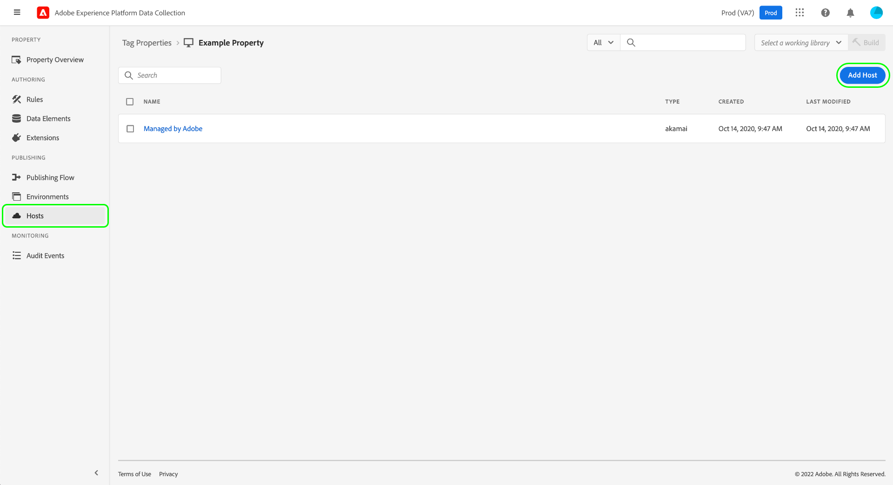
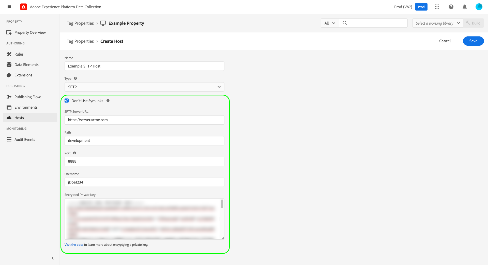

# SFTP-Hosts

>[!NOTE]
>
>Adobe Experience Platform Launch wurde als eine Suite von Datenerfassungstechnologien in Adobe Experience Platform umbenannt. Infolgedessen wurden in der gesamten Produktdokumentation mehrere terminologische Änderungen eingeführt. Eine konsolidierte Übersicht der terminologischen Änderungen finden Sie im folgenden [Dokument](../../../term-updates.md).

Mit Adobe Experience Platform können Sie Tag-Bibliotheks-Builds an einen gesicherten SFTP-Server übermitteln, den Sie hosten. So erhalten Sie mehr Kontrolle über die Speicherung und Verwaltung Ihrer Builds. In diesem Handbuch wird beschrieben, wie Sie einen SFTP-Host für eine Tag-Eigenschaft in der Datenerfassungs-Benutzeroberfläche einrichten.

>[!NOTE]
>
>Sie können auch einen Host verwenden, der stattdessen von Adobe verwaltet wird. Siehe Handbuch unter [Hosts, die von Adoben verwaltet werden](./managed-by-adobe-host.md) für weitere Informationen.
>
>Informationen zu den Vorteilen und Einschränkungen von Self-Hosting-Bibliotheken finden Sie in der [Handbuch zum selbstständigen Hosting](./self-hosting-libraries.md).

## Einrichten eines Zugriffsschlüssels für Ihren Server {#access-key}

Platform stellt mithilfe eines verschlüsselten Schlüssels eine Verbindung mit Ihrer SFTP-Site her. Es sind einige Schritte nötig, um dies korrekt einzurichten:

### Erstellen eines Schlüsselpaars aus öffentlichem/privatem Schlüssel

Auf Ihrem SFTP-Server muss ein öffentliches/privates Schlüsselpaar installiert sein. Sie können diese Schlüssel auf Ihrem Server erstellen oder woanders generieren und auf Ihrem Server installieren. Weitere Informationen finden Sie in der GitHub-Dokumentation zum [Generieren von SSH-Schlüsseln](https://help.github.com/articles/generating-a-new-ssh-key-and-adding-it-to-the-ssh-agent/#generating-a-new-ssh-key).

### Schlüssel verschlüsseln

Der private Schlüssel wird zum Verschlüsseln des öffentlichen Schlüssels verwendet. Sie müssen Ihren privaten Schlüssel während des Erstellungsprozesses des SFTP-Hosts angeben. Siehe Abschnitt zu [Verschlüsseln von Werten](../../../api/guides/encrypting-values.md) Anweisungen zum Verschlüsseln öffentlicher Schlüssel finden Sie im Reactor-API-Handbuch . Verwenden Sie den GPG-Schlüssel der Produktionsumgebung, sofern Sie nicht wissen, dass Sie einen bestimmten Schlüssel benötigen. Sie können Ihren privaten Schlüssel auf jedem beliebigen Computer verschlüsseln. Sie müssen GPG also nicht auf Ihrem Server installieren, um diesen Schritt abzuschließen.

### IP-Adressen der Zulassungsliste-Plattform

Möglicherweise müssen Sie eine Reihe von IP-Adressen genehmigen, die in Ihrer Unternehmensfirewall verwendet werden sollen, damit Platform Ihren SFTP-Server erreichen und eine Verbindung mit ihm herstellen kann. Diese IP-Adressen sind:

* `184.72.239.68`
* `23.20.85.113`
* `54.226.193.184`

>[!NOTE]
>
>Die Struktur der Tag-Builds hat sich im Laufe der Zeit geändert. Sie verwenden intern symbolische Links (Symlinks), um die Abwärtskompatibilität zu gewährleisten, sodass vorherige Einbettungs-Codes weiterhin mit der neuesten Build-Struktur funktionieren. Ihr SFTP-Server muss die Verwendung von Symlinks unterstützen, damit er ein gültiges Ziel für Tag-Builds ist.

Detaillierte Informationen finden Sie im folgenden Artikel von Medium zum [Einrichten von SFTP-Servern für die Bereitstellung eines Builds](https://medium.com/launch-by-adobe/configuring-an-sftp-server-for-use-with-adobe-launch-bc626027e5a6).

## Erstellen eines SFTP-Hosts {#create}

Wählen Sie in der Datenerfassungs-Benutzeroberfläche die Option **[!UICONTROL Hosts]** im linken Navigationsbereich, gefolgt von **[!UICONTROL Organisation hinzufügen]**.

Das Dialogfeld zur Hosterstellung wird angezeigt. Geben Sie einen Namen für den Host ein und unter **[!UICONTROL Typ]** auswählen **[!UICONTROL SFTP]**.

### Konfigurieren des SFTP-Hosts {#configure}

Das Dialogfeld wird um zusätzliche Konfigurationsoptionen für den SFTP-Host erweitert. Diese werden nachfolgend erläutert.

| Konfigurationsfeld | Beschreibung |
| --- | --- |
| [!UICONTROL Symlinks nicht verwenden] | Standardmäßig verwenden alle SFTP-Hosts symbolische Links (Symlinks), um auf die Bibliothek zu verweisen [builds](../builds.md) die auf dem Server gespeichert werden. Allerdings unterstützen nicht alle Server die Verwendung von Symlinks. Wenn diese Option ausgewählt ist, verwendet der Host einen Kopiervorgang, um die Build-Assets direkt zu aktualisieren, anstatt Symlinks zu verwenden. |
| [!UICONTROL SFTP-Server-URL] | Der URL-Basispfad für Ihren Server. |
| [!UICONTROL Path] | Der Pfad, der an die Basis-Server-URL für diesen Host angehängt werden soll. |
| [!UICONTROL Port] | Der Port muss einer der folgenden sein:<ul><li>`21`</li><li>`22`</li><li>`80`</li><li>`200-299`</li><li>`443`</li><li>`2000-2999`</li><li>`4343`</li><li>`8080`</li><li>`8888`</li></ul>Als Best Practice im Hinblick auf die Sicherheit beschränkt Adobe die Anzahl der Ports, die für den ausgehenden Datenverkehr verwendet werden können. Die ausgewählten Ports sind in der Regel über Unternehmens-Firewalls erlaubt und enthalten einige Bereiche für mehr Flexibilität. |
| [!UICONTROL Benutzername] | Der Benutzername, der beim Zugriff auf den Server verwendet werden soll. |
| [!UICONTROL Verschlüsselter privater Schlüssel] | Der verschlüsselte private Schlüssel, den Sie in einem [vorheriger Schritt](#access-key). |

Auswählen **[!UICONTROL Speichern]** , um den Host mit der ausgewählten Konfiguration zu erstellen.

Wenn Sie **[!UICONTROL Speichern]** auswählen, werden die Verbindung und die Möglichkeit getestet, die Dateien an Ihren SFTP-Server zu senden. Platform erstellt einen Ordner, schreibt eine Datei in diesen Ordner, prüft, ob die Datei vorhanden ist, und bereinigt sie dann nach sich selbst. Wenn das Benutzerkonto auf Ihrem SFTP-Server (der mit dem sicheren Zertifikat verbunden ist, das Sie für Platform bereitgestellt haben) nicht über die erforderlichen Berechtigungen zum Ausführen dieser Aktion verfügt, wird der Host in den Status &quot;Fehlgeschlagen&quot;versetzt.

## Nächste Schritte

In diesem Handbuch wurde beschrieben, wie Sie einen selbst gehosteten SFTP-Server für die Verwendung in Tags einrichten. Sobald der Host eingerichtet wurde, können Sie ihn mit einer oder mehreren Ihrer [Umgebungen](../environments.md) zum Veröffentlichen von Tag-Bibliotheken. Weitere Informationen zum allgemeinen Verfahren zum Aktivieren von Tag-Funktionen in Ihren Web- oder mobilen Eigenschaften finden Sie in der [Publishing-Übersicht](../overview.md).
