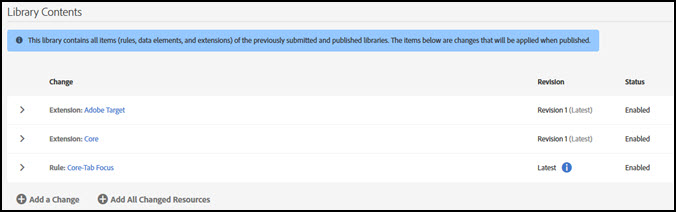

# Bibliotheken

>[!NOTE]
>
>Adobe Experience Platform Launch wurde als eine Suite von Datenerfassungstechnologien in Adobe Experience Platform umbenannt. Infolgedessen wurden in der gesamten Produktdokumentation mehrere terminologische Änderungen eingeführt. Eine konsolidierte Übersicht der terminologischen Änderungen finden Sie im folgenden [Dokument](../../term-updates.md).

Eine Bibliothek ist eine Reihe von Anweisungen, die spezifizieren, wie Erweiterungen, Datenelemente und Regeln nach deren Bereitstellung miteinander interagieren. Beim Erstellen einer Bibliothek geben Sie die Änderungen an, die Sie in Ihrer Bibliothek vornehmen möchten. Zum Zeitpunkt der Erstellung werden diese Änderungen mit allen Elementen kombiniert, die in früheren Bibliotheken übermittelt, genehmigt oder veröffentlicht wurden.

Bibliotheken beinhalten das Hinzufügen oder Entfernen von:

* Regeln
* Elementen
* Erweiterungskonfiguration

Bibliotheken müssen einer Umgebung zugewiesen werden, bevor sie in einen Build kompiliert werden können. Bibliotheken werden als Ganzes genehmigt oder abgelehnt. Sie können einzelne Elemente in einer Bibliothek nicht genehmigen oder ablehnen. Eine Bibliothek wechselt zwischen verschiedenen Umgebungen, während sie den Workflow zur Veröffentlichung durchläuft.

## eine Bibliothek erstellen {#create-a-library}

Um eine Bibliothek zu erstellen, führen Sie die folgenden Schritte aus.

1. Öffnen Sie die Registerkarte [!UICONTROL Veröffentlichung].

   Auf der Seite [!UICONTROL Veröffentlichen] werden die Entwicklungsbibliotheken aufgelistet und die Möglichkeiten geboten, sie zur Genehmigung einzureichen, zum Staging zu verschieben oder sie in der Produktion zu veröffentlichen.

1. Klicken Sie auf **[!UICONTROL Neue Bibliothek hinzufügen]**.

   

1. Benennen Sie die Bibliothek.
1. Weisen Sie die Bibliothek einer Entwicklungsumgebung zu.
1. Fügen Sie der Bibliothek eine Änderung hinzu.
Klicken Sie zum Hinzufügen eines Elements auf **[!UICONTROL Änderung hinzufügen]** und wählen Sie die Elemente aus, die Sie hinzufügen möchten. Jedes Element, das bearbeitet oder gelöscht wurde, kann der ausgewählten Bibliothek hinzugefügt werden.

   

   Sie können Ihrer Bibliothek Folgendes hinzufügen:

   * Regeln
   * Datenelemente
   * Erweiterungskonfigurationen

1. Um geänderte Ressourcen hinzuzufügen, wählen Sie **[!UICONTROL Alle geänderten Ressourcen hinzufügen]** aus.
1. Wählen Sie **[!UICONTROL Speichern]** oder **[!UICONTROL Speichern und für Entwicklung aufbauen]**.

   Beim Bereitstellen wird ein Build kompiliert und in der zugewiesenen Umgebung bereitgestellt.

Wählen Sie nach Erstellung einer Bibliothek das Dropdown-Menü für diese Bibliothek aus, um eine der folgenden Optionen auszuwählen:

* **Bearbeiten**: Mit dieser Option können Sie die Bibliothekskonfiguration ändern.

* **Build für Entwicklung**: Mit dieser Option wird ein Build kompiliert und in der zugewiesenen Umgebung bereitgestellt.

* **Zur Genehmigung einreichen**: Mit dieser Option kann die Bibliothek von einem Genehmiger in den nächsten Schritt im Veröffentlichungsprozess verschoben werden.

* **Löschen**: Mit dieser Option wird die aktuell ausgewählte Bibliothek aus dem Veröffentlichungsprozess entfernt.

## Hinzufügen zu einer Bibliothek {#add-to-a-library}

Um eine Bibliothek hinzuzufügen, führen Sie die folgenden Schritte aus.

1. Installieren Sie die [Erweiterungen](../managing-resources/extensions/overview.md), die Sie hinzufügen möchten.
1. Erstellen Sie die [Datenelemente](../managing-resources/data-elements.md) und Regeln, die Sie hinzufügen möchten.
1. Öffnen Sie die Registerkarte **[!UICONTROL Veröffentlichung]**.
1. Wählen Sie die zu ändernde [Bibliothek](libraries.md) aus und klicken Sie auf **[!UICONTROL Bearbeiten]**.
1. Verwenden Sie die Schaltflächen „Regeln“, „Datenelemente“ und „Erweiterungen“, um die Elemente auszuwählen, die Sie der Bibliothek hinzufügen möchten.
1. Speichern Sie die Änderungen.

Änderungen an der Bibliothek werden im Änderungsprotokoll der Bibliotheksinhalte angezeigt.

>[!NOTE]
>
>Datenelemente können von Erweiterungen abhängig sein. Regeln können von Datenelementen und Erweiterungen abhängig sein. Wenn Sie nicht alle erforderlichen Komponenten in Ihre Bibliothek aufnehmen, schlägt der Build zum Zeitpunkt der Erstellung fehl, und Sie müssen die erforderlichen Komponenten hinzufügen, bevor Sie einen erfolgreichen Build abschließen. In einer künftigen Version werden Abhängigkeiten überprüft, wenn Sie Änderungen an einer Bibliothek vornehmen.

## Entfernen aus einer Bibliothek

Um etwas aus einer Bibliothek zu entfernen, müssen Sie es deaktivieren und dann den deaktivierten Status veröffentlichen.

1. Deaktivieren Sie die zu entfernenden Erweiterungen sowie die Datenelemente und Regeln, die von diesen Erweiterungen abhängig sind.
1. Deaktivieren Sie die zu entfernenden Datenelemente und Regeln.
1. Öffnen Sie die Registerkarte **[!UICONTROL Veröffentlichung]**.
1. Wählen Sie die Bibliothek aus, die Sie ändern möchten.
1. Verwenden Sie die Schaltflächen „Regeln“, „Datenelemente“ und „Erweiterungen“, um die deaktivierten Elemente auszuwählen, die Sie aus der Bibliothek entfernen möchten.
1. Speichern Sie die Änderungen.

## Verwalten von Bibliotheksänderungen

Um Bibliotheksoptionen zu bearbeiten, führen Sie die folgenden Schritte aus.

1. Wählen Sie eine Bibliothek aus und klicken Sie auf **[!UICONTROL Bearbeiten]**, um Änderungen der Bibliothek anzuzeigen. Alle Änderungen werden in der Liste der [!UICONTROL Bibliotheksinhalte] angezeigt.

   

1. Klicken Sie auf die Änderung, die Sie anzeigen möchten, und wählen Sie eine Revision aus.

   

1. Wählen Sie aus, ob **alle** oder **geänderte** Artikel angezeigt werden sollen.
1. Wählen Sie die Revision aus und klicken Sie auf **[!UICONTROL Revision auswählen]**.
1. Wählen Sie entweder **[!UICONTROL Änderung hinzufügen]** oder **[!UICONTROL Alle geänderten Ressourcen hinzufügen]**.

## Aktive Bibliothek {#active-library}

Bibliotheken enthalten eine Reihe von Änderungen, die Sie an Ihrem bereitgestellten Code vornehmen möchten. Die aktive Bibliothek erleichtert dies, sodass Sie Änderungen schnell durchsuchen und sich die Auswirkungen ansehen können.

Erweiterungen, Regeln und Datenelemente können jetzt direkt in der Bibliothek gespeichert werden, an der Sie gerade arbeiten. Bei Bedarf kann aus der Dropdown-Liste [!UICONTROL Aktive Bibliothek] auch ein neuer Build oder sogar eine neue Bibliothek erstellt werden.

Die folgende Liste enthält weitere Informationen zum Verwalten einer aktiven Bibliothek.

1. [Erstellen Sie eine neue Bibliothek](libraries.md#create-a-library).
1. Navigieren Sie zu [Regeln](../managing-resources/rules.md), [Datenelemente](../managing-resources/data-elements.md) oder [Erweiterungen](../managing-resources/extensions/overview.md).
1. Wählen Sie Ihre aktive Bibliothek aus.
1. Nehmen Sie Ihre Änderungen vor, speichern Sie und erstellen Sie die Bibliothek.
1. Testen Sie Ihre Änderungen und wiederholen Sie diese Schritte nach Bedarf.
