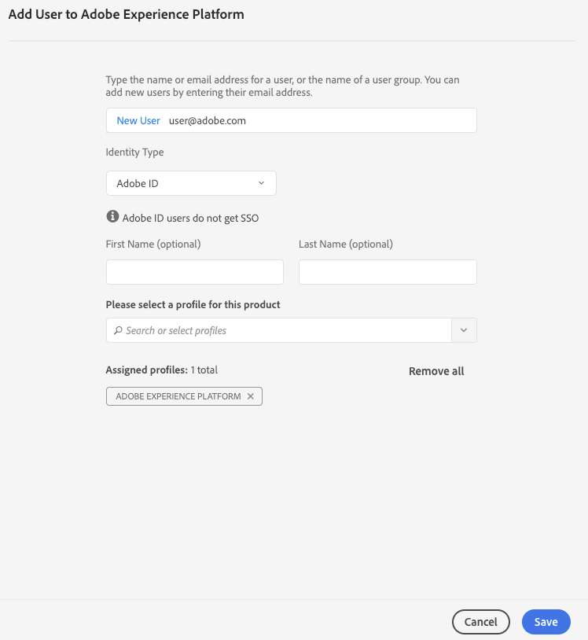

# Authentifizierung und Zugriff auf Experience Platform-APIs

Dieses Dokument bietet eine schrittweise Anleitung zum Zugriff auf ein Adobe Experience Platform Developer-Konto, um Aufrufe an Experience Platform-APIs durchzuführen.

## Authentifizierung für API-Aufrufe

Um die Sicherheit Ihrer Anwendungen und Benutzer zu gewährleisten, müssen alle Anforderungen an Adobe I/O-APIs mit Standards wie OAuth und JSON Web Tokens (JWT) authentifiziert und autorisiert werden. Die JWT wird dann zusammen mit kundenspezifischen Informationen verwendet, um Ihr persönliches Zugriffstoken zu generieren.

Dieses Lernprogramm beschreibt die Authentifizierungsschritte durch die Erstellung eines Zugriffstokens, das im folgenden Flussdiagramm dargestellt wird:


## Voraussetzungen

Für die erfolgreiche Ausführung von Aufrufen an Experience Platform-APIs benötigen Sie Folgendes:

* Eine IMS-Organisation mit Zugriff auf Adobe Experience Platform
* Ein registriertes Adoben ID-Konto
* Ein Produktadministrator, der Sie als **Entwickler** und als **Produktbenutzer** hinzufügt.

In den folgenden Abschnitten werden die Schritte zum Erstellen einer Adobe ID erläutert, um Entwickler und Benutzer für ein Unternehmen zu werden.

### Adobe ID erstellen

Wenn Sie keine Adobe ID haben, können Sie eine wie folgt erstellen:

1. Zur [Adobe Developer Console wechseln](https://console.adobe.io)
2. Klicken Sie auf **Neues Konto erstellen**
3. Anmeldevorgang abschließen

## Entwickler und Benutzer für die Experience Platform einer Organisation werden

Vor der Erstellung von Integrationen auf Adobe I/O muss Ihr Konto über Entwicklerberechtigungen für ein Produkt in einer IMS-Organisation verfügen. Ausführliche Informationen zu Entwicklerkonten auf der Admin Console finden Sie im [Support-Dokument](https://helpx.adobe.com/de/enterprise/using/manage-developers.html) für die Verwaltung von Entwicklern.

**Entwicklerzugriff erlangen**

Wenden Sie sich an einen Administrator in Ihrer Organisation, um Sie als Entwickler für eines der Produkte Ihrer Organisation mithilfe der [Admin Console](https://adminconsole.adobe.com/)hinzuzufügen.


Der Administrator muss Sie als Entwickler mindestens einem Produkt-Profil zuweisen, um fortfahren zu können.


Nachdem Sie als Entwickler zugewiesen wurden, haben Sie Zugriffsrechte, um Integrationen auf [Adobe I/O](https://www.adobe.com/go/devs_console_ui)zu erstellen. Bei diesen Integrationen handelt es sich um eine Pipeline von externen Apps und Diensten zur Adobe API.

**Benutzerzugriff sichern**

Ihr Produktadministrator muss Sie auch als Admin Console hinzufügen.


Ähnlich wie beim Hinzufügen eines Entwicklers muss der Administrator Sie mindestens einem Profil zuweisen, um fortfahren zu können.



## Erstellen von Zugriffsberechtigungen in der Adobe Developer Console

>[!NOTE] Wenn Sie diesem Dokument im [Privacy Service-Entwicklerhandbuch](../privacy-service/api/getting-started.md)folgen, können Sie jetzt zu diesem Handbuch zurückkehren, um die Zugriffsberechtigungen für Privacy Service zu generieren.

Mit Adobe Developer Console müssen Sie die folgenden drei Zugriffsberechtigungen generieren:

* `{IMS_ORG}`
* `{API_KEY}`
* `{ACCESS_TOKEN}`

Ihre `{IMS_ORG}` und `{API_KEY}` nur einmal generiert werden müssen und können in zukünftigen API-Aufrufen der Platform wiederverwendet werden. Ihre `{ACCESS_TOKEN}` Daten sind jedoch nur vorübergehend und müssen alle 24 Stunden neu generiert werden.

Die Schritte werden nachfolgend detailliert beschrieben.

### Einmalige Einrichtung

Wechseln Sie zur [Adobe Developer Console](https://www.adobe.com/go/devs_console_ui) und melden Sie sich bei Ihrer Adobe ID an. Führen Sie anschließend die Schritte aus, die im Lernprogramm zum [Erstellen eines leeren Projekts](https://www.adobe.io/apis/experienceplatform/console/docs.html#!AdobeDocs/adobeio-console/master/projects-empty.md) in der Dokumentation zur Adobe Developer Console beschrieben sind.

Nachdem Sie ein neues Projekt erstellt haben, klicken Sie im Bildschirm &quot; **[!UICONTROL Projektübersicht]** &quot;auf _Hinzufügen API_ .


Der _Hinzufügen eines API_ -Bildschirms wird angezeigt. Klicken Sie auf das Produktsymbol für die Adobe Experience Platform und wählen Sie dann die **[!UICONTROL Experience Platformen-API]** , bevor Sie auf **[!UICONTROL Weiter]** klicken.


Nachdem Sie die Experience Platform als API ausgewählt haben, die dem Projekt hinzugefügt werden soll, führen Sie die Schritte aus, die im Lernprogramm zum [Hinzufügen einer API zu einem Projekt mithilfe eines Dienstkontos (JWT)](https://www.adobe.io/apis/experienceplatform/console/docs.html#!AdobeDocs/adobeio-console/master/services-add-api-jwt.md) (beginnend mit dem Schritt &quot;API konfigurieren&quot;) beschrieben sind, um den Vorgang abzuschließen.

Nachdem die API zum Projekt hinzugefügt wurde, zeigt die Seite &quot; _Projektübersicht_ &quot;die folgenden Anmeldeinformationen an, die für alle Aufrufe der Experience Platform-APIs erforderlich sind:

* `{API_KEY}` (Client-ID)
* `{IMS_ORG}` (Organisations-ID)


### Authentifizierung für jede Sitzung

Die letzte erforderliche Berechtigung, die Sie erfassen müssen, ist Ihre `{ACCESS_TOKEN}`. Im Gegensatz zu den Werten für `{API_KEY}` und muss `{IMS_ORG}`alle 24 Stunden ein neues Token generiert werden, um weiterhin Platform-APIs verwenden zu können.

Um ein neues zu erstellen, führen Sie die Schritte `{ACCESS_TOKEN}`zum [Generieren eines JWT-Tokens](https://www.adobe.io/apis/experienceplatform/console/docs.html#!AdobeDocs/adobeio-console/master/credentials.md) im Handbuch mit den Anmeldeinformationen für die Developer Console aus.

## Zugriffsberechtigungen testen

Nachdem Sie alle drei erforderlichen Anmeldeinformationen gesammelt haben, können Sie versuchen, den folgenden API-Aufruf durchzuführen. Dieser Aufruf Liste alle Erlebnisdatenmodellklassen (XDM) innerhalb des `global` Containers der Schema-Registrierung:

**API-Format**

```http
GET /global/classes
```

**Anfrage**

```SHELL
curl -X GET https://platform.adobe.io/data/foundation/schemaregistry/global/classes \
  -H 'Accept: application/vnd.adobe.xed-id+json' \
  -H 'Authorization: Bearer {ACCESS_TOKEN}' \
  -H 'x-api-key: {API_KEY}' \
  -H 'x-gw-ims-org-id: {IMS_ORG}'
```

**Antwort**

Wenn Ihre Antwort der unten stehenden ähnelt, sind Ihre Anmeldeinformationen gültig und funktionieren. (Diese Antwort wurde aus Platzgründen abgeschnitten.)

```JSON
{
  "results": [
    {
        "title": "XDM ExperienceEvent",
        "$id": "https://ns.adobe.com/xdm/context/experienceevent",
        "meta:altId": "_xdm.context.experienceevent",
        "version": "1"
    },
    {
        "title": "XDM Individual Profile",
        "$id": "https://ns.adobe.com/xdm/context/profile",
        "meta:altId": "_xdm.context.profile",
        "version": "1"
    }
  ]
}
```

## Verwenden von Postman für JWT-Authentifizierung und API-Aufrufe

[Postman](https://www.getpostman.com/) ist ein beliebtes Werkzeug, um mit RESTful APIs zu arbeiten. Dieser [Mittlere Beitrag](https://medium.com/adobetech/using-postman-for-jwt-authentication-on-adobe-i-o-7573428ffe7f) beschreibt, wie Sie Postman so einrichten können, dass die JWT-Authentifizierung automatisch durchgeführt wird und damit Adobe Experience Platform-APIs verwendet werden.

## Nächste Schritte

Durch Lesen dieses Dokuments haben Sie Ihre Zugriffsberechtigungen für Platform-APIs gesammelt und erfolgreich getestet. Sie können nun die in der gesamten [Dokumentation](../landing/documentation/overview.md)bereitgestellten Beispiel-API-Aufrufe verwenden.

Zusätzlich zu den Authentifizierungswerten, die Sie in diesem Lernprogramm gesammelt haben, benötigen viele Platformen-APIs auch eine gültige Angabe, die als Kopfzeile bereitgestellt `{SANDBOX_NAME}` werden muss. See the [sandboxes overview](../sandboxes/home.md) for more information.