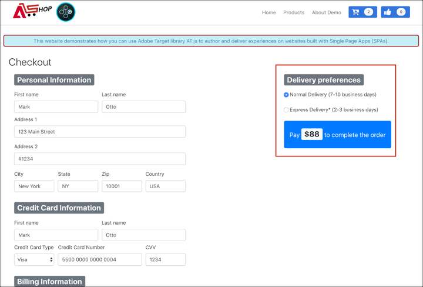
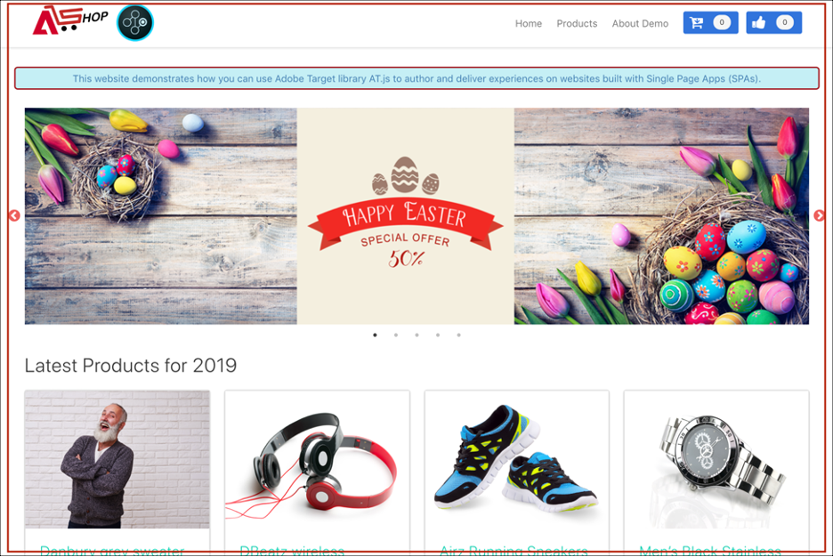

# Implementierung von Einzelseitenanwendungen

Adobe Experience Platform Web SDK bietet umfassende Funktionen, mit denen ein Unternehmen mithilfe von Client-seitigen Technologien wie Single Page Applications (SPAs) Personalisierungen der neuesten Generation ausführen kann.

Herkömmliche Websites arbeiteten nach dem „Page-to-Page“-Navigationsmodell, das auch als Multi Page Applications (SPA) bezeichnet wird, bei dem Website-Designs eng an URLs gekoppelt waren und der Übergang von einer Web-Seite zur anderen ein Laden der Seite erforderte.

Moderne Web-Anwendungen, wie z. B. Einzelseitenanwendungen, haben stattdessen ein Modell übernommen, das die schnelle Verwendung der Darstellung der Browser-Benutzeroberfläche unterstützt, die häufig unabhängig von Seitenneuladungen ist. Diese Erlebnisse können durch Kundeninteraktionen wie Scrollen, Klicks und Cursor-Bewegungen ausgelöst werden. Im Zuge der Weiterentwicklung der Paradigmen des modernen Internets funktioniert die Relevanz herkömmlicher generischer Ereignisse, wie z. B. des Seitenladevorgangs, für die Bereitstellung von Personalisierung und Experimenten nicht mehr.


## Vorteile von Experience Platform Web SDK für SPAs

Hier einige Vorteile bei einer Verwendung des Adobe Experience Platform Web SDK für Einzelseitenanwendungen:

* Möglichkeit zur Zwischenspeicherung aller Angebote beim Seitenladen, um mehrere Server-Aufrufe auf einen einzelnen Server-Aufruf zu reduzieren
* Drastische Verbesserung des Anwendererlebnisses auf Ihrer Site, da Angebote sofort über den Cache angezeigt werden, ohne dass durch herkömmliche Server-Aufrufe Latenzzeit gebraucht wird
* Eine einzelne Codezeile und ein einmaliges Entwicklersetup ermöglichen es Marketing-Experten, A/B- und Experience Targeting(XT)-Aktivitäten über Visual Experience Composer (VEC) in Ihrer SPA zu erstellen und auszuführen.

## XDM-Ansichten und Einzelseitenanwendungen

Der Adobe Target VEC für SPAs nutzt ein Konzept namens Ansichten: eine logische Gruppe visueller Elemente, die zusammen ein SPA-Erlebnis bilden. Ein Single Page Application kann daher basierend auf Benutzerinteraktionen als Übergang durch Ansichten anstelle von URLs betrachtet werden. Eine Ansicht kann in der Regel eine ganze Site oder gruppierte visuelle Elemente innerhalb einer Site darstellen.

Um näher zu erläutern, was Ansichten sind, wird im folgenden Beispiel eine hypothetische Online-E-Commerce-Site verwendet, die in React implementiert ist, um Beispielansichten zu erkunden.

Nachdem Sie zur Startseite navigiert sind, fördert ein Hero-Bild einen Osterverkauf sowie die neuesten Produkte, die auf der Website verfügbar sind. In diesem Fall kann eine Ansicht für den gesamten Startbildschirm definiert werden. Diese Ansicht kann einfach als „Home“ bezeichnet werden.


Wenn der Kunde sich mehr für die Produkte interessiert, die das Unternehmen verkauft, entscheidet er sich, auf den Link **Produkte** zu klicken. Ähnlich wie bei der Startseite kann die gesamte Produkt-Site als Ansicht definiert werden. Diese Ansicht kann als „products-all“ bezeichnet werden.


Da eine Ansicht als ganze Site oder als Gruppe visueller Elemente auf einer Site definiert werden kann, können die vier auf der Produkt-Site angezeigten Produkte gruppiert und als Ansicht betrachtet werden. Diese Ansicht kann als „Produkte“ bezeichnet werden.


Wenn der Kunde beschließt, auf die Schaltfläche **Mehr laden** zu klicken, um weitere Produkte auf der Website zu erkunden, ändert sich in diesem Fall die Website-URL nicht. Es kann jedoch hier eine Ansicht erstellt werden, die nur die zweite Zeile der angezeigten Produkte darstellt. Der Name der Ansicht kann „products-page-2“ lauten.


Die Kundin oder der Kunde möchte einige Produkte von der Seite kaufen und fährt mit dem Checkout-Bildschirm fort. Auf der Checkout-Website erhält der Kunde Optionen, um einen normalen Versand oder einen Expressversand auszuwählen. Eine Ansicht kann eine beliebige Gruppe visueller Elemente auf einer Website sein, sodass eine Ansicht für Versandvoreinstellungen erstellt und als „Versandvoreinstellungen“ bezeichnet werden kann.



Das Konzept der Ansichten kann noch viel weiter ausgedehnt werden. Dies sind nur einige Beispiele für Ansichten, die auf einer Site definiert werden können.

## Implementieren von XDM-Ansichten

XDM-Ansichten können in Adobe Target genutzt werden, um es Marketing-Experten zu ermöglichen, A/B- und XT-Tests auf SPAs über den Visual Experience Composer durchzuführen. Dazu müssen auf Entwicklerseite die folgenden Schritte ausgeführt werden, um ein einmaliges Setup abzuschließen:

1. [Adobe Experience Platform Web SDK installieren](/help/web-sdk/install/overview.md)
2. Bestimmen Sie alle XDM-Ansichten in Ihrer Einzelseitenanwendung, die Sie personalisieren möchten.
3. Implementieren Sie nach dem Definieren der XDM-Ansichten die `sendEvent()`-Funktion mit `renderDecisions` auf `true` und der entsprechenden XDM-Ansicht in Ihrer Einzelseitenanwendung, um AB- oder XT-VEC-Aktivitäten bereitzustellen. Die XDM-Ansicht muss in `xdm.web.webPageDetails.viewName` übergeben werden. In diesem Schritt können Marketing-Experten Visual Experience Composer nutzen, um A/B- und XT-Tests für diese XDM-Dateien zu starten.

   ```javascript
   alloy("sendEvent", { 
     "renderDecisions": true, 
     "xdm": { 
       "web": { 
         "webPageDetails": { 
         "viewName":"home" 
         }
       } 
     } 
   });
   ```

>[!NOTE]
>
>Beim ersten `sendEvent()`-Aufruf werden alle XDM-Ansichten, die für den Endbenutzer gerendert werden sollen, abgerufen und zwischengespeichert. Nachfolgende `sendEvent()` mit übergebenen XDM-Ansichten werden aus dem Cache gelesen und ohne einen Server-Aufruf gerendert.

## `sendEvent()`-Funktionsbeispiele

In diesem Abschnitt werden drei Beispiele beschrieben, die zeigen, wie die `sendEvent()`-Funktion in React für eine hypothetische E-Commerce-SPA aufgerufen wird.

### Beispiel 1: Startseite eines A/B-Tests

Das Marketing-Team möchte A/B-Tests auf der gesamten Startseite durchführen.



So können A/B-Tests auf der gesamten Startseite durchgeführt werden: `sendEvent()` muss aufgerufen werden, während der XDM-`viewName` auf `home` eingestellt ist:

```jsx
function onViewChange() { 
  
  var viewName = window.location.hash; // or use window.location.pathName if router works on path and not hash 

  viewName = viewName || 'home'; // view name cannot be empty 

  // Sanitize viewName to get rid of any trailing symbols derived from URL 

  if (viewName.startsWith('#') || viewName.startsWith('/')) { 
    viewName = viewName.substr(1); 
  }
   
  alloy("sendEvent", { 
    "renderDecisions": true, 
    "xdm": { 
      "web": { 
        "webPageDetails": { 
          "viewName":"home" 
        } 
      } 
    }
  }); 
} 

// react router v4 

const history = syncHistoryWithStore(createBrowserHistory(), store); 

history.listen(onViewChange); 

// react router v3 

<Router history={hashHistory} onUpdate={onViewChange} > 
```

### Beispiel 2: Personalisierte Produkte

Das Marketing-Team möchte die zweite Produktreihe personalisieren, indem die Farbe des Preisschilds nach dem Klicken auf „Mehr laden **in Rot** wird.


```jsx
function onViewChange(viewName) { 

  alloy("sendEvent", { 
    "renderDecisions": true, 
    "xdm": { 
      "web": { 
        "webPageDetails": { 
          "viewName": viewName
        }
      } 
    } 
  }); 
} 

class Products extends Component { 
  
  render() { 
    return ( 
      <button type="button" onClick={this.handleLoadMoreClicked}>Load more</button> 
    ); 
  } 

  handleLoadMoreClicked() { 
    var page = this.state.page + 1; // assuming page number is derived from component's state 
    this.setState({page: page}); 
    onViewChange('PRODUCTS-PAGE-' + page); 
  } 

} 
```

### Beispiel 3: Voreinstellungen für den A/B-Test-Versand

Das Marketing-Team möchte einen A/B-Test durchführen, um zu sehen, ob das Ändern der Farbe der Schaltfläche von Blau in Rot bei **Express-Versand** Konversionen steigern kann (im Gegensatz dazu, die Farbe der Schaltfläche für beide Versandoptionen blau zu halten).


Um Inhalte auf der Website je nach ausgewählter Versandvoreinstellung zu personalisieren, kann für jede Versandvoreinstellung eine Ansicht erstellt werden. Wenn **Normaler Versand** ausgewählt ist, kann die Ansicht als „Checkout-Normal“ bezeichnet werden. Wenn **Express-Versand** ausgewählt ist, kann die Ansicht „Checkout-Express“ genannt werden.

```jsx
function onViewChange(viewName) { 
  alloy("sendEvent", { 
    "renderDecisions": true, 
    "xdm": { 
      "web": { 
        "webPageDetails": { 
          "viewName": viewName 
        }
      }
    }
  }); 
} 

class Checkout extends Component { 

  render() { 
    return ( 
      <div onChange={this.onDeliveryPreferenceChanged}> 
        <label> 
          <input type="radio" id="normal" name="deliveryPreference" value={"Normal Delivery"} defaultChecked={true}/> 
          <span> Normal Delivery (7-10 business days)</span> 
        </label> 
        <label> 
          <input type="radio" id="express" name="deliveryPreference" value={"Express Delivery"}/> 
          <span> Express Delivery* (2-3 business days)</span> 
        </label> 
      </div> 
    ); 
  } 

  onDeliveryPreferenceChanged(evt) { 
    var selectedPreferenceValue = evt.target.value; 
    onViewChange(selectedPreferenceValue); 
  } 

} 
```

## Verwenden des Visual Experience Composer für eine SPA

Wenn Sie mit der Definition Ihrer XDM-Ansichten und der Implementierung von `sendEvent()` mit den übergebenen XDM-Ansichten fertig sind, kann der VEC diese Ansichten erkennen und Benutzern ermöglichen, Aktionen und Änderungen für A/B- oder XT-Aktivitäten zu erstellen.

>[!NOTE]
>
>Um VEC für Ihre SPA zu verwenden, müssen Sie entweder die VEC Helper-Erweiterung [Firefox](https://addons.mozilla.org/en-US/firefox/addon/adobe-target-vec-helper/) oder [Chrome](https://chrome.google.com/webstore/detail/adobe-target-vec-helper/ggjpideecfnbipkacplkhhaflkdjagak) installieren und aktivieren.

### Bedienfeld „Änderungen“

Das Bedienfeld Änderungen erfasst die für eine bestimmte Ansicht erstellten Aktionen. Alle Aktionen für eine Ansicht sind unter dieser Ansicht gruppiert.


### Aktionen

Durch Klicken auf eine Aktion wird das Element auf der Site hervorgehoben, auf die diese Aktion angewendet wird. Jede VEC-Aktion, die unter einer Ansicht erstellt wird, verfügt über **Symbole:**, **Bearbeiten**, **Klonen**, **Verschieben** und **Löschen**. Diese Symbole werden in der folgenden Tabelle detaillierter erläutert.


| Symbol | Beschreibung |
|---|---|
| Information | Zeigt die Details der Aktion an. |
| Bearbeiten | Ermöglicht die direkte Bearbeitung der Eigenschaften der Aktion. |
| Klonen | Klonen Sie die Aktion in eine oder mehrere Ansichten, die im Bedienfeld Änderungen vorhanden sind, oder in eine oder mehrere Ansichten, die Sie im VEC durchsucht und aufgerufen haben. Die Aktion muss nicht unbedingt im Bedienfeld Änderungen vorhanden sein.<br/><br/>**Hinweis:** Nachdem ein Klonvorgang durchgeführt wurde, müssen Sie über Durchsuchen zur Ansicht im VEC navigieren, um zu sehen, ob die geklonte Aktion ein gültiger Vorgang war. Wenn die Aktion nicht auf die Ansicht angewendet werden kann, wird ein Fehler angezeigt. |
| Verschieben | Verschiebt die Aktion in ein Seitenladeereignis oder eine andere Ansicht, die bereits im Bedienfeld Änderungen vorhanden ist.<br/><br/>**Seitenladeereignis** Alle Aktionen, die dem Seitenladeereignis entsprechen, werden beim ersten Laden der Seite Ihrer Web-Anwendung angewendet. <br/><br/>**Hinweis:** Nachdem ein Verschiebevorgang durchgeführt wurde, müssen Sie über Durchsuchen zur Ansicht im VEC navigieren, um zu sehen, ob der Verschiebevorgang gültig war. Wenn die Aktion nicht auf die Ansicht angewendet werden kann, wird ein Fehler angezeigt. |
| Löschen | Löscht die Aktion. |

## Beispiele für die Verwendung von VEC für SPAs

In diesem Abschnitt werden drei Beispiele für die Verwendung von Visual Experience Composer zum Erstellen von Aktionen und Änderungen für A/B- oder XT-Aktivitäten beschrieben.

### Beispiel 1: Aktualisieren der Ansicht „Startseite“

Zuvor in diesem Dokument wurde eine Ansicht mit dem Namen „Startseite“ für die gesamte Startseite definiert. Das Marketing-Team möchte nun die Ansicht „Startseite“ wie folgt aktualisieren:

* Ändern Sie die **Zum Warenkorb hinzufügen** und **Wie** in einen helleren Anteil von Blau. Dies sollte beim Laden der Seite passieren, da dazu das Ändern von Komponenten der Kopfzeile gehört.
* Ändern Sie das **Neueste Produkte für 2019**-Label in **Heißeste Produkte für 2019** und ändern Sie die Textfarbe in Lila.

Um diese Aktualisierungen in VEC vorzunehmen, wählen Sie **Erstellen** und wenden Sie diese Änderungen auf die Ansicht „Startseite“ an.


### Beispiel 2: Ändern von Produktbeschriftungen

Für die Ansicht „products-page-2“ möchte das Marketing-Team die Beschriftung **Preis** in **Verkaufspreis** ändern und die Beschriftungsfarbe in Rot ändern.

Um diese Aktualisierungen in VEC vorzunehmen, sind die folgenden Schritte erforderlich:

1. Wählen Sie **VEC** Durchsuchen) aus.
2. Wählen **Produkte** in der oberen Navigation der Site aus.
3. Wählen Sie **Mehr laden** einmal aus, um die zweite Zeile mit Produkten anzuzeigen.
4. Wählen Sie **VEC** Erstellen) aus.
5. Wenden Sie Aktionen an, um das Textfeld in **Verkaufspreis** und die Farbe in Rot zu ändern.


### Beispiel 3: Stil der Versandeinstellungen personalisieren

Ansichten können auf einer granularen Ebene definiert werden, z. B. als Status oder eine Option über ein Optionsfeld. Zuvor in diesem Dokument wurden Ansichten für Versandvoreinstellungen, „Checkout-Normal“ und „Checkout-Express“ definiert. Das Marketing-Team möchte die Farbe der Schaltfläche für die Ansicht „Checkout-Express“ in Rot ändern.

Um diese Aktualisierungen in VEC vorzunehmen, sind die folgenden Schritte erforderlich:

1. Wählen Sie **VEC** Durchsuchen) aus.
2. Fügen Sie Produkte zum Warenkorb auf der Website hinzu.
3. Wählen Sie das Warenkorb -Symbol in der oberen rechten Ecke der Site aus.
4. Wählen Sie **Bestellung**.
5. Wählen Sie das **Express-Versand** unter **Versandeinstellungen** aus.
6. Wählen Sie **VEC** Erstellen) aus.
7. Ändern Sie die Farbe **Schaltfläche** Pay) in Rot.

>[!NOTE]
>
>Die Ansicht „Checkout-Express“ wird erst dann im Bedienfeld Änderungen angezeigt, wenn das Optionsfeld **Express-Versand** ausgewählt ist. Dies liegt daran, dass die `sendEvent()`-Funktion ausgeführt wird, wenn die Optionsschaltfläche **Express-Versand** ausgewählt ist. Daher erkennt der VEC die Ansicht „Checkout-Express“ erst, wenn die Optionsschaltfläche ausgewählt ist.


