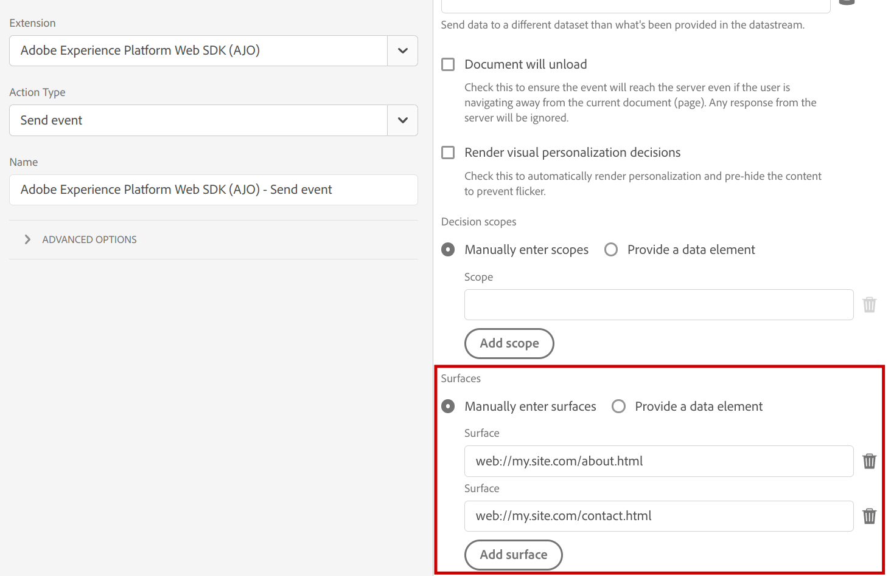
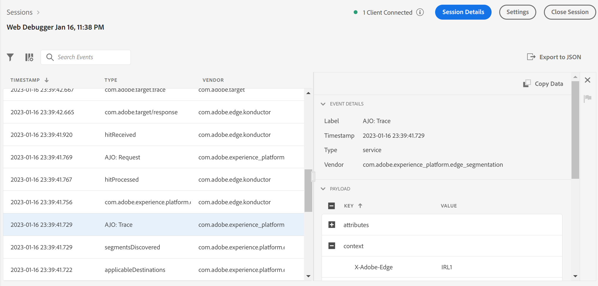

# Verwenden von [!DNL Adobe Journey Optimizer] mit dem [!DNL Experience Platform Web SDK]

[!DNL Adobe Experience Platform] [!DNL Web SDK] können personalisierte Erlebnisse bereitstellen und rendern, die in [!DNL Adobe Journey Optimizer] für den Web-Kanal verwaltet werden. Sie können einen WYSIWYG-Editor, [!DNL Adobe Journey Optimizer] [Webkanal](https://experienceleague.adobe.com/docs/journey-optimizer/using/web/create-web.html?lang=de) oder eine nicht visuelle Schnittstelle, den [Code-basierten Erlebniskanal](https://experienceleague.adobe.com/de/docs/journey-optimizer/using/code-based-experience/get-started-code-based) verwenden, um Ihre [!DNL Journey Optimizer Web] Kampagnen und Personalisierungserlebnisse zu erstellen, zu aktivieren und bereitzustellen.

>[!IMPORTANT]
>
>Lesen Sie die Dokumentation zum [Adobe Journey Optimizer](https://experienceleague.adobe.com/docs/journey-optimizer/using/web/get-started-web.html?lang=de)Webkanal, um Informationen zu den ersten Schritten bei der Erstellung und Berichterstellung für [!DNL Journey Optimizer Web] zu erhalten.

## Terminologie {#terminology}

**[!UICONTROL Oberfläche]**: Eine Web-Oberfläche ist eine Web-Seite oder ein Speicherort auf einer Seite, die durch einen URI identifiziert wird, auf dem der Inhalt des [!DNL Adobe Journey Optimizer] Erlebnisses bereitgestellt wird.

**[!UICONTROL Vorschläge]**: In [!DNL Adobe Journey Optimizer] korrelieren Vorschläge mit dem aus einer [!DNL Journey Optimizer Campaign] ausgewählten Erlebnis.

## Aktivieren von [!DNL Adobe Journey Optimizer] {#enable-ajo}

Gehen Sie wie folgt vor, um mit der Verwendung von [!DNL Adobe Journey Optimizer] zu beginnen.

1. Gehen Sie über die [Voraussetzungen](https://experienceleague.adobe.com/docs/journey-optimizer/using/web/create-web.html?lang=de#prerequesites) im [!DNL Adobe Journey Optimizer]Handbuch [Web-Erlebnisse](https://experienceleague.adobe.com/docs/journey-optimizer/using/web/create-web.html?lang=de), insbesondere:
   * Einrichten von [!DNL Adobe Experience Cloud Visual Editing Helper].
   * Aktivieren Sie [!DNL Adobe Journey Optimizer] in Ihrem [Datenstrom](../../../datastreams/overview.md).
   * Aktivieren Sie die [!UICONTROL Zusammenführungsrichtlinie Active-On-Edge].

2. Fügen Sie den Ereignissen die Option `renderDecisions` hinzu. Legen Sie `renderDecisions` auf `true` fest, um die von Journey Optimizer bereitgestellten Inhaltsvorschläge auf Ihren Web-Seitenoberflächen automatisch zu rendern.

   ```javascript
   alloy("sendEvent", {
       ...,
       "renderDecisions": true
   })
   ```

3. Geben Sie optional zusätzliche Oberflächen in Ihren Ereignissen an. Standardmäßig generiert die Web-SDK automatisch die Web-Oberfläche für die aktuelle Web-Seite und nimmt sie in die Anfrage an die Edge Network auf. Bei Bedarf können zusätzliche Oberflächen in die Anfrage eingeschlossen werden, indem Sie diese in der `personalization.surfaces`-Option des `sendEvent`-Befehls oder in der entsprechenden **[!UICONTROL Oberflächen]** [[!UICONTROL Ereignis senden]-](../../../tags/extensions/client/web-sdk/action-types.md#send-event) der Web SDK-Erweiterung angeben.

   ```javascript
   alloy("sendEvent", {
       ...
       "personalization": {
           "surfaces": [ "web://my.site.com/about.html", "web://my.site.com/contact.html" ]
       }
   })
   ```

   

   Ereignisoberflächen sind im Feld `query.personalization.surfaces` enthalten:

   ```json
   {
   "events": [
       {
           "query": {
               "personalization": {
               "schemas": [
                   ...
               ],
               "decisionScopes": [
                   "__view__"
               ],
               "surfaces": [
                   "web://ajostage.weebly.com/"
               ]
               }
           },
           ...
       }
   ]
   }
   ```

4. Ähnlich wie bei anderen Personalisierungsfunktionen können Sie ein Snippet hinzufügen **[das](../manage-flicker.md)** ausblendet, um beim Abrufen von Erlebnissen nur bestimmte Teile der Seite auszublenden.

## Erstellen von Adobe Journey Optimizer Web-Erlebnissen {#create-ajo-web-experiences}

Befolgen Sie die [Bearbeiten von Web](https://experienceleague.adobe.com/docs/journey-optimizer/using/web/create-web.html?lang=de#create-web-campaign)Kampagnen[!DNL Adobe Journey Optimizer] Anweisungen im [Handbuch zu Web-](https://experienceleague.adobe.com/docs/journey-optimizer/using/web/create-web.html?lang=de), um [!DNL Journey Optimizer Web] Kampagnen und Erlebnisse zu erstellen.

## Rendern von personalisiertem Inhalt {#rendering-personalized-content}

Weitere Informationen finden Sie in der Dokumentation [&#x200B; Rendern &#x200B;](../rendering-personalization-content.md) Personalisierungsinhalten .

Adobe Journey Optimizer-Vorschläge für Web-Oberflächen werden ähnlich wie die Vorschläge für den `__view__` Entscheidungsumfang verarbeitet. Wenn `renderDecisions` Option im `sendEvent`-Befehl auf `true` festgelegt ist, werden diese automatisch von der Web-SDK gerendert.

Journey Optimizer-Beispielinhaltsvorschlag:

```json
{
    "scope": "web://ajostage.weebly.com/",
    "scopeDetails": {
        "correlationID": "ccfaf19c-6360-4aea-b464-0cf924db5da7",
        "characteristics": {
            "eventToken": "eyJtZXNzYWdlRXhlY3V0aW9uIjp7Im1lc3NhZ2VFeGVjdXRpb25JRCI6ImEzNDYxYTMzLTc5MjktNGQyNS1hNmMxLTVkYzM2YWY1NzRmMyIsIm1lc3NhZ2VJRCI6ImNjZmFmMTljLTYzNjAtNGFlYS1iNDY0LTBjZjkyNGRiNWRhNyIsIm1lc3NhZ2VUeXBlIjoibWFya2V0aW5nIiwiY2FtcGFpZ25JRCI6IjEzN2JmMzllLWM1ODgtNGI1My1iODQxLTJiMWZiZDYxM2JkYiIsImNhbXBhaWduVmVyc2lvbklEIjoiMTA1NzY1MmEtZWYwNS00YjE3LWExMmUtY2FlOTQyOTFhMWFjIiwiY2FtcGFpZ25BY3Rpb25JRCI6ImViNTlmODQ4LTk5ZDYtNGE1OC05YmU4LTk4MjIxODU0NmYzNiIsIm1lc3NhZ2VQdWJsaWNhdGlvbklEIjoiYzg2NzFjZmItNDdjYS00YTVjLTg4Y2YtNzYwZDFlZjU1MzQyIn0sIm1lc3NhZ2VQcm9maWxlIjp7ImNoYW5uZWwiOnsiX2lkIjoiaHR0cHM6Ly9ucy5hZG9iZS5jb20veGRtL2NoYW5uZWxzL3dlYiIsIl90eXBlIjoiaHR0cHM6Ly9ucy5hZG9iZS5jb20veGRtL2NoYW5uZWwtdHlwZXMvd2ViIn0sIm1lc3NhZ2VQcm9maWxlSUQiOiI2YTViY2I3ZC02MmYxLTQ5NDItODRkMC02MzE5ZjM5Zjk1ZGUifX0="
        },
        "decisionProvider": "AJO",
        "activity": {
            "id": "137bf39e-c588-4b53-b841-2b1fbd613bdb#eb59f848-99d6-4a58-9be8-982218546f36"
        }
    },
    "id": "002321c0-dff5-4153-b171-a9dfb70b9750",
    "items": [
        {
            "schema": "https://ns.adobe.com/personalization/dom-action",
            "data": {
                "uiData": {
                    "tagType": "Text",
                    "actionType": "changed"
                },
                "content": "Welcome AJO!",
                "prehidingSelector": "#wsite-content > DIV:nth-of-type(2) > DIV:nth-of-type(1) > DIV:nth-of-type(1) > DIV:nth-of-type(1) > DIV:nth-of-type(1) > DIV:nth-of-type(3) > FONT:nth-of-type(1) > SPAN:nth-of-type(1)",
                "type": "setHtml",
                "selector": "#wsite-content > DIV.wsite-section-wrap:eq(1) > DIV.wsite-section:eq(0) > DIV.wsite-section-content:eq(0) > DIV.container:eq(0) > DIV.wsite-section-elements:eq(0) > DIV.paragraph:eq(0) > FONT:nth-of-type(1) > SPAN:nth-of-type(1)"
            },
            "id": "0a522f66-9e6a-4ded-b1d0-e9167f103290"
        },
        {
            "schema": "https://ns.adobe.com/personalization/dom-action",
            "data": {
                "uiData": {
                    "tagType": "Text",
                    "actionType": "changed"
                },
                "content": {
                    "font-weight": "bold"
                },
                "prehidingSelector": "#wsite-content > DIV:nth-of-type(2) > DIV:nth-of-type(1) > DIV:nth-of-type(1) > DIV:nth-of-type(1) > DIV:nth-of-type(1) > DIV:nth-of-type(3) > FONT:nth-of-type(1) > SPAN:nth-of-type(1)",
                "type": "setStyle",
                "selector": "#wsite-content > DIV.wsite-section-wrap:eq(1) > DIV.wsite-section:eq(0) > DIV.wsite-section-content:eq(0) > DIV.container:eq(0) > DIV.wsite-section-elements:eq(0) > DIV.paragraph:eq(0) > FONT:nth-of-type(1) > SPAN:nth-of-type(1)"
            },
            "id": "66216ca5-5d0f-4239-a8c8-6bc4a5a7cbdb"
        }
    ]
}
```

## Debugging {#debugging}

Verwenden Sie zum Debuggen von Adobe Journey Optimizer-Personalisierungsimplementierungen [Web SDK-Debugging](/help/web-sdk/use-cases/debugging.md). [!DNL Adobe Journey Optimizer] Debug-Traces sind bei der Fehlerbehebung mit [[!DNL Adobe Experience Platform Assurance]](https://developer.adobe.com/client-sdks/documentation/platform-assurance/) verfügbar. Suchen Sie nach Ereignissen mit dem Präfix `AJO:` .


