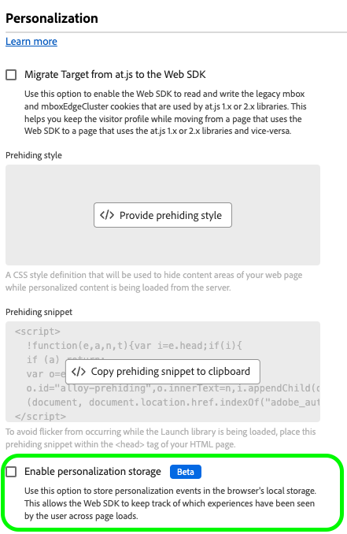

# Konfigurieren der Web-In-App-Messaging-Unterstützung in Web SDK

In-App-Nachrichten sind Benachrichtigungen, die Sie an Benutzer innerhalb Ihrer Web-Anwendung senden können und sie zu bestimmten Punkten von Interesse führen.

Sie können diese Benachrichtigungen für verschiedene Zwecke verwenden, z. B. zur Förderung neuer Funktionen, zur Präsentation von Sonderangeboten oder zur Erleichterung des Onboardings von Benutzenden.

Mithilfe von In-App-Nachrichten können Sie effektiv mit Ihrer Zielgruppe interagieren und sie auf wichtige Aspekte Ihrer Anwendung lenken.

>[!IMPORTANT]
>
>Web-In-App-Messaging ist eine Funktion von [Adobe Journey Optimizer](https://experienceleague.adobe.com/docs/journey-optimizer/using/ajo-home.html?lang=de) die die Web-SDK verwendet, um die personalisierten Inhalte bereitzustellen.
>
>Detaillierte Anweisungen zum Konfigurieren Ihrer Web-In-App-Messaging-Kampagne finden Sie in der [Adobe Journey Optimizer-Dokumentation](https://experienceleague.adobe.com/docs/journey-optimizer/using/in-app/create-in-app-web.html?lang=de).


## Voraussetzungen {#prerequisites}

### Web SDK-Tag-Erweiterungsversion {#extension-version}

Für die Web-In-App-Messaging-Funktion ist die neueste Version der Tag-Erweiterung von Web SDK erforderlich.

### Konfigurieren eines CSP für Web-In-App-Messaging {#csp}

Beim Konfigurieren von [Web-In-App](../personalization/web-in-app-messaging.md)Messaging) müssen Sie die folgende Anweisung in Ihr CSP aufnehmen:

```
default-src  blob:;
```

Weitere Informationen zum Konfigurieren eines CSP finden Sie in der [entsprechenden Dokumentation](../use-cases/configuring-a-csp.md).

## Konfigurieren von Web-In-App-Nachrichten mit der Tag-Erweiterung „Web SDK&quot; {#tag-extension}

Auf der Seite [Konfiguration von Web SDK-Tag-Erweiterungen](../../tags/extensions/client/web-sdk/web-sdk-extension-configuration.md) erfahren Sie, wo Sie die unten beschriebenen Einstellungen finden.

SDK Nachdem Sie die Tag[Erweiterung &quot;](../../tags/extensions/client/web-sdk/web-sdk-extension-configuration.md#install-the-web-sdk-tag-extension)&quot; installiert haben, führen Sie die folgenden Schritte aus, um die Erweiterung für Web-In-App-Nachrichten zu konfigurieren.

Aktivieren Sie im Abschnitt **[!UICONTROL Personalization]** die Option **[!UICONTROL Personalisierungsspeicher aktivieren]**. Mit dieser Option kann Web SDK verfolgen, welche Erlebnisse der Benutzer über Seitenladevorgänge hinweg gesehen hat.




Web-In-App-Messaging unterstützt zwei Typen von Triggern:

* [Senden von Daten an Experience Platform](#send-data-platform)
* [Manuelles Auslösen der Nachrichten](#manual-trigger)

Anhand der folgenden Abschnitte können Sie die Tag-Erweiterung „Web SDK&quot; entsprechend den gewünschten Triggern konfigurieren.

### Konfigurationsschritte für den Trigger **[!UICONTROL Daten an Experience Platform senden]** {#send-data-platform}

Wählen Sie die Tag-Eigenschaft aus, die Ihre Web SDK-Erweiterung enthält, und [Erstellen einer neuen Regel](../../tags/ui/managing-resources/rules.md##create-a-rule) mit den folgenden Einstellungen:

1. **[!UICONTROL Erweiterung]**: [!UICONTROL Core]
2. **[!UICONTROL Ereignistyp]**: [!UICONTROL Bibliothek geladen (Seitenanfang)]

   

3. Wählen **[!UICONTROL Änderungen beibehalten]**, um die Ereigniskonfiguration zu speichern.

Als Nächstes müssen Sie der von Ihnen erstellten Regel eine Aktion hinzufügen.

1. Wählen Sie im Abschnitt [!DNL Actions] die Option **[!UICONTROL Hinzufügen]** aus.
   

2. Verwenden Sie die folgenden **[!UICONTROL Action]**-Einstellungen:
   * **[!UICONTROL Erweiterung]**: [!UICONTROL Adobe Experience Platform Web SDK]
   * **[!UICONTROL Aktionstyp]**: [!UICONTROL Ereignis senden]

     

3. Aktivieren Sie auf der rechten Bildschirmseite im Abschnitt **[!UICONTROL Personalization]** die Option **[!UICONTROL Visuelle Personalisierungsentscheidungen rendern]**.
   

4. Definieren Sie rechts im Bildschirm im Abschnitt **[!UICONTROL Entscheidungskontext]** die **[!UICONTROL Schlüssel]**/**[!UICONTROL Wert]**-Paare, die Sie in Ihrer Kampagnenkonfiguration verwendet haben, um sich für die In-App-Nachricht zu qualifizieren.
   

5. Wählen **[!UICONTROL Änderungen beibehalten]** um Ihre Konfiguration zu speichern.


Als Nächstes müssen Sie die neu erstellte Regel zur Tag-Eigenschaftsbibliothek hinzufügen. Navigieren Sie dazu zu **[!UICONTROL Veröffentlichungsfluss]** und wählen Sie die zuvor erstellte Regel aus.


Nachdem Sie die Regel zur Bibliothek hinzugefügt haben, wählen Sie **[!UICONTROL Speichern und in Entwicklung erstellen]** aus.


Der Konfigurationsprozess ist jetzt abgeschlossen und Ihre Nachricht kann den Benutzern angezeigt werden.

### Konfigurationsschritte zur Verwendung von manuellen Triggern {#manual-trigger}

Wählen Sie die Tag-Eigenschaft aus, die Ihre Web SDK-Erweiterung enthält, und [Erstellen einer neuen Regel](../../tags/ui/managing-resources/rules.md##create-a-rule) mit den folgenden Einstellungen:

1. **[!UICONTROL Erweiterung]**: [!UICONTROL Core]
2. **[!UICONTROL Ereignistyp]**: [!UICONTROL Klick]
3. Legen Sie den Trigger für ein bestimmtes Seitenelement fest, das durch einen von Ihnen ausgewählten CSS-Selektor identifiziert wird.

   


Als Nächstes müssen Sie der von Ihnen erstellten Regel eine Aktion hinzufügen.

1. Wählen Sie im Abschnitt [!DNL Actions] die Option **[!UICONTROL Hinzufügen]** aus.
   

2. Verwenden Sie die folgenden **[!UICONTROL Action]**-Einstellungen:
   * **[!UICONTROL Erweiterung]**: [!UICONTROL Adobe Experience Platform Web SDK]
   * **[!UICONTROL Aktionstyp]**: [!UICONTROL Regelsätze auswerten]

     

3. Aktivieren Sie auf der rechten Bildschirmseite die Option **[!UICONTROL Visuelle Personalisierungsentscheidungen rendern]**.
   


4. Definieren Sie rechts im Bildschirm im Abschnitt **[!UICONTROL Entscheidungskontext]** die **[!UICONTROL Schlüssel]**/**[!UICONTROL Wert]**-Paare, die Sie in Ihrer Kampagnenkonfiguration verwendet haben, um sich für die In-App-Nachricht zu qualifizieren.
   

5. Wählen **[!UICONTROL Änderungen beibehalten]** um Ihre Konfiguration zu speichern.

Als Nächstes müssen Sie die neu erstellte Regel zur Tag-Eigenschaftsbibliothek hinzufügen. Navigieren Sie dazu zu **[!UICONTROL Veröffentlichungsfluss]** und wählen Sie die zuvor erstellte Regel aus.


Nachdem Sie die Regel zur Bibliothek hinzugefügt haben, wählen Sie **[!UICONTROL Speichern und in Entwicklung erstellen]** aus.


Der Konfigurationsprozess ist jetzt abgeschlossen und Ihre Nachricht kann den Benutzern angezeigt werden.

## Konfigurieren von Web-In-App-Nachrichten mithilfe der Web SDK JavaScript-Bibliothek {#js-library}

Als Alternative zur Verwendung der Tag-Erweiterung „Web SDK&quot; können Sie Web-In-App-Nachrichten auch direkt über die Web SDK JavaScript-Bibliothek konfigurieren.


Sie können Web-In-App-Nachrichten von Adobe Journey Optimizer auf zwei Arten anzeigen.

### Methode 1: Automatisches Abrufen des Personalisierungsinhalts {#automatic}

Damit Web SDK den Personalisierungsinhalt beim Laden der Seite automatisch abruft, verwenden Sie den Befehl `sendEvent` , wie im folgenden Beispiel gezeigt.

```js
  alloy("sendEvent", {
      renderDecisions: true,
      personalization: {
          surfaces: ['#welcome']
      }
  });
```

### Methode 2: Manuelles Abrufen des Personalisierungsinhalts basierend auf der Benutzeraktion {#manual}

Um den Personalisierungsinhalt erst anzuzeigen, nachdem der Benutzer eine bestimmte Aktion ausgeführt hat, verwenden Sie den Befehl `evaluateRulesets` wie im folgenden Beispiel gezeigt.

In diesem Beispiel wird der Personalisierungsinhalt angezeigt, wenn ein Benutzer auf die Schaltfläche „Jetzt **[!UICONTROL &quot;]** Ihrer Website klickt.

```js
 alloy("evaluateRulesets", {
     renderDecisions: true,
     personalization: {
         decisionContext: {
             "userAction": "buy_now"
         }
     }
 });
```

### Personalisierungsspeicher konfigurieren {#personalization-storage}

Sie können festlegen, dass In-App-Nachrichten Benutzern für eine bestimmte Anzahl von Malen oder jedes Mal, wenn sie eine Seite besuchen, über die `personalizationStorageEnabled` angezeigt werden.

Legen [&#x200B; in der Konfiguration &#x200B;](../commands/configure/overview.md)Web-SDK&quot; die Option &quot;`personalizationStorageEnabled`&quot; entsprechend Ihren Anforderungen fest:

* `personalizationStorageEnabled: true` Trigger vergleichen die In-App-Nachricht mit der Häufigkeit, die Sie in der [Adobe Journey Optimizer-Kampagne&rbrace; definiert &#x200B;](https://experienceleague.adobe.com/docs/journey-optimizer/using/in-app/create-in-app-web.html?lang=de#configure-inapp).
* `personalizationStorageEnabled: false` Trigger die In-App-Nachricht bei jedem Laden der Seite.
