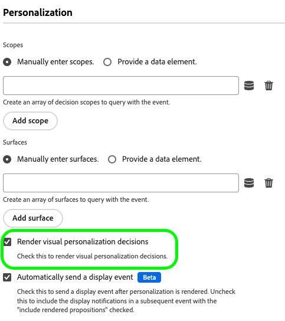

# Konfigurieren der Web-In-App-Messaging-Unterstützung im Web SDK

In-App-Nachrichten sind Benachrichtigungen, die Sie an Benutzer in Ihrer Webanwendung senden können, um sie an bestimmte Zielpunkte weiterzuleiten.

Sie können diese Benachrichtigungen für verschiedene Zwecke verwenden, z. B. zur Förderung neuer Funktionen, zur Präsentation von Sonderangeboten oder zur Erleichterung des Onboarding von Benutzern.

Mithilfe von In-App-Nachrichten können Sie effektiv mit Ihrer Zielgruppe interagieren und diese auf wichtige Aspekte Ihrer Anwendung lenken.

>[!IMPORTANT]
>
>Web-In-App-Nachrichten sind eine Funktion vom Typ [Adobe Journey Optimizer](https://experienceleague.adobe.com/docs/journey-optimizer/using/ajo-home.html?lang=de), die das Web SDK verwendet, um personalisierte Inhalte bereitzustellen.
>
>Detaillierte Anweisungen zum Konfigurieren Ihrer Web-In-App-Messaging-Kampagne finden Sie in der [Adobe Journey Optimizer-Dokumentation](https://experienceleague.adobe.com/docs/journey-optimizer/using/in-app/create-in-app-web.html).


## Voraussetzungen {#prerequisites}

### Version der Web SDK-Tag-Erweiterung {#extension-version}

Für die Web-In-App-Messaging-Funktion ist die neueste Version der Web SDK-Tag-Erweiterung erforderlich.

### CSP für Web-In-App-Nachrichten konfigurieren {#csp}

Wenn Sie [Web In-App Messaging](../personalization/web-in-app-messaging.md) konfigurieren, müssen Sie die folgende Anweisung in Ihre CSP aufnehmen:

```
default-src  blob:;
```

Weitere Informationen zum Konfigurieren einer CSP finden Sie in der [dedizierten Dokumentation](../use-cases/configuring-a-csp.md).

## Web-In-App-Nachrichten mithilfe der Web SDK-Tag-Erweiterung konfigurieren {#tag-extension}

Auf der Konfigurationsseite ](../../tags/extensions/client/web-sdk/web-sdk-extension-configuration.md) der Tag-Erweiterung für das Web SDK [finden Sie die unten beschriebenen Einstellungen.

Nachdem Sie [die Web SDK-Tag-Erweiterung ](../../tags/extensions/client/web-sdk/web-sdk-extension-configuration.md#install-the-web-sdk-tag-extension) installiert haben, führen Sie die folgenden Schritte aus, um die Erweiterung für Web In-App Messaging zu konfigurieren.

Aktivieren Sie im Abschnitt **[!UICONTROL Personalization]** die Option **[!UICONTROL Personalisierungsspeicher aktivieren]** . Mit dieser Option kann das Web SDK verfolgen, welche Erlebnisse der Benutzer beim Laden der Seite gesehen hat.


Web In-App-Nachrichten unterstützen zwei Arten von Triggern:

* [Senden von Daten an Platform](#send-data-platform)
* [Nachrichten manuell auslösen](#manual-trigger)

In den folgenden Abschnitten erfahren Sie, wie Sie die Web SDK-Tag-Erweiterung entsprechend den gewünschten Triggern konfigurieren.

### Konfigurationsschritte für den Trigger **[!UICONTROL Daten an Platform senden]** {#send-data-platform}

Wählen Sie die Tag-Eigenschaft aus, die Ihre Web SDK-Erweiterung enthält, und erstellen Sie [eine neue Regel](../../tags/ui/managing-resources/rules.md##create-a-rule) mit den folgenden Einstellungen:

1. **[!UICONTROL Erweiterung]**: [!UICONTROL Core]
2. **[!UICONTROL Ereignistyp]**: [!UICONTROL Bibliothek geladen (Seitenanfang)]

   

3. Wählen Sie **[!UICONTROL Änderungen beibehalten]** aus, um die Ereigniskonfiguration zu speichern.

Als Nächstes müssen Sie der von Ihnen erstellten Regel eine Aktion hinzufügen.

1. Wählen Sie im Abschnitt [!DNL Actions] die Option **[!UICONTROL Hinzufügen]** aus.
   

2. Verwenden Sie die folgenden Einstellungen für **[!UICONTROL Aktion]**:
   * **[!UICONTROL Erweiterung]**: [!UICONTROL Adobe Experience Platform Web SDK]
   * **[!UICONTROL Aktionstyp]**: [!UICONTROL Ereignis senden]

     

3. Aktivieren Sie rechts auf dem Bildschirm im Bereich **[!UICONTROL Personalization]** die Option **[!UICONTROL visuelle Personalisierungsentscheidungen rendern]** .
   

4. Definieren Sie rechts im Bildschirm im Abschnitt **[!UICONTROL Entscheidungskontext]** die Paare **[!UICONTROL Schlüssel]**/**[!UICONTROL Wert]** , die Sie in Ihrer Kampagnenkonfiguration verwendet haben, um sich für die In-App-Nachricht zu qualifizieren.
   

5. Wählen Sie **[!UICONTROL Änderungen beibehalten]** aus, um Ihre Konfiguration zu speichern.


Als Nächstes müssen Sie die neu erstellte Regel zur Tag-Property-Bibliothek hinzufügen. Gehen Sie dazu zu **[!UICONTROL Veröffentlichungsfluss]** und wählen Sie die zuvor erstellte Regel aus.


Nachdem Sie die Regel zur Bibliothek hinzugefügt haben, wählen Sie &quot;**[!UICONTROL Speichern und in Entwicklung erstellen]**&quot;.


Der Konfigurationsprozess ist jetzt abgeschlossen und Ihre Nachricht kann Ihren Benutzern angezeigt werden.

### Konfigurationsschritte für die Verwendung von manuellen Triggern {#manual-trigger}

Wählen Sie die Tag-Eigenschaft aus, die Ihre Web SDK-Erweiterung enthält, und erstellen Sie [eine neue Regel](../../tags/ui/managing-resources/rules.md##create-a-rule) mit den folgenden Einstellungen:

1. **[!UICONTROL Erweiterung]**: [!UICONTROL Core]
2. **[!UICONTROL Ereignistyp]**: [!UICONTROL Klick]
3. Legen Sie den Trigger für ein bestimmtes Element auf der Seite fest, den Sie durch einen CSS-Selektor Ihrer Wahl identifizieren.

   


Als Nächstes müssen Sie der von Ihnen erstellten Regel eine Aktion hinzufügen.

1. Wählen Sie im Abschnitt [!DNL Actions] die Option **[!UICONTROL Hinzufügen]** aus.
   

2. Verwenden Sie die folgenden Einstellungen für **[!UICONTROL Aktion]**:
   * **[!UICONTROL Erweiterung]**: [!UICONTROL Adobe Experience Platform Web SDK]
   * **[!UICONTROL Aktionstyp]**: [!UICONTROL Regelsätze auswerten]

     

3. Aktivieren Sie rechts im Bildschirm die Option **[!UICONTROL Entscheidungen zur visuellen Personalisierung rendern]** .
   


4. Definieren Sie rechts im Bildschirm im Abschnitt **[!UICONTROL Entscheidungskontext]** die Paare **[!UICONTROL Schlüssel]**/**[!UICONTROL Wert]** , die Sie in Ihrer Kampagnenkonfiguration verwendet haben, um sich für die In-App-Nachricht zu qualifizieren.
   

5. Wählen Sie **[!UICONTROL Änderungen beibehalten]** aus, um Ihre Konfiguration zu speichern.

Als Nächstes müssen Sie die neu erstellte Regel zur Tag-Property-Bibliothek hinzufügen. Gehen Sie dazu zu **[!UICONTROL Veröffentlichungsfluss]** und wählen Sie die zuvor erstellte Regel aus.


Nachdem Sie die Regel zur Bibliothek hinzugefügt haben, wählen Sie &quot;**[!UICONTROL Speichern und in Entwicklung erstellen]**&quot;.


Der Konfigurationsprozess ist jetzt abgeschlossen und Ihre Nachricht kann Ihren Benutzern angezeigt werden.

## Web-In-App-Nachrichten mithilfe der Web SDK JavaScript-Bibliothek konfigurieren {#js-library}

Alternativ zur Verwendung der Web SDK-Tag-Erweiterung können Sie auch Web-In-App-Nachrichten direkt über die Web SDK JavaScript-Bibliothek konfigurieren.


Sie können Web-In-App-Nachrichten aus Adobe Journey Optimizer auf zwei Arten anzeigen.

### Methode 1: Personalisierungsinhalt automatisch abrufen {#automatic}

Damit das Web SDK den Personalisierungsinhalt beim Laden der Seite automatisch abruft, verwenden Sie den Befehl &quot;`sendEvent`&quot;, wie im folgenden Beispiel gezeigt.

```js
  alloy("sendEvent", {
      renderDecisions: true,
      personalization: {
          surfaces: ['#welcome']
      }
  });
```

### Methode 2: Personalisierungsinhalt basierend auf der Benutzeraktion manuell abrufen {#manual}

Um den Personalisierungsinhalt erst dann anzuzeigen, wenn der Benutzer eine bestimmte Aktion ausgeführt hat, verwenden Sie den Befehl `evaluateRulesets` , wie im Beispiel unten dargestellt.

In diesem Beispiel wird der Personalisierungsinhalt angezeigt, wenn ein Benutzer auf die Schaltfläche **[!UICONTROL Jetzt kaufen]** auf Ihrer Website klickt.

```js
 alloy("evaluateRulesets", {
     renderDecisions: true,
     personalization: {
         decisionContext: {
             "userAction": "buy_now"
         }
     }
 });
```

### Konfigurieren des Personalisierungsspeichers {#personalization-storage}

Sie können Benutzern über die Konfigurationsoption `personalizationStorageEnabled` festlegen, ob In-App-Nachrichten für eine bestimmte Anzahl von Malen oder jedes Mal, wenn sie eine Seite besuchen, angezeigt werden sollen.

Legen Sie in der [Web SDK configuration](../commands/configure/overview.md) die `personalizationStorageEnabled` -Option entsprechend Ihren Anforderungen fest:

* `personalizationStorageEnabled: true` Trigger der In-App-Nachricht mit der Häufigkeit, die Sie in der [Adobe Journey Optimizer-Kampagne](https://experienceleague.adobe.com/docs/journey-optimizer/using/in-app/create-in-app-web.html#configure-inapp) definiert haben.
* `personalizationStorageEnabled: false` Trigger der In-App-Nachricht bei jedem Seitenladevorgang.
