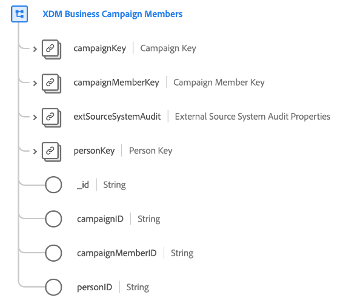

# [!UICONTROL XDM Business Campaign-Mitglieder] class

>[!IMPORTANT]
>
>Diese Klasse ist für Organisationen mit Zugriff auf [Adobe Real-time Customer Data Platform B2B Edition](../../../rtcdp/b2b-overview.md). Sie müssen Zugriff auf Real-Time CDP B2B Edition haben, damit diese Klasse an [Echtzeit-Kundenprofil](../../../profile/home.md).

[!UICONTROL XDM Business Campaign-Mitglieder] ist eine standardmäßige Experience-Datenmodell (XDM)-Klasse, die einen Kontakt oder Lead beschreibt, der mit einer Geschäftskampagne verknüpft ist.

| Eigenschaft | Datentyp | Beschreibung |
| --- | --- | --- |
| `campaignKey` | [[!UICONTROL B2B-Quelle]](../../data-types/b2b-source.md) | Eine zusammengesetzte Kennung für die zugehörige Kampagne. |
| `campaignMemberKey` | [[!UICONTROL B2B-Quelle]](../../data-types/b2b-source.md) | Eine zusammengesetzte Kennung für die Kampagnenmitgliedschaft-Entität. |
| `extSourceSystemAudit` | [[!UICONTROL Audit-Attribute des externen Quellsystems]](../../data-types/external-source-system-audit-attributes.md) | Wenn die Kampagnenmitgliedschaft aus einem externen Quellsystem stammt, erfasst dieses Objekt Prüfattribute für dieses System. |
| `personKey` | [[!UICONTROL B2B-Quelle]](../../data-types/b2b-source.md) | Eine zusammengesetzte Kennung für die Person, die Mitglied der zugehörigen Kampagne ist. |
| `_id` | Zeichenfolge | Eine eindeutige Kennung für den Datensatz. Dies ist ein systemgenerierter Wert, der getrennt vom `campaignMemberID`. |

{style="table-layout:auto"}

Informationen dazu, wie diese Klasse konzeptionell mit den anderen B2B-Klassen verknüpft ist und wie Sie diese Beziehungen in der Benutzeroberfläche von Adobe Experience Platform herstellen können, finden Sie im Handbuch unter [Schemabeziehungen in Real-Time CDP B2B Edition](../../tutorials/relationship-b2b.md)

Weitere Felder, die mit dieser Klasse kompatibel sind, finden Sie in der Feldergruppenreferenz für [[!UICONTROL Details zu XDM-Business-Campaign-Mitgliedern]](../../field-groups/b2b-campaign-members/details.md).
