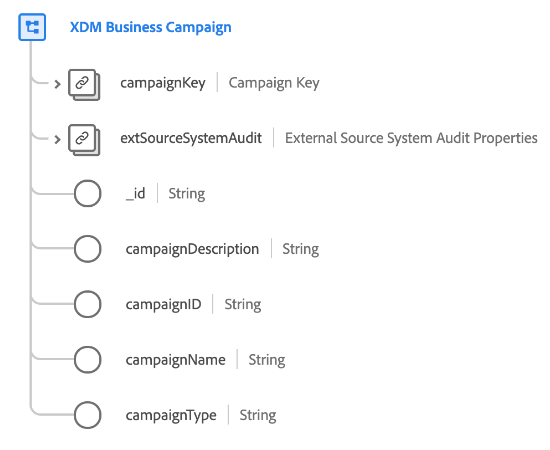

# [!UICONTROL XDM Business Campaign] class

[!UICONTROL XDM Business Campaign] ist eine standardmäßige Experience-Datenmodell (XDM)-Klasse, die die erforderlichen Mindesteigenschaften einer Geschäftskampagne erfasst.

| Eigenschaft | Datentyp | Beschreibung |
| --- | --- | --- |
| `campaignKey` | [[!UICONTROL B2B-Quelle]](../../data-types/b2b-source.md) | Eine zusammengesetzte Kennung für die Kampagnenentität. |
| `extSourceSystemAudit` | [[!UICONTROL Audit-Attribute des externen Quellsystems]](../../data-types/external-source-system-audit-attributes.md) | Wenn die Kampagne aus einem externen Quellsystem stammt, erfasst dieses Objekt Prüfattribute für dieses System. |
| `_id` | Zeichenfolge | Eine eindeutige Kennung für den Datensatz. Dies ist ein systemgenerierter Wert, der getrennt vom `campaignID`. |
| `campaignDescription` | Zeichenfolge | Eine Beschreibung der Kampagne. |
| `campaignID` | Zeichenfolge | Eine eindeutige Kennung für die Kampagnenentität. |
| `campaignName` | Zeichenfolge | Der Name der Kampagne. |
| `campaignType` | Zeichenfolge | Kampagnentyp oder Zielgruppe. |

{style=&quot;table-layout:auto&quot;}

Siehe Handbuch unter [Schemabeziehungen in der Echtzeit-Kundendatenplattform B2B Edition](../../tutorials/relationship-b2b.md) um zu erfahren, wie diese Klasse konzeptionell mit den anderen B2B-Klassen in Beziehung steht und wie Sie diese Beziehungen in der Adobe Experience Platform-Benutzeroberfläche herstellen können.
