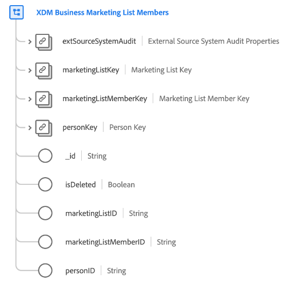

# [!UICONTROL XDM Business Marketing List Members]-Klasse

>[!IMPORTANT]
>
>Diese Klasse ist für die Verwendung durch Organisationen vorgesehen, die Zugriff auf [Adobe Real-time Customer Data Platform B2B edition](../../../rtcdp/b2b-overview.md) haben. Sie müssen Zugriff auf Real-Time CDP B2B edition haben, damit diese Klasse am Echtzeit[Kundenprofil teilnehmen ](../../../profile/home.md).

[!UICONTROL XDM Business Marketing List Members] ist eine standardmäßige Klasse des Experience-Datenmodells (XDM), das Mitglieder, Personen oder Kontakte beschreibt, die mit einer Marketing-Liste verknüpft sind.

| Eigenschaft | Datentyp | Beschreibung |
| --- | --- | --- |
| `extSourceSystemAudit` | [[!UICONTROL Audit-Attribute des externen Source-Systems]](../../data-types/external-source-system-audit-attributes.md) | Wenn die Mitgliedschaft in der Marketing-Liste von einem externen Quellsystem stammt, erfasst dieses Objekt Audit-Attribute für dieses System. |
| `marketingListKey` | [[!UICONTROL B2B-Source]](../../data-types/b2b-source.md) | Eine zusammengesetzte Kennung für die Marketing-Liste, der die Person angehört. |
| `marketingListMemberKey` | [[!UICONTROL B2B-Source]](../../data-types/b2b-source.md) | Eine zusammengesetzte Kennung für die Entität der Marketing-Listenmitgliedschaft. |
| `personKey` | [[!UICONTROL B2B-Source]](../../data-types/b2b-source.md) | Eine zusammengesetzte Kennung für die Person, die Mitglied der Marketing-Liste ist. |
| `_id` | String | Eine eindeutige Kennung für den Datensatz. Dies ist ein vom System generierter Wert, der vom `marketingListMemberID` getrennt ist. |
| `isDeleted` | Boolesch | Gibt an, ob diese Entität des Abonnenten der Marketing-Liste auf Marketo Engage gelöscht wurde.  Bei Verwendung des [Marketo-Quell](../../../sources/connectors/adobe-applications/marketo/marketo.md)Connectors werden alle in Marketo gelöschten Datensätze automatisch im Echtzeit-Kundenprofil angezeigt. Datensätze, die sich auf diese Profile beziehen, können jedoch weiterhin im Data Lake vorhanden sein. Wenn Sie `isDeleted` auf `true` setzen, können Sie das Feld verwenden, um herauszufiltern, welche Datensätze aus Ihren Quellen gelöscht wurden, wenn Sie den Data Lake abfragen. |
| `marketingListID` | String | Eine eindeutige ID für die Marketing-Liste. |
| `marketingListMemberID` | String | Eine eindeutige ID für die Entität der Marketing-Listenmitgliedschaft. |
| `personId` | String | Eine eindeutige ID für die Person. |

{style="table-layout:auto"}

Lesen Sie das Handbuch zu [Schemabeziehungen in Real-Time CDP B2B edition](../../tutorials/relationship-b2b.md), um zu erfahren, wie sich diese Klasse konzeptionell auf die anderen B2B-Klassen bezieht und wie Sie diese Beziehungen in der Adobe Experience Platform-Benutzeroberfläche herstellen können.
