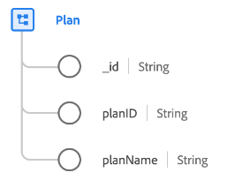

# [!UICONTROL Plan] class

Im Experience-Datenmodell (XDM) erfasst die Klasse [!UICONTROL Plan] den Mindestsatz von Eigenschaften, die einen Plan definieren, z. B. einen Krankenversicherungsplan oder einen Versicherungsplan.

| Eigenschaft | Datentyp | Beschreibung |
| --- | --- | --- |
| `_id` | [!UICONTROL String] | Eine eindeutige, systemgenerierte Zeichenfolgenkennung für den Datensatz. Dieses Feld wird verwendet, um die Eindeutigkeit eines einzelnen Datensatzes zu verfolgen, Datenduplizierung zu verhindern und diesen Datensatz in nachgelagerten Diensten nachzuschlagen.  Da dieses Feld systemseitig generiert wird, wird bei der Datenerfassung kein expliziter Wert angegeben. Sie können jedoch weiterhin Ihre eigenen eindeutigen ID-Werte angeben, wenn Sie möchten. |
| `planId` | [!UICONTROL String] | Eine eindeutige Kennung für den Plan. |
| `planName` | [!UICONTROL String] | Der Name des Plans. |

{style="table-layout:auto"}

Die Klasse kann mit der Feldergruppe [[!UICONTROL Details zum Krankenversicherungsplan] ](../field-groups/plan/healthcare-plan-details.md) erweitert werden, um weitere Details zu einem Krankenversicherungsplan zu beschreiben.
