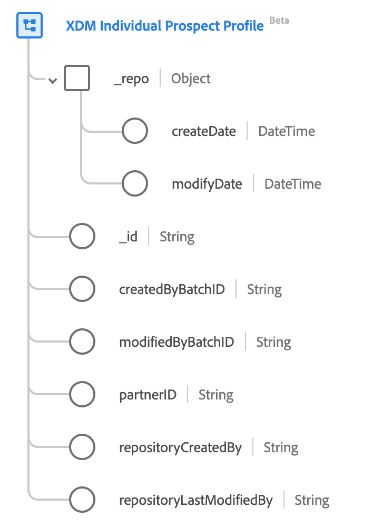

# [!UICONTROL XDM Individual Prospect Profile]-Klasse

Im Experience-Datenmodell (XDM) erfasst die Klasse [!UICONTROL XDM Individual Prospect Profile] Interessentenprofile, die in der Regel von Datenpartnern bezogen werden, für erstklassige Anwendungsfälle zur Kundenakquise.

>[!NOTE]
>
>Um ein Feld im Profil eines XDM-Kontakts als Identität festzulegen, müssen Sie zunächst mindestens einen Partner-ID-Namespace erstellen. Weitere Informationen zur Partner-ID finden Sie im Abschnitt [Identitätstypen](../../identity-service/features/namespaces.md).

| Eigenschaft | Datentyp | Beschreibung |
| --- | --- | --- |
| `_repo` | Objekt | Mit dieser Klasse können Sie Interessentenprofile einbinden, die von Datenanbietern bezogen werden, um Anwendungsfälle für die Kundenakquise zu ermitteln. |
| `_repo.createDate` | [!UICONTROL DateTime] | Server-Datum und -Uhrzeit der Erstellung der Ressource im Repository. Die Erstellungszeit kann das erste Hochladen einer Asset-Datei sein oder ein Verzeichnis wird vom Server als übergeordnetes Element eines neuen Assets erstellt. Die datetime-Eigenschaft muss dem ISO 8601-Standard entsprechen. Ein Beispiel für dieses Format ist „2004-10-23T12:00:00-06:00“. |
| `_repo.modifyDate` | [!UICONTROL DateTime] | Das Server-Zeit (Datum und Uhrzeit), zu der die Ressource im Repository zuletzt geändert wurde, z. B. wenn eine neue Version eines Assets hochgeladen oder die untergeordnete Ressource eines Verzeichnisses hinzugefügt oder entfernt wird. Die datetime-Eigenschaft muss dem ISO 8601-Standard entsprechen. Ein Beispiel ist „2004-10-23T12:00:“. |
| `_id` | [!UICONTROL String] | Eine eindeutige, systemgenerierte Zeichenfolgenkennung für den Datensatz. Dieses Feld wird verwendet, um die Eindeutigkeit eines einzelnen Datensatzes nachzuverfolgen, Doppelungen von Daten zu verhindern und diesen Datensatz in nachgelagerten Services nachzuschlagen.  Da dieses Feld systemgeneriert ist, gibt es bei der Datenaufnahme keinen expliziten Wert an. Sie können jedoch bei Bedarf auch eigene eindeutige ID-Werte angeben. |
| `createdByBatchID` | [!UICONTROL String] | Die ID des erfassten Batches, der zur Erstellung des Datensatzes geführt hat. |
| `modifiedByBatchID` | [!UICONTROL String] | Die ID des zuletzt aufgenommenen Batches, der zur Aktualisierung des Datensatzes geführt hat. |
| `partnerID` | [!UICONTROL String] | In der Regel eine eindeutige pseudonyme Kennung, die einen einzelnen Interessenten identifiziert. Weitere Informationen zur [-ID und zu den anderen Identitätstypen](../../identity-service/features/namespaces.md#identity-type) die in Adobe Experience Platform verfügbar sind, finden Sie in der Dokumentation zu „Identitätstypen“. |
| `repositoryCreatedBy` | [!UICONTROL String] | Die ID des Benutzers, der den Datensatz erstellt hat. |
| `repositoryLastModifiedBy` | [!UICONTROL String] | Die ID des Benutzers, der den Datensatz zuletzt geändert hat. Wenn der Datensatz erstellt wird, wird der `modifiedByUser` als `createdByUser` Wert festgelegt. |

{style="table-layout:auto"}
