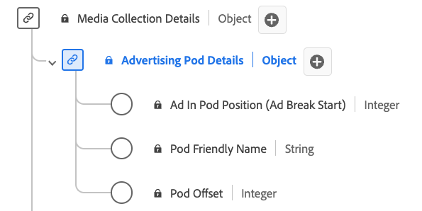

# [!UICONTROL Details der Werbeunterbrechung] Sammlungsdatentyp

[!UICONTROL Details der Werbeunterbrechung] Die Sammlung ist ein standardmäßiger Experience-Datenmodell (XDM)-Datentyp. Sie definiert eine Sequenz oder Gruppe von Anzeigen, die in der Regel während Inhaltsunterbrechungen nacheinander wiedergegeben werden. Verwenden Sie die [!UICONTROL Details der Werbeunterbrechung] Sammlungsdatentyp zum Erfassen von Details wie der ID der Werbeunterbrechung, einem benutzerfreundlichen Namen für die Werbeunterbrechung, dem Index der Anzeigen innerhalb der Werbeunterbrechung und dem Offset der Werbeunterbrechung innerhalb der Timeline des Inhalts in Sekunden.

| Anzeigename | Eigenschaft | Datentyp | Erforderlich | Beschreibung |
|-----------------------------------------|-----------------|-----------|--------------------------------------------------------------------|
| [!UICONTROL Anzeigenposition innerhalb der Werbeunterbrechung] | `index` | integer | Ja | Der Index der Anzeige innerhalb des Starts der übergeordneten Werbeunterbrechung. |
| [!UICONTROL Anzeigename der Werbeunterbrechung] | `friendlyName` | Zeichenfolge | Nein | Der leicht verständliche Name der Werbeunterbrechung. |
| [!UICONTROL Werbeunterbrechung] | `offset` | integer | Ja | Der Versatz der Werbeunterbrechung innerhalb des Inhalts in Sekunden. |
