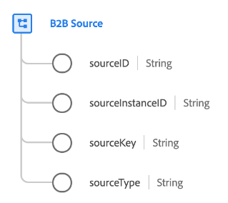

# [!UICONTROL B2B-Quelle] Datentyp

[!UICONTROL B2B-Quelle] ist ein standardmäßiger Experience-Datenmodell (XDM)-Datentyp, der eine zusammengesetzte Kennung für eine B2B-Entität darstellt (z. B. eine [account](../classes/b2b/business-account.md), und [Opportunity](../classes/b2b/business-opportunity.md)oder [Kampagne](../classes/b2b/business-campaign.md)).

Wenn Sie sich ausschließlich auf zeichenfolgenbasierte IDs verlassen, können sich IDs über mehrere Systeme hinweg überschneiden (z. B. könnte eine Chance auf eine Zeichenfolgen-ID in einem CRM-System gegeben werden, aber dieselbe ID könnte auf eine völlig andere Möglichkeit verweisen). Dies kann beim Zusammenführen von Daten in zu Datenkonflikten führen [Echtzeit-Kundenprofil](../../profile/home.md).

Die [!UICONTROL B2B-Quelle] Datentyp ermöglicht es Ihnen, die ursprüngliche Zeichenfolgen-ID einer Entität zu verwenden und sie mit quellenspezifischen Kontextdaten zu kombinieren, um sicherzustellen, dass sie im Platform-System vollkommen eindeutig bleibt, unabhängig von der Quelle, aus der sie stammt.

| Eigenschaft | Datentyp | Beschreibung |
| --- | --- | --- |
| `sourceID` | Zeichenfolge | Eine eindeutige ID für den Quelldatensatz. |
| `sourceInstanceID` | Zeichenfolge | Die Instanz- oder Organisations-ID der Quelldaten. |
| `sourceKey` | Zeichenfolge | Eine eindeutige Kennung, die aus der Variablen `sourceId`, `sourceInstanceId`und `sourceType` im folgenden Format verkettet: `[sourceID]@$[sourceInstanceID].[sourceType]`.  Einige Quell-Connectoren wie Marketo verketten diesen Wert für bestimmte Kennungen automatisch. Andere müssen manuell mithilfe der [Datenvorbereitung `concat` function](../../data-prep/functions.md#string), zum Beispiel: `concat(id,"@${ORG_ID}.Marketo")` |
| `sourceType` | Zeichenfolge | Der Name der Plattform, die die Quelldaten bereitstellt. |

{style=&quot;table-layout:auto&quot;}

Weitere Informationen zum Datentyp finden Sie im öffentlichen XDM-Repository:

* [Ausgefülltes Beispiel](https://github.com/adobe/xdm/blob/master/components/datatypes/b2b/b2b-source.example.1.json)
* [Vollständiges Schema](https://github.com/adobe/xdm/blob/master/components/datatypes/b2b/b2b-source.schema.json)
