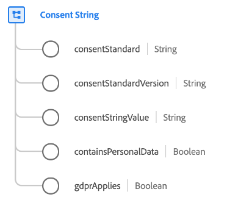

# [!UICONTROL Zustimmungszeichenfolge] Datentyp

[!UICONTROL Zustimmungszeichenfolge] ist ein standardmäßiger XDM-Datentyp, der einen Zeichenfolgenwert beschreibt, der die Zustimmung eines Kunden darstellt. Sie enthält kontextbezogene Informationen wie den Standard für die Zustimmungszeichenfolge (z. B. die [IAB Transparency and Consent Framework (TCF) 2.0](../field-groups/profile/iab.md)).

| Eigenschaft | Datentyp | Beschreibung |
| --- | --- | --- |
| `consentStandard` | Zeichenfolge | Der Standard für die Zustimmungszeichenfolge. Dies hilft bei der Bestimmung des Formats der Zustimmungszeichenfolge, das von den Zustimmungsverwaltungsdiensten festgelegt wird. |
| `consentStandardVersion` | Zeichenfolge | Die Version des Zustimmungsstandards, die verwendet wird, um das Format der Zustimmungszeichenfolge genau zu definieren, das von den Zustimmungsverwaltungsdiensten festgelegt wurde. |
| `consentStringValue` | Zeichenfolge | Die vollständige Zustimmungszeichenfolge, die vom Zustimmungsverwaltungsdienst bereitgestellt wird. `consentStandard` und `consentStandardVersion` help define how to parse this string. |
| `containsPersonalData` | Boolesch | Wenn dieses Feld wahr ist, bedeutet dies, dass diese Zustimmungszeichenfolge für die Durchsetzung der Zustimmung verarbeitet werden muss. |
| `gdprApplies` | Boolesch | Wenn dieses Feld zutrifft, bedeutet dies, dass die Einwilligung mit personenbezogenen Daten eingeht. |

{style="table-layout:auto"}

Weitere Informationen zum Datentyp finden Sie im öffentlichen XDM-Repository:

* [Ausgefülltes Beispiel](https://github.com/adobe/xdm/blob/master/components/datatypes/consent/consentstring.example.1.json)
* [Vollständiges Schema](https://github.com/adobe/xdm/blob/master/components/datatypes/consent/consentstring.schema.json)
