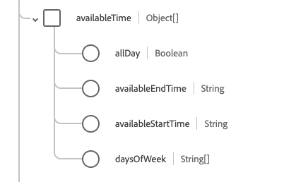

# Datentyp [!UICONTROL Verfügbarkeit]

[!UICONTROL Verfügbarkeit] ist ein standardmäßiger XDM-Datentyp (Experience-Datenmodell), der Verfügbarkeitsdaten für ein Element beschreibt. Dieser Datentyp wird gemäß den Spezifikationen von HL7 FHIR Release 5 erstellt.

| Anzeigename | Eigenschaft | Datentyp | Beschreibung |
| --- | --- | --- | --- |
| [!UICONTROL Verfügbare Zeit] | `availableTime` | Array von Objekten | Die Zeit, zu der das Element verfügbar ist. Weitere Informationen finden Sie im Abschnitt [unter ](#available-time) . |
| [!UICONTROL Nicht verfügbare Zeit] | `notAvailableTime` | String | Die Zeit, zu der das Element nicht verfügbar ist, mit einem angegebenen Grund. Weitere Informationen finden Sie im Abschnitt [unter ](#not-available-time) . |

Weitere Informationen zum Datentyp finden Sie im öffentlichen XDM-Repository:

* [Ausgefülltes Beispiel](https://github.com/adobe/xdm/blob/master/extensions/industry/healthcare/fhir/datatypes/availability.example.1.json)
* [Vollständiges Schema](https://github.com/adobe/xdm/blob/master/extensions/industry/healthcare/fhir/datatypes/availability.schema.json)

## `availableTime` {#available-time}

`availableTime` wird als Array von Objekten bereitgestellt. Die Struktur der einzelnen Objekte wird nachfolgend beschrieben.

| Anzeigename | Eigenschaft | Datentyp | Beschreibung |
| --- | --- | --- | --- |
| [!UICONTROL Ganztägig] | `allDay` | Boolesch | Ein boolescher Wert, der angibt, ob das Element immer verfügbar ist. |
| [!UICONTROL  Verfügbare Endzeit] | `availableEndTime` | String | Die Tageszeit, zu der das Element nicht mehr verfügbar ist. Dies wird ignoriert, wenn `allDay` `true` ist. |
| [!UICONTROL Verfügbare Startzeit] | `availableStartTime` | String | Die Tageszeit, zu der das Element verfügbar ist. Dies wird ignoriert, wenn `allDay` `true` ist. |
| [!UICONTROL Wochentage] | `daysOfWeek` | Zeichenfolgen-Array | Ein Array von Zeichenfolgen, die angeben, welche Tage verfügbar sind. Die Werte dieser Eigenschaft müssen mit einem oder mehreren der folgenden bekannten Enum-Werte übereinstimmen. <li> `mon` </li> <li> `tues` </li> <li> `wed` </li> <li> `thurs`</li>  <li> `fri` </li> <li> `sat`</li> <li> `sun`</li> |

## `notAvailableTime` {#not-available-time}

`notAvailableTime` wird als Array von Objekten bereitgestellt. Die Struktur der einzelnen Objekte wird nachfolgend beschrieben.

| Anzeigename | Eigenschaft | Datentyp | Beschreibung |
| --- | --- | --- | --- |
| [!UICONTROL Während] | `during` | [[!UICONTROL Zeitraum]](../healthcare/period.md) | Der Zeitraum, in dem das Element nicht mehr verfügbar ist. |
| [!UICONTROL Beschreibung] | `description` | String | Der Grund dafür, dass das Element nicht verfügbar ist. |
