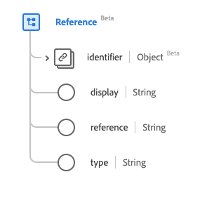

# [!UICONTROL Referenz]-Datentyp

[!UICONTROL Referenz] ist ein standardmäßiger Experience-Datenmodell (XDM)-Datentyp, der eine Referenz zwischen Ressourcen bereitstellt. Dieser Datentyp wird gemäß den Spezifikationen von HL7 FHIR Release 5 erstellt.

| Anzeigename | Eigenschaft | Datentyp | Beschreibung |
| --- | --- | --- | --- |
| [!UICONTROL ID] | `identifier` | [[!UICONTROL ID]](../healthcare/identifier.md) | Die logische Referenz, wenn die Literalreferenz nicht bekannt ist. |
| [!UICONTROL Anzeige] | `display` | String | Die Textalternative für die Referenz. |
| [!UICONTROL Referenz] | `reference` | String | Die Literalreferenz, relative, interne oder absolute URL. |
| [!UICONTROL Typ] | `type` | String | Der Typ, auf den sich der Verweis bezieht, der als URI angezeigt wird. |

Weitere Informationen zum Datentyp finden Sie im öffentlichen XDM-Repository:

* [Ausgefülltes Beispiel](https://github.com/adobe/xdm/blob/master/extensions/industry/healthcare/fhir/datatypes/reference.example.1.json)
* [Vollständiges Schema](https://github.com/adobe/xdm/blob/master/extensions/industry/healthcare/fhir/datatypes/reference.schema.json)
