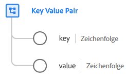

# Datentyp [!UICONTROL Schlüssel-Wert-Paar]

[!UICONTROL Schlüssel-Wert-Paar] ist ein standardmäßiger Experience-Datenmodell (XDM)-Datentyp, der die Details eines generischen Schlüssel-Wert-Paares erfasst. Dieser Datentyp wird in der [[!UICONTROL Adobe Analytics ExperienceEvent Full Extension]-Feldgruppe](../field-groups/event/analytics-full-extension.md) verwendet, um die Array-Elemente einer Listenvariablen zu beschreiben.

| Eigenschaft | Datentyp | Beschreibung |
| --- | --- | --- |
| `key` | Zeichenfolge | Ein Schlüssel (Name) für eine generische Variable oder einen allgemeinen Wert. |
| `value` | Zeichenfolge | Der Wert der Variablen. |

{style=&quot;table-layout:auto&quot;}

Weitere Informationen zum Datentyp finden Sie im [öffentlichen XDM-Repository](https://github.com/adobe/xdm/blob/master/extensions/adobe/experience/analytics/keyvalue.schema.json).
