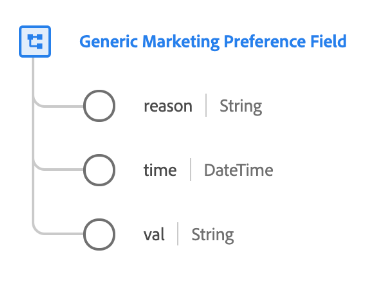

# Datentyp [!UICONTROL Generisches Feld &#x200B;] Marketing-Voreinstellungen

[!UICONTROL Generisches Feld für Marketing-]) ist ein standardmäßiger XDM-Datentyp, der die Auswahl eines Kunden für eine bestimmte Marketing-Voreinstellung beschreibt.

>[!NOTE]
>
>Dieser Datentyp soll verwendet werden, um die Struktur der Einverständnisschemata Ihres Unternehmens mithilfe der Feldergruppe [[!UICONTROL Einverständnisse und Voreinstellungen] als ](../field-groups/profile/consents.md) anzupassen.
>
>Wenn Sie eine `subscriptions` für ein bestimmtes Marketing-Präferenzfeld benötigen, müssen Sie stattdessen das Feld [Marketing-Feld mit dem Datentyp Abonnements](./marketing-field-subscriptions.md) verwenden.

| Eigenschaft | Datentyp | Beschreibung |
| --- | --- | --- |
| `reason` | Zeichenfolge | Wenn ein Kunde sich von einem Marketing-Anwendungsfall abmeldet, stellt dieses Zeichenfolgenfeld den Grund dar, warum der Kunde sich abgemeldet hat. |
| `time` | DateTime | Ein ISO 8601-Zeitstempel, der angibt, wann sich die Marketing-Voreinstellung geändert hat, falls zutreffend. |
| `val` | String | Die vom Kunden bereitgestellte Präferenzauswahl für diesen Marketing-Anwendungsfall. Siehe die nachstehende Tabelle für die akzeptierten Werte und Definitionen. |

{style="table-layout:auto"}

In der folgenden Tabelle sind die akzeptierten Werte für `val` aufgeführt:

| Wert | Titel | Beschreibung |
| --- | --- | --- |
| `y` | Ja (Opt-in) | Der Kunde hat sich für die Voreinstellung entschieden. Mit anderen Worten, sie **nicht** der Verwendung ihrer Daten, wie in der betreffenden Präferenz angegeben. |
| `n` | Nein (Opt-out) | Der Kunde hat die Voreinstellung abgelehnt. Mit anderen Worten, sie **(nicht** der Verwendung ihrer Daten, wie in der betreffenden Präferenz angegeben. |
| `p` | Überprüfung ausstehend | Das System hat noch keinen endgültigen Präferenzwert erhalten. Dies wird am häufigsten im Rahmen einer Einwilligung verwendet, die eine zweistufige Überprüfung erfordert. Wenn sich ein Kunde beispielsweise für den Erhalt von E-Mails entscheidet, wird dieses Einverständnis auf `p` gesetzt, bis er einen Link in einer E-Mail auswählt, um zu überprüfen, ob er die richtige E-Mail-Adresse angegeben hat. Ab diesem Zeitpunkt wird das Einverständnis auf `y` aktualisiert.  Wenn diese Voreinstellung keinen zweistufigen Verifizierungsprozess verwendet, kann stattdessen die `p` verwendet werden, um anzugeben, dass der Kunde noch nicht auf die Einverständnisaufforderung reagiert hat. Beispielsweise können Sie den Wert auf der ersten Seite einer Website automatisch auf `p` setzen, bevor der Kunde auf die Einverständnisaufforderung reagiert hat. In Rechtssystemen, die keine ausdrückliche Zustimmung erfordern, können Sie diese auch verwenden, um anzugeben, dass der Kunde nicht explizit widersprochen hat (mit anderen Worten, eine Zustimmung wird vorausgesetzt). |
| `u` | Unbekannt | Die Präferenzinformationen des Kunden sind unbekannt. |
| `dy` | Standard von „Ja“ (Opt-in) | Der Kunde hat selbst keinen Einverständniswert angegeben und wird standardmäßig als Opt-in („Ja„) behandelt. Mit anderen Worten wird die Einwilligung so lange vorausgesetzt, bis der Kunde etwas Anderes angibt.  Beachten Sie, dass Sie, wenn Gesetze oder Änderungen an den Datenschutzrichtlinien Ihres Unternehmens zu Änderungen an den Standardwerten einiger oder aller Benutzer führen, alle Profile, die Standardwerte enthalten, manuell aktualisieren müssen. |
| `dn` | Standard von „Nein“ (Opt-out) | Der Kunde hat selbst keinen Einverständniswert angegeben und wird standardmäßig als Opt-out („Nein„) behandelt. Mit anderen Worten wird davon ausgegangen, dass der Kunde seine Zustimmung verweigert hat, bis er etwas Anderes angibt.  Beachten Sie, dass Sie, wenn Gesetze oder Änderungen an den Datenschutzrichtlinien Ihres Unternehmens zu Änderungen an den Standardwerten einiger oder aller Benutzer führen, alle Profile, die Standardwerte enthalten, manuell aktualisieren müssen. |
| `LI` | berechtigtes Interesse | Das berechtigte geschäftliche Interesse an der Erhebung und Verarbeitung dieser Daten für den angegebenen Zweck überwiegt den potenziellen Schaden, den sie für den Einzelnen darstellen. |
| `CT` | Vertrag | Die Erhebung von Daten für den genannten Zweck ist erforderlich, um vertragliche Verpflichtungen mit der Person zu erfüllen. |
| `CP` | Erfüllung einer rechtlichen Verpflichtung | Die Erhebung von Daten für den angegebenen Zweck ist erforderlich, um die rechtlichen Verpflichtungen des Unternehmens zu erfüllen. |
| `VI` | Lebensnotwendiges Interesse des Einzelnen | Die Erhebung von Daten für den genannten Zweck ist erforderlich, um die lebenswichtigen Interessen des Einzelnen zu schützen. |
| `PI` | öffentliches Interesse | Die Erhebung von Daten für den genannten Zweck ist erforderlich, um eine Aufgabe im öffentlichen Interesse oder in Ausübung öffentlicher Gewalt zu erfüllen. |

{style="table-layout:auto"}

Weitere Informationen zum Datentyp finden Sie im öffentlichen XDM-Repository:

* [Ausgefülltes Beispiel](https://github.com/adobe/xdm/blob/master/components/datatypes/consent/marketing-field-basic.example.1.json)
* [Vollständiges Schema](https://github.com/adobe/xdm/blob/master/components/datatypes/consent/marketing-field-basic.schema.json)
