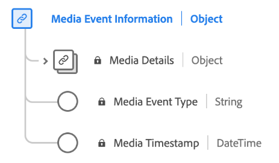

# Datentyp [!UICONTROL Medien-Ereignisinformationen]

[!UICONTROL Medien-Ereignisinformationen] ist ein standardmäßiger Experience-Datenmodell (XDM)-Datentyp, der Mediendetails im Zusammenhang mit dem Erlebnisereignis beschreibt.

| Eigenschaft | Datentyp | Beschreibung |
| --- | --- | --- |
| `mediaCollection` | [!UICONTROL mediaDetails] | Mediendetailinformationen zum Erlebnisereignis. Dieser Datentyp wird sowohl für die [Mediensammlung](./media-collection-details.md) als auch für die [Mediendatenberichterstellung](./media-reporting-details.md) verwendet. |
| `mediaEventTimestamp` | [!UICONTROL String] | Der Zeitpunkt, zu dem ein Medienereignis aufgetreten ist. |
| `mediaEventType` | [!UICONTROL String] | Der Medien-Ereignistyp. |

{style="table-layout:auto"}

Weitere Informationen zur Feldergruppe finden Sie im [öffentlichen XDM-Repository](https://github.com/adobe/xdm/blob/master/components/datatypes/mediaevent.schema.json)
