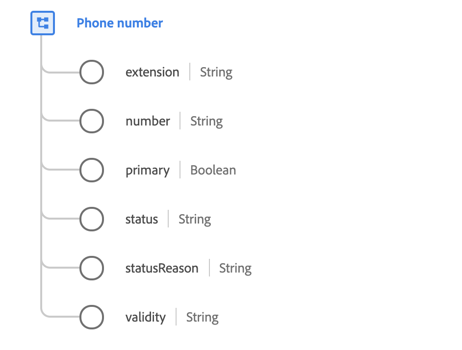

# [!UICONTROL Telefonnummer] Datentyp

[!UICONTROL Telefonnummer] ist ein standardmäßiger XDM-Datentyp, der die Details einer Telefonnummer beschreibt.

 

| Eigenschaft | Beschreibung |
| --- | --- |
| `extension` | Die interne Wählnummer, die zum Anrufen von einer privaten Börse, einem Betreiber oder einer Telefonzentrale verwendet wird. |
| `number` | Die Telefonnummer. Beachten Sie, dass die Telefonnummer eine Zeichenfolge ist und aussagekräftige Zeichen wie Klammern enthalten kann. `()`, Bindestriche `-`, oder Zeichen, um IDs für Unterwählungen wie Erweiterungen anzugeben `x` Beispiel: `1-353(0)18391111` oder `+613 9403600x1234`. |
| `primary` | Ein boolescher Wert, der anzeigt, ob dies die primäre Telefonnummer des Kontakts ist. Im Gegensatz zu Adresse oder E-Mail-Adresse kann es mehrere primäre Telefonnummern geben. einen pro Kommunikationskanal. Der Kommunikationskanal wird durch den Typ definiert (durch den Namen der übergeordneten Eigenschaft angegeben): `textMessaging`, `mobile`, `phone`, `home`, `work`, `unknown`und `fax`. |
| `status` | Gibt an, ob die Telefonnummer derzeit verwendet werden kann. |
| `statusReason` | Eine Beschreibung des aktuellen Status. |
| `validity` | Ein Grad der technischen Korrektheit der Telefonnummer. |

{style=&quot;table-layout:auto&quot;}

Weitere Informationen zum Datentyp der Telefonnummer finden Sie im öffentlichen XDM-Repository:

* [Ausgefülltes Beispiel](https://github.com/adobe/xdm/blob/master/components/datatypes/demographic/phonenumber.example.1.json)
* [Vollständiges Schema](https://github.com/adobe/xdm/blob/master/components/datatypes/demographic/phonenumber.schema.json)
