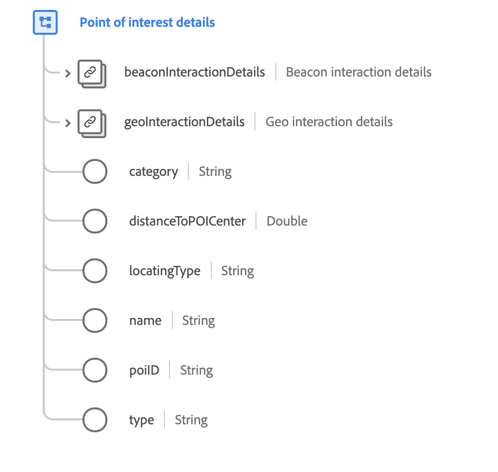

# [!UICONTROL Details zum POI] Datentyp

[!UICONTROL Details zum POI] ist ein standardmäßiger XDM-Datentyp, der die geografischen Daten beschreibt, in denen ein Ereignis beobachtet wurde.

 

| Eigenschaft | Datentyp | Beschreibung |
| --- | --- | --- |
| `beaconInteractionDetails` | [[!UICONTROL Beacon]](./beacon.md) | Beschreibt die Beacon-Details, die für die POI-Interaktion aktiv sind. |
| `geoInteractionDetails` | [[!UICONTROL Details zur Geo-Interaktion]](./geo-interaction-details.md) | Beschreibt die für die POI-Interaktion aktiven Geodetails. |
| `category` | Zeichenfolge | Eine allgemeine Kategorie, die vom Administrator der POI-Definitionen für die Organisation der POIs zugewiesen wurde. |
| `distanceToPOICenter` | Double | Die geschätzte Entfernung vom POI-Zentrum in Metern. |
| `locatingType` | Zeichenfolge | Der Mechanismus zur Bestimmung des Standorts. Zu den zulässigen Werten gehören: <ul><li>`beacon`</li><li>`gps`</li><li>`ip`</li><li>`ip+wifi`</li><li>`wifi-triangulation`</li></ul> |
| `name` | Zeichenfolge | Ein Name für den POI. |
| `poiID` | Zeichenfolge | Eine eindeutige Kennung des POI. |
| `type` | Zeichenfolge | Der allgemeine Typ des POI unter Verwendung eines vom Administrator der POI-Definitionen ausgewählten Typisierungsschemas. |

{style="table-layout:auto"}

Weitere Informationen zum Datentyp finden Sie im öffentlichen XDM-Repository:

* [Ausgefülltes Beispiel](https://github.com/adobe/xdm/blob/master/components/datatypes/poi-detail.example.1.json)
* [Vollständiges Schema](https://github.com/adobe/xdm/blob/master/components/datatypes/poi-detail.schema.json)
