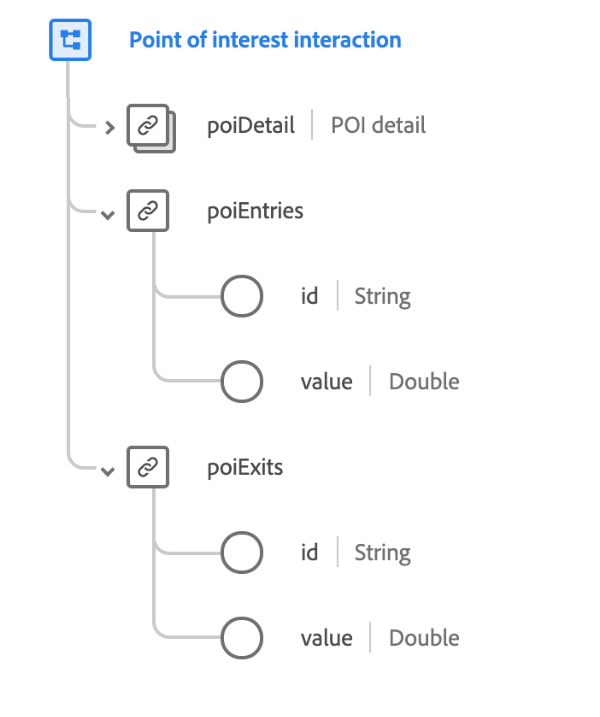

# [!UICONTROL Interaktion mit Zielpunkten] Datentyp

[!UICONTROL Interaktion mit Zielpunkten] ist ein standardmäßiger XDM-Datentyp, der das drahtlose Gerät beschreibt, das Identitätsinformationen an mobile Anwendungen weitergibt, wenn mobile Geräte in Reichweite sind.

 

| Eigenschaft | Datentyp | Beschreibung |
| --- | --- | --- |
| `poiDetail` | [[!UICONTROL Interessenspunktdetails]](./poi-details.md) | Beschreibt die Details des POI, der das Ereignis verursacht hat. |
| `poiEntries` | Objekt | Beschreibt, wie oft eine Person am POI teilgenommen hat. Enthält zwei Eigenschaften: <ul><li>`id`: Eine eindeutige Kennung für die Kennzahl.</li><li>`value`: Der quantifizierbare Wert der Maßnahme.</li></ul> |
| `poiExits` | Objekt | Beschreibt, wie oft eine Person den POI verlassen hat. Enthält zwei Eigenschaften: <ul><li>`id`: Eine eindeutige Kennung für die Kennzahl.</li><li>`value`: Der quantifizierbare Wert der Maßnahme.</li></ul> |

{style=&quot;table-layout:auto&quot;}

Weitere Informationen zum Datentyp finden Sie im öffentlichen XDM-Repository:

* [Ausgefülltes Beispiel](https://github.com/adobe/xdm/blob/master/components/datatypes/deprecated/poi-interaction.example.1.json)
* [Vollständiges Schema](https://github.com/adobe/xdm/blob/master/components/datatypes/deprecated/poi-interaction.schema.json)
