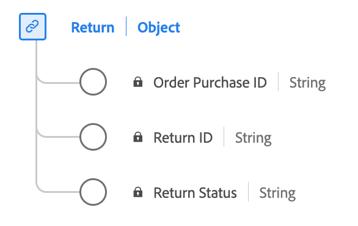

# Datentyp [!UICONTROL Return]

[!UICONTROL Return] ist ein standardmäßiger XDM-Datentyp (Experience-Datenmodell), der die wesentlichen Informationen zu einer Return Merchandise Authorization (RMA) erfasst.

| Anzeigename | Eigenschaft | Datentyp | Beschreibung |
|----------------------------------|----------------------|-----------|--------------------------------------------------|
| [!UICONTROL Rückgabe-ID] | `returnID` | Zeichenfolge | Die eindeutige Kennung für diese RMA. |
| [!UICONTROL Rückkehrstatus] | `returnStatus` | Zeichenfolge | Der aktuelle Status des RMA (z. B. Ausstehend oder Geschlossen). |
| [!UICONTROL Auftrags-ID] | `purchaseID` | Zeichenfolge | Die eindeutige Kennung der Bestellung/des Kaufs, auf die sich der RMA bezieht. |

{style="table-layout:auto"}

Weitere Informationen zum Datentyp finden Sie im öffentlichen XDM-Repository:

* [Ausgefülltes Beispiel](https://github.com/adobe/xdm/blob/master/components/datatypes/return.example.1.json)
* [Vollständiges Schema](https://github.com/adobe/xdm/blob/master/components/datatypes/return.schema.json)
