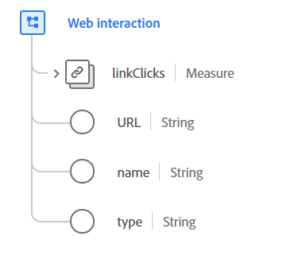

# [!UICONTROL Webinteraktion] Datentyp

[!UICONTROL Webinteraktion] ist ein standardmäßiger Experience-Datenmodell (XDM)-Datentyp, der Informationen zu Interaktionen beschreibt, die auf einer Webseite nach dem ersten Laden der Seite aufgetreten sind. Sie ist zur Aufzeichnung von Interaktionen in Rich-Web-Anwendungen gedacht, die keinen neuen Seitenladevorgang wie Single-Page-Webanwendungen (SPA) Trigger haben.

 

| Eigenschaft | Datentyp | Beschreibung |
| --- | --- | --- |
| `linkClicks` | [[!UICONTROL Maßnahme]](./measure.md) | Eine Messung, die den Klick auf einen Weblink verfolgt. |
| `URL` | Zeichenfolge | Der tatsächliche Link oder die URL, der/die für diese Web-Interaktion verwendet wird. |
| `name` | Zeichenfolge | Der für diesen Web-Link verwendete normative Name. Dies wird zu Classification-Zwecken verwendet. |
| `type` | Zeichenfolge | Der Linktyp. Diese Eigenschaft muss einem der folgenden Enum-Werte entsprechen: <li> `download` </li> <li> `exit` </li> <li> `other` </li> |

{style="table-layout:auto"}

Weitere Informationen zum Datentyp finden Sie im öffentlichen XDM-Repository:

* [Ausgefülltes Beispiel](https://github.com/adobe/xdm/blob/master/components/datatypes/deprecated/webinteraction.example.1.json)
* [Vollständiges Schema](https://github.com/adobe/xdm/blob/master/components/datatypes/deprecated/webinteraction.schema.json)
