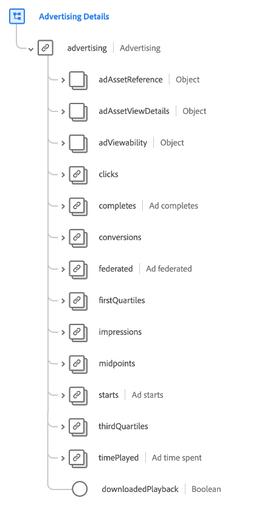

# [!UICONTROL Advertising Details] Schemafeldgruppe

[!UICONTROL Advertising Details] ist eine Standardschemafeldgruppe für die [[!DNL XDM ExperienceEvent] Klasse](../../classes/experienceevent.md). Die Feldergruppe stellt ein einzelnes `advertising` -Objekt für ein Schema bereit, das Informationen zu Werbeimpressionen, Clickthroughs und Attribution erfasst.

| Eigenschaft | Datentyp | Beschreibung |
| --- | --- | --- |
| `adAssetReference` | Objekt | Erfasst Asset-Informationen zur Anzeige. Weitere Informationen zur Struktur dieses Objekts finden Sie im Unterabschnitt [unter ](#adAssetReference) . |
| `adAssetViewDetails` | Objekt | Erfasst Ansichtsdetails für die Anzeigenwiedergabe. Weitere Informationen zur Struktur dieses Objekts finden Sie im Unterabschnitt [unter ](#adAssetViewDetails) . |
| `adViewability` | Objekt | Erfasst die Anzahl der Impressionen, die von Endbenutzern angezeigt werden, z. B. Player-Lautstärke, Bibliotheksversion, Fensterstatus und Anzeigendarstellungsfelddimensionen. Weitere Informationen zur Struktur dieses Objekts finden Sie im Unterabschnitt [unter ](#adViewability) . |
| `clicks` | [[!UICONTROL Maßnahme]](../../data-types/measure.md) | Die Anzahl der Klickaktionen für die Anzeige. |
| `completes` | [[!UICONTROL Maßnahme]](../../data-types/measure.md) | Die Häufigkeit, mit der ein zeitgesteuertes Medien-Asset bis zum Ende angesehen wurde. Das bedeutet nicht unbedingt, dass der Endbenutzer das gesamte Video angesehen hat, da er es möglicherweise übersprungen hat. |
| `conversions` | [[!UICONTROL Maßnahme]](../../data-types/measure.md) | Die Häufigkeit, mit der eine vordefinierte Aktion (oder Aktionen) ein Ereignis zur Leistungsbewertung ausgelöst hat. |
| `federated` | [[!UICONTROL Maßnahme]](../../data-types/measure.md) | Zeigt an, ob ein Erlebnisereignis durch Datenverbund erstellt wurde, z. B. durch gemeinsame Nutzung von Daten durch Kunden. |
| `firstQuartiles` | [[!UICONTROL Maßnahme]](../../data-types/measure.md) | Die Häufigkeit, mit der eine digitale Videoanzeige 25 % ihrer Dauer mit normaler Geschwindigkeit wiedergegeben hat. |
| `impressions` | [[!UICONTROL Maßnahme]](../../data-types/measure.md) | Die Anzahl der Anzeigenimpressionen, die an einen Endbenutzer gesendet werden, der potenziell angezeigt wird. |
| `midpoints` | [[!UICONTROL Maßnahme]](../../data-types/measure.md) | Die Häufigkeit, mit der eine digitale Videoanzeige 50 % ihrer Dauer mit normaler Geschwindigkeit wiedergegeben hat. |
| `starts` | [[!UICONTROL Maßnahme]](../../data-types/measure.md) | Die Häufigkeit, mit der die Wiedergabe einer digitalen Videoanzeige gestartet wurde. |
| `thirdQuartiles` | [[!UICONTROL Maßnahme]](../../data-types/measure.md) | Die Häufigkeit, mit der eine digitale Videoanzeige 75 % ihrer Dauer mit normaler Geschwindigkeit wiedergegeben hat. |
| `timePlayed` | [[!UICONTROL Maßnahme]](../../data-types/measure.md) | Die Zeit, die ein Endbenutzer mit einem bestimmten zeitgesteuerten Medien-Asset verbracht hat. |
| `downloadedPlayback` | Boolesch | Wenn auf &quot;`true`&quot;gesetzt, zeigt an, dass der Treffer aufgrund der Wiedergabe einer heruntergeladenen Anzeigensitzung generiert wird. |

{style="table-layout:auto"}

## `adAssetReference` {#adAssetReference}

Das Objekt `adAssetReference` erfasst Asset-Informationen über die Anzeige.

| Eigenschaft | Datentyp | Beschreibung |
| --- | --- | --- |
| `_dc.title` | Zeichenfolge | Der benutzerfreundliche und menschenlesbare Name des Anzeigen-Assets. |
| `_xmpDM.duration` | Ganzzahl | Die Länge oder Dauer des Assets in Sekunden. |
| `_id` | Zeichenfolge | Eine eindeutige Kennung des Anzeigen-Assets entsprechend dem [Anzeigen-ID-Standard](https://datatracker.ietf.org/doc/html/rfc8107). |
| `advertiser` | Zeichenfolge | Das Unternehmen oder die Marke, deren Produkt in der Anzeige vorgestellt wird. |
| `campaign` | Zeichenfolge | Die ID der Anzeigenkampagne. |
| `creativeID` | Zeichenfolge | Die ID des Kreativinhalts der Anzeige. |
| `creativeURL` | Zeichenfolge | Die URL des Kreativinhalts der Anzeige. |
| `placementID` | Zeichenfolge | Die Platzierungs-ID der Anzeige. |
| `siteID` | Zeichenfolge | Die ID der Anzeigen-Site. |

{style="table-layout:auto"}

## `adAssetViewDetails` {#adAssetViewDetails}

Das Objekt `adAssetViewDetails` erfasst Ansichtsdetails für die Wiedergabe der Anzeige.

| Eigenschaft | Datentyp | Beschreibung |
| --- | --- | --- |
| `adBreak` | [[!UICONTROL Werbeunterbrechung]](../../data-types/ad-break.md) | Beschreibt, wie eine zeitgesteuerte Anzeige in zeitgesteuerte Medien eingefügt wird. |
| `index` | Ganzzahl | Der Index der Anzeige innerhalb der übergeordneten Werbeunterbrechung. Beispielsweise hat die erste Anzeige den Index `0` und die zweite Anzeige den Index `1`. |
| `playerName` | Zeichenfolge | Der Name des Players, der für das Rendering der Werbeanzeige verantwortlich ist. |

{style="table-layout:auto"}

## `adViewability` {#adViewability}

Das Objekt `adViewability` erfasst die Anzahl der Impressionen, die von Endbenutzern gesehen werden, wie z. B. Player-Lautstärke, Bibliotheksversion, Fensterstatus und Anzeigenansichtsdimensionen.

| Eigenschaft | Datentyp | Beschreibung |
| --- | --- | --- |
| `implementationDetails` | [[!UICONTROL Implementierungsdetails]](../../data-types/implementation-details.md) | Name und Version der Bibliothek, die zur Messung der Sichtbarkeitsmetriken verwendet wird. |
| `measuredAdNotVisible` | [[!UICONTROL Maßnahme]](../../data-types/measure.md) | Gibt an, dass die Anzeige nicht sichtbar ist, gemessen durch eine Sichtbarkeitsbibliothek zur Impressionszeit. |
| `measuredMuted` | [[!UICONTROL Maßnahme]](../../data-types/measure.md) | Gibt an, dass die Anzeige laut Messung durch eine Sichtbarkeitsbibliothek zur Impressionszeit stummgeschaltet ist. |
| `unmeasurableIframe` | [[!UICONTROL Maßnahme]](../../data-types/measure.md) | Gibt an, dass die Anzeige in einem inaktiven Fenster angezeigt wird, gemessen durch eine Sichtbarkeitsbibliothek zur Impressionszeit. |
| `unmeasurableOther` | [[!UICONTROL Maßnahme]](../../data-types/measure.md) | Gibt an, dass die Sichtbarkeitsbibliothek aufgrund der Anzeige innerhalb eines iFrames nicht in der Lage ist, Messungen korrekt auszuführen. |
| `viewabilityEligibleImpressions` | [[!UICONTROL Maßnahme]](../../data-types/measure.md) | Impression(en) einer Anzeige für einen Endbenutzer unter Verwendung einer Sichtbarkeitsbibliothek. |
| `viewabilityCompletes` | [[!UICONTROL Maßnahme]](../../data-types/measure.md) | Beendigungen einer Werbeanzeige für einen Endbenutzer, die zum Zeitpunkt der Beendigung von einer Sichtbarkeitsbibliothek als sichtbar erachtet wird. |
| `viewableFirstQuartiles` | [[!UICONTROL Maßnahme]](../../data-types/measure.md) | Erste(s) Quartil(e) einer Anzeige für einen Endbenutzer, die von einer Sichtbarkeitsbibliothek im ersten Quartil der Wiedergabe als sichtbar erachtet wird. |
| `viewableImpressions` | [[!UICONTROL Maßnahme]](../../data-types/measure.md) | Impressionen einer Anzeige für einen Endbenutzer, die von einer Sichtbarkeitsbibliothek nach zwei Sekunden der Wiedergabe als sichtbar erachtet wird. |
| `viewableMidpoints` | [[!UICONTROL Maßnahme]](../../data-types/measure.md) | Mittelpunkte einer Anzeige für einen Endbenutzer, die von einer Sichtbarkeitsbibliothek mitten im Spiel als sichtbar erachtet wird. |
| `viewableThirdQuartiles` | [[!UICONTROL Maßnahme]](../../data-types/measure.md) | Dritte(s) Quartil(e) einer Anzeige für einen Endbenutzer, die von einer Sichtbarkeitsbibliothek im dritten Quartil der Wiedergabe als sichtbar erachtet wird. |
| `activeWindow` | Boolesch | Gibt an, ob die Anzeige im aktiven Fenster des Benutzergeräts angezeigt wurde. |
| `adHeight` | Ganzzahl | Die Anzahl der zur Laufzeit gemessenen vertikalen Pixel des Players. Diese kann größer sein als die Größe der Anzeige, wenn der Player über zusätzliche Steuerelemente oder Miniaturansichten verfügt. |
| `adUnitDepth` | Ganzzahl | Herausgeber können Werbeeinheiten in Container (iFrames) einbetten, um den Zugriff der Anzeige nur auf den Code der Seite zu beschränken. Dieser Wert beschreibt, in wie vielen Containern die Anzeigeneinheit angezeigt wird. |
| `adWidth` | Ganzzahl | Die Anzahl der zur Laufzeit gemessenen horizontalen Pixel des Players. Diese kann größer sein als die Größe der Anzeige, wenn der Player über zusätzliche Steuerelemente oder Miniaturansichten verfügt. |
| `measurementEligible` | Boolesch | Ob die Sichtbarkeitsmessungen für die Anzeige zulässig sind. Eine Anzeige ist zulässig, wenn das Gerät über ein unterstütztes kreatives Format und einen unterstützten Tag-Typ verfügt. |
| `percentViewable` | Ganzzahl | Der Prozentsatz der Pixel in der Anzeige, der zum Zeitpunkt der Messung als sichtbar erachtet wird. |
| `playerVolume` | Ganzzahl | Der Prozentsatz der Player-Lautstärke, gemessen zur Laufzeit, wobei `0` stummgeschaltet und `100` die maximale Lautstärke ist. |
| `viewable` | Boolesch | Gibt an, ob die Anzeige zur Laufzeit sichtbar war. Display-Anzeigen gelten als sichtbar, wenn mindestens 50 % der Anzeige mindestens eine Sekunde lang sichtbar sind. Videoanzeigen gelten als sichtbar, wenn mindestens 50 % der Anzeige während der Videowiedergabe mindestens zwei Sekunden lang sichtbar sind. |
| `viewportHeight` | Ganzzahl | Die vertikale Größe (in Pixel) des Fensters, in dem das Erlebnis zur Laufzeit angezeigt wurde. Bei einem Webansichtsereignis gibt dieser Wert die Höhe des Browser-Viewports an. |
| `viewportWidth` | Ganzzahl | Die horizontale Größe (in Pixel) des Fensters, in dem das Erlebnis zur Laufzeit angezeigt wurde. Bei einem Webansichtsereignis gibt dieser Wert die Breite des Browser-Viewports an. |

{style="table-layout:auto"}

Weitere Informationen zur Feldergruppe finden Sie im [öffentlichen XDM-Repository](https://github.com/adobe/xdm/blob/master/components/fieldgroups/experience-event/experienceevent-advertising.schema.json).
