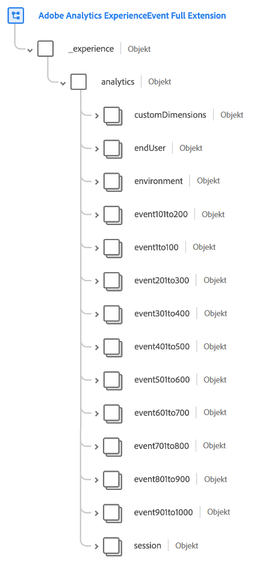
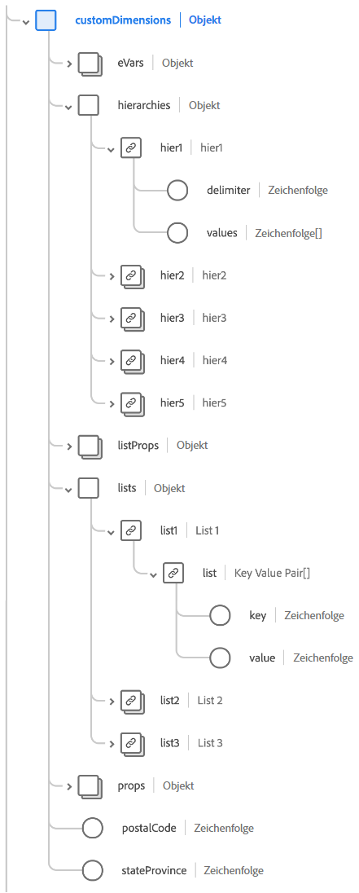
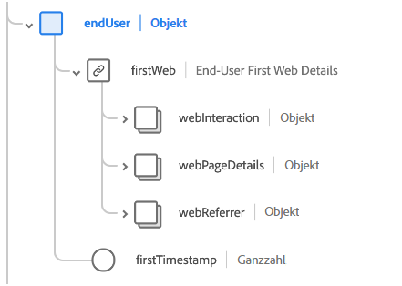
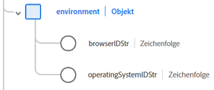
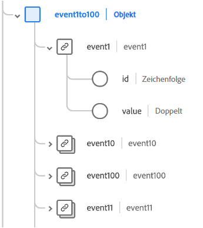
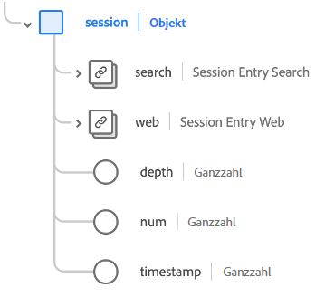

# [!UICONTROL Adobe Analytics ExperienceEvent Full Extension] Schemafeldgruppe

[!UICONTROL Adobe Analytics ExperienceEvent Full Extension] ist eine Standardschemafeldgruppe für die [[!DNL XDM ExperienceEvent] class](../../classes/experienceevent.md), das allgemeine Metriken erfasst, die von Adobe Analytics erfasst werden.

In diesem Dokument werden die Struktur und der Anwendungsfall der Feldergruppe Analytics-Erweiterung beschrieben.

>[!NOTE]
>
>Aufgrund der Größe und Anzahl der wiederholten Elemente in dieser Feldergruppe wurden viele der in diesem Handbuch angezeigten Felder reduziert, um Speicherplatz zu sparen. Um die gesamte Struktur dieser Feldergruppe zu untersuchen, können Sie [in der Platform-Benutzeroberfläche nachschlagen ](../../ui/explore.md) oder das vollständige Schema im [öffentliches XDM-Repository](https://github.com/adobe/xdm/blob/master/extensions/adobe/experience/analytics/experienceevent-all.schema.json).

## Feldgruppenstruktur

Die Feldergruppe stellt eine `_experience` -Objekt auf ein Schema verweist, das selbst ein einzelnes `analytics` -Objekt.

| Eigenschaft | Datentyp | Beschreibung |
| --- | --- | --- |
| `customDimensions` | Objekt | Erfasst benutzerdefinierte Dimensionen, die von Analytics verfolgt werden. Siehe [Unterabschnitt unten](#custom-dimensions) für weitere Informationen zum Inhalt dieses Objekts. |
| `endUser` | Objekt | Erfasst die Webinteraktionsdetails für den Endbenutzer, der das Ereignis ausgelöst hat. Siehe [Unterabschnitt unten](#end-user) für weitere Informationen zum Inhalt dieses Objekts. |
| `environment` | Objekt | Erfasst Informationen über den Browser und das Betriebssystem, die das Ereignis ausgelöst haben. Siehe [Unterabschnitt unten](#environment) für weitere Informationen zum Inhalt dieses Objekts. |
| `event1to100`  `event101to200`  `event201to300`  `event301to400`  `event401to500`  `event501to100`  `event601to700`  `event701to800`  `event801to900`  `event901to1000` | Objekt | Die Feldergruppe stellt Objektfelder bereit, mit denen bis zu 1000 benutzerspezifische Ereignisse erfasst werden können. Siehe [Unterabschnitt unten](#events) für weitere Informationen zu diesen Feldern. |
| `session` | Objekt | Erfasst Informationen über die Sitzung, die das Ereignis ausgelöst hat. Siehe [Unterabschnitt unten](#session) für weitere Informationen zum Inhalt dieses Objekts. |

{style=&quot;table-layout:auto&quot;}

## `customDimensions` {#custom-dimensions}

`customDimensions` erfasst benutzerdefinierte [Dimensionen](https://experienceleague.adobe.com/docs/analytics/components/dimensions/overview.html?lang=de) die von Analytics verfolgt werden.

| Eigenschaft | Datentyp | Beschreibung |
| --- | --- | --- |
| `eVars` | Objekt | Ein Objekt, das bis zu 250 Konversionsvariablen ([eVars](https://experienceleague.adobe.com/docs/analytics/components/dimensions/evar.html?lang=de)). Die Eigenschaften dieses Objekts werden `eVar1` nach `eVar250` und akzeptieren nur Zeichenfolgen für ihren Datentyp. |
| `hierarchies` | Objekt | Ein Objekt, das bis zu fünf benutzerdefinierte Hierarchievariablen ([hiers](https://experienceleague.adobe.com/docs/analytics/implementation/vars/page-vars/hier.html?lang=de)). Die Eigenschaften dieses Objekts werden `hier1` nach `hier5`, die selbst Objekte mit den folgenden Untereigenschaften sind:<ul><li>`delimiter`: Das ursprüngliche Trennzeichen, mit dem die unter `values`.</li><li>`values`: Eine durch Trennzeichen getrennte Liste von Namen auf Hierarchieebene, die als Zeichenfolge dargestellt werden.</li></ul> |
| `listProps` | Objekt | Ein Objekt, das bis zu 75 [Listen-Props](https://experienceleague.adobe.com/docs/analytics/implementation/vars/page-vars/prop.html#list-props). Die Eigenschaften dieses Objekts werden `prop1` nach `prop75`, die selbst Objekte mit den folgenden Untereigenschaften sind:<ul><li>`delimiter`: Das ursprüngliche Trennzeichen, mit dem die unter `values`.</li><li>`values`: Eine durch Trennzeichen getrennte Liste von Werten für die Eigenschaft, die als Zeichenfolge dargestellt wird.</li></ul> |
| `lists` | Objekt | Ein Objekt, das bis zu drei Elemente erfasst [Listen](https://experienceleague.adobe.com/docs/analytics/implementation/vars/page-vars/list.html). Die Eigenschaften dieses Objekts werden `list1` nach `list3`. Jede dieser Eigenschaften enthält eine `list` Array von [[!UICONTROL Schlüssel-Wert-Paar]](../../data-types/key-value-pair.md) Datentypen. |
| `props` | Objekt | Ein Objekt, das bis zu 75 [props](https://experienceleague.adobe.com/docs/analytics/implementation/vars/page-vars/prop.html). Die Eigenschaften dieses Objekts werden `prop1` nach `prop75` und akzeptieren nur Zeichenfolgen für ihren Datentyp. |
| `postalCode` | Zeichenfolge | Eine vom Kunden bereitgestellte Postleitzahl oder Postleitzahl. |
| `stateProvince` | Zeichenfolge | Ein vom Kunden bereitgestellter Bundesland- oder Bundesstandort. |

{style=&quot;table-layout:auto&quot;}

## `endUser` {#end-user}

`endUser` erfasst die Webinteraktionsdetails für den Endbenutzer, der das Ereignis ausgelöst hat.

| Eigenschaft | Datentyp | Beschreibung |
| --- | --- | --- |
| `firstWeb` | [[!UICONTROL Webinformationen]](../../data-types/web-information.md) | Die Informationen zu Web-Seite, Link und Referrer aus dem ersten Erlebnisereignis für diesen Endbenutzer. |
| `firstTimestamp` | Ganzzahl | Ein Unix-Zeitstempel für das erste ExperienceEvent für diesen Endbenutzer. |

## `environment` {#environment}

`environment` erfasst Informationen über den Browser und das Betriebssystem, die das Ereignis ausgelöst haben.

| Eigenschaft | Datentyp | Beschreibung |
| --- | --- | --- |
| `browserIDStr` | Zeichenfolge | Die Adobe Analytics-Kennung für den verwendeten Browser (auch als [Browsertyp-Dimension](https://experienceleague.adobe.com/docs/analytics/components/dimensions/browser-type.html)). |
| `operatingSystemIDStr` | Zeichenfolge | Die Adobe Analytics-Kennung für das verwendete Betriebssystem (auch bekannt als [Betriebssystemtyp-Dimension](https://experienceleague.adobe.com/docs/analytics/components/dimensions/operating-system-types.html)). |

## Benutzerdefinierte Ereignisfelder {#events}

Die Feldergruppe Analytics-Erweiterung enthält zehn Objektfelder, die bis zu 100 erfassen [benutzerspezifische Ereignismetriken](https://experienceleague.adobe.com/docs/analytics/components/metrics/custom-events.html) jeweils für insgesamt 1000 Felder der Feldergruppe.

Jedes Ereignisobjekt der obersten Ebene enthält die einzelnen Ereignisobjekte für den jeweiligen Bereich. Beispiel: `event101to200` enthält die von `event101` nach `event200`.

Jedes Gerade-Objekt verwendet die [[!UICONTROL Maßnahme]](../../data-types/measure.md) Datentyp mit einer eindeutigen Kennung und einem quantifizierbaren Wert.

## `session` {#session}

`session` erfasst Informationen über die Sitzung, die das Ereignis ausgelöst hat.

| Eigenschaft | Datentyp | Beschreibung |
| --- | --- | --- |
| `search` | [[!UICONTROL Durchsuchen]](../../data-types/search.md) | Erfasst Informationen zur Web- oder mobilen Suche für den Sitzungseintrag. |
| `web` | [[!UICONTROL Webinformationen]](../../data-types/web-information.md) | Erfasst Informationen zu Link-Klicks, Webseitendetails, Referrer-Informationen und Browserdetails für den Sitzungseintrag. |
| `depth` | Ganzzahl | Die aktuelle Sitzungstiefe (z. B. die Seitenzahl) für den Endbenutzer. |
| `num` | Ganzzahl | Die aktuelle Sitzungsnummer für den Endbenutzer. |
| `timestamp` | Ganzzahl | Ein Unix-Zeitstempel für den Sitzungseintrag. |

## Nächste Schritte

In diesem Dokument wurden die Struktur und der Anwendungsfall für die Feldergruppe Analytics-Erweiterung behandelt. Weitere Informationen zur Feldergruppe selbst finden Sie im Abschnitt [öffentliches XDM-Repository](https://github.com/adobe/xdm/blob/master/extensions/adobe/experience/analytics/experienceevent-all.schema.json).

Wenn Sie diese Feldergruppe verwenden, um Analytics-Daten mithilfe des Adobe Experience Platform Web SDK zu erfassen, lesen Sie das Handbuch unter [Konfigurieren eines Datenspeichers](../../../edge/fundamentals/datastreams.md) , um zu erfahren, wie Sie Daten serverseitig XDM zuordnen.
