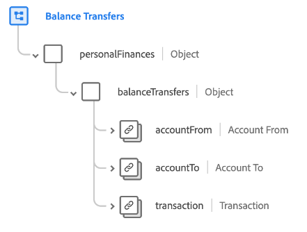

# [!UICONTROL Bilanzübertragungen] Schemafeldgruppe

[!UICONTROL Bilanzübertragungen] ist eine Standardschemafeldgruppe für die [[!DNL XDM ExperienceEvent] class](../../classes/experienceevent.md). Die Feldergruppe stellt eine `personalFinances.balanceTransfers` -Objekt zu einem Schema, das Details zu einer Übertragung des finanziellen Saldos zwischen Konten erfasst.

| Eigenschaft | Datentyp | Beschreibung |
| --- | --- | --- |
| `accountFrom` | [[!UICONTROL Finanzkonto]](../../data-types/financial-account.md) | Beschreibt das Finanzkonto, von dem der Saldo übertragen wird. |
| `accountTo` | [[!UICONTROL Finanzkonto]](../../data-types/financial-account.md) | Beschreibt das Finanzkonto, auf das der Saldo übertragen wird. |
| `transaction` | [[!UICONTROL Transaktion]](../../data-types/transaction.md) | Beschreibt die Finanztransaktion im Zusammenhang mit der Bilanzübertragung. |

{style=&quot;table-layout:auto&quot;}

Weitere Informationen zur Feldergruppe finden Sie im Abschnitt [öffentliches XDM-Repository](https://github.com/adobe/xdm/blob/master/docs/reference/fieldgroups/experience-event/industry-verticals/experienceevent-balance-transfers.schema.json).
