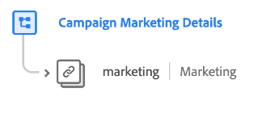

# [!UICONTROL Feldergruppe ] &quot;Campaign Marketing Details&quot;

>[!NOTE]
>
>Die Namen verschiedener Schemafeldgruppen wurden geändert. Weitere Informationen finden Sie im Dokument zu [Feldgruppennamenupdates](../name-updates.md) .

[!UICONTROL Kampagnenmarketing-] Details sind eine Standardschemafeldgruppe für die  [[!DNL XDM ExperienceEvent] Klasse](../../classes/experienceevent.md), die zur Beschreibung von Marketingkampagneninformationen wie Kampagnengruppe, Name und Trackingcode verwendet wird.

| Eigenschaft | Datentyp | Beschreibung |
| --- | --- | --- |
| `marketing` | [Marketing](../../data-types/marketing.md) | Ein Objekt, das Informationen zu Marketing-Kampagnen wie Kampagnengruppe, Name und Trackingcode beschreibt. |

{style=&quot;table-layout:auto&quot;}

Weitere Informationen zur Feldergruppe finden Sie im öffentlichen XDM-Repository:

* [Ausgefülltes Beispiel](https://github.com/adobe/xdm/blob/master/components/fieldgroups/experience-event/experienceevent-marketing.example.1.json)
* [Vollständiges Schema](https://github.com/adobe/xdm/blob/master/components/fieldgroups/experience-event/experienceevent-marketing.schema.json)
