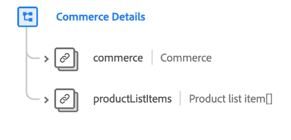

# [!UICONTROL Commerce-Details] Schemafeldgruppe

>[!NOTE]
>
>Die Namen mehrerer Schemafeldgruppen wurden geändert. Weitere Informationen finden Sie im Dokument zu den [Namensaktualisierungen für Feldgruppen](../name-updates.md).

[!UICONTROL Commerce Details] ist eine Standardschemafeldgruppe für die [[!DNL XDM ExperienceEvent] class](../../classes/experienceevent.md), die zur Beschreibung von Commerce-Daten wie Produktinformationen (SKU, Name, Menge) und standardmäßigen Warenkorbvorgängen (Bestellung, Kasse, Abbruch) verwendet wird.

| Eigenschaft | Datentyp | Beschreibung |
| --- | --- | --- |
| `commerce` | [Commerce](../../data-types/commerce.md) | Ein Objekt, das Produktretouren, die Garantieregistrierung und die Warenkorb-/Bestellprozesse beschreibt. |
| `productListItems` | Array von [Produktlistenelementen](../../data-types/product-list-item.md) | Eine Liste von Artikeln, die die von einem Kunden ausgewählten Produkte darstellen, mit bestimmten Optionen und Preisen zu einem bestimmten Zeitpunkt (der vom Produktdatensatz abweichen kann). |

{style="table-layout:auto"}

Weitere Informationen zur Feldergruppe finden Sie im öffentlichen XDM-Repository:

* [Ausgefülltes Beispiel](https://github.com/adobe/xdm/blob/master/components/fieldgroups/experience-event/experienceevent-commerce.example.1.json)
* [Vollständiges Schema](https://github.com/adobe/xdm/blob/master/components/fieldgroups/experience-event/experienceevent-commerce.schema.json)
