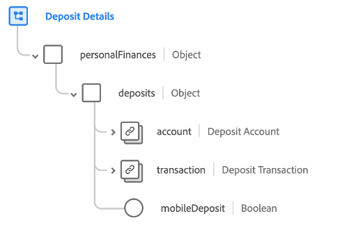

# [!UICONTROL Einlagendetails] Schemafeldgruppe

[!UICONTROL Einlagendetails] ist eine Standardschemafeldgruppe für die [[!DNL XDM ExperienceEvent] class](../../classes/experienceevent.md). Die Feldergruppe stellt eine `personalFinances.deposits` -Feld in ein Schema, das Details zu einer finanziellen Einlage erfasst.

| Eigenschaft | Datentyp | Beschreibung |
| --- | --- | --- |
| `account` | [[!UICONTROL Finanzkonto]](../../data-types/financial-account.md) | Beschreibt das mit der Einlage verbundene Finanzkonto. |
| `transaction` | [[!UICONTROL Transaktion]](../../data-types/transaction.md) | Beschreibt die mit der Einlage verbundene Finanztransaktion. |
| `mobileDeposit` | [!UICONTROL Boolesch] | Gibt an, ob die Anzahlung über eine mobile Plattform erfolgt ist. |

{style=&quot;table-layout:auto&quot;}

Weitere Informationen zur Feldergruppe finden Sie im Abschnitt [öffentliches XDM-Repository](https://github.com/adobe/xdm/blob/master/docs/reference/fieldgroups/experience-event/industry-verticals/experienceevent-deposit-details.schema.json).
