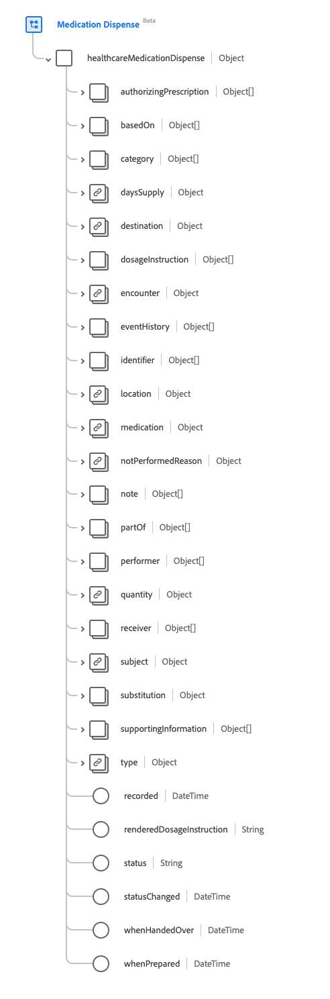

# [!UICONTROL Medikationskosten] Schemafeldgruppe

[!UICONTROL Medikationskosten] ist eine Standardschemafeldgruppe für die [[!DNL Medication] Klasse](../../classes/location.md), die [[!DNL XDM Individual Profile] Klasse](../../classes/individual-profile.md) und die [[!DNL Provider class]](../../classes/provider.md). Es stellt ein einzelnes Objektfeld `healthcareMedicationDispense` bereit, das Informationen über ein Medikament erfasst, das für eine benannte Person/einen benannten Patienten ausgegeben werden soll oder wurde.

| Anzeigename | Eigenschaft | Datentyp | Beschreibung |
| --- | --- | --- | --- |
| [!UICONTROL Autorisierung der Verschreibung] | `authorizingPrescription` | Array von [[!UICONTROL Verweis]](../../data-types/healthcare/reference.md) | Der Befehl, der die Abgabe des Rezepts erlaubt. |
| [!UICONTROL basierend auf ] | `basedOn` | Array von [[!UICONTROL Verweis]](../../data-types/healthcare/reference.md) | Der Plan für die Abgabe der Medikation basiert auf dem . |
| [!UICONTROL Kategorie] | `category` | Array von [[!UICONTROL Codeable Concept]](../../data-types/healthcare/codeable-concept.md) | Die Kategorie, in der das Arzneimittel abgegeben wird, fällt in die Liste, wie beispielsweise die rechtliche Kategorie des Arzneimittels oder die Einstufung des Arzneimittels. |
| [!UICONTROL Tagesangebot] | `daysSupply` | [[!UICONTROL Einfache Menge]](../../data-types/healthcare/simple-quantity.md) | Die Anzahl der Tage, für die das Medikament den Patienten versorgen wird. |
| [!UICONTROL Ziel] | `destination` | [[!UICONTROL Referenz]](../../data-types/healthcare/reference.md) | Die Einrichtung oder der Ort, an die die Medikation im Rahmen des Auslieferungsereignisses versandt wurde oder werden wird. |
| [!UICONTROL Dosierungsanleitung] | `dosageInstruction` | Array von [[!UICONTROL Dosierung]](../../data-types/healthcare/dosage.md) | Beschreibt, wie die Medikation vom Patienten angewendet werden soll. |
| [!UICONTROL Encounter] | `encounter` | [[!UICONTROL Referenz]](../../data-types/healthcare/reference.md) | Die Begegnung, die den Kontext für dieses Ereignis festlegt. |
| [!UICONTROL Ereignisverlauf] | `eventHistory` | Array von [[!UICONTROL Verweis]](../../data-types/healthcare/reference.md) | Eine Zusammenfassung der Ereignisse im Zusammenhang mit der Abgabe. |
| [!UICONTROL ID] | `identifier` | Array von [[!UICONTROL Bezeichner]](../../data-types/healthcare/identifier.md) | Kennungen im Zusammenhang mit der Abgabe. Die Kennungen sollten durch Geschäftsprozesse definiert und/oder verwendet werden, um darauf zu verweisen, wenn ein direkter URL-Verweis nicht geeignet ist. |
| [!UICONTROL Ort] | `location` | [[!UICONTROL Referenz]](../../data-types/healthcare/reference.md) | Der wichtigste physische Ort, an dem das Arzneimittel abgegeben wurde. |
| [!UICONTROL Meditation] | `medication` | [[!UICONTROL Codeable Reference]](../../data-types/healthcare/codeable-reference.md) | Identifiziert das angeforderte Arzneimittel. Dies sollte ein Link zu einer Ressource sein, die Details des Arzneimittels darstellt, oder ein Code, der das Arzneimittel identifiziert. |
| [!UICONTROL Nicht durchgeführter Grund] | `notPerformedReason` | [[!UICONTROL Codeable Reference]](../../data-types/healthcare/codeable-reference.md) | Der Grund, warum das Medikament nicht verabreicht wurde. |
| [!UICONTROL Hinweis] | `note` | Array von [[!UICONTROL Anmerkung]](../../data-types/healthcare/annotation.md) | Zusätzliche Informationen über die Abgabe. |
| [!UICONTROL Teil von ] | `partOf` | Array von [[!UICONTROL Verweis]](../../data-types/healthcare/reference.md) | Das Verfahren oder die Arzneimittelanforderung, das/die die Abgabe ausgelöst hat. |
| [!UICONTROL Performer] | `performer` | Array von Objekten | Gibt an, wer oder was das Spendenereignis ausgeführt hat. Weitere Informationen finden Sie im Abschnitt [unter ](#performer) . |
| [!UICONTROL Quantity] | `quantity` | [[!UICONTROL Einfache Menge]](../../data-types/healthcare/simple-quantity.md) | Die Menge der verabreichten Medikamente, einschließlich der Maßeinheit. |
| [!UICONTROL Receiver] | `receiver` | Array von [[!UICONTROL Verweis]](../../data-types/healthcare/reference.md) | Identifiziert die Person, die das Arzneimittel abgeholt hat, oder den Ort, an dem das Arzneimittel verabreicht wurde. |
| [!UICONTROL Betreff] | `subject` | [[!UICONTROL Referenz]](../../data-types/healthcare/reference.md) | Ein Link zu einer Ressource, die die Person oder Gruppe darstellt, der das Arzneimittel verabreicht wird. |
| [!UICONTROL Substitution] | `substitution` | Objekt | Gibt an, ob im Rahmen der Abgabe eine Substitution vorgenommen wurde. Enthält vier Eigenschaften: <li>`wasSubstituted`: Ein boolean -Wert, der &quot;true&quot;ist, wenn der Dispatcher eine Ersetzung angefordert hat.</li> <li>`type`: Ein Wert vom Typ [[!UICONTROL Codeable Concept]](../../data-types/healthcare/codeable-concept.md) , der einen Code bereitstellt, der angibt, ob eine Ersetzung vorgenommen wurde.</li> <li>`reason`: Ein Array von Werten vom Typ [[!UICONTROL Codeable Concept]](../../data-types/healthcare/codeable-concept.md) , die den Grund bzw. die Gründe für die Ersetzung enthalten.</li> <li>`responsibleParty`: Ein [[!UICONTROL Referenz]](../../data-types/healthcare/reference.md) -Wert, der die für die Ersetzung verantwortliche Person oder Partei angibt. </li> |
| [!UICONTROL Unterstützende Informationen] | `supportingInformation` | Array von [[!UICONTROL Verweis]](../../data-types/healthcare/reference.md) | Zusätzliche Informationen, die die Abgabe des Arzneimittels unterstützen. |
| [!UICONTROL Typ] | `type` | [[!UICONTROL Codeable Concept]](../../data-types/healthcare/codeable-concept.md) | Beschreibt die Art des ausgelösten Ereignisses, z. B. eine Notausfüllung oder eine Teilfüllung. |
| [!UICONTROL Aufnahme] | `recorded` | DateTime | Datum und Uhrzeit des Beginns der Ausgabefaktivität, wenn `whenPrepared` oder `whenHandedOver` nicht aufgefüllt ist. |
| [!UICONTROL Rendered Dose Instruction] | `renderedDosageInstruction` | String | Die vollständige Darstellung der Dosis ist in allen Dosierungsanweisungen enthalten. Bei Mehrfachdosierungsanweisungen zur Darstellung einer komplexen Dosierung wie Erhöhung oder Verschlankung der Dosen zu verwenden. |
| [!UICONTROL Status] | `status` | String | Der Status der Ausgabe. Der Wert dieser Eigenschaft muss mit einem der folgenden bekannten Enum-Werte übereinstimmen. <li> `preperation` </li> <li> `in-progress` </li> <li> `cancelled` </li> <li> `on-hold` </li> <li> `completed` </li> <li> `entered-in-error` </li> <li> `stopped` </li> <li> `declined` </li> <li> `unknown` </li> |
| [!UICONTROL Status geändert] | `statusChanged` | DateTime | Datum und Uhrzeit der Änderung des Status des Ausgabedatensatzes. |
| [!UICONTROL  bei Übergabe über] | `whenHandedOver` | DateTime | Datum und Uhrzeit der Abgabe der verabreichten Medikation an den Patienten. |
| [!UICONTROL  Bei Vorbereitung] | `whenPrepared` | DateTime | Datum und Uhrzeit der Verpackung und Überprüfung der verabreichten Arzneimittel. |

Weitere Informationen zur Feldergruppe finden Sie im öffentlichen XDM-Repository:

* [Ausgefülltes Beispiel](https://github.com/adobe/xdm/blob/master/extensions/industry/healthcare/fhir/fieldgroups/medicationdispense.example.1.json)
* [Vollständiges Schema](https://github.com/adobe/xdm/blob/master/extensions/industry/healthcare/fhir/fieldgroups/medicationdispense.schema.json)

## `performer` {#performer}

`performer` wird als Array von Objekten bereitgestellt. Die Struktur der einzelnen Objekte wird nachfolgend beschrieben.

| Anzeigename | Eigenschaft | Datentyp | Beschreibung |
| --- | --- | --- | --- |
| [!UICONTROL Akteur] | `actor` | [[!UICONTROL Referenz]](../../data-types/healthcare/reference.md) | Der (oder ähnliche) Praktiker, der die Aktion ausgeführt hat. Es sollte davon ausgegangen werden, dass der Schauspieler der Spender der Medikation ist. |
| [!UICONTROL Funktion] | `function` | [[!UICONTROL Codeable Concept]](../../data-types/healthcare/codeable-concept.md) | Die Art des Leisters in der Ausgabe, wie z. B. das Datum in der Einfahrt, der Verpackung oder der Endprüfung. |
